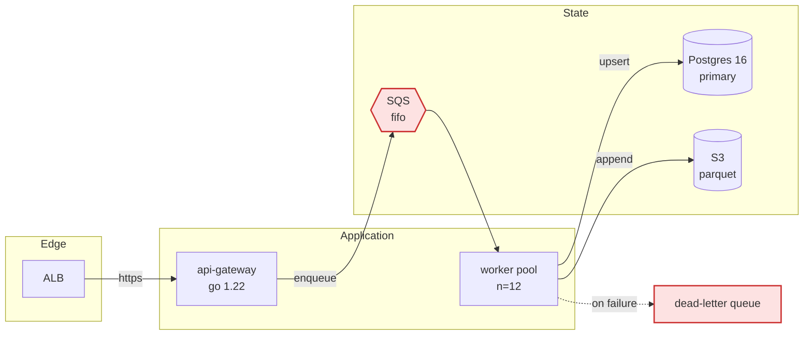
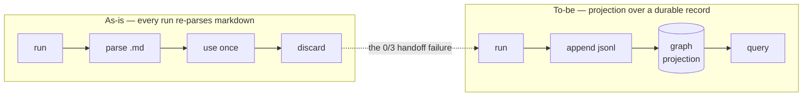
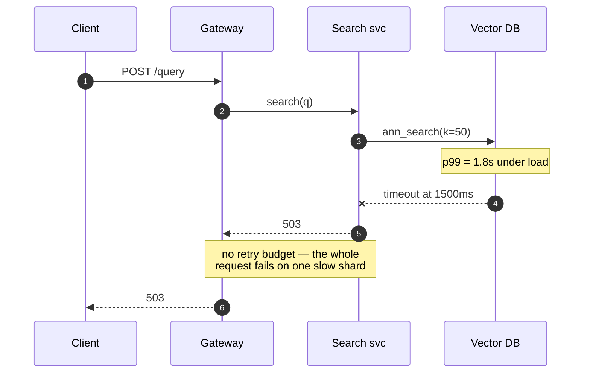
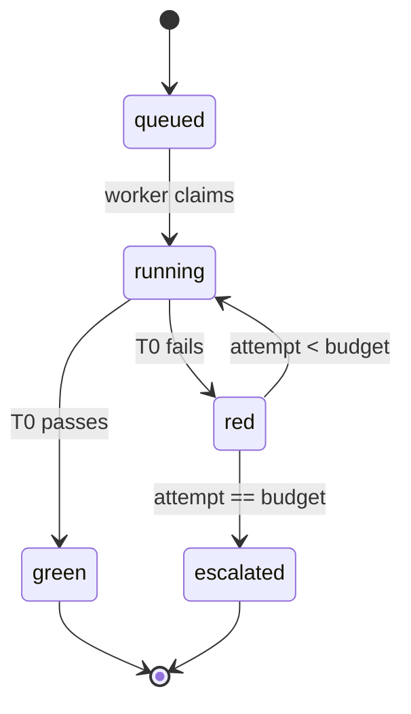
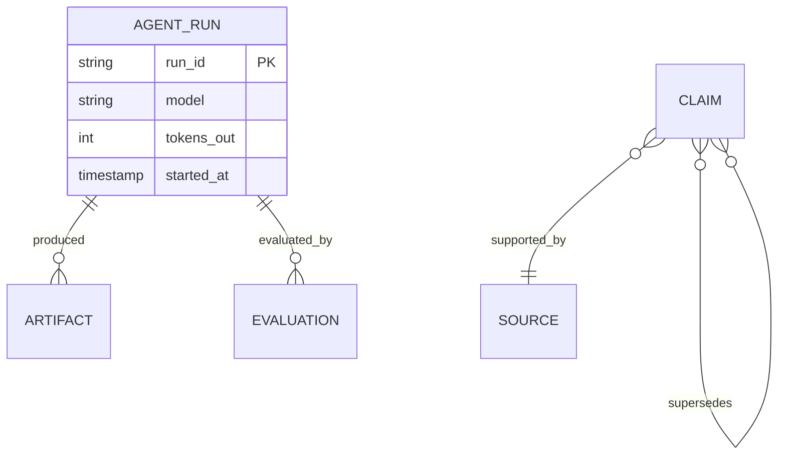
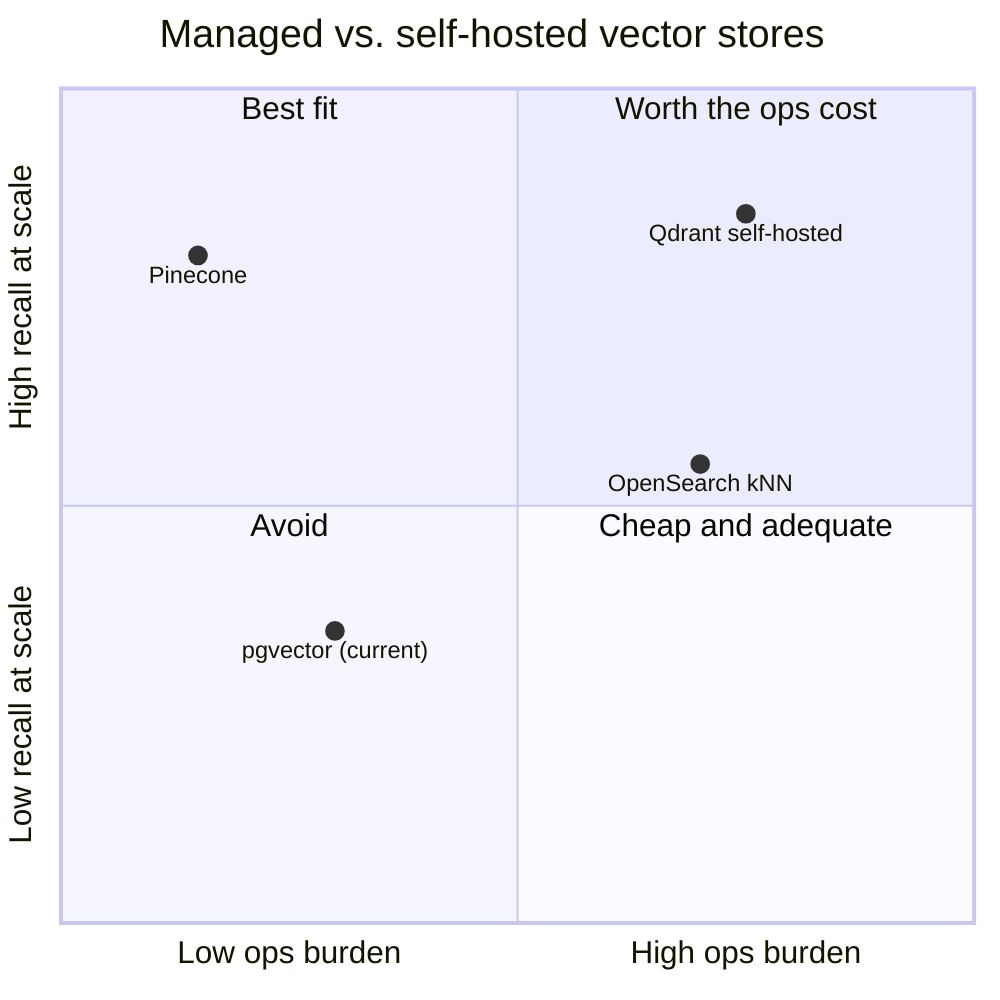
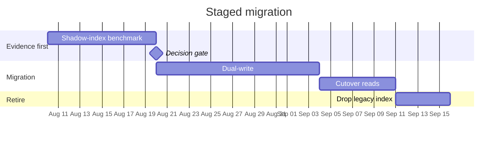
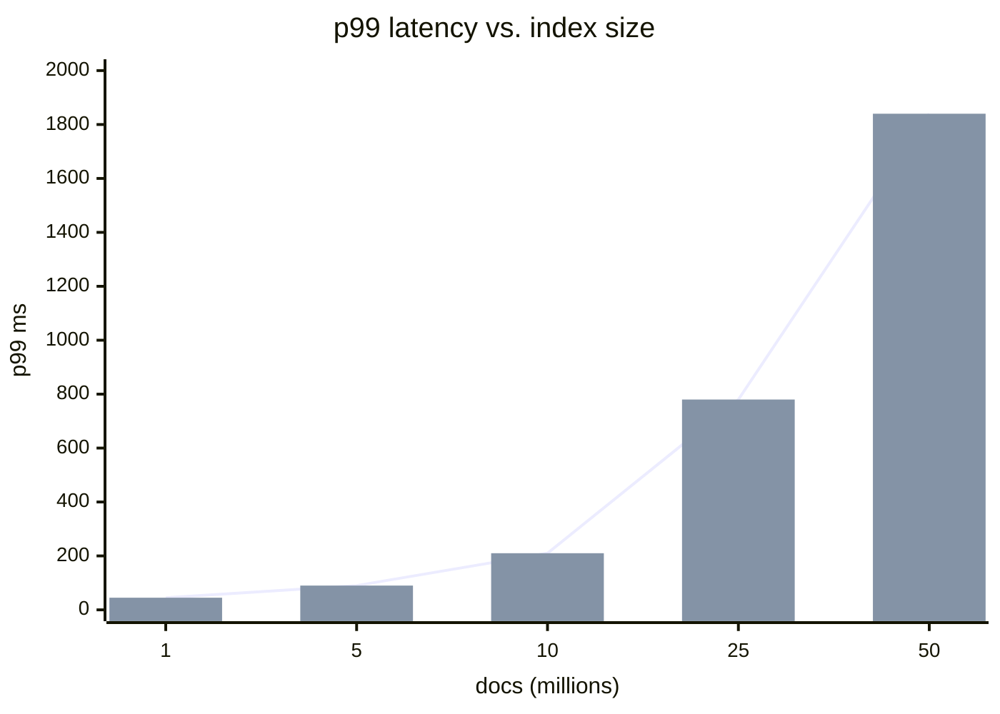
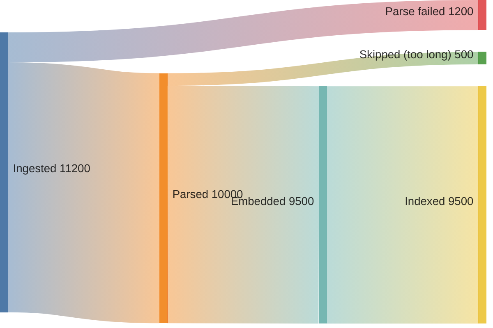

# Diagram patterns for architecture reports

Contents:
1. Choosing the diagram
2. The escaping rules that break rendering
3. Verified syntax per type
4. Layout for legibility
5. Charting measured numbers

---

## 1. Choosing the diagram

Match the diagram to the *shape of the claim*, not to the topic. A diagram whose shape does not
match its claim makes the reader work to translate, which is the cost you were trying to avoid.

| The claim is about… | Use | Because |
|---|---|---|
| What talks to what; where a boundary sits | `flowchart` | Topology is nodes and edges |
| Ordering across time; who waits on whom; timeouts | `sequenceDiagram` | Time is the vertical axis; activation bars show blocking |
| A thing's lifecycle; legal and illegal transitions | `stateDiagram-v2` | Illegal transitions are visible as missing edges |
| Data model, keys, cardinality | `erDiagram` | Cardinality notation is unambiguous |
| Positioning options on two axes | `quadrantChart` | Shows clustering and empty quadrants |
| Measured quantities, >6 values | `xychart-beta` | A table of 20 numbers hides its own shape |
| Volume moving through stages; loss at each | `sankey-beta` | Width encodes magnitude; drop-off is visible |
| Staged plan with dependencies and duration | `gantt` | Sequencing and parallelism at once |
| Evolution of a field or system over releases | `timeline` | Cheap, and reads instantly |
| Decomposing a landscape into branches | `mindmap` | Only for landscape surveys — weak for architecture |

**Do not draw** when: there are fewer than four nodes (a sentence is faster), the diagram would
only restate the heading, or you cannot label the edges. Unlabelled edges in an architecture
diagram mean you have not yet decided what flows between the boxes.

---

## 2. The escaping rules that break rendering

These are the failures that actually appear. Learn them once.

**Parentheses, brackets, braces, and commas inside a node label must be inside quotes.**

```
A[Ingest (batch)]        ← breaks the parser
A["Ingest (batch)"]      ← correct
```

**The same applies to edge labels.**

```
A -->|retry (3x)| B      ← breaks
A -->|"retry (3x)"| B    ← correct
```

**Reserved words cannot be node ids:** `end`, `graph`, `subgraph`, `class`, `click`, `style`,
`linkStyle`, `o`, `x`. Lowercase `end` inside a `flowchart` is the classic one — it silently
terminates the enclosing `subgraph`. Prefix them: `n_end`, `svc_class`.

**Line breaks inside labels** use `<br/>`, not `\n`:

```
A["Postgres<br/>primary"]
```

**Comments** must start the line with `%%`. A trailing `%%` after a statement is not a comment.

**Arrow forms** — `flowchart` needs two dashes minimum: `-->` works, `->` does not. Dotted is
`-.->`, thick is `==>`. In `sequenceDiagram` the forms differ entirely: `->>` solid arrow,
`-->>` dashed (use for responses), `-x` for a lost message.

**Unicode is fine** in labels; emoji are fine but reduce legibility in dense diagrams.

---

## 3. Verified syntax per type

### Flowchart — architecture and data flow



Node shapes carry meaning worth using consistently: `[ ]` service, `[( )]` datastore, `{{ }}`
queue, `{ }` decision, `([ ])` external actor. `classDef` + `class` is how you mark the finding —
colour the two nodes the report is about and leave the rest neutral.

Directions: `LR` for pipelines and request paths, `TB` for layered stacks. `LR` almost always
reads better in a document because pages are wider than they are tall.

### As-is vs. to-be

Keep the layout identical and change only what moved — the reader should diff by glance.



### Sequence — the failure path



`autonumber` gives you step numbers to cite from prose — "the failure at step 5" is much easier to
follow than "the timeout". Use `Note over` to place the measured number next to the thing it
indicts.

### State — lifecycle



### ER — data model



Cardinality: `||` exactly one, `o{` zero-or-more, `|{` one-or-more. Left symbol reads toward the
right entity.

### Quadrant — positioning options



Coordinates are 0–1. Label the current state explicitly — the reader's first question is "where
are we now?"

### Gantt — a staged, costed roadmap



Put the cheapest evidence-producing step first and gate the rest behind a milestone — that
sequencing *is* the recommendation, made visible.

---

## 4. Layout for legibility

- **Cap a flowchart at ~15 nodes.** Past that, split by concern and cross-reference. A diagram
  nobody can read is a diagram nobody reads.
- **Group with `subgraph`** along the boundary the report argues about — trust zone, deploy unit,
  team ownership. The grouping is itself a claim.
- **Colour only the finding.** Two or three highlighted nodes against neutral grey directs the
  eye. Rainbow diagrams direct it nowhere.
- **Label every edge** with the protocol, the volume, or the trigger. `API --> DB` says nothing;
  `API -->|"~4k qps, p99 8ms"| DB` is an argument.
- **Choose colours that survive both light and dark rendering.** Light fills with saturated
  strokes (`fill:#fde2e2,stroke:#c33`) stay legible in both; dark fills with dark strokes do not.

---

## 5. Charting measured numbers

When you have more than six measurements, chart them. A table of 20 numbers hides its own shape,
which is precisely the thing the reader needs.



`xychart-beta` is deliberately limited — no series legend, no dual axis. If the comparison needs
more than one series, either draw one chart per series or fall back to a table with the shape
described in prose. Do not fight the tool.

For volumes lost across stages:



The drop-off is the point — a funnel where 12% fails to parse is a finding you would have to state
three times in prose to land as hard.
