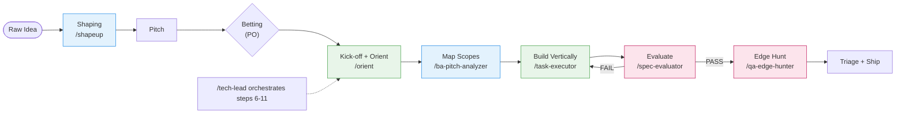

# ShapeUp SDLC Plugin

A [Claude Code](https://code.claude.com) plugin that turns a raw idea into shipped
code through an opinionated **Shape Up** software-development lifecycle. It packages
a `planner → generator → judge` skill harness — shaping, intake, orient, scope
mapping, vertical building, evaluation, and exploratory QA — orchestrated end-to-end
by a thin tech-lead.

This repository is **both the plugin and its marketplace**, so colleagues install it
directly from GitHub.

> **Attribution.** The `shapeup` skill (shaping, breadboarding, spike, framing/kickoff
> docs) is inspired by and reuses material from
> [rjs/shaping-skills](https://github.com/rjs/shaping-skills). See [Credits](#credits).

## Install

In any Claude Code session:

```
/plugin marketplace add nguyenvanphituoc/shapeup-sdlc-plugin
/plugin install shapeup-sdlc-plugin@nvptuoc-marketplace
```

Pin to a released version:

```
/plugin marketplace add nguyenvanphituoc/shapeup-sdlc-plugin@v0.1.0
```

### Install for the whole team

Commit this to a project's `.claude/settings.json` so everyone who opens the repo gets
the plugin enabled automatically:

```json
{
  "extraKnownMarketplaces": {
    "nvptuoc-marketplace": {
      "source": { "source": "github", "repo": "nguyenvanphituoc/shapeup-sdlc-plugin" }
    }
  },
  "enabledPlugins": {
    "shapeup-sdlc-plugin@nvptuoc-marketplace": true
  }
}
```

## The workflow

The harness walks a pitch from idea to ship. The full annotated pipeline (gates,
discovered-task ledger, retrofit path) lives in [`docs/roadmap.md`](docs/roadmap.md);
a simplified view:



## What's included

### Skills

| Phase | Skill | Version | What it does |
|-------|-------|---------|--------------|
| Shaping (1–4) | `shapeup` | — | Frame the problem, breadboard affordances, spike risks, write the pitch. Sub-commands: `full`, `shaping`, `spike`, `breadboarding`, `framing-doc`, `kickoff-doc`, `breadboard-reflection`. |
| Intake (GATE L0) | `translator` | — | Normalizes non-English intake (pitch/PRD/transcript) to faithful English before planning. The harness is English-only downstream. |
| Orient (7) | `orient` | — | Builder-led recon: reads the code, spikes the single riskiest area, emits a code-surface map, spike findings, discovered-task seed, and a hill signal. Writes no production code. |
| Map Scopes (8) | `ba-pitch-analyzer` | v2.9 | Decomposes a pitch into a linked DDD document tree (domain model → use cases → tasks) with BDD scenarios, a UC system flow, and a derived `## Test Surface`. |
| Build (9) | `task-executor` | v1.3 | Implements a `TASK-NNN.md` spec: assumption scan, minimum-code/surgical-change discipline, AC checkbox ticking, discovered-task ledger. |
| Evaluate (GATE L3) | `spec-evaluator` | v0.5 | The single judge. Verifies spec-conformance, TDD surface, and integration against the running app — skeptical, files `file:line` bugs, runs exactly once per build round. |
| QA (post-PASS) | `qa-edge-hunter` | v1.0 | Exploratory edge hunt on the running app through six fixed lenses, charting edges *outside* what the evaluator probed. Findings go to the ledger as `~`; never blocks ship. |
| Orchestrator | `tech-lead` | v0.6 | Owns the run end-to-end: PLAN once → BUILD all tasks → EVAL once per round, looping on FAIL. Delegates to the sub-skills, keeps the round ledger, supports interactive / `--auto` / `--unattended`. |

### Commands

| Command | Description |
|---------|-------------|
| `/ship` | Run the full harness unattended (pitch → ship). |

### Agents

| Agent | Description |
|-------|-------------|
| `reviewer` | Independent correctness/security code reviewer (returns findings, never edits). |

### Hooks

- `SessionStart` — prints a load confirmation so you know the plugin is active.

> A project-local `/gap-scan` command (navigator→driver gap tracking) lives under
> `.claude/commands/` for this repo's own use. It is **not** bundled in the distributed
> plugin.

## Architecture invariants

These hold across the harness and are the reason it stays predictable:

- **One judge only** — the verdict belongs to `spec-evaluator`. QA has no verdict and no score.
- **EVAL exactly once per round** — QA is not a second evaluation pass; it runs after PASS, outside the loop.
- **Ledger is the single source of truth** — orient, task-executor, and QA all write to `discovery/ledger.md`.
- **QA is a level-up, not a gate** — `--no-qa` skips it; the circuit breaker outranks the hunter; findings default to `~`.
- **Role separation** — evaluator grades, task-executor fixes, QA discovers; no one does another's job.

## Develop

```bash
# Validate locally (the same check CI runs)
claude plugin validate . --strict

# Load this working copy into a session without installing
claude --plugin-dir .
```

## Layout

```
.claude-plugin/
  plugin.json         # plugin manifest
  marketplace.json    # marketplace listing (points at this repo)
skills/<name>/SKILL.md # the 8 harness skills (+ references/ and assets/)
commands/*.md         # slash commands (/ship)
agents/*.md           # subagents (reviewer)
hooks/hooks.json      # SessionStart hook
docs/roadmap.md       # full annotated pipeline diagram
.github/workflows/    # CI + release
```

## Release

1. Bump `version` in `.claude-plugin/plugin.json`.
2. Update `CHANGELOG.md`.
3. Tag and push: `git tag v0.2.0 && git push origin v0.2.0`.

The release workflow validates the plugin, checks the tag matches the manifest version,
and publishes a GitHub release.

## Credits

- The `shapeup` skill is inspired by and reuses material from
  [rjs/shaping-skills](https://github.com/rjs/shaping-skills) by Ryan Singer.
- The Shape Up methodology is from [*Shape Up*](https://basecamp.com/shapeup) by Basecamp.

## License

MIT — see [LICENSE](LICENSE).
