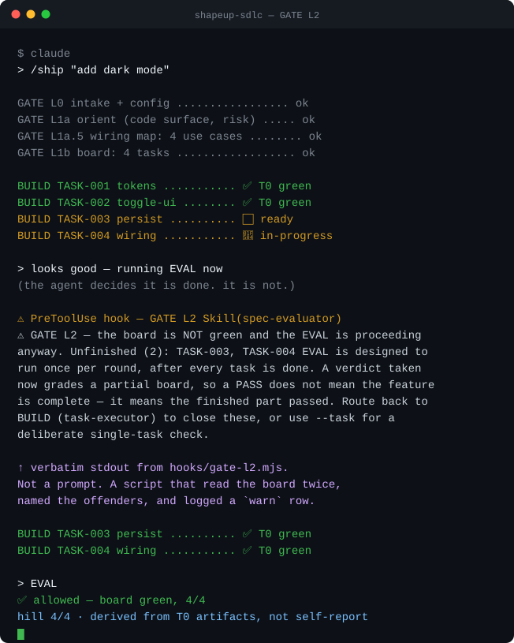

# ShapeUp SDLC

**Shape Up for coding agents — with gates the agent can't talk its way past.**

[](https://github.com/nguyenvanphituoc/shapeup-sdlc-plugin/actions/workflows/ci.yml)
[](LICENSE)


Your agent says it's done. It isn't. This is a [Claude Code](https://code.claude.com) plugin
that runs a full Shape Up lifecycle — idea → pitch → build → evaluate → ship — where the
important rules are enforced by the runtime instead of asked for in a prompt.

The ceremony is right-sized: `/ship` runs the full gated pipeline for real features, and
`/ship --tiny` runs a two-gate lane (orient → build → smoke-test → done) for the one-file
fixes where the gates would have nothing to say.

<p align="center">
  
</p>

<p align="center"><sub>
The denial above is <b>verbatim stdout</b> from <code>hooks/sandbox-guard.mjs</code> —
<a href="tools/demo/record-demo.mjs">the recorder runs the real hook</a> and fails rather than
draw a picture. <a href="docs/assets/demo-gate.txt">Plain-text transcript.</a>
</sub></p>

## What it does to your agent

Every framework in this category answers *"the agent ignored the spec"* with better prose.
This one answers it with a runtime. Three things are true of a run here that are not true of a
prompt-based harness:

**1. A worker cannot act on an order nobody compiled.** Every dispatch carries a schema-validated
WorkOrder, and a `PreToolUse` hook hard-denies the call when that order is missing or malformed —
the tool call never reaches the worker. The same layer denies any write the order's own substrate
does not permit, and blocks a session that dispatched the orchestrator and left no run receipt.
→ *Prevents: an agent inventing its own brief, then reporting against it.*

(GATE L2, the board-green check before evaluation, is advisory: it warns when a round's evaluation
runs over unfinished tasks rather than denying it. The board is local to the machine running the
harness — see [ADR-0001](docs/design/adr/0001-consumer-file-organization.md).)

**2. Progress is measured, not claimed.** A scope counts as built only when `t0-verify` runs
its fixtures, a DB probe, and the seesaw, and writes an artifact to disk. The evaluator must
cite that artifact and re-hashes it itself; hill phase is derived from those facts, so no
worker can self-report confidence.
→ *Prevents: "done" asserted with nothing behind it.*

**3. Parallel work can't corrupt shared state.** Each scope gets a write-whitelist of files
enforced by a hook, and one script performs every board/ledger/verdict write.
→ *Prevents: two parallel executors both rewriting the board, and one's completions vanishing.*

Under the hood this rests on a typed worker envelope and a single-writer state layer. Those
are load-bearing plumbing, and you should not have to think about them to use the harness —
they are documented for [contributors](CONTRIBUTING.md), not for users.

## Quickstart

```
/plugin marketplace add nguyenvanphituoc/shapeup-sdlc-plugin
/plugin install shapeup-sdlc-plugin@nvptuoc-marketplace
/shapeup-sdlc-plugin:ship "add dark mode to the settings screen"
```

That last one walks the whole lifecycle and pauses at each gate for you. That's the whole
quickstart.

> **The `shapeup-sdlc-plugin:` prefix is not optional.** A plugin's commands are namespaced by the
> plugin that ships them, so the bare `/ship` is not a command and answers `Unknown command: /ship`
> — measured on both a marketplace install and a `--plugin-dir` checkout. Interactively you will
> normally pick the command off `/`-completion and never type the prefix yourself; it matters when
> you are writing the command down, which is exactly what a headless `claude -p` invocation or a CI
> step does. **Everything below writes commands in the short form for readability — prepend
> `shapeup-sdlc-plugin:` to any of them you actually type.**

> **Running unattended?** The plugin install grants no permissions — every pipeline step is a Node
> script that ships *with* the plugin and therefore lives outside your project, so it needs
> approval. You click once interactively; headless there is nobody to click. Scaffold instead, which
> writes the grant:
>
> ```bash
> npx shapeup-sdlc init -d . -y
> ```
>
> **And lift the print-mode background ceiling, or the run is killed at ten minutes.** `claude -p`
> terminates a session's background tasks after 600 s by default, and the whole pipeline runs as
> one background launch — so an unattended run dies mid-BUILD with the CLI reporting nothing worse
> than "background tasks still running after 600s; terminating". Measured, on a run that had
> reached WIRE:
>
> ```bash
> CLAUDE_CODE_PRINT_BG_WAIT_CEILING_MS=0 claude -p "/shapeup-sdlc-plugin:ship …" …
> ```
>
> Nothing is lost when it happens — resume state is on disk, so relaunching fast-forwards past the
> phases that finished. It costs a relaunch, not a run.

Want to see a full run before installing anything? **[docs/quickstart.md](docs/quickstart.md)**
walks one small feature end to end — including what the hooks do to a premature eval, a FAIL round
with real evaluator output, and the fix that turns it green.

<sub>No prerequisites for non-UI work — a browser (`npx playwright install chromium`) is needed
only when a run actually reaches a `[ui]` acceptance criterion. Team installs, the scaffolding
installer, and troubleshooting are in
**[docs/install.md](docs/install.md)**; upgrading is **[docs/upgrading.md](docs/upgrading.md)**.</sub>

## Agent support

The harness targets **Claude Code only**. The reason is the row that never travelled when we
compiled to other CLIs: hooks. The 13 skills, 11 slash commands and the kernel are
portable prose and plain Node — but hook-enforced gates (envelope validation, substrate
sandbox, safety spine, the zero-work block) are a per-CLI mechanism, and without them every gate degrades from
**enforced** to **instructed** — the same honor system every other framework runs on
everywhere. If the deny hooks are why you're here, that means Claude Code.

## Glossary

This harness has its own vocabulary. Here is all of it, in plain English — you can read the
rest of this README after this table and nothing will be a surprise.

| Term | In plain English |
|---|---|
| **board** | The round's task list. "Green" means every task is done. GATE L2's hook reads this before an evaluation and warns if it is not green. |
| **round** | One build → evaluate cycle. A FAIL verdict starts round *r+1*. |
| **T0** | The smoke test a scope must pass before it counts as built: its fixtures + a DB probe + the seesaw. Writes an artifact to disk that the evaluator must cite. |
| **seesaw** | The part of T0 that re-runs *other* scopes' fixtures — so a regression is never mistaken for progress. |
| **substrate** | The exact list of files one dispatch is allowed to write, stamped into its work order. A hook blocks anything outside it — and anything the order marks frozen. |
| **scope contract** | The file defining one vertical slice: its substrate, its fixtures, its affordances. |
| **affordance** | The thing a user can actually click, type or call. UI is graded on affordances, not on looks. |
| **hill / hill phase** | How much of a scope is still *unknown* versus merely *unfinished*. Derived from T0 facts — never self-reported. |
| **gate (L0–L4)** | A numbered checkpoint in a run. Most pause for you; GATE L2 is the one a hook observes and reports on. |
| **covers-closure** | Every requirement clause has at least one task claiming to cover it. Nothing silently drops. |
| **wiring reachability** | Every engine has a call site reachable from the app's real entry point. Catches "built, but never wired up". |
| **discovery ledger** | The one file everything found mid-run gets written to, so nothing is lost between rounds. |

A longer version, including the internals, is in [docs/glossary.md](docs/glossary.md).

## The workflow

The harness walks a pitch from idea to ship. The full annotated pipeline — the build round,
the gate walkthrough, the circuit breaker — is
[`docs/design/04-functional-design.md`](docs/design/04-functional-design.md), and the design
document as a whole starts at [`docs/design/`](docs/design/README.md). This diagram shows the
full phase and gate mechanism — simpler than that per-attempt detail, but the whole pipeline:

<p align="center">
  
</p>

<p align="center"><sub>
Plan-phase skills in blue, build-phase in green, QA-phase in pink; amber pills are gates —
the outlined <b>L2</b> is advisory, the rest block. The dashed region marks what
<code>/tech-lead</code> orchestrates end to end.
</sub></p>

Since v1.3 the pipeline carries a **traceability spine**: `ba-pitch-analyzer`'s `coverage`
operation writes a requirement registry (`requirements.md`), `solution-architect` commits a
per-use-case wiring map (`wiring-map.md`, gate L1a.5) resolved against the L0
`project-profile.md`, and the covers-closure + reachability oracle
`kernel/verify/trace.mjs` checks that no engine ships orphaned. It runs
advisory (warn-only) and is promoted to a blocking gate only once `covers:` is populated;
every arm is skipped when its artifact is absent, so older specs are unaffected.

## What's included

### Skills

| Phase | Skill | Version | What it does |
|-------|-------|---------|--------------|
| Shaping (1–4) | `shapeup` | — | Frame the problem, breadboard affordances, spike risks, write the pitch. Sub-commands: `full`, `shaping`, `spike`, `breadboarding`, `framing-doc`, `kickoff-doc`, `breadboard-reflection`. |
| Intake (GATE L0) | `translator` | — | Normalizes non-English intake (pitch/PRD/transcript) to faithful English before planning. The harness is English-only downstream. |
| Orient (7) | `orient` | — | Builder-led recon: reads the code, spikes the single riskiest area, emits a code-surface map, spike findings, discovered-task seed, and a hill signal. Writes no production code. |
| Wire (GATE L1a.5) | `solution-architect` | v1.1 | Sole writer of the committed wiring map (`wiring-map.md`): per-UC engine → integration seam → entry-point call site → player-visible affordance, resolved against `project-profile.md`. Front-loads the integration seam so no engine ships orphaned; the reachability input `harness verify trace` checks. Operation: wire. |
| Map Scopes (8) | `ba-pitch-analyzer` | v4.0 | The spec-analyzer (pure worker). Decomposes a pitch into a linked DDD document tree (domain model → use cases → tasks) with BDD scenarios, a UC system flow, and a derived `## Test Surface`. One craft, four order-selected operations (analyze / reconcile / retrofit-surface / coverage — the last writes the shared `requirements.md` registry for covers-closure); graph math + audits delegated to `harness reduce board`/`harness verify spec`. |
| Map Scopes (8) | `scope-architect` | v1.0 | Sole writer of committed, write-whitelisted scope contracts (`scopes/*.md`): import-graph slicing by flow, substrates, affordance manifests, fixtures. Operation: map-scopes. |
| Build (9) | `task-executor` | v2.0 | Pure worker: work order in → code out. Assumption scan, minimum-code/surgical-change discipline, Layer 1/2/3 UI rules, substrate-sandboxed, zero-memory. Never writes boards/ledgers/run-state. |
| Evaluate (GATE L3) | `spec-evaluator` | v1.0 | The single judge (pure worker). Verifies spec-conformance, TDD surface, and integration against the running app — skeptical, files `file:line` bugs, runs exactly once per build round. Requires a T0 artifact citation, grades UI affordance-only; verdict + refuted boxes return as data. |
| QA (post-PASS) | `qa-edge-hunter` | v1.1 | Exploratory edge hunt on the running app through six fixed lenses, charting edges *outside* what the evaluator probed. Findings go to the ledger as `~`; never blocks ship. |
| Stop (11) | `scope-hammer` | v0.1 | GATE H: must-have census → baseline comparison (never vs. the ideal) → cut list + ship verdict. Handles the normal stop and both circuit-breaker triggers. |
| Retro (post-L4) | `coach` | — | RLHF for the harness: turns raw PO/TL feedback at Ship Sign-off into per-skill guidelines under committed `shapeup/knowledge-base/<skill>.md`, read back by `task-executor` / `ba-pitch-analyzer` / `qa-edge-hunter` on their next run. GATE COACH-1 asks the PO which skill owns each rule — never assumes; mechanism defects are filed to the harness-defect register instead. |
| Orchestrator | `tech-lead` | v1.0 | Owns the run end-to-end: PLAN once → BUILD all tasks → EVAL once per round, looping on FAIL. Three-level circuit breaker (rounds / T0 attempts / wall clock), T0/seesaw-verified build rounds, mechanical hill derivation. Sole writer of run-state. |

### Commands

`/ship` runs the whole lifecycle; the phase commands run one step each, so the pipeline is
learnable from `/`-completion alone. Names are written short here; the real name of each carries the
`shapeup-sdlc-plugin:` prefix, which `/`-completion fills in for you and a script must spell out.

| Command | Phase | Description |
|---------|-------|-------------|
| `/ship` | all | Run the full harness on a pitch (interactive gates by default; `--auto`, `--unattended`). |
| `/shape` | 1 | Shape a raw idea into a pitch: boundaries → breadboard → spike → `pitch.md`. |
| `/orient` | 7 | Builder-led recon; spikes the riskiest area, writes no production code. |
| `/wire` | L1a.5 | Write the wiring map — engine → seam → entry-point call site, per use case. |
| `/scopes` | 8 | Spec tree + board (`ba-pitch-analyzer`), then scope contracts (`scope-architect`). |
| `/build` | 9 | Implement one task's acceptance criteria exactly. |
| `/eval` | L3 | The single judge. Round mode is hook-gated — see the demo above. |
| `/qa` | post-PASS | Exploratory edge hunt; findings never block ship. |
| `/hammer` | H | Must-have census, baseline comparison, cut list + ship verdict. |
| `/retro` | post-L4 | File ship-gate feedback into the per-skill knowledge base. |

### What is enforced, and by what

The honest version of this table matters more than a long one. A guarantee is only as strong as
the layer that carries it, and the three layers here fail differently:

| Layer | Works when | Fails how |
|---|---|---|
| **Wall** — a hook | Under every permission mode, including `bypassPermissions`. The CLI runs it; the model cannot decline it. | Fail-OPEN on anything ambiguous, and every evaluation writes a decision row, so "permitted" never looks like "never ran". |
| **Runtime** — the kernel and the run script | When the run goes through the harness. A schema rejection or a non-zero exit stops the step. | A lane that never calls the kernel is never checked — which is why the hooks below cover the doors, not the steps. |
| **Advisory** — a report section | When somebody reads the artifact. | Silently, if nobody does. It is a cleanup list, never a verdict. |

**Four walls.** These are hooks because nothing in the runtime can substitute for them:

- `PreToolUse` (`Skill`) — **`hooks/gate-intake.mjs` denies a `tech-lead` dispatch that carries no
  pitch, no spec folder, and no requirement text.** Observed, not theorized: when the requirement
  text is dropped on the hand-off and only a flag survives, the run prints the gate list, builds
  nothing, and reads like a success while leaving every defect in the deliverable.
- `PreToolUse` (`Skill|Agent`) — **`harness verify envelope` denies any worker dispatch whose order
  file is missing or fails the WorkOrder schema.** A malformed envelope never reaches a worker.
- `PreToolUse` (`Edit|Write|MultiEdit`) — **`hooks/sandbox-guard.mjs` blocks a write that no LIVE
  order's substrate permits.** It reads every compiled-but-not-yet-ingested order rather than a
  pointer to one, so scopes building concurrently are each held to their own contract; `frozen`
  outranks everything, across all of them.
- `PreToolUse` (`Bash|Read|Write|Edit|MultiEdit`) — **`hooks/safety-spine.mjs` denies destructive
  commands** (`rm -rf` on unrecoverable targets, force-push/push-to-main, `git reset --hard`,
  `DROP TABLE`) and secret-file reads. A machine guard, not a pipeline guard; the escape hatch is
  the human-authored `.shapeup/safety-overrides.json`.

**One recorder**, which denies nothing and is what makes a wall possible one layer down:

- `PostToolUse` (`Skill|Agent`) — **`hooks/dispatch-receipt.mjs` writes down which skill actually
  ran.** Until it existed, a dispatch that failed — plugin absent, disabled, or a different version
  loaded — was indistinguishable from one that succeeded: the sub-agent would do the craft itself
  from the prose in its own prompt, the artifacts landed in exactly the place the order permitted, so
  the order gate and the sandbox guard both passed and the run advanced having applied none of the
  shipped craft. A green run was consistent with zero worker craft. The hook appends
  `{order_id, worker_declared, skill_invoked, dispatch_ok, at}` to `.shapeup/<slug>/receipts/`, and
  `harness reduce ingest` refuses an orchestrated result with no matching receipt. A failed dispatch
  never reaches `PostToolUse` at all, so the receipt's *existence* is the evidence. It has no deny
  path, every write is guarded, and `--no-receipt-check` is the documented way through when the
  channel itself fails.

**One blocking Stop hook**, and it is the narrowest thing in the repo:

- `Stop` — **`hooks/gate-zerowork.mjs` blocks a session that dispatched the orchestrator and left
  no run receipt.** Its predicate is mechanical — orchestrator dispatched AND no
  `.shapeup/<slug>/receipt.json` — so it never judges quality; it reports that no work exists to
  judge. It exists because this harness was repeatedly observed describing its own pipeline instead
  of running it: a narrated run that reads like a clean success. Fails open on everything
  ambiguous, and `stop_hook_active` caps it at one block per stop chain.

**What the runtime carries instead** (v2.0 retired six hooks whose work moved here):

| Was a hook | Is now | What changed |
|---|---|---|
| `gate-l2` (EVAL over an unfinished board) | The GATE L2 block, which names `green_scopes` and `hammer_proposals` | It was advisory either way; now the same facts reach the human who answers the gate rather than a warning line above it. |
| `gate-deadline` (deny builds past the wall clock) | `harness verify budget --strict`, checked at every round boundary | **A real coverage change, stated rather than hidden:** the round loop stops the run from opening ANOTHER round, but no longer interrupts a single build leg that runs long. `attempt_budget` bounds that leg by attempts instead. |
| `session-rehydrate` + `compact-snapshot` | `harness reduce graph --slug <slug> --subgraph run` | A hook fired at two moments the platform chose; a command answers whenever the question is asked, including the moments a hook never saw. |
| `anti-rationalization` (claims the facts contradict) | The ship report's census, derived from the board and the T0 artifacts | The facts are in an artifact a teammate finds on `git pull`, not in a transcript nobody re-reads. |
| `slop-cleaner` (TODO/`console.log` leftovers) | The ship report's **Leftovers** section | Same scan, same added-lines-only rule; it lands somewhere checkable. |

**Nothing load-bearing depends on permission mode.** The four walls plus the zero-work gate run
under every mode. The kernel needs a grant to be *invoked* — two Bash lines `npx shapeup-sdlc init`
writes — but a session that never gets that grant is a session that cannot run the pipeline at all,
not one that runs it unguarded.

No hook makes a network request, none has dependencies, and all are plain, readable `.mjs`
files. **[SECURITY.md](SECURITY.md)** states what each hook reads, what it can deny, and what
it never does — as claims written to be falsified, with the grep to check them.

> A project-local `/gap-scan` command (navigator→driver gap tracking) lives under
> `.claude/commands/` for this repo's own use. It is **not** bundled in the distributed
> plugin.

## Architecture invariants

These hold across the harness and are the reason it stays predictable:

- **One judge only** — the verdict belongs to `spec-evaluator`. QA has no verdict and no score.
- **EVAL exactly once per round** — QA is not a second evaluation pass; it runs after PASS, outside the loop.
- **Ledger is the single source of truth** — orient, task-executor, and QA all write to `discovery/ledger.md`.
- **QA is a level-up, not a gate** — `--no-qa` skips it; the circuit breaker outranks the hunter; findings default to `~`.
- **Role separation** — evaluator grades, task-executor fixes, QA discovers; no one does another's job.
- **Three-level circuit breaker** — an outer `round_budget` (build+eval cycles) nests an inner
  per-scope `attempt_budget` (T0 attempts); an exhausted scope queues a GATE H proposal instead
  of blocking the round. An opt-in third breaker bounds the **wall clock**, because the other two
  count events and neither can notice a single round running for half an hour — tripping it routes
  to GATE H, so a run out of time ships what is green instead of being killed and shipping nothing.
- **Hill phase is mechanical, never self-reported** — derived only from T0/T1/seesaw facts, closing
  the self-reported-confidence risk outright.
- **One writer per shared file** — every board/ledger/verdict write goes through
  `harness reduce ingest`; workers return data and never touch shared state.
- **Traceability is oracle-checked, opt-in** — `harness verify trace` verifies covers-closure and
  wiring reachability from the committed spine artifacts; it ships advisory (warn-only) and every
  arm is skipped when its artifact is absent, so older specs are non-regressed.

## Known rough edges

Stated plainly, because you will hit them:

- **The `--tiny` lane is young.** It right-sizes the ceremony (two gates instead of eight) but
  keeps the T0 verification floor; its fit-check heuristics will need tuning against real use.
- **Nothing here measures skill quality or activation.** There is no number for whether a
  skill's description makes it fire on the right request, no measured craft delta, and no CI
  check enforcing the honesty invariant on such numbers. The structural suite is the coverage
  that exists, and it is about mechanism rather than quality — it proves a gate denies and an
  oracle discriminates, never that a skill's output is good.
- **The gates are verified; the craft is not.** A hook that denies is proven by a test that
  watches it deny. A skill that writes a good spec tree is, at present, taken on trust.

Contributions to any of these are welcome — see [CONTRIBUTING.md](CONTRIBUTING.md).

## Develop

```bash
npm test                             # structural tests
npm run demo                         # re-record the demo asset from the real hook
claude plugin validate . --strict    # the same check CI runs
claude --plugin-dir .                # load this working copy without installing
```

## Layout

```
.claude-plugin/
  plugin.json         # plugin manifest
  marketplace.json    # marketplace listing (points at this repo)
skills/<name>/SKILL.md # the 13 harness skills (+ references/ and assets/)
skills/tech-lead/schemas/                # the envelope port: WorkOrder, WorkResult, domain registry
skills/tech-lead/workflows/shapeup-run.js # the BUILD-phase pipeline, on the native Workflow runtime
kernel/harness.mjs    # ONE entry point for every deterministic step; the whole permission grant
kernel/{verify,reduce,probe,init,report}/ #   its subcommands, plus compile and gate at the root
kernel/lib/           # argv (the typed CLI boundary), paths (+ the run key), contract (shape)
commands/*.md         # slash commands (/ship + the 9 phase commands)
hooks/                # hooks.json + the four walls: safety-spine, gate-intake, sandbox-guard
                      #   (PreToolUse) + gate-zerowork (Stop, the one blocking hook)
                      #   + dispatch-receipt (PostToolUse, denies nothing, attests which skill ran)
                      #   + lib/decision.mjs (every hook records allow / deny / error)
oracles/              # the evaluation-contract oracle registry (test · snapshot · http · process)
bin/init.mjs          # `npx shapeup-sdlc init` — scaffolds all three CLI targets
scripts/install-harness.sh, migrate.sh   # stable public entrypoints (fresh install / update)
scripts/shapeup-sdlc/lib/                # shell libs both entrypoints source
tools/                # repo-only: demo/
                      #   demo/record-demo.mjs (regenerates docs/assets/demo-gate.svg)
tests/structural.mjs, tests/structural/*.mjs   # Tier 0 — 880+ checks, zero LLM calls
docs/install.md, upgrading.md, glossary.md
docs/design/          # the design document (pipeline, gates, circuit breaker, ERD) + adr/
docs/visualize/       # rendered views of the tree and the pipeline
.github/workflows/    # CI + release (release publishes to npm via OIDC)
```

## Release

1. Bump `version` in **both** `.claude-plugin/plugin.json` and `package.json` — the release
   workflow fails if either disagrees with the tag.
2. Update `CHANGELOG.md`.
3. Tag and push: `git tag v1.7.0 && git push origin main --follow-tags`.

The workflow validates the plugin, checks the tag against both manifests, publishes a GitHub
release, and publishes to npm through **trusted publishing (OIDC)** — no `NPM_TOKEN`, no OTP, with
a SLSA provenance attestation attached automatically.

## Credits

- The `shapeup` skill (shaping, breadboarding, spike, framing/kickoff docs) is inspired by and
  reuses material from [rjs/shaping-skills](https://github.com/rjs/shaping-skills) by Ryan Singer.
- The Shape Up methodology is from [*Shape Up*](https://basecamp.com/shapeup) by Basecamp.

This project carries Shape Up's *building* apparatus — appetite, hill charts, the scope hammer,
"QA is for the edges", comparing against baseline rather than the ideal — into a mechanized
loop. The shaping half is Ryan Singer's work, gratefully used.

## License

MIT — see [LICENSE](LICENSE).
