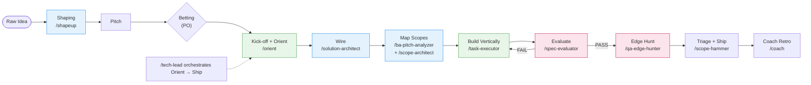

# ShapeUp SDLC

**Shape Up for coding agents — with gates the agent can't talk its way past.**

[](https://github.com/nguyenvanphituoc/shapeup-sdlc-plugin/actions/workflows/ci.yml)
[](LICENSE)


Your agent says it's done. It isn't. This is a [Claude Code](https://code.claude.com) plugin
that runs a full Shape Up lifecycle — idea → pitch → build → evaluate → ship — where the
important rules are enforced by the runtime instead of asked for in a prompt.

The ceremony is right-sized: `/ship` runs the full gated pipeline for real features, and
`/ship --tiny` runs a two-gate lane (orient → build → smoke-test → done) for the one-file
fixes where the gates would have nothing to say.

<p align="center">
  
</p>

<p align="center"><sub>
The denial text above is <b>verbatim stdout</b> from <code>hooks/gate-l2.mjs</code> —
<a href="scripts/demo/record-demo.mjs">the recorder runs the real hook</a> and fails rather than
draw a picture. <a href="docs/assets/demo-gate.txt">Plain-text transcript.</a>
</sub></p>

## What it does to your agent

Every framework in this category answers *"the agent ignored the spec"* with better prose.
This one answers it with a runtime. Three things are true of a run here that are not true of a
prompt-based harness:

**1. The agent cannot evaluate its own half-finished work.** A `PreToolUse` hook hard-denies
the once-per-round evaluation while any task is unfinished, naming the offenders. It is not a
reminder the model can rationalize past — the tool call never reaches the evaluator.
→ *Prevents: the agent running EVAL on a half-green board and reporting PASS.*

**2. Progress is measured, not claimed.** A scope counts as built only when `t0-verify` runs
its fixtures, a DB probe, and the seesaw, and writes an artifact to disk. The evaluator must
cite that artifact and re-hashes it itself; hill phase is derived from those facts, so no
worker can self-report confidence.
→ *Prevents: "done" asserted with nothing behind it.*

**3. Parallel work can't corrupt shared state.** Each scope gets a write-whitelist of files
enforced by a hook, and one script performs every board/ledger/verdict write.
→ *Prevents: two parallel executors both rewriting the board, and one's completions vanishing.*

Under the hood this rests on a typed worker envelope and a single-writer state layer. Those
are load-bearing plumbing, and you should not have to think about them to use the harness —
they are documented for [contributors](CONTRIBUTING.md), not for users.

## Quickstart

```
/plugin marketplace add nguyenvanphituoc/shapeup-sdlc-plugin
/plugin install shapeup-sdlc-plugin@nvptuoc-marketplace
/ship "add dark mode to the settings screen"
```

`/ship` walks the whole lifecycle and pauses at each gate for you. That's the whole quickstart.

<sub>No prerequisites for non-UI work — a browser (`npx playwright install chromium`) is needed
only when a run actually reaches a `[ui]` acceptance criterion. Team installs, the scaffolding
installer (Claude Code / Antigravity / Codex), and troubleshooting are in
**[docs/install.md](docs/install.md)**; upgrading is **[docs/upgrading.md](docs/upgrading.md)**.</sub>

## Agent support

The harness is written once and compiled to other agent CLIs (`npm run distribute` emits
`dist/`; the [scaffolding installer](docs/install.md#local-scaffolding) wires targets in one
run). The matrix is honest — the row that matters most does not travel:

| | Claude Code | Cursor | Antigravity | Codex |
|---|:---:|:---:|:---:|:---:|
| The 13 skills | ✅ plugin | ✅ `.mdc` rules (references inlined) | ✅ subagent defs + skill files | ✅ skill files |
| Slash commands | ✅ all 10 | ✅ VS Code/Cursor extension + rules | — | — |
| Pipeline scripts (`t0-verify`, `trace-lint`, oracles) | ✅ | ✅ plain Node, run from any CLI | ✅ | ✅ |
| **Hook-enforced gates** (deny on premature EVAL, substrate sandbox, safety spine) | ✅ | ❌ | ❌ | ❌ |
| Advisory Stop hooks | ✅ | ❌ | ❌ | ❌ |

Hooks are a per-CLI mechanism, so outside Claude Code the gates degrade from **enforced** to
**instructed** — the same honor system every other framework runs on everywhere. If the deny
hook is why you're here, that currently means Claude Code.

## Glossary

This harness has its own vocabulary. Here is all of it, in plain English — you can read the
rest of this README after this table and nothing will be a surprise.

| Term | In plain English |
|---|---|
| **board** | The round's task list. "Green" means every task is done. The deny hook reads this. |
| **round** | One build → evaluate cycle. A FAIL verdict starts round *r+1*. |
| **T0** | The smoke test a scope must pass before it counts as built: its fixtures + a DB probe + the seesaw. Writes an artifact to disk that the evaluator must cite. |
| **seesaw** | The part of T0 that re-runs *other* scopes' fixtures — so a regression is never mistaken for progress. |
| **substrate** | The exact list of files one scope is allowed to write. A hook blocks anything outside it. |
| **scope contract** | The file defining one vertical slice: its substrate, its fixtures, its affordances. |
| **affordance** | The thing a user can actually click, type or call. UI is graded on affordances, not on looks. |
| **hill / hill phase** | How much of a scope is still *unknown* versus merely *unfinished*. Derived from T0 facts — never self-reported. |
| **gate (L0–L4)** | A numbered checkpoint in a run. Most pause for you; GATE L2 is the one enforced by a hook. |
| **covers-closure** | Every requirement clause has at least one task claiming to cover it. Nothing silently drops. |
| **wiring reachability** | Every engine has a call site reachable from the app's real entry point. Catches "built, but never wired up". |
| **discovery ledger** | The one file everything found mid-run gets written to, so nothing is lost between rounds. |

A longer version, including the internals, is in [docs/glossary.md](docs/glossary.md).

## The workflow

The harness walks a pitch from idea to ship. The full annotated pipeline — the build round,
the gate walkthrough, the circuit breaker — is
[`docs/design/04-functional-design.md`](docs/design/04-functional-design.md), and the design
document as a whole starts at [`docs/design/`](docs/design/README.md). A simplified view:


```mermaid
graph LR
    A([Raw Idea]) --> S["Shaping<br>/shapeup"]
    S --> P["Pitch"]
    P --> BET{"Betting<br>(PO)"}
    BET --> KO["Kick-off + Orient<br>/orient"]
    KO --> WIRE["Wire<br>/solution-architect"]
    WIRE --> MAP["Map Scopes<br>/ba-pitch-analyzer<br>+ /scope-architect"]
    MAP --> BUILD["Build Vertically<br>/task-executor"]
    BUILD --> EVAL["Evaluate<br>/spec-evaluator"]
    EVAL -- FAIL --> BUILD
    EVAL -- PASS --> QA["Edge Hunt<br>/qa-edge-hunter"]
    QA --> SHIP["Triage + Ship<br>/scope-hammer"]
    SHIP --> RETRO["Coach Retro<br>/coach"]
    TL["/tech-lead orchestrates Orient → Ship"] -.-> KO

    classDef plan fill:#e3f2fd,stroke:#1e88e5;
    classDef build fill:#e8f5e9,stroke:#43a047;
    classDef qa fill:#fce4ec,stroke:#c2185b;
    class S,WIRE,MAP plan;
    class KO,BUILD build;
    class QA,EVAL qa;
```

Since v1.3 the pipeline carries a **traceability spine**: `ba-pitch-analyzer`'s `coverage`
operation writes a requirement registry (`requirements.md`), `solution-architect` commits a
per-use-case wiring map (`wiring-map.json`, gate L1a.5) resolved against the L0
`project-profile.json`, and the covers-closure + reachability oracle
`skills/tech-lead/scripts/trace-lint.mjs` checks that no engine ships orphaned. It runs
advisory (warn-only) and is promoted to a blocking gate only once `covers:` is populated;
every arm is skipped when its artifact is absent, so older specs are unaffected.

## What's included

### Skills

| Phase | Skill | Version | What it does |
|-------|-------|---------|--------------|
| Shaping (1–4) | `shapeup` | — | Frame the problem, breadboard affordances, spike risks, write the pitch. Sub-commands: `full`, `shaping`, `spike`, `breadboarding`, `framing-doc`, `kickoff-doc`, `breadboard-reflection`. |
| Intake (GATE L0) | `translator` | — | Normalizes non-English intake (pitch/PRD/transcript) to faithful English before planning. The harness is English-only downstream. |
| Orient (7) | `orient` | — | Builder-led recon: reads the code, spikes the single riskiest area, emits a code-surface map, spike findings, discovered-task seed, and a hill signal. Writes no production code. |
| Wire (GATE L1a.5) | `solution-architect` | v1.1 | Sole writer of the committed wiring map (`wiring-map.json`): per-UC engine → integration seam → entry-point call site → player-visible affordance, resolved against `project-profile.json`. Front-loads the integration seam so no engine ships orphaned; the reachability input `trace-lint.mjs` checks. Operation: wire. |
| Map Scopes (8) | `ba-pitch-analyzer` | v4.0 | The spec-analyzer (pure worker). Decomposes a pitch into a linked DDD document tree (domain model → use cases → tasks) with BDD scenarios, a UC system flow, and a derived `## Test Surface`. One craft, five order-selected operations (analyze / generate-board / reconcile / retrofit-surface / coverage — the last writes the shared `requirements.md` registry for covers-closure); graph math + audits delegated to `board-derive.mjs`/`spec-lint.mjs`. |
| Map Scopes (8) | `scope-architect` | v1.0 | Sole writer of committed, write-whitelisted scope contracts (`scopes/*.json`): import-graph slicing by flow, substrates, affordance manifests, fixtures. Operations: map-scopes / remap / split-scope. |
| Build (9) | `task-executor` | v2.0 | Pure worker: work order in → code out. Assumption scan, minimum-code/surgical-change discipline, Layer 1/2/3 UI rules, substrate-sandboxed, zero-memory. Never writes boards/ledgers/run-state. |
| Evaluate (GATE L3) | `spec-evaluator` | v1.0 | The single judge (pure worker). Verifies spec-conformance, TDD surface, and integration against the running app — skeptical, files `file:line` bugs, runs exactly once per build round. Requires a T0 artifact citation, grades UI affordance-only; verdict + refuted boxes return as data. |
| QA (post-PASS) | `qa-edge-hunter` | v1.1 | Exploratory edge hunt on the running app through six fixed lenses, charting edges *outside* what the evaluator probed. Findings go to the ledger as `~`; never blocks ship. |
| Advisor (mid-build) | `advisor-protocol` | v0.1 | Adjudicates a worker's structured `ESCALATE` (design decision / spec ambiguity / substrate expansion) within a per-scope-per-round budget; persists answers to the committed round ledger so they survive a zero-memory reset. |
| Stop (11) | `scope-hammer` | v0.1 | GATE H: must-have census → baseline comparison (never vs. the ideal) → cut list + ship verdict. Handles the normal stop and both circuit-breaker triggers. |
| Retro (post-L4) | `coach` | — | RLHF for the harness: turns raw PO/TL feedback at Ship Sign-off into per-skill guidelines under committed `docs/shapeup-sdlc/knowledge-base/<skill>.md`, read back by `task-executor` / `ba-pitch-analyzer` / `qa-edge-hunter` on their next run. GATE COACH-1 asks the PO which skill owns each rule — never assumes; mechanism defects are filed to the harness-defect register instead. |
| Orchestrator | `tech-lead` | v1.0 | Owns the run end-to-end: PLAN once → BUILD all tasks → EVAL once per round, looping on FAIL. Two-level circuit breaker, T0/seesaw-verified build rounds, mechanical hill derivation. Sole writer of run-state. |

### Commands

`/ship` runs the whole lifecycle; the phase commands run one step each, so the pipeline is
learnable from `/`-completion alone.

| Command | Phase | Description |
|---------|-------|-------------|
| `/ship` | all | Run the full harness on a pitch (interactive gates by default; `--auto`, `--unattended`). |
| `/shape` | 1 | Shape a raw idea into a pitch: boundaries → breadboard → spike → `pitch.md`. |
| `/orient` | 7 | Builder-led recon; spikes the riskiest area, writes no production code. |
| `/wire` | L1a.5 | Write the wiring map — engine → seam → entry-point call site, per use case. |
| `/scopes` | 8 | Spec tree + board (`ba-pitch-analyzer`), then scope contracts (`scope-architect`). |
| `/build` | 9 | Implement one task's acceptance criteria exactly. |
| `/eval` | L3 | The single judge. Round mode is hook-gated — see the demo above. |
| `/qa` | post-PASS | Exploratory edge hunt; findings never block ship. |
| `/hammer` | H | Must-have census, baseline comparison, cut list + ship verdict. |
| `/retro` | post-L4 | File ship-gate feedback into the per-skill knowledge base. |

### Agents

| Agent | Description |
|-------|-------------|
| `reviewer` | Independent correctness/security code reviewer (returns findings, never edits). |

### Hooks

Seven Node hooks. What each one reads and what it can deny:

- `SessionStart` — prints a load confirmation so you know the plugin is active; on
  `compact|resume`, `hooks/session-rehydrate.mjs` additionally injects the mid-run
  `RunSnapshot` hint ("trust the files, not the summary") when a harness run is in flight.
- `PreToolUse` (matcher `Skill`) — **`hooks/gate-l2.mjs` hard-blocks the once-per-round EVAL
  delegation while the task board isn't fully green.** This is the gate in the demo above.
- `PreToolUse` (matcher `Bash|Read|Write|Edit|MultiEdit`) — `hooks/safety-spine.mjs` denies
  destructive commands (`rm -rf` on unrecoverable targets, force-push/push-to-main,
  `git reset --hard`, `DROP TABLE`) and secret-file reads. Machine guard, not pipeline guard;
  escape hatch is the human-authored `.shapeup-sdlc/safety-overrides.json`.
- `PreToolUse` (matcher `Edit|Write|MultiEdit`) — `hooks/sandbox-guard.mjs` blocks writes
  outside the active scope's substrate whitelist (no-op unless scope contracts exist).
- `PreToolUse` (matcher `Skill|Agent`) — `skills/tech-lead/scripts/validate-envelope.mjs`
  denies any worker dispatch whose order file is missing or schema-invalid.
- `Stop` — two **advisory, never-blocking** hooks (`hooks/anti-rationalization.mjs` flags
  completion claims the board/T0 facts contradict; `hooks/slop-cleaner.mjs` flags TODO/
  `console.log`/commented-out-code leftovers in the session's diff). They emit at most a
  `systemMessage` — "QA is a level-up, not a gate."
- `PreCompact` — `hooks/compact-snapshot.mjs` persists the mid-run `RunSnapshot` to
  `.shapeup-sdlc/<slug>/run-snapshot.json` before the conversation is compacted.

No hook makes a network request, none has dependencies, and all are plain, readable `.mjs`
files. **[SECURITY.md](SECURITY.md)** states what each hook reads, what it can deny, and what
it never does — as claims written to be falsified, with the grep to check them.

> A project-local `/gap-scan` command (navigator→driver gap tracking) lives under
> `.claude/commands/` for this repo's own use. It is **not** bundled in the distributed
> plugin.

## Architecture invariants

These hold across the harness and are the reason it stays predictable:

- **One judge only** — the verdict belongs to `spec-evaluator`. QA has no verdict and no score.
- **EVAL exactly once per round** — QA is not a second evaluation pass; it runs after PASS, outside the loop.
- **Ledger is the single source of truth** — orient, task-executor, and QA all write to `discovery/ledger.md`.
- **QA is a level-up, not a gate** — `--no-qa` skips it; the circuit breaker outranks the hunter; findings default to `~`.
- **Role separation** — evaluator grades, task-executor fixes, QA discovers; no one does another's job.
- **Two-level circuit breaker** — an outer `round_budget` (build+eval cycles) nests an inner
  per-scope `attempt_budget` (T0 attempts); an exhausted scope queues a GATE H proposal instead
  of blocking the round.
- **Hill phase is mechanical, never self-reported** — derived only from T0/T1/seesaw facts, closing
  the self-reported-confidence risk outright.
- **One writer per shared file** — every board/ledger/verdict write goes through
  `ingest-result.mjs`; workers return data and never touch shared state.
- **Traceability is oracle-checked, opt-in** — `trace-lint.mjs` verifies covers-closure and
  wiring reachability from the committed spine artifacts; it ships advisory (warn-only) and every
  arm is skipped when its artifact is absent, so older specs are non-regressed.

## Known rough edges

Stated plainly, because you will hit them:

- **The `--tiny` lane is young.** It right-sizes the ceremony (two gates instead of eight) but
  keeps the T0 verification floor; its fit-check heuristics will need tuning against real use.
- **The trigger-eval numbers are unmeasured.** The harness ships `status: "unmeasured"` and a
  CI test that *fails* if fabricated results appear. There is no benchmark claim here yet
  because there is not yet an honest one.

Contributions to any of these are welcome — see [CONTRIBUTING.md](CONTRIBUTING.md).

## Develop

```bash
npm test                             # structural tests
npm run demo                         # re-record the demo asset from the real hook
claude plugin validate . --strict    # the same check CI runs
claude --plugin-dir .                # load this working copy without installing
```

## Layout

```
.claude-plugin/
  plugin.json         # plugin manifest
  marketplace.json    # marketplace listing (points at this repo)
skills/<name>/SKILL.md # the 13 harness skills (+ references/ and assets/)
skills/tech-lead/scripts|schemas/        # orchestrator pipeline: compile-order, ingest-result,
                                         #   validate-envelope, t0-verify, trace-lint,
                                         #   aegis-digest, run-snapshot, stats + envelope schemas
skills/ba-pitch-analyzer/scripts/        # planner mechanics: board-derive, spec-lint
skills/spec-evaluator/scripts/           # verdict-ledger (reference impl of the flip/confidence grammar)
commands/*.md         # slash commands (/ship + the 9 phase commands)
agents/*.md           # subagents (reviewer)
hooks/                # hooks.json + safety-spine, gate-l2, sandbox-guard (PreToolUse),
                      #   anti-rationalization, slop-cleaner (Stop, advisory),
                      #   compact-snapshot (PreCompact), session-rehydrate (SessionStart)
scripts/install-harness.sh, migrate.sh   # stable public entrypoints (fresh install / update)
scripts/demo/record-demo.mjs             # regenerates docs/assets/demo-gate.svg
scripts/shapeup-sdlc/                    # dev/CI tooling: lib/, migrations/, oracles/,
                                         #   trigger-eval.mjs, distribute.js
docs/install.md, upgrading.md, glossary.md
docs/design/          # the design document (pipeline, gates, circuit breaker, ERD)
docs/launch/          # directory-submission copy
.github/workflows/    # CI + release
```

## Release

1. Bump `version` in `.claude-plugin/plugin.json`.
2. Update `CHANGELOG.md`.
3. Tag and push: `git tag v1.3.1 && git push origin v1.3.1`.

The release workflow validates the plugin, checks the tag matches the manifest version,
and publishes a GitHub release.

## Credits

- The `shapeup` skill (shaping, breadboarding, spike, framing/kickoff docs) is inspired by and
  reuses material from [rjs/shaping-skills](https://github.com/rjs/shaping-skills) by Ryan Singer.
- The Shape Up methodology is from [*Shape Up*](https://basecamp.com/shapeup) by Basecamp.

This project carries Shape Up's *building* apparatus — appetite, hill charts, the scope hammer,
"QA is for the edges", comparing against baseline rather than the ideal — into a mechanized
loop. The shaping half is Ryan Singer's work, gratefully used.

## License

MIT — see [LICENSE](LICENSE).
