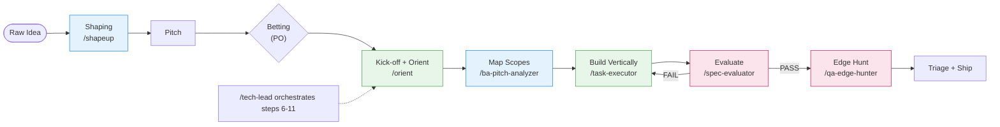

# ShapeUp SDLC Plugin

A [Claude Code](https://code.claude.com) plugin that turns a raw idea into shipped
code through an opinionated **Shape Up** software-development lifecycle. It packages
a `planner → generator → judge` skill harness — shaping, intake, orient, scope
mapping, vertical building, evaluation, and exploratory QA — orchestrated end-to-end
by a thin tech-lead.

This repository is **both the plugin and its marketplace**, so colleagues install it
directly from GitHub.

> **Attribution.** The `shapeup` skill (shaping, breadboarding, spike, framing/kickoff
> docs) is inspired by and reuses material from
> [rjs/shaping-skills](https://github.com/rjs/shaping-skills). See [Credits](#credits).

## Install

In any Claude Code session:

```
/plugin marketplace add nguyenvanphituoc/shapeup-sdlc-plugin
/plugin install shapeup-sdlc-plugin@nvptuoc-marketplace
```

Pin to a released version:

```
/plugin marketplace add nguyenvanphituoc/shapeup-sdlc-plugin@v0.1.0
```

### Bundled dependency

This plugin depends on the official **Playwright** plugin
(`playwright@claude-plugins-official`) — the QA and evaluation skills drive the running
app to verify `[ui]` criteria. On a normal `/plugin install`, Claude Code resolves the
dependency automatically (adding the `claude-plugins-official` marketplace if needed).

The evaluation/QA skills drive the browser through the Playwright **CLI** by default
(token-efficient), so the dependency also expects a browser binary to be present:

```bash
npx playwright install chromium
```

**Troubleshooting — `Dependency "playwright@claude-plugins-official" is not installed`.**
This means the Playwright plugin is missing *or installed-but-disabled*. Install and/or
enable it, then reload:

```bash
claude plugin install playwright@claude-plugins-official   # if missing
claude plugin enable  playwright@claude-plugins-official    # if disabled
```

In a session, `/reload-plugins` picks up the change. Note: the dependency gate is also
checked when loading a working copy with `claude --plugin-dir .`, so enable Playwright
before dev-loading this plugin.

### Install for the whole team

The **Local Scaffolding installer** (see below) does this automatically. If you prefer to
wire it by hand, commit this to a project's `.claude/settings.json`:

```json
{
  "extraKnownMarketplaces": {
    "nvptuoc-marketplace": {
      "source": { "source": "github", "repo": "nguyenvanphituoc/shapeup-sdlc-plugin" }
    }
  },
  "enabledPlugins": {
    "shapeup-sdlc-plugin@nvptuoc-marketplace": true
  }
}
```

### Local Scaffolding Architecture (Recommended)

Instead of installing the plugin globally, you can scaffold the Shape Up SDLC harness directly into a target repository. For Claude Code this wires the plugin via `.claude/settings.json` (marketplace + enable). For Antigravity and Codex it copies skill files into the project, enabling **local skill evolution and custom project tuning**.

Run **one** of the following from the root of your target project:

**Option A — Remote (curl, no clone needed):**

```bash
curl -fsSL "https://raw.githubusercontent.com/nguyenvanphituoc/shapeup-sdlc-plugin/main/scripts/install-harness.sh" | bash -s -- --directory . --yes
```

> **Note — `--yes` flag**: When piped via `curl | bash`, stdin is consumed by the pipe so the
> interactive prompt receives no input and cancels. Always pass `--yes` (or `-y`) with the remote
> one-liner. Omit it when running the script directly to get an explicit confirmation.

**Option B — Local clone:**

```bash
/path/to/shapeup-sdlc-plugin/scripts/install-harness.sh --directory .
```

> The installer scripts are bash (macOS / Linux). On Windows, run them under WSL or Git Bash.

This installer automatically configures:
- **Claude Code**: Runs `claude plugin marketplace add --scope project` + `claude plugin install --scope project` to register the marketplace and enable the plugin in one shot (writes `.claude/settings.json`), then appends/creates `CLAUDE.md`. Falls back to writing `settings.json` directly if the `claude` CLI is not in PATH.
- **Antigravity**: Copies skills to `.agents/skills/`, subagent configs to `.agents/subagents/`, and creates `.agents/AGENTS.md`.
- **Codex**: Copies skills to `.codex/skills/` and creates `.codex/AGENTS.md`.
- **Local Git Boundaries & Telemetry**: Adds the `.shapeup-sdlc/` + Tier C ignore rules to `.gitignore`, initializes the per-machine `docs/shapeup-sdlc/metrics/` shard directory, and drops the Tier C example templates (`.claude/settings.local.example.json`, `.env.shapeup.example`).

### Upgrading an existing install (knowledge base → team-shared)

Updating an install is a **versioned migration**, modeled on database migration tools (Flyway /
Rails): `migrate.sh` first **updates code** (replaces the installed skills for each CLI), then
**migrates data** by applying any pending `scripts/shapeup-sdlc/migrations/NNNN__*.sh` in order and recording
each in a committed `docs/shapeup-sdlc/.harness-migrations` ledger. It is idempotent — applied
migrations are skipped on re-run — so it is always safe to run again, and every future version adds
its own migration rather than another one-off script. See
[`docs/audit/migration-system.md`](docs/audit/migration-system.md).

**Option A — Remote one-liner** (no clone needed; auto-detects installed CLIs):

```bash
curl -fsSL "https://raw.githubusercontent.com/nguyenvanphituoc/shapeup-sdlc-plugin/main/scripts/migrate.sh" | bash -s -- --directory . --yes
```

> As with the installer, the piped form consumes stdin, so pass `--yes` (it auto-detects installed
> CLIs). Omit it when running from a clone to get the interactive CLI prompt.

**Option B — Local clone:**

```bash
/path/to/shapeup-sdlc-plugin/scripts/migrate.sh --directory .        # update code + migrate data
/path/to/shapeup-sdlc-plugin/scripts/migrate.sh --directory . --dry-run   # list pending migrations
```

Migration `0001` performs the knowledge-base upgrade: as of plugin 0.2.5 / tech-lead
0.12, `/coach` no longer writes one flat, gitignored `.shapeup-sdlc/knowledge-base.md` (which never
reached teammates and was never read back). It now files each rule **by skill** under committed
`docs/shapeup-sdlc/knowledge-base/<skill>.md`, read back by `task-executor` / `ba-pitch-analyzer` /
`qa-edge-hunter` at the top of their next run. Old rules are preserved verbatim into
`docs/shapeup-sdlc/knowledge-base/_INBOX.md` — **never auto-categorized**. Afterward, run `/coach`
on `_INBOX.md` to assign each rule to a skill (its GATE COACH-1 asks — it never assumes), and commit
`docs/shapeup-sdlc/` so the team inherits the knowledge base + migration ledger on `git pull`.

Migration `0002` brings a pre-0.3.0 install up to the file-organization addendum: it shards a flat
`docs/shapeup-sdlc/metrics.jsonl` into `docs/shapeup-sdlc/metrics/<machine-id>.jsonl` (retiring the
old file to `metrics.jsonl.migrated`), adds the Tier C `.gitignore` rules, and drops the Tier C
example templates — the same three steps a fresh `install-harness.sh` run already does.

(Source resolution, CLI selection, and skill replacement are factored into a shared
`scripts/shapeup-sdlc/lib/lib-harness.sh`; the migration runner lives in
`scripts/shapeup-sdlc/lib/lib-migrate.sh`. The `install-harness.sh` / `migrate.sh` entrypoints stay
at a stable `scripts/` path on purpose — an update mechanism that broke its own bookmarked URL on
every refactor would defeat the point of having one.)

## The workflow

The harness walks a pitch from idea to ship. The full annotated pipeline (gates,
discovered-task ledger, retrofit path) lives in [`docs/mechanism-roadmap.md`](docs/mechanism-roadmap.md);
a simplified view:


```mermaid
graph LR
    A([Raw Idea]) --> S["Shaping<br>/shapeup"]
    S --> P["Pitch"]
    P --> BET{"Betting<br>(PO)"}
    BET --> KO["Kick-off + Orient<br>/orient"]
    KO --> MAP["Map Scopes<br>/ba-pitch-analyzer"]
    MAP --> BUILD["Build Vertically<br>/task-executor"]
    BUILD --> EVAL["Evaluate<br>/spec-evaluator"]
    EVAL -- FAIL --> BUILD
    EVAL -- PASS --> QA["Edge Hunt<br>/qa-edge-hunter"]
    QA --> SHIP["Triage + Ship"]
    TL["/tech-lead orchestrates steps 6-11"] -.-> KO

    classDef plan fill:#e3f2fd,stroke:#1e88e5;
    classDef build fill:#e8f5e9,stroke:#43a047;
    classDef qa fill:#fce4ec,stroke:#c2185b;
    class S,MAP plan;
    class KO,BUILD build;
    class QA,EVAL qa;
```

## What's included

### Skills

| Phase | Skill | Version | What it does |
|-------|-------|---------|--------------|
| Shaping (1–4) | `shapeup` | — | Frame the problem, breadboard affordances, spike risks, write the pitch. Sub-commands: `full`, `shaping`, `spike`, `breadboarding`, `framing-doc`, `kickoff-doc`, `breadboard-reflection`. |
| Intake (GATE L0) | `translator` | — | Normalizes non-English intake (pitch/PRD/transcript) to faithful English before planning. The harness is English-only downstream. |
| Orient (7) | `orient` | — | Builder-led recon: reads the code, spikes the single riskiest area, emits a code-surface map, spike findings, discovered-task seed, and a hill signal. Writes no production code. |
| Map Scopes (8) | `ba-pitch-analyzer` | v4.0 | The spec-analyzer (pure worker). Decomposes a pitch into a linked DDD document tree (domain model → use cases → tasks) with BDD scenarios, a UC system flow, and a derived `## Test Surface`. One craft, four order-selected operations (analyze / generate-board / reconcile / retrofit-surface); graph math + audits delegated to `board-derive.mjs`/`spec-lint.mjs`. |
| Map Scopes (8) | `scope-architect` | v1.0 | Sole writer of committed, write-whitelisted scope contracts (`scopes/*.json`): import-graph slicing by flow, substrates, affordance manifests, fixtures. Operations: map-scopes / remap / split-scope. |
| Build (9) | `task-executor` | v2.0 | Pure worker: WorkOrder in → code + WorkResult out. Assumption scan, minimum-code/surgical-change discipline, Layer 1/2/3 UI rules, substrate-sandboxed, zero-memory. Never writes boards/ledgers/run-state — `ingest-result.mjs` applies its envelope. |
| Evaluate (GATE L3) | `spec-evaluator` | v1.0 | The single judge (pure worker). Verifies spec-conformance, TDD surface, and integration against the running app — skeptical, files `file:line` bugs, runs exactly once per build round. Requires a T0 artifact citation, grades UI affordance-only; verdict + refuted boxes return as data. |
| QA (post-PASS) | `qa-edge-hunter` | v1.0 | Exploratory edge hunt on the running app through six fixed lenses, charting edges *outside* what the evaluator probed. Findings go to the ledger as `~`; never blocks ship. |
| Advisor (mid-build) | `advisor-protocol` | v0.1 | Adjudicates a worker's structured `ESCALATE` (design decision / spec ambiguity / substrate expansion) within a per-scope-per-round budget; persists answers to the committed round ledger so they survive a zero-memory reset. |
| Stop (11) | `scope-hammer` | v0.1 | GATE H: must-have census → baseline comparison (never vs. the ideal) → cut list + ship verdict. Handles the normal stop and both circuit-breaker triggers. |
| Orchestrator | `tech-lead` | v1.0 | Owns the run end-to-end: PLAN once → BUILD all tasks → EVAL once per round, looping on FAIL. Every dispatch goes through the envelope port (compile-order → `--order` → ingest-result). Two-level circuit breaker, T0/seesaw-verified build rounds, mechanical hill derivation. Sole writer of run-state (D6 closed mechanically). |

### Commands

| Command | Description |
|---------|-------------|
| `/ship` | Run the full harness unattended (pitch → ship). |

### Agents

| Agent | Description |
|-------|-------------|
| `reviewer` | Independent correctness/security code reviewer (returns findings, never edits). |

### Hooks

- `SessionStart` — prints a load confirmation so you know the plugin is active.
- `PreToolUse` (matcher `Skill`) — `hooks/gate-l2.mjs` hard-blocks the once-per-round EVAL
  delegation while the task board isn't fully green.
- `PreToolUse` (matcher `Edit|Write|MultiEdit`) — `hooks/sandbox-guard.mjs` blocks writes
  outside the active scope's substrate whitelist (v0.3.0, no-op unless scope contracts exist).

> A project-local `/gap-scan` command (navigator→driver gap tracking) lives under
> `.claude/commands/` for this repo's own use. It is **not** bundled in the distributed
> plugin.

## Architecture invariants

These hold across the harness and are the reason it stays predictable:

- **One judge only** — the verdict belongs to `spec-evaluator`. QA has no verdict and no score.
- **EVAL exactly once per round** — QA is not a second evaluation pass; it runs after PASS, outside the loop.
- **Ledger is the single source of truth** — orient, task-executor, and QA all write to `discovery/ledger.md`.
- **QA is a level-up, not a gate** — `--no-qa` skips it; the circuit breaker outranks the hunter; findings default to `~`.
- **Role separation** — evaluator grades, task-executor fixes, QA discovers; no one does another's job.
- **Two-level circuit breaker** — an outer `round_budget` (build+eval cycles) nests an inner
  per-scope `attempt_budget` (T0 attempts); an exhausted scope queues a GATE H proposal instead
  of blocking the round (v0.3.0, scope contracts only).
- **Hill phase is mechanical, never self-reported** — derived only from T0/T1/seesaw facts, closing
  the self-reported-confidence risk outright (v0.3.0).

## Develop

```bash
# Validate locally (the same check CI runs)
claude plugin validate . --strict

# Load this working copy into a session without installing
claude --plugin-dir .
```

## Layout

```
.claude-plugin/
  plugin.json         # plugin manifest
  marketplace.json    # marketplace listing (points at this repo)
skills/<name>/SKILL.md # the 11 harness skills (+ references/ and assets/)
skills/tech-lead/scripts|schemas/        # orchestrator pipeline: compile-order, ingest-result,
                                         #   validate-envelope, t0-verify, aegis-digest + envelope schemas
skills/ba-pitch-analyzer/scripts/        # planner mechanics: board-derive, spec-lint
commands/*.md         # slash commands (/ship)
agents/*.md           # subagents (reviewer)
hooks/                # hooks.json + gate-l2.mjs + sandbox-guard.mjs (SessionStart + PreToolUse)
scripts/install-harness.sh, migrate.sh   # stable public entrypoints (fresh install / update)
scripts/shapeup-sdlc/                    # dev/CI tooling: lib/, migrations/, oracles/,
                                         #   trigger-eval.mjs, verdict-ledger.mjs, distribute.js
docs/mechanism-roadmap.md       # full annotated pipeline diagram
.github/workflows/    # CI + release
```

## Release

1. Bump `version` in `.claude-plugin/plugin.json`.
2. Update `CHANGELOG.md`.
3. Tag and push: `git tag v0.2.0 && git push origin v0.2.0`.

The release workflow validates the plugin, checks the tag matches the manifest version,
and publishes a GitHub release.

## Credits

- The `shapeup` skill is inspired by and reuses material from
  [rjs/shaping-skills](https://github.com/rjs/shaping-skills) by Ryan Singer.
- The Shape Up methodology is from [*Shape Up*](https://basecamp.com/shapeup) by Basecamp.

## License

MIT — see [LICENSE](LICENSE).
