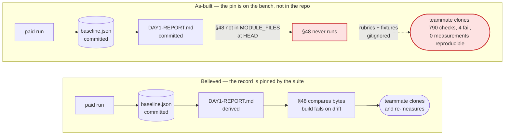

# Day 1's measurement is done; Day 1's evidence is not — a clone of HEAD runs 790 of the 1244 checks the record cites, and fails 4

**Question:** The artifact says Day 1 is complete at 5/5. What is the next action that actually
closes the Day-1 plan's requirement, and is there one?
**Sources:** artifact `19018dfb` (Day 1 — Tier 1 measurement record), `docs/internal/plan/ratchet-and-receipt-plan.md`,
`evals/DAY1-REPORT.md`, `evals/baselines/skill-loop.baseline.json`, `tests/structural/48-day1-day2.mjs`,
`.gitignore`, and five test-suite runs against a local `git clone` of HEAD taken 2026-08-05.
**Confidence:** High on everything measured — every number below came from running the suite, not
from reading it. Medium on the fixture-commit recommendation, which is a policy call the operator
already made once in `4bf29e4` and may have made deliberately.
**Status:** Executed. The recommendation in §6 was carried out on 2026-08-05 and verified; see the
outcome block below. The analysis is preserved in its original tense as the record of what was
found.

---

## Outcome — all three steps landed, verified on a fresh clone

Six commits, `7cb30d2..397f01a`, no model spend and no measurement re-run.

| Acceptance check | Before | After |
|---|---|---|
| `npm test` on a fresh clone | 790 checks, **4 failures** | **1107 checks, 0 failures** |
| `skill-loop.mjs --selftest` on a clone | `no Day-1 rubrics found` | **5 rubrics discriminate**, weak → strong on every one |
| `DAY1-REPORT.md` regenerates from the baseline | §48 never ran | **byte-identical**, §48 loaded and enforcing |
| Committed files citing untracked docs | 1 (`day1-day2-measurement.md`) | **0** |

Two further defects were found while executing and are fixed in the same series — neither was
visible from reading, only from running:

1. **66 fixture files would have been dropped from the instrument commit.** The ba-pitch-analyzer
   reference drafts carry a board under `.shapeup/`, and the run-trace ignore rule matches that name
   at any depth — so the fixture directories would have looked committed while the loop graded a
   spec tree with no board. Caught by `git check-ignore` over every instrument file before staging;
   fixed with two negations (`7cb30d2`).
2. **Two of the five HD-00x fixes were neither committed nor guarded.** The published record says
   all five are "pinned by structural §46(f)(g)(h)(i)". §46 tests `contract-md.mjs` and nothing
   else, so HD-004 (`board-derive.mjs`, the *second* frontmatter parser — the one that cost a full
   paid measurement) and HD-001's `spec-lint.mjs` call site were unfixed at HEAD with no regression
   guard anywhere. Both fixes committed and both now pinned in §23, mutation-verified in both
   directions (`5cb8194`). The suite went 1244 → 1249 locally.

The reproducible ceiling is **1107 on a clone against 1249 locally** — the 142-check gap is the
gitignored `evals/runs/` records and is by design (§4.1, point 3). Quote 1107.

---

## 0. The finding in one paragraph

The artifact is numerically faithful: every per-skill figure in it re-derives from
`evals/baselines/skill-loop.baseline.json` — n, revision counts, fixture fingerprints, dollars, and
the run index at which each revision happened all check out exactly. What does not check out is the
one claim it makes about *durability*: "structural §48 fails the build if this table and that file
disagree." Structural §48 is not wired into the test runner at HEAD — the line adding
`48-day1-day2.mjs` to `MODULE_FILES` is sitting uncommitted in the working tree
(`tests/structural.mjs:38-56` vs `git show HEAD:tests/structural.mjs`). So does the fix for HD-001,
the flagship defect the artifact celebrates, while the regression guard that catches it *is*
committed. The consequence is measurable and I measured it: a fresh `git clone` of this repo runs
**790 checks and fails 4**, two of them the HD-001 guard. It cannot reproduce a single Day-1 number,
because the rubrics, fixtures and oracles that produced them are gitignored — `node
tools/skill-loop.mjs --selftest` on the clone answers `no Day-1 rubrics found`, which is the exact
command `evals/DAY1-REPORT.md:251` prints under the heading **Reproduce**. Day 1's own governing
requirement, from *Graph Engineering* §VI.A, is *every artifact stored*. The artifacts are stored —
in one working tree, uncommitted. **The measurement is finished. The evidence chain has a hole in
exactly the place this project spent five defects learning to look.**

---

## 1. What is actually being asked

The Day-1 plan declares itself complete (`docs/internal/plan/ratchet-and-receipt-plan.md`): all five Tier-1
skills meet all four conditions of §1, under the condition-4 text as amended by the operator on
2026-08-04. That reading is sound and the artifact discloses the amendment properly. So "continue to
meet the requirement" cannot mean *measure more* — there is no unmeasured skill inside the plan's
scope, and §6 rules `translator` out by name.

It has to mean the part of the requirement the plan states but does not check: §VI.A's *every
artifact stored*, which `evals/DAY1-REPORT.md:7-8` operationalises as **"this file and the baseline
it derives from are what survive a clone."** That is a falsifiable claim about a git repository, and
it is the only Day-1 claim nobody has run. So I ran it.

The evaluation criterion, therefore, is not a score. It is: **can a second person, on a second
machine, from `git clone` alone, (a) run the suite green, (b) verify the published numbers, and
(c) re-take a measurement?**

---

## 2. The as-built evidence chain, against the one people believe they have



Three mechanisms, each verified by running it rather than reading it:

**(a) §48 exists, is tracked, and is not loaded.** `tests/structural/48-day1-day2.mjs` is 1022 lines
and is in `git ls-files`. `MODULE_FILES` in `tests/structural.mjs` at HEAD lists seventeen modules
and `48-day1-day2.mjs` is not among them; the working tree adds it. A clone prints 54 section
headers and none is `▸ 48`.

**(b) The HD-001 fix is uncommitted; its guard is committed.** `skills/tech-lead/scripts/trace-lint.mjs:263-275`
— the `WIRING-UNREADABLE` red finding that stops the reachability gate failing open — shows only in
`git diff`. The guard that fires without it is in the committed `tests/structural/46-contract-md.mjs`.
That asymmetry is why HEAD is red rather than merely unpinned.

**(c) The instrument is gitignored by design.** `.gitignore:35-40` excludes `evals/*` with two
negations (`evals/baselines/skill-loop.baseline.json`, `evals/DAY1-REPORT.md`) and excludes
`skills/*/evals/`. That sweeps up the five Day-1 rubrics (`skills/*/evals/day1-rubric.json`), the
fixture spine (`evals/fixtures`, 548K), both row renderers (`evals/oracles`), all three schemas
(`evals/schemas`), the Day-2 register (`evals/failure-classes.json`), and — asymmetrically with its
sibling — `evals/baselines/trigger-evals.baseline.json`, which commit `4bf29e4` untracked while the
checks that require it stayed.

**The irony worth naming:** §48 contains a block headed *"the measurement SURVIVES a clone"*
(`tests/structural/48-day1-day2.mjs:410-434`). It checks that the baseline and the report are not
gitignored. It does not check the instrument, and it is not running anyway. Wired into a clone, §48
diagnoses this report's finding in its own words — `no Day-1 rubric found — the loop rung has no
instrument at all` — which is check output I obtained, not prose I wrote.

---

## 3. The central finding

**The Day-1 record is reproducible in exactly one place, and the artifact's headline durability
claim is true only there.**

This matters more here than it would in most repos, because reproducibility is not a nice-to-have
in this project — it is the thesis. `AGENTS.md` opens with *"every invariant that matters lives in
the runtime, not in a prompt."* The Day-1 plan's own rule is *"a figure with two homes has one that
is wrong, and this plan has already been stale twice"* (`docs/internal/plan/ratchet-and-receipt-plan.md`). The
programme's best return was five production defects found by *storing every artifact and re-scoring
it after a fix* — the report says so plainly at `:815-817`: **"Storing every artifact is what made
that recoverable."**

An instrument that is stored only on the machine that ran it has the property the harness was built
to eliminate. Concretely, today: nobody can re-score the stored drafts after the *next* HD-00x fix,
because the drafts and the rubrics that grade them do not leave this laptop. That capability — not
the 5/5 — is what the five defects were bought with, and it is currently one `rm -rf` from gone.

The artifact adds a third home for the numbers on top of that. Its data block is commented
`// data, transcribed from the committed baseline` — a hand-copy, unpinned by anything. It is
faithful today (I checked all five rows). The plan's own rule says what happens to it next.

---

## 4. Argued from the numbers

### 4.1 What each configuration actually runs

Five runs, same machine, same Node, differing only in what is present. `npm test` throughout.

| Configuration | Checks | Failures |
|---|---:|---:|
| **`git clone` of HEAD — what a teammate gets today** | **790** | **4** |
| HEAD + §48 wired in (fix (a) alone) | 864 | **10** |
| HEAD + instrument committed + HD-001 fix + §48 wired | **1100** | **0** |
| …plus the rest of the current working tree | 1102 | 0 |
| …plus gitignored `evals/runs/` (55 files) — **this machine** | **1244** | 0 |

Three things fall out of that table, and each changes an action:

1. **454 checks — 36% of the cited suite — do not exist on a clone.** The artifact's provenance line
   `suite: 1244 checks green` is a local measurement presented as a repository property.
2. **Wiring §48 in first makes things worse, not better** — 4 failures become 10. §48 hard-fails on
   a missing schema (`48-day1-day2.mjs:37`) and a missing register (`:950`). **The instrument must be
   committed before the check that requires it.** This is the one non-obvious step in the fix.
3. **142 of the 1244 checks come from `evals/runs/`** — gitignored raw run records, 55 files, which
   by deliberate policy (`.gitignore:24-32`) never leave the machine. Even after committing
   everything the plan intends to commit, the honest reproducible ceiling is **1102**, not 1244. A
   check count that varies with how many paid runs happen to be on disk is not a repository invariant
   and should not be quoted as one.

### 4.2 The four failures on a clone of HEAD

| Failing check | Cause | Fix |
|---|---|---|
| `HD-001 regression: trace-lint returned overall=green for an unreadable wiring map` | `trace-lint.mjs` fix uncommitted | commit the working-tree change |
| `HD-001 regression: reachability reported checked=true pass=true having walked nothing` | same | same |
| `only 0/13 skills have trigger-eval datasets` | `skills/*/evals/` gitignored | commit or scope the rule |
| `evals/baselines/trigger-evals.baseline.json missing` | untracked in `4bf29e4`; sibling baseline is negated, this one is not | add the negation or drop the check |

### 4.3 Audit of the artifact against the committed baseline

Every per-skill figure verified against `evals/baselines/skill-loop.baseline.json` by script.

| Artifact claim | Verdict |
|---|---|
| `scope-architect` n=10, 1 revision at run 5, 4 rounds, $20.6953, fixture `c613665dbb8e9202` | ✅ exact |
| `solution-architect` n=3, 1 revision at run 3, $1.7336, fixture `6fada177c6343ebc` | ✅ exact |
| `ba-pitch-analyzer` 1/16 pooled, 0/10 latest, $7.9758, fixture `e275807eff45902b` | ✅ exact |
| `spec-evaluator` 0/13 pooled, $12.5559 · `task-executor` 0/13, $6.6958 | ✅ exact |
| Bounds 39.4% / 86.5% / 26.4% / ≤21% | ✅ reproduce from the exact binomial |
| Cost estimates $12.90 / $5.30 / $8.60 / $6.30 | ✅ = plan §5's n=3 per-run figures × 10 |
| 5/5 amended, 3/5 original, disclosure of the amendment | ✅ matches plan §1 and report `:44-49` |
| `suite: 1244 checks green` | ⚠️ true here only; **790 on a clone**, 1102 reproducible ceiling |
| `spend: $61.35` | ⚠️ unlabelled. Equals P7 $13.43 + P8 $47.92 exactly, i.e. *the last two phases*, not the programme — plan §5 puts P1–P5 at a further $12.38 plus superseded runs. Reads as a total. |
| `23 paid measurements` | ⚠️ not derivable from any committed file; plan §5 says "seventeen" pre-P8 |
| "structural §48 fails the build if this table and that file disagree" | ❌ §48 does not run at HEAD, and it compares `DAY1-REPORT.md`, never this artifact |

The three flagged rows are the whole of the artifact's inaccuracy, and none of them is a per-skill
number. That is a good result for a hand-transcribed document and an argument for not making
another one.

---

## 5. What deliberately not to do

- **Do not measure anything.** There is no Day-1 skill left to measure, and §P7 pre-registered the
  refusal to escalate fixtures again (`docs/internal/plan/ratchet-and-receipt-plan.md:716`). Spending on `translator` or on
  raising `n` to 40 is Day-2 or Tier-2 work and both were costed and rejected on the record ($52–70,
  55–87% chance of a null). Re-opening either now converts a finished programme into an open one.
- **Do not amend the report to soften the `Reproduce:` line.** Making the claim smaller is the
  cheaper repair and it is the wrong one: the reason the line is there is that §VI.A requires it.
  Fix the repository, not the sentence.
- **Do not commit `evals/runs/`.** 2.3 MB of raw drafts that churn every run, and ADR-0001's split
  puts them on the machine's side correctly. Accept 1102 as the reproducible ceiling and stop
  quoting 1244.
- **Do not publish a fourth home for the numbers.** The artifact should link to
  `evals/DAY1-REPORT.md`, or be regenerated from the baseline by a script that §48 diffs — same rule
  the report already lives under. A hand-transcribed copy is exactly the "figure with two homes" the
  plan forbids, and it has already acquired two figures ($61.35, 23) that exist nowhere else.
- **Do not wire §48 in as the first commit.** Verified above: it takes a clone from 4 failures to
  10.

---

## 6. Recommendation — one action, three commits, no spend

**Next action: make HEAD reproduce Day 1. No model calls, no measurement, ~30–45 minutes.**

The sequence matters; each step is green before the next starts.

**Step 1 — un-ignore the instrument (~15 min, 0 tokens, ~1.9 MB / 458 files).**
Add negations to `.gitignore` for the five things §48 and the loop actually need:
`evals/schemas/`, `evals/oracles/`, `evals/fixtures/`, `evals/failure-classes.json`,
`evals/baselines/trigger-evals.baseline.json`, and `skills/*/evals/` (rubrics, trigger datasets, and
the committed weak/partial/strong reference drafts — 1.3 MB). `evals/runs/` stays ignored. Commit as
its own change with the reasoning in the message, because it reverses part of `4bf29e4` and the next
reader will want to know that was deliberate.

**Step 2 — commit the HD-001 fix and wire §48 (~10 min).**
`skills/tech-lead/scripts/trace-lint.mjs` plus the `MODULE_FILES` line in `tests/structural.mjs`,
`tests/README.md`, and the two touched test modules. This is the commit that turns HEAD from red to
green.

**Step 3 — verify on a clone, and make that the acceptance test (~5 min).**

```bash
git clone --local . /tmp/day1-clone && cd /tmp/day1-clone
npm test                                            # expect: green, ~1100 checks
node tools/skill-loop.mjs --selftest --skill scope-architect   # expect: rubric found, weak < partial < strong
```

Both commands currently fail. When they pass, the Day-1 plan's §VI.A requirement is met in fact
rather than by assertion. Measured target: **1100 checks green** at step 2's HEAD (I ran this
configuration; it is 1100/0, not a projection).

**Step 4, optional but cheap — correct the two artifact figures.** Label `spend: $61.35` as
*P7 + P8*, replace `1244 checks` with the clone-reproducible number, and soften the §48 sentence to
name what §48 actually pins (`DAY1-REPORT.md` against the baseline). Everything else in the artifact
stands as published.

**What this does not do, and should not:** it does not touch a score, a verdict, a bar, or a
fixture. Nothing in the published result changes. That is the point — the work is making the
existing result checkable by someone else, which is the only Day-1 property currently held by
assertion.

**After this, Day 1 is closed** and the next rung is Day 2 (`evals/failure-classes.json`, eight
entries, §VI.B — *tool reduces known error class*), which §48 already validates and which becomes
runnable by a teammate for the first time at step 1.

---

## 7. What would change this answer

- ~~**If keeping fixtures local is a firm policy decision rather than an artifact of `4bf29e4`.**~~
  **Resolved 2026-08-05: the operator approved committing the instrument.** The `.gitignore` block
  now states the line explicitly — instrument committed, `evals/runs/` ignored — so the next reader
  does not have to reconstruct which side of it a new file belongs on.
- ~~**If the other uncommitted work belongs to a different branch.**~~ It did not; it was three
  separable workstreams and landed as three commits (`24778e2` the `CriterionVerdict` file:line
  locator, `a41bd87` the Haiku → Sonnet model matrix, `397f01a` the design-doc catch-up including
  §5.1's measurement table).
- **If a CI runner already clones and tests this repo somewhere.** Then failures would have surfaced
  already and my clone test is redundant — but I found no CI config, and the four failures are real
  at HEAD as of this writing.
- **If `evals/runs/` is later made committable** (e.g. pruned to the drafts §48 reads), the
  reproducible ceiling rises from 1102 toward 1244 and the artifact's figure becomes quotable.

---

## Appendix — evidence table

| # | Claim | Source | How obtained |
|---|---|---|---|
| 1 | Clone of HEAD: 790 checks, 4 failures | `git clone --local` + `npm test` | run 2026-08-05 |
| 2 | Local working tree: 1244 checks, 0 failures | `npm test` | run 2026-08-05 |
| 3 | §48 absent from `MODULE_FILES` at HEAD | `git show HEAD:tests/structural.mjs:38-56` | read |
| 4 | §48 is tracked but unloaded | `git ls-files tests/structural/48-day1-day2.mjs` | read |
| 5 | HD-001 fix uncommitted | `git diff skills/tech-lead/scripts/trace-lint.mjs` (+13 lines at `:263`) | read |
| 6 | Wiring §48 alone → 10 failures / 864 checks | clone + one-line patch + `npm test` | run |
| 7 | Instrument + fix + wiring → 1100 checks, 0 failures | clone + copy + `npm test` | run |
| 8 | Full working tree on clone → 1102 checks | clone + `git diff --name-only` copy | run |
| 9 | +`evals/runs/` (55 files) → 1244 | clone + copy | run |
| 10 | `no Day-1 rubrics found` on a clone | `node tools/skill-loop.mjs --selftest --skill scope-architect` | run |
| 11 | Instrument payload 1.9 MB / 458 files | `du -sk`, `find … \| wc -l` | measured |
| 12 | Rubrics at `skills/*/evals/day1-rubric.json`, 5 skills | `find` | measured |
| 13 | `.gitignore` excludes `evals/*` with 2 negations, and `skills/*/evals/` | `.gitignore:35-40` | read |
| 14 | `trigger-evals.baseline.json` untracked in `4bf29e4` | `git log -- evals/baselines/trigger-evals.baseline.json` | read |
| 15 | All five artifact per-skill figures match the baseline | `node -e` over `skill-loop.baseline.json` | computed |
| 16 | `$61.35` = P7 $13.43 + P8 $47.92 | `docs/internal/plan/ratchet-and-receipt-plan.md:674-675` | arithmetic |
| 17 | Plan declares Day 1 complete, 5/5 amended / 3/5 original | `docs/internal/plan/ratchet-and-receipt-plan.md:14-22` | read |
| 18 | "every artifact stored" is the §VI.A requirement | `docs/internal/plan/ratchet-and-receipt-plan.md:3-5` | read |
| 19 | §48 self-diagnoses the gap when wired on a clone | check output: `no Day-1 rubric found — the loop rung has no instrument at all` | run |

**Not checked:** whether a CI pipeline exists outside this repo; whether any teammate has already
cloned and hit this; whether the fixture-local policy was a considered decision (item 7's open
question); the artifact's `23 paid measurements`, which I could neither confirm nor refute from
committed files.
