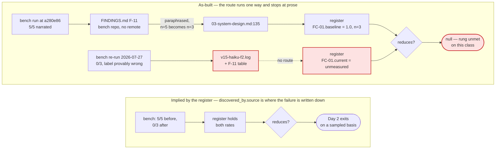

# Day 2 needs five schema fields, then $8.63 of runs — the baseline's build was in the record all along, and the post-fix number carries a label it provably cannot have

**Question:** Day 1 is closed. The Day-2 rung's exit criterion is *"tool reduces known error
class"* and the register claims it once, structurally. What is the next action that actually moves
Day 2, and what does it cost?
**Scope:** `evals/failure-classes.json`, `evals/schemas/day2-failure-class.schema.json`, structural
§48(f), and the external evidence those three point at. Excludes Day 1 (closed,
`docs/day1_evidence_chain_review.md`) and every rung above Day 2.
**Sources:** *Graph Engineering — The Karpathy Loop* (July 2026) §VI.B, Table II, Table VI and the
Appendix graph-write invariants, read from the supplied PDF; this repo @ `bc30d11`;
`/Users/teo/workspace/sdd-harness-bench` @ `dff1bf2` — **an author-owned benchmark with no git
remote, so treat its numbers as this project's own measurements rather than an independent
result**; four suite runs, one register mutation, one plan simulation, and object-existence checks
at `a280e86` vs `HEAD`, executed 2026-08-05/06.
**Confidence:** High on everything measured — register state, mutation result, clone count,
benchmark figures, commit timestamps and the four `git cat-file` checks all came from running
something. Medium on what an honest Arm C would cost; the flags are priced, the reconstruction is
not.
**Status:** Analysis only, **revision 3**. Nothing executed; the register is byte-identical to
`bc30d11` (the §4.3 mutation was reverted and `git status` verified clean).

> **Revision history — two reversals, both of my own instructions.**
>
> **Rev 2** withdrew rev 1's *"do not buy a fresh measurement."* A timestamp check showed the cited
> runs finished 2–4 hours before the release commit they are credited to, against an uncommitted
> tree, through a pack cache that could not tell builds apart (§4.2b). Rev 2 also found the
> reduction is **jointly produced by two tools** (§4.2c) and that the register cannot **retire** a
> superseded rate (§4.4), and rebuilt §6 around all three.
>
> **Rev 3** corrects two things rev 2 got wrong. (1) Rev 2 said the baseline's build was
> unrecoverable and instructed Stage 1 to write `harness_build: null`. **It is recoverable** —
> `runs.jsonl` names the commit, `a280e86` (§4.2b). Write it. (2) Rev 2 specified Arm C at the
> `v1.3.0` tag and made it the gate for everything. **Both are wrong**: the tag is 15 commits
> before the baseline build and does not even contain `bin/init.mjs`, and today's adapter passes
> two flags whose scripts do not exist in any pre-v1.4 build — so Arm C as specified measures a
> configuration nobody has ever run, and gating on it lets an instrument fault halt the two clean
> arms (§4.7). **Arm C is demoted to optional archaeology. Run A → B.** Derivations live in
> `docs/day2_plan_review.md` §4.1–4.7 and `docs/day2_execution_plan_review.md` §4.1–4.6; this
> document is the executable plan and cites them rather than restating the arithmetic — one home
> per figure.

---

## 0. The finding in one paragraph

The Day-2 register holds eight error classes and claims the rung's exit criterion exactly once —
FC-04, on a `structural` basis, where the tool is the baseline-honesty invariant and the evidence
it reduced anything is the register that invariant governs. That is the weakest claim available and
the project already says so in its own words (`docs/design/05-verification-and-quality-strategy.md:37`
names the misreading: *"The tool exists, so the class is reduced"*). Meanwhile the strongest
before/after this project has produced is finished and paid for: the narrated-run collapse FC-01
exists for went **5/5 to 0/3** on the same benchmark cell, at a cost of **$7.69**, Fisher exact
one-tailed **p = 0.018**. It is written up as `FINDINGS.md` §F-11 in a repository with **no git
remote**, and it reaches the register only as a paraphrase in a design doc that copied the wrong `n`
out of a file stating both. So FC-01's `current` still reads `unmeasured`, and **Day 2 is short of a
route from where its measurements are taken to where its exit criterion is recorded** — the same
failure Day 1 closed on, one rung up and one repository over. What the route has to carry is now
precisely known, and it is asymmetric. The **baseline is sound and identified**: `runs.jsonl` names
its build `a280e86`, and both of FC-01's registered tools are verifiably *absent* there
(`git cat-file -e`), which is exactly what a before-state should look like. The **post-fix number is
provably mislabelled**: those rows carry the same `a280e86` label, yet each recorded `receipt ✓`,
and the receipt is written by `init-run.mjs`, which does not exist at `a280e86`. A run cannot emit an
artifact from a script its build lacks. And the **destination cannot hold either fact**: `Rate` has
no build field, `FailureClass` has no retirement array and no way to express that the reduction is
**jointly produced** — with FC-01's mechanisms present and FC-02's permission grant absent the rate
is 1/3 at **p = 0.107**, not significant. The route is also unguarded: I set FC-06, a class marked
`hypothesized` and never once observed, to claim a *sampled* reduction from two rates I invented, and
the suite stayed green at **1254 checks with the check count unchanged**; the rule forbidding that
lives in an English sentence inside a `description` field (`day2-failure-class.schema.json:40`).
**Build the record before buying the number: five fields and one array, free, then $8.63 of runs —
and nothing gates on a configuration nobody has measured.**

---

## 1. What is actually being asked

The paper's Day-2 text is three sentences (§VI.B, read from the supplied PDF):

> Add one tool that addresses a measured failure. Code execution, web search, database access, or
> file operations. Each tool requires typed schema, permissions, and result confirmation.

and Table II gives the exit criterion for the *Tool use* stage as **"Tool reduces known error
class"**. The register was built against exactly that reading and its own `note` states the position
plainly: this harness has many tools; what it lacked was *the link* — a named error class, the
measurement that found it, and evidence the tool still fires.

So "continue Day 2" cannot mean *add a tool*. There are eight registered and every one passes the
three-part contract already — §48(f) checks tool path, typed schema, permissions statement and
result confirmation separately for all eight, and all thirty-two of those checks are green. It has
to mean the one thing Table II asks for and the register cannot yet show: **a reduction, from two
measured rates, attributable to the tool being credited, in a class actually observed to fail.**

The evaluation criterion is one question with a checkable answer: **can a second person, from
`git clone` of this repository alone, read a reduction claim and get back to the runs that support
it?** Five sub-questions, and today the plan passes one:

| Sub-question | Today |
|---|---|
| Is the number **recorded** in the register at all? | ❌ FC-01.current is `unmeasured` (§4.1) |
| Is it **build-identified**? | ❌ no field exists — though the baseline's build is knowable (§4.2b) |
| Is it **attributable** to the tool being credited? | ❌ two tools produced it (§4.2c) |
| Does a superseded number remain **addressable**? | ❌ no retirement mechanism (§4.4) |
| Is the *direction* right — sampled evidence over structural assertion? | ✅ and it is what §6 is for |

---

## 2. The as-built evidence route, against the one the register implies

Four facts, each obtained by running something rather than reading it:

**(a) The post-fix measurement exists, is committed, and is complete.**
`sdd-harness-bench/results/v15-haiku-f2.log` records three reps of the F2/Haiku/`shapeup-sdlc` cell —
the cell FC-01's baseline came from — each `oracle: 14/14 pass · 0 major fail · 0 escaped`, each
`receipt ✓`, each reaching gate L4 or H. The benchmark's own runner classifies the *kind* of failure
mechanically (`runner/lib/transcript-metrics.mjs:202`, `failureMode()` returns
`never_started | narrated | stalled | built_and_failed | ok`), and **`narrated` is literally FC-01's
error class**.

**(b) The register's baseline `n` is wrong, and the wrong value was available to copy.**
FC-01 records `n: 3`. `FINDINGS.md` §F-11 publishes `v1.3 (pilot), n=5`, and the raw record agrees:
`results/runs.jsonl` holds exactly five pre-fix rows for that cell at `first_pass_acceptance
0.2857…` / `escaped_defects 10`. The cited design doc states n=3 at `:135` and n=5 at `:154`, in the
same file; `init-run.mjs:6` also says n=5. This is the "figure with two homes" rule from the Day-1
plan, firing on the Day-2 register.

**(c) The register travels; its evidence does not.** A `git clone --local` of this repo runs
**1112 checks, 0 failures** — up from the 1107 Day 1 closed on, so that work held, and
`evals/failure-classes.json` is among what survives. But the benchmark repository has **no git
remote** (`git remote -v` empty, tree clean, 182 files tracked under `results/`). Everything behind
FC-01 is committed to a repository that exists on one laptop.

**(d) One end of the pair is identified; the other carries a label it cannot have.** Detailed in
§4.2b. The baseline's build is `a280e86`, named in the record and corroborated by both FC-01 tools
being absent there. The post-fix rows carry the *same* label and are provably not that build.

**The irony worth naming:** Day 1's finding was that the instrument producing the numbers was
gitignored in a single working tree. Day 2's evidence is the opposite of gitignored — diligently
committed, with a findings document, raw JSONL, retained transcripts and a self-testing oracle —
into a repository nobody else can fetch, half of it under a build label that contradicts its own
artifacts.

---

## 3. The central finding

**Day 2 is blocked by what the record can hold, not by what has been measured — and buying a new
measurement against the current record reproduces every existing defect at full price.**

Three halves, and the third is why §6 has a Stage 0.

**The bookkeeping half is cheap.** FC-01 has a measured before (5/5 narrated, n=5, build `a280e86`)
and a measured after (0/3, n=3). Carrying those into the register is a text edit against data that
already exists, and it should happen whether or not anyone spends another dollar — see §6 Stage 1,
which banks the evidence with `reduces` still null.

**The guard half is the one that inverts the project's thesis.** §48(f) refuses a `reduces` claim
lacking two measured rates and a basis (`48-day1-day2.mjs:1002-1007`) — the F1 fabrication, blocked.
What it does not check is anything about *what those rates measure*: a `hypothesized` class may
claim a `sampled` reduction (mutation-verified, §4.3); a `measured` rate needs `value`, `unit` and
`method` but **not `measured_at`** (`:995`), while §48(e) requires exactly that one rung down; and
nothing requires `method` to name anything re-runnable. `AGENTS.md` opens with *"every invariant
that matters lives in the runtime, not in a prompt"*, and the strongest of these rules —
`hypothesized` **MUST NOT** claim a reduction — is a JSON Schema `description`, which is a comment
with punctuation. Four of eight classes are `hypothesized`.

**The record half is why Stage 0 exists.** The register's `Rate` type is
`{status, unit, value, n, method, measured_at, model}` — every field about *the sample*, none about
*the subject*. There is no build field, so a rate cannot say which bytes it measured **even when the
answer is known**, which is now demonstrably the case for the baseline. There is no `superseded`
array, so writing a new rate deletes the old one. And `FailureClass` carries exactly one `tool`, so a
reduction produced by two tools has nowhere honest to live. Day 1 has the first two counterparts and
learned them expensively: every result carries a `fixture_sha`, §48 refuses to pool across
fingerprints because *"a fixture-change or a different fingerprint is a DIFFERENT instrument and
must not be pooled"*, and the post-mortem is in the module itself — *"the act of producing the new
number deleted the old one."* The source says the same twice, independently: Appendix graph-write
invariant 4, **"Every superseded object remains addressable"**, and Table VI's Reversibility row,
*"Can updates be undone? Failure if missing: failed experiment damages state."*

That is not a schema-aesthetics complaint. It is the direct cause of why the $7.69 already spent
cannot settle the question it was bought to settle — and the reason five free fields must land
before the next $8.63 is committed.

---

## 4. Argued from the numbers

### 4.1 What the register actually holds

Computed from `evals/failure-classes.json` @ `bc30d11`:

| id | discovered_by | baseline | current | reduces | basis |
|---|---|---|---|---|---|
| FC-01 narrated run | `measured` | **1.0** rate, n=3 *(should be 5)* | **unmeasured** *(data exists — §4.2)* | null | — |
| FC-02 silently inert enforcement | `audit-finding` | 26 count *(undated)* | unmeasured *(free — §6 Stage 4)* | null | — |
| FC-03 lenient judge | `observed` | unmeasured | unmeasured | null | — |
| FC-04 fabricated evidence | `audit-finding` | 1 count, n=1 *(undated)* | 0 count, n=3 | **true** | `structural` |
| FC-05 sibling-stealing description | `hypothesized` | unmeasured *(withdrawn)* | 0.0 rate, n=75 | null | — |
| FC-06 malformed work order | `hypothesized` | unmeasured | unmeasured | null | — |
| FC-07 cross-scope write | `hypothesized` | unmeasured | unmeasured | null | — |
| FC-08 unstable judge | `hypothesized` | unmeasured | unmeasured | null | — |

One class of eight meets the exit criterion. It is the only one whose baseline and current are both
`count`s, both about the register's own layer, and whose "after" is 0 because a test forbids
anything else. That is a legitimate `structural` claim — `reduction_basis` exists so it can be
labelled rather than laundered — but it is a claim about impossibility by construction, and Table
II's verb is *reduces*, which is a claim about the world.

Note the shape of the two nearly-complete rows. **FC-01 has the before and not the after. FC-05 has
the after and not the before.** FC-05's baseline was deliberately *withdrawn* (the TPR≈0 proxy
artifact, F1); FC-01's after was taken and not carried. Only the second is fixable without spending.

### 4.2 FC-01's pair — one end sound, one end mislabelled, and jointly produced

**(a) The measurement.** `sdd-harness-bench/FINDINGS.md:541` (§F-11), reconciled against
`results/runs.jsonl` and `results/v15-haiku-f2.log`:

| F2 · Haiku 4.5 · `shapeup-sdlc` | acceptance | escaped | writes | receipt | last gate | USD |
|---|--:|--:|--:|:--:|---|--:|
| **v1.3 pilot, n=5** | **29%** | **10** | **0** | — | L4 | 0.064 |
| v1.4 rep 1 | 100% | 0 | 48 | ✓ | L4 | 3.286 |
| v1.4 rep 2 | 100% | 0 | 67 | ✓ | H | 2.305 |
| v1.4 rep 3 | 100% | 0 | 48 | ✓ | L4 | 2.101 |

Zero variance on both sides. The three post-fix rows reconcile to `runs.jsonl` by cost to seven
decimal places (`$3.28554175`, `$2.3054766`, `$2.10127915`) — which is also how I found they are
**filed under the pre-fix version string**, so a `harness_version` group-by cannot find them. As a
rate on FC-01's error class: **1.0 (5/5) → 0.0 (0/3)**, Fisher exact one-tailed **p = 0.0179**,
one-sided 95% upper bound on the post-fix rate **0.632**. So *"the rate fell from 1.0"* is
supported; *"this now happens under 5% of the time"* is not.

**(b) The baseline's build is known; the post-fix label is provably wrong.**

*Known:* every baseline row is labelled `v1.3.0-15-ga280e86 (a280e86) packed` — `git describe`
output naming the commit, with the distance independently confirmed
(`git rev-list --count v1.3.0..a280e86` = 15). Corroborated by object existence: **both of FC-01's
registered tools, `init-run.mjs` and `hooks/gate-zerowork.mjs`, are absent at `a280e86`**
(`git cat-file -e`). That is precisely what a before-state should look like, verified rather than
assumed. **Rev 2 said this was unrecoverable; it was wrong.**

*Provably wrong:* the post-fix rows carry the **same** `a280e86` label, and each recorded
`receipt ✓`. The receipt is written by `init-run.mjs`. `init-run.mjs` does not exist at `a280e86`.
A run cannot emit an artifact from a script its build does not contain — so the label is false, and
falsifiable from the log alone.

The mechanism is in the timestamps: those runs finished at **12:37 and 14:26 on 2026-07-27**, the
`v1.4.0` commit (`36521ba`) landed at **16:36 the same afternoon** and **was never tagged**
(`git tag -l v1.4.0` → 0), and the benchmark's content-addressed pack key (`53c02ae`) landed
**2026-07-28 16:17**, replacing a cache its own comment calls *"one directory… returned whenever it
existed, never invalidated."* It also took five attempts (`v14`…`v15`), and `v14c` still produced a
`never_started` run at 4/14 *with* the grant in place. **This is what Arm A repairs: not a fresher
number, the first correctly-labelled one for the post-fix condition.**

**(c) The reduction is jointly produced.** The benchmark ran the same cell in both install shapes,
differing by whether `setup()` writes the installer permission grant — which is **FC-02's registered
tool** (`bin/init.mjs`), not FC-01's:

| Configuration | narrated | acceptance | Fisher vs. the 5/5 baseline |
|---|:--:|---|--:|
| pilot at `a280e86`, no grant *(FC-01 baseline)* | **5/5** | 29% ×5 | — |
| v1.4 mechanisms, **grant absent** (`v14-haiku-f2.log`) | **1/3** | 14/14, 4/14, 4/14 | **p = 0.107** — not significant |
| v1.4 mechanisms, **grant present** (`v15-haiku-f2.log`) | **0/3** | 14/14 ×3 | **p = 0.018** — significant |

FC-01's tool alone moves the rate and does not clear the bar. Writing `reduces: true` on FC-01 from
a single arm credits one tool with a result two produced, and §VI.B is specific — *"Add **one** tool
that addresses a measured failure"* — with a per-tool exit criterion. **This is separable for
$0.94** (§4.6, Arm B). Worth noting for the contrast's cleanliness: `bin/init.mjs` **does** exist at
`a280e86`, so the baseline lacked the grant because the benchmark did not apply it, not because the
plugin could not — Arm B varies *applying* a tool, not *adding* one.

The honest caveat that must travel with any of these numbers: one feature, one model, an author-run
benchmark. F-11 states its own limit and it should be quoted, not softened — fixing the collapse
*"converted a fake cheap loss into a real expensive pass"*, and on that cell the harness now matches
the no-harness control at 11.8× the cost. FC-01's tool removed a defect. It did not prove the
harness worth running.

### 4.3 What §48(f) does not check — mutation-verified

Method: set FC-06 (`discovered_by.kind: "hypothesized"`, both rates `unmeasured`) to claim a
`sampled` reduction from two rates whose `method` reads `"FABRICATED BY MUTATION TEST"`. Run
`npm test`. Restore, confirm `git status` clean.

| | before mutation | after mutation |
|---|---|---|
| suite result | ✅ 1254 checks | ✅ **1254 checks** |
| checks touching FC-06's claim | `ok` — *claims no reduction* | `ok` — *claims a reduction from two measured rates, basis "sampled"* |
| net change in the report | — | **none** |

The count does not move, because both branches of `48-day1-day2.mjs:1002-1007` call `ok()`. A reader
diffing suite output sees one word change inside one line of 1254. The rule that should have fired
is `day2-failure-class.schema.json:40` — *"hypothesized = reasoned, never seen — MUST NOT claim a
reduction"* — and JSON Schema cannot enforce a cross-field constraint written in a `description`.

This is FC-02's own error class — *a guard installed, documented, green, and never firing* —
occurring inside the register FC-02 is recorded in.

### 4.4 What the schema cannot hold

Searched `day2-failure-class.schema.json` for `superseded`, `supersede`, `retire`: **zero matches.**
`FailureClass` has one `current` object, so a re-measure overwrites its predecessor; one `tool`
object, so a joint attribution has nowhere to live; and `$defs.Rate` is
`{status, unit, value, n, method, measured_at, model}` — no build, no version, no fingerprint.

The contrast with Day 1 is exact and it is in the same repository:

| | Day 1 | Day 2 |
|---|---|---|
| Identity of what was measured | `fixture_sha` on every result | *(absent)* |
| Cross-instrument comparison | refused — *"a different fingerprint is a DIFFERENT instrument"* | nothing to refuse on |
| Retirement | `superseded[]` with `cause`, retained figures, successor sha | *(absent)* |
| Caveat travels with the number | enforced, §48(d7) | *(prose only)* |
| Date required to claim `measured` | yes, §48(e) `:936` | no, §48(f) `:995` |

Three of the register's four measured rates carry `measured_at: null` (FC-01.baseline,
FC-02.baseline, FC-04.baseline).

The last row of that table is the one decision-makers keep re-learning. §48(d7) exists because *"a
number published without its caveat is how the last one was misread"* — and it enforces
caveat-travel **mechanically** for the Day-1 report. Recording a joint attribution in `method` would
put the claim in a field checks read and the limitation in one they do not, which is that same
pattern one rung up. Hence `co_attributed_to` in §6 Stage 0.

### 4.5 The four suite configurations, measured

| Configuration | Checks | Failures |
|---|---:|---:|
| `git clone --local` of `bc30d11` + `npm test` | **1112** | **0** |
| local working tree (adds gitignored `evals/runs/`) | 1254 | 0 |
| local + FC-06 mutated to a fabricated `sampled` reduction | **1254** | **0** |
| local, register restored | 1254 | 0 |

Day 1's fix held — a clone is green and 5 checks richer than the 1107 it closed on. Row 3 is §4.3.

### 4.6 What the measurement costs, and what each arm buys

Per-rep figures from runs that already happened (`results/runs.jsonl`, Haiku 4.5). Derivation:
`docs/day2_plan_review.md` §4.7; Arm C's demotion: `docs/day2_execution_plan_review.md` §4.1.

| Arm | Configuration | n | Cost | Gates? | What it buys |
|---|---|--:|--:|:--:|---|
| **A** | v1.6.3 as installed | 3 | **$7.69** | no | the first correctly-labelled post-fix rate (§4.2b) |
| **B** | v1.6.3, grant withheld | 3 | **$0.94** | no | separates FC-01's tool from FC-02's (§4.2c) |
| | **Recommended total** | | **$8.63** | | ~1.7 h wall clock |
| *C* | `a280e86`, **reconstructed pilot invocation** | 5 | ~$0.33 + engineering | **no** | optional: does the baseline still reproduce? |

**Arm C is not the `v1.3.0` tag and is not a gate.** Rev 2 said both, and both are wrong. The tag is
commit `6493c9e` (2026-07-24), 15 commits before the baseline build, and it does not contain
`bin/init.mjs` at all. And today's adapter issues
`/shapeup-sdlc-plugin:ship --unattended --gate-answers ci --wall-clock-budget <N>`
(`adapter.mjs:267,296`) — `gate-answers.mjs` and `budget-check.mjs` are **absent at `a280e86`**, so
running it as-is measures a configuration nobody has ever had. A failure would be consistent with
four causes, only one of which is actionable, and gating on it would let an instrument fault halt
Arms A and B.

Raising n on Arm A is the purchase **not** to make: the one-sided 95% bound reaches 25.9% at n=10
and 9.8% at n=29, costing ~$18 and ~$67 for a claim (*the residual rate is under X*) nobody needs
yet. The marginal dollar belongs to Arm B, which answers a question n cannot.

---

## 5. What deliberately not to do

- **Do not run any benchmark arm before Stage 0 lands.** With one `current` field and no
  `superseded[]`, the first successful run *deletes* the $7.69 result (§4.4). The schema edit is
  free and takes about an hour; the run costs $8.63 and is irreversible in the register. This is the
  Day-1 ordering lesson pointing the other way — *"the instrument must be committed before the check
  that requires it"* — and it cost four failures to learn the first time.
- **Do not let Arm C gate Arms A and B, and do not run it with today's invocation.** §4.6. A gate
  whose failure has four causes and one actionable reading is not a gate. If Arm C runs at all it
  runs with the pilot-era command reconstructed from the adapter's own history, after A and B, and
  labelled as archaeology.
- **Do not write `harness_build: null` on FC-01's baseline.** `a280e86` is in `runs.jsonl` on every
  baseline row (§4.2b). Write the commit. Reserve the null for the post-fix rate — and even there,
  record the *contradiction* rather than a bare null.
- **Do not buy Arm A alone.** It is 89% of the money for a number that still cannot say whether
  FC-01's tool or FC-02's produced it (§4.2c).
- **Do not record a joint attribution only in `method`.** §4.4's last row. The schema is being
  edited in Stage 0 anyway; a typed field costs the same keystrokes and can be checked.
- **Do not write the same three runs into FC-02's `reduces` as well.** One experiment, one
  clearance. Two would take the register from 1-of-8 to 3-of-8 on a single measurement — evidence
  inflation of exactly the kind this register exists to prevent.
- **Do not date an undated baseline from the commit that shipped its fix.** `measured_at` means
  *when the measurement was taken*. FC-04's baseline is a retrospective count — no sampling event
  occurred — so a fix's commit date would assert a measurement that never happened, inside the row
  whose error class is *"Fabricated evidence."* Date it as the **audit that produced the count** and
  say so in `method`. Same for FC-02's 26.
- **Do not plan fixtures as a route to `measured` for FC-06/07/08.** A fixture that plants a
  malformed order and confirms the hook denies it proves the **guard fires** — that is
  `result_confirmation`, which FC-06 already has (§20, §21, §24). It produces no *rate*: there is no
  population and no trial, the failure was induced. Its honest ceiling is a `structural` basis, which
  §6's adopted reading has already ruled insufficient for the rung. Keeping the three
  `hypothesized` and guarded is the complete action.
- **Do not retract FC-04's `reduces: true`.** It is honestly labelled `structural`, the schema
  invented that label for cases like it, and `05-verification-and-quality-strategy.md:37` already
  publishes the misreading it invites. The fix for a register with one weak claim is a second,
  stronger claim — not deleting the first.
- **Do not build a Day-2 measurement harness inside this repo.** A `tools/failure-class.mjs` beside
  `tools/skill-loop.mjs` is the tempting symmetry and it is wrong: the instrument already exists, is
  tested (`runner/metrics.test.mjs`), and needs a real multi-turn agent session per data point.
- **Do not publish the benchmark repository to fix the provenance.** It is the author's own benchmark
  of the author's own tool, and its README leads with that conflict of interest for good reason. The
  gap is fixable **by value** — the register can carry the numbers, the bench commit sha, the build
  id and the log path, checkable by anyone holding both repositories.

---

## 6. Recommendation — six stages, record before spend

**Order: schema → data → measure → write → structural → guard.** Roughly half a day and **$8.63**,
of which everything except Stage 2 is free. Stages 0 and 1 are worth doing **even if the measurement
is never bought** — they leave the register strictly better than today.

### Stage 0 — Schema first, before any spend · ~60 min · $0

Three additions to `day2-failure-class.schema.json`:

1. **`superseded: []`** on `FailureClass`, modelled on the Day-1 baseline's array: retained
   `value`/`n`/`method`/`measured_at`/`model`/`harness_build`, plus a `cause` enum. Do not invent a
   vocabulary — `re-measure | instrument-change | withdrawn` maps onto Day 1's three.
2. **`harness_build` on `Rate`** — a commit sha, git tag, or the benchmark's content-addressed
   shipped-surface hash. Nullable, and the field description must say what to write when a recorded
   label is **contradicted** rather than merely missing, so §4.2b's case has a home.
3. **`co_attributed_to: []`** on `FailureClass` — ids of other classes whose tools are load-bearing
   for this class's reduction (§4.4).

**Exit:** `npm test` green; the register round-trips unchanged.

### Stage 1 — Bank what already exists, and date it · ~45 min · $0

This is the stage that closes revision 1's original finding, and it stands alone.

- **FC-01.current** ← the v1.5 rate: `{status: "measured", unit: "rate", value: 0.0, n: 3,
  measured_at: "2026-07-27", model: "claude-haiku-4-5-20251001", harness_build: null}`, with
  `method` naming the bench commit (`dff1bf2`), the record (`results/v15-haiku-f2.log`,
  `FINDINGS.md` §F-11), the classifier (`failureMode()` → `narrated`), the Fisher p, the 0.632
  bound, **and the contradiction**: labelled `a280e86` in `runs.jsonl`, refuted by `receipt ✓`
  against an `init-run.mjs` that does not exist there (§4.2b).
- **`reduces` stays `null`.** The rates are banked; the claim waits for Arm B. This is exactly what
  the schema's null state means — *exit criterion not yet met* — and it means Stage 1 publishes no
  claim it might have to walk back.
- **FC-01.baseline** `n` 3 → 5, `measured_at` added, **`harness_build: "a280e86"`**, with one line
  in `method` recording that both FC-01 tools are verifiably absent at that commit — which is what
  makes it a legitimate before-state.
- **FC-02.baseline** and **FC-04.baseline** dated to the audits that produced their counts (F-16 →
  `27deb1b`, 2026-07-28; F1 → `evals/README.md`), each `method` saying *counted by that audit*.
- **`03-system-design.md:135`** `n=3` → `n=5`.
- The register's `note` gains one sentence: **the rung requires at least one sampled reduction;
  structural claims remain valid and stay labelled.**

**Exit:** every measured rate carries a date and a build field — one a commit, one a recorded
contradiction; the $7.69 measurement is in the repository for the first time; `reduces` unchanged at
1 of 8.

### Stage 2 — Measurement · ~1.7 h · **$8.63** · gated behind Stage 0

**Pre-registration, written before any run (2026-08-06).** Two questions get their answers now
rather than after the data arrives — the discipline the benchmark itself models at `FINDINGS.md`
§F-14, *"pre-registered, before any F4 run."*

*If Arm B shows the reduction is jointly produced:* FC-01 still takes `reduces: true` with
`co_attributed_to: ["FC-02"]`, and that **counts as clearing the rung**. A bundle of two registered
tools reducing a registered class, labelled as such, is a legitimate Day-2 exit and a more honest
one than a single-tool claim the data does not support. FC-02's own `reduces` stays untouched.

*If Arm C is ever run, its four outcomes:*

| Arm C outcome | Disposition |
|---|---|
| Reproduces 5/5 | Baseline confirmed; note it, change nothing |
| Reproduces 1–4 of 5 | Baseline is not zero-variance; widen it and re-state §4.2's Fisher p |
| Reproduces 0/5 | Baseline **withdrawn**, as Day 1 withdrew HD-004 — not patched |
| Fails for adapter reasons (§4.6) | **Instrument fault. Discard the arm, change nothing** |

**Sequence:**

1. `node runner/run.mjs --probe`, then `--dry-run` (`runner/run.mjs:81-82`) — free, and the cheapest
   way to discover four releases have moved something.
2. Build the grant-withhold flag in `setup()` — `writeInstallerPermissions()` is self-contained at
   `adapter.mjs:147-165` and called unconditionally at `:205`. **A prerequisite of this stage, not a
   step inside it.**
3. **Arm A** — v1.6.3, grant, n=3, ~$7.69.
4. **Arm B** — v1.6.3, grant withheld, n=3, ~$0.94.
5. **Arm C** — optional, after A and B report, gating nothing, and only with a reconstructed
   pilot-era invocation.

**Exit:** two build-identified rates at HEAD; the attribution settled.

### Stage 3 — Write the result, attributed · ~45 min · $0

Arm A's rate becomes `FC-01.current` with its `harness_build` and `measured_at`; **Stage 1's v1.5
rate moves to `superseded` with `cause: "re-measure"`, not overwritten** — which also exercises
Stage 0's array on real data rather than a fixture. Set `reduces: true` and
`reduction_basis: "sampled"`, and **if Arm B shows joint production set
`co_attributed_to: ["FC-02"]` and leave FC-02's own `reduces` alone** (§5).

**Exit:** `reduces` on FC-01 traceable to two arms and a build id — **2 of 8** at the exit
criterion, one sampled and one structural.

### Stage 4 — FC-02's structural current, which is free · ~20 min · $0

§11a scans the 33 `.mjs` files under `bin/ hooks/ skills/ scripts/` for the broken same-line
`import.meta.url` / `process.argv[1]` guard and finds **1 occurrence, inside the shared helper's own
explanation of the bug**; §11b then *executes* 22 guarded entry points through a symlinked directory
and a path containing a space. So `current` is `{status: "measured", unit: "count", value: 0,
method: "…hand-rolled guards remaining outside the shared helper, over 33 scanned modules; 22
guarded entry points additionally executed via symlink and spaced paths (structural §11a/§11b)"}`
with `reduction_basis: "structural"`.

**The denominators differ and must stay visibly distinct:** 26 was a count of broken guards, 22 is a
count of entry points now execution-probed. **Do not claim they are the same set.**

**Exit:** **3 of 8** at the exit criterion — one sampled, two structural, each labelled.

### Stage 5 — The guards, last · ~60 min · $0

Five rules in `48-day1-day2.mjs`:

1. `hypothesized` may not claim a reduction — fail when `reduces !== null` and
   `discovered_by.kind === "hypothesized"`.
2. A measured rate must carry `measured_at` — the rule §48(e) `:936` already applies one rung down.
3. `reduction_basis: "sampled"` requires `n` on both rates.
4. `reduction_basis: "sampled"` requires `harness_build` on both rates — the mechanical form of
   §4.2b's lesson.
5. **A class with non-empty `co_attributed_to` is not an independent clearance, and a class named in
   another's `co_attributed_to` may not claim `reduces` from the same `measured_at` +
   `harness_build` pair.** The anti-double-count rule (§5).

Rules 2, 4 and 5 fail against today's register, which is why this stage lands **after** Stages 1
and 3. Add the enforcement point as a comment citing `schema:40`, so the next reader finds the
runtime rule from the prose one.

**Exit — the acceptance test, and it is not a green suite:** re-applying the §4.3 mutation must turn
the suite **red**, and reverting it must turn it green. **Mutation-verify all five rules in both
directions**, including writing the double-count and confirming rule 5 catches it. A guard verified
only by the suite passing is the inert-enforcement class this register exists to track.

---

## 7. What would change this answer

- **If Arm A itself fails to run at v1.6.3.** Four releases have shipped since the adapter was last
  exercised and **I still have not executed even `--probe`**. That check costs nothing and must
  precede any budgeting; if it fails, this staging is premature and Stage 2's price is unknown.
- **If Arm B shows no difference — v1.6.3 without the grant also gives 0/3.** Then FC-01's tools
  carry the result alone, §4.2c dissolves, `co_attributed_to` stays empty, and Stage 3 writes the
  simple version. That is a good outcome and precisely what the $0.94 buys the right to say.
- **If the pilot-era adapter invocation turns out to be git-restorable in a directly reusable
  form.** Then Arm C becomes cheap again and is worth running for its own sake. It still should not
  gate. **I did not check the bench's adapter history for this.**
- **If a pre-v1.4 orchestrator ignores `--gate-answers ci` harmlessly.** My claim is that the flag's
  implementing script is absent, which is checked; that the run therefore fails or degrades is an
  **inference**. If it is wrong, Arm C is cheaper than §4.6 says — though the `v1.3.0`-vs-`a280e86`
  correction stands regardless.
- **If `co_attributed_to` is judged over-engineering for one case.** The cheaper fallback that keeps
  most of the value is a boolean `attribution_is_joint` plus `method` prose. I prefer the array
  because FC-01 and FC-02 are unlikely to be the only entangled pair in a harness whose tools are
  layered, but the boolean is defensible.
- **If the operator reads Day 2 as harness-scoped rather than evidence-scoped** — structural
  impossibility being the intended norm — then FC-04 already suffices, Stage 2's $8.63 is optional,
  and Stages 0/1/4/5 remain worth doing for the record's sake. Stage 1 writes the adopted reading
  into the register's `note` either way.
- **If FC-05's withdrawn baseline can be reconstructed.** It has a measured `current` (0.0 FP across
  75 cross-skill negatives, n=75, 2026-07-26) and a deliberately withdrawn before. **I did not check
  whether a pre-hardening description set survives in git history**, and revision 1's ranking of this
  above the benchmark arms is withdrawn.

---

## Appendix — evidence table

| # | Claim | Source | How obtained |
|---|---|---|---|
| 1 | Day-2 exit criterion is "Tool reduces known error class"; §VI.B says "add **one** tool" | supplied PDF, Table II + §VI.B | read (`pdftotext -layout`) |
| 2 | "Every superseded object remains addressable" | supplied PDF, Appendix graph-write invariants | read |
| 3 | Reversibility: "failed experiment damages state" | supplied PDF, Table VI | read |
| 4 | Register: 8 classes, 1 `reduces: true` (FC-04, `structural`); 4 of 8 `hypothesized` | `evals/failure-classes.json` | computed by script |
| 5 | FC-01 baseline records n=3; bench and raw records say n=5 | `failure-classes.json:33`; `FINDINGS.md:541`; `runs.jsonl` | read + computed |
| 6 | Cited doc states both n values | `03-system-design.md:135` vs `:154`; `init-run.mjs:6` | read |
| 7 | Post-fix: 3/3 reps 14/14 oracle, 0 escaped, receipt ✓ | `results/v15-haiku-f2.log:17,24,31` | read |
| 8 | Those three reps cost $7.692; filed under the **pre-fix** version string | log matched to `runs.jsonl` by cost to 7 d.p. | computed |
| 9 | Bench classifies runs `narrated` mechanically | `runner/lib/transcript-metrics.mjs:202` | read |
| 10 | Baseline rows labelled `v1.3.0-15-ga280e86 (a280e86) packed`; 15 commits confirmed | `runs.jsonl`; `git rev-list --count v1.3.0..a280e86` | read + run |
| 11 | `v1.3.0` tag = `6493c9e` (2026-07-24), 15 commits before `a280e86` (2026-07-26) | `git log -1` | run |
| 12 | `init-run.mjs` and `hooks/gate-zerowork.mjs` **absent** at `a280e86` | `git cat-file -e` | run |
| 13 | ⇒ the post-fix rows' `a280e86` label is provably wrong (receipt ⇒ `init-run.mjs`) | 7 + 12 | inference, stated |
| 14 | `gate-answers.mjs`, `budget-check.mjs` absent at `a280e86`; adapter passes both flags | `git cat-file -e`; `adapter.mjs:267,296` | run + read |
| 15 | `bin/init.mjs` present at `a280e86`, absent at the `v1.3.0` tag | `git ls-tree` | run |
| 16 | Runs finished 12:37 / 14:26 2026-07-27; `v1.4.0` commit 16:36, never tagged | log mtimes; `git log 36521ba`; `git tag -l` → 0 | measured + run |
| 17 | Content-addressed pack key landed 2026-07-28 16:17; prior cache "never invalidated" | bench `git log 53c02ae`; `adapter.mjs:33-42` | read |
| 18 | Grant written unconditionally by `setup()`; it is FC-02's tool | `adapter.mjs:147-165, 205`; `failure-classes.json` FC-02 | read |
| 19 | v1.4 without grant 1/3 narrated; with grant 0/3; v14c `never_started` with grant | `v14-`, `v14c-`, `v15-haiku-f2.log` | read |
| 20 | Fisher one-tailed: 5/5→1/3 p=0.107; 5/5→0/3 p=0.018 | — | computed |
| 21 | 95% one-sided upper bound at 0/3 = 0.632; 0/10 = 0.259; 0/29 = 0.098 | — | computed |
| 22 | Bench repo has **no git remote**, tree clean, 182 files tracked in `results/` | `git remote -v`, `git status`, `git ls-files` | run |
| 23 | A `hypothesized` class can claim a `sampled` reduction; suite stays green at 1254 | mutation of FC-06 + `npm test` | **run, then reverted** |
| 24 | The reduces branch checks only two statuses + a basis | `48-day1-day2.mjs:1002-1007` | read |
| 25 | §48(f) does not require `measured_at`; §48(e) does | `48-day1-day2.mjs:995` vs `:936` | read |
| 26 | §48(d7) enforces caveat-travel mechanically for the Day-1 report | `48-day1-day2.mjs` (d7) | read |
| 27 | 3 of 4 measured rates carry `measured_at: null` | `failure-classes.json` | computed |
| 28 | Day-2 schema has no `superseded`/`retire`; `Rate` has no build field; one `tool` per class | grep → 0; `$defs.Rate`; `$defs.FailureClass` | run + read |
| 29 | Day-1 baseline has a `superseded` array with `cause`; results carry `fixture_sha` | `skill-loop.baseline.json:830`; `48-day1-day2.mjs` (d9) | read |
| 30 | `discovered_by.kind` enum is measured / observed / audit-finding / hypothesized | schema `:39-41` | read |
| 31 | FC-06 already carries result confirmation (§20, §21, §24) | `failure-classes.json` FC-06 | read |
| 32 | The benchmark pre-registers outcomes before spending (F-14) | `FINDINGS.md:700` | read |
| 33 | Day 1 withdrew rather than patched an apparatus-fault measurement (HD-004) | `skill-loop.baseline.json:762` | read |
| 34 | `run.mjs` supports `--probe` as well as `--dry-run` | `runner/run.mjs:81-82` | read |
| 35 | Arm costs A $7.69 / B $0.94; Arm A wall clock ~91 min | `runs.jsonl` `cost_usd`; `v15` session lines | computed |
| 36 | Clone of `bc30d11`: 1112 checks, 0 failures; local 1254, 0 | `git clone --local` + `npm test` | run 2026-08-05 |
| 37 | 1 same-line guard occurrence over 33 scanned modules; 22 entry points probed | script over `bin/ hooks/ skills/ scripts/`; `11-is-main.mjs:50,265,327` | computed + read |
| 38 | F-16 audit resolves to `27deb1b`, 2026-07-28 16:10 | `git log 27deb1b` | read |
| 39 | Day 1's ordering lesson, published | `docs/day1_evidence_chain_review.md` §5 | read |
| 40 | The plan already calls Day 2 open on this axis; the project names FC-04's misreading | `ratchet-and-receipt-plan.md:401`; `05-verification-and-quality-strategy.md:37` | read |

**Not checked:** whether the benchmark runs end-to-end at v1.6.3 — no run, not even `--probe` or
`--dry-run`; **what a pre-v1.4 orchestrator actually does with `--gate-answers ci`** (flag-script
absence is checked, the consequence is inferred — §7); whether the pilot-era adapter invocation is
recoverable from the bench's git history in a directly reusable form, which decides Arm C's real
cost; whether anything in the adapter beyond those two flags is version-sensitive — I audited the
command construction, not the whole `setup()`/`run()` path; whether `setup()` can withhold the grant
without a code change (call site read, flag inferred, nothing written or tested); whether the F1
audit behind FC-04's count has a single unambiguous date, which Stage 1 assumes; whether
`co_attributed_to` has naming precedent elsewhere in the repo's schemas; whether a pre-hardening
skill-description set survives in git history for FC-05; whether any FC-06/07/08 failure has been
observed somewhere I did not search — I searched the register, `FINDINGS.md`, `CHANGELOG.md` and
`docs/` and found no instance, which is weaker than proof of absence.
