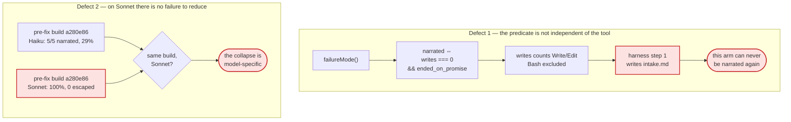

# Day 2's reduction is an artifact of how "narrated" is counted — and on Sonnet the failure it reduces does not happen

**Question:** Rev 3 was executed in full and the register claims 3 of 8 at the Day-2 exit criterion,
one `sampled`. Is that claim true, and — with Sonnet now the floor model — what would make it true?
**Scope:** `evals/failure-classes.json`, `evals/schemas/day2-failure-class.schema.json`, structural
§48(f), the benchmark's `failureMode()` classifier, and the plan-executor that ran rev 3. Excludes
Day 1 (closed) and every rung above Day 2.
**Model policy:** **Sonnet (`claude-sonnet-5`) is the floor.** Haiku is no longer used for any arm
this plan buys. Every historical Haiku figure below is retained and **labelled as Haiku**, because
it is evidence about a different instrument, not about the one this plan will run.
**Sources:** this repo @ `52a4deb`; `/Users/teo/workspace/sdd-harness-bench` @ `37db64b` — **an
author-owned benchmark with no git remote, so its numbers are this project's own measurements, not
an independent result**; six live reps executed 2026-08-06 costing $11.05 (Haiku); transcript
re-analysis of every `f2-budgets` run and every Sonnet run in the record; Fisher exact recomputed
here.
**Confidence:** High on everything measured. **Deliberately not sourced from this project's design
docs**: rev 3's central error came from trusting a prose description of an error class instead of
reading the code that decides it.
**Status:** Analysis, **revision 5**. The register currently carries a claim this document argues is
unsupported. §6 Stage 0 withdraws it.

> **Revision history.**
>
> **Rev 4** reversed rev 3's result using rev 3's own data: `failureMode()` calls a run `narrated`
> only when `writes === 0`, and this harness writes an intake document as step one, so it leaves its
> own error class before doing any work.
>
> **Rev 5** adopts **Sonnet as the floor model** and finds that this is not a cost change, it is a
> scope change. The single scored Sonnet run of this cell at the pre-fix build `a280e86` scored
> **100% acceptance with 0 escaped defects**. FC-01's collapse is a **Haiku-specific** phenomenon;
> on Sonnet there is no baseline failure to reduce. Rev 4's predicate finding is unaffected and is
> now independently replicated on Sonnet: **12 Sonnet runs made exactly one write and all 12 were
> classified `built_and_failed`, none `narrated`.**

---

## 0. The finding in one paragraph

Two things are wrong with the register's one sampled claim, and the second one is fatal to measuring
it at all under the new model policy. **First, the predicate is not independent of the tool.** FC-01
is described as *"ships nothing while reading like a clean run"* but operationalised as
`failureMode() === "narrated"`, which requires `writes === 0 && ended_on_promise`
(`runner/lib/transcript-metrics.mjs:208-215`), where `writes` counts only `Write`/`Edit`-family
calls — **`Bash` is excluded** (`:40`). This harness writes an intake document first, so it exits
the class by construction. Arm A rep 1 wrote one file (`intake.md`), shipped **zero product code**,
scored the baseline's own 0.2857 with 10 escaped defects, and was recorded as *not* narrated;
counted honestly the arm is **1/3**, Fisher **p = 0.107**, not 0.018. The artifact is systematic:
**12 Sonnet runs and 6 Haiku runs made exactly one write, and none was ever classified `narrated`.**
**Second, with Sonnet as the floor, the baseline disappears.** The one scored Sonnet run of this
cell at the pre-fix build `a280e86` scored **1.0 acceptance, 0 escaped, $1.92** — the pre-fix
harness simply worked. A reduction needs a failure to reduce; on Sonnet, FC-01's does not occur.
**So Day 2 has no sampled reduction, and cannot buy one for FC-01 on Sonnet at any price.** The work
is to withdraw the claim, make the predicate a recorded field so the next claim can be attacked the
same way, and spend **$5.8 establishing whether the class exists on Sonnet at all** before
considering the **$26.8** an after-arm would cost.

---

## 1. What the model change actually costs, and what it costs beyond money

From scored rows in the record, `shapeup-sdlc` only:

| model | n | mean cost/rep | mean acceptance |
|---|--:|--:|--:|
| Haiku 4.5 | 16 | $1.396 | 69% |
| **Sonnet 5** | 8 | **$6.695** | **54%** |

**Sonnet is 4.8× the cost per rep on this harness, at lower acceptance.** That is the money. The
scope consequence is larger and is stated in §2(e): the baseline the whole FC-01 claim rests on was
measured on Haiku, and a Sonnet "after" compared against a Haiku "before" is precisely the pooling
this project already forbids — Day 1's rule, quoted in the register's own lineage, is that *"a
different fingerprint is a DIFFERENT instrument and must not be pooled."* A model is a fingerprint.

---

## 2. The evidence, and where it breaks

**(a) The discriminator is a tool call the harness makes first.** `failureMode()` returns `narrated`
only inside `if (!wrote && m.assistant_turns > 0)`, `wrote = (m.writes ?? 0) > 0`. `WRITE_TOOLS` at
`:40` is `{Write, Edit, MultiEdit, NotebookEdit, str_replace_editor, create_file}`.

**(b) Every low-write run wrote the harness's own document.** All ≤3-write runs in the Haiku cell —
six of them — wrote exactly one file: `.shapeup/intake.md`, `intake.md` (×2), `INTAKE.md`,
`pitch-f2-category-budgets.md`, `F2-category-budgets.md`.

**(c) It replicates on Sonnet, across features.** **12 Sonnet rows have `writes === 1`. All 12 are
`built_and_failed`. None is `narrated`.** The escape hatch is systematic, not a Haiku quirk — which
means the predicate defect survives the model change even though the baseline does not.

**(d) The reduction survives only under the uncorrected count** *(Haiku, Arm A, 2026-08-06)*:

| rep | writes | **product writes** | acceptance | escaped | `failure_mode` |
|---|--:|--:|--:|--:|---|
| 1 | 1 | **0** | 0.2857 | 10 | `built_and_failed` |
| 2 | 48 | 9 | 1.0 | 0 | `ok` |
| 3 | 56 | 27 | 1.0 | 0 | `ok` |

| Comparison | Fisher one-tailed |
|---|--:|
| 5/5 → 0/3 narrated *(as recorded)* | **0.0179** |
| 5/5 → 1/3 shipped-nothing *(corrected)* | **0.1071** |

**(e) On Sonnet the pre-fix build passes.** The one scored Sonnet `f2-budgets` row at
`v1.3.0-15-ga280e86 (a280e86) packed` records **`first_pass_acceptance: 1`, `escaped_defects: 0`,
$1.922**. n = 1, and it is the only Sonnet evidence at that build for that cell — but it points the
opposite way from the entire Haiku baseline, and no Sonnet run anywhere in the record is classified
`narrated`.

---

## 3. The central finding

**The register's one sampled claim counts a predicate the harness satisfies by design, and under the
new model policy the failure it claims to reduce does not occur.**

**The claim must be withdrawn, not patched.** Day 1's precedent is HD-004: withdraw an
apparatus-fault measurement rather than repair it. The register already has the vocabulary —
`superseded[].cause = "instrument-change"`. Patching 0/3 to 1/3 in place would leave a `sampled`
basis at p = 0.107 claiming an exit criterion it does not meet.

**The register cannot say what an error class *is*.** `FailureClass` carries `error_class` and
`description` — both English — and no field naming the **mechanical predicate** that decides
membership. So no check can ask the question that matters: *can the registered tool satisfy this
predicate with its own output?* Rev 3 added `harness_build` so a rate could say **what** it
measured. Rev 5 must add the field that says **how it decided**, and a companion field asserting
independence.

**Rates are model-conditioned and the register treats that as decoration.** `Rate.model` exists and
is free-text. Nothing prevents a baseline measured on one model from being compared against a
current measured on another — which is exactly what "switch the floor to Sonnet" would silently do
to FC-01. This needs the same treatment `harness_build` got in rev 3.

**The cost picture on Sonnet is worse than the caveat implies**, from scored rows:

| harness (Sonnet) | n | mean cost | mean acceptance |
|---|--:|--:|--:|
| `bare` | 14 | $0.570 | 70% |
| `openspec` | 3 | $1.889 | 100% |
| `cc-sdd` | 3 | $2.616 | 100% |
| `spec-kit` | 3 | $2.898 | 100% |
| **`shapeup-sdlc-auto`** | 3 | **$4.463** | **100%** |
| **`shapeup-sdlc`** | 8 | **$6.695** | **54%** |

`shapeup-sdlc` is the most expensive arm in the matrix and the only one under 100%. And
`shapeup-sdlc-auto` — the same family, differently invoked — reaches 100% for a third less. That is
the most actionable number in this document and neither revision has explained it.

---

## 4. What rev 3's execution got right, and rev 5 keeps

- **Arm B stands, and is model-independent.** Withholding FC-02's grant gave 0/3 receipts:
  `init-run.mjs` never ran. This is a file-existence check that never touches `failureMode()`.
  FC-02's grant is a precondition for FC-01's tools.
- **The schema additions stand** — `superseded[]`, `harness_build`, `co_attributed_to` are what make
  the withdrawal expressible instead of destructive.
- **FC-02's structural claim stands** (§11a/§11b: 33 modules scanned, 22 entry points probed).
- **The five guards stand**, mutation-verified in both directions.
- **Three benchmark instrument faults were found and fixed** — the run-trace root rename hardcoded
  in three places, one of which recorded `run_receipt_present: false` for runs whose receipt existed.

---

## 5. What deliberately not to do

- **Do not buy a Sonnet after-arm before establishing the Sonnet baseline.** At $6.70/rep it is
  $26.8 for n=4, and §2(e) says the thing it would measure may not exist. The baseline probe is
  $5.8 and answers whether the rest is worth buying.
- **Do not compare a Sonnet current against the Haiku baseline.** Different model, different
  instrument. This is the pooling rule, and switching the floor model is exactly the moment it gets
  broken by accident.
- **Do not buy more reps against the current metric.** 0/6 at p = 0.0022 would be a more confident
  measurement of the wrong thing.
- **Do not patch 0/3 to 1/3 and keep `reduces: true`.** p = 0.107 does not meet the criterion.
- **Do not delete the v1.6.3 Haiku rate.** It is a real measurement of a real cell; it retires with
  `cause: "instrument-change"` and stays addressable.
- **Do not delete or re-label the Haiku baseline either.** It is valid evidence *about Haiku*. It
  becomes wrong only when read as evidence about Sonnet, which is what the new `model_scope` field
  in Stage 1 exists to prevent.
- **Do not touch FC-02's `reduces`.** One experiment, one clearance.
- **Do not redefine `failureMode()` in this repo.** It belongs to the benchmark; this repo records
  which predicate it relied on.
- **Do not treat "product writes" as obviously correct.** It is better, not proven, and Stage 1's
  `predicate_independence` exists so the next revision can attack it as this one attacked `narrated`.
- **Do not fix the plan-executor by asking agents to be careful.** Its failure — a run that executed
  zero stages and returned `"outcome":"complete"` — is FC-01's class. It needs a gate.

---

## 6. Recommendation — five stages, cheap-first, withdraw before measuring

**Order: withdraw → define → guard → probe → gate.** Roughly half a day plus **$5.8**, with a
**$26.8** decision point that §2(e) suggests will not be taken.

### Stage 0 — Withdraw the unsupported claim · ~30 min · $0

- `FC-01.current` (the v1.6.3 Haiku rate, 0.0 n=3) → `superseded[]`, `cause: "instrument-change"`,
  with `method` recording *why*: the rate counted `failureMode() === "narrated"`, whose predicate is
  `writes === 0`, which this harness's own intake write forecloses.
- `FC-01.reduces` → `null`; `reduction_basis` → `null`. `co_attributed_to` **stays** `["FC-02"]` —
  Arm B is unaffected and this is where that finding lives.
- `FC-01.current` becomes the corrected Haiku rate: **1/3 shipped-nothing**, `measured`, carrying
  Fisher p = 0.1071 and rep 1's 0-product-writes evidence in `method`.
- The register `note` gains: **a claim is only as good as the predicate its rate counted, and both
  the predicate and the model it was counted on must be recorded.**

**Exit:** `npm test` green; **2 of 8** at the exit criterion, both `structural`; FC-01 carries two
retired records and no claim.

### Stage 1 — Make the predicate and the model scope into fields · ~60 min · $0

Add to `day2-failure-class.schema.json`:

1. **`error_predicate`** on `FailureClass`, required whenever `reduces` is non-null:
   `{ expression, source, counts }` — the mechanical rule deciding membership, the `file:line`
   implementing it, and what it counts. FC-01's would read
   `failureMode()==="narrated" ⇔ writes===0 && ended_on_promise` @ `transcript-metrics.mjs:208`.
2. **`predicate_independence`**, required alongside it: why the registered tool cannot satisfy the
   predicate with its own output, and the check establishing it. The question rev 3 never asked, in
   the one place a reader cannot miss it.
3. **`model_scope`** on `Rate` — required when `status: "measured"`. A rate measured on one model is
   not evidence about another, and with Sonnet now the floor this stops being hypothetical.

**Exit:** schema round-trips; register unchanged; `npm test` green.

### Stage 2 — Guard all three · ~60 min · $0

Three rules in `48-day1-day2.mjs`, each **mutation-verified in both directions**:

1. `reduces !== null` requires a non-empty `error_predicate` whose `source` resolves to a real
   `file:line`.
2. `reduction_basis: "sampled"` requires `predicate_independence` present and non-empty.
3. **`reduction_basis: "sampled"` requires `baseline.model_scope === current.model_scope`** — the
   mechanical form of §5's pooling rule, and the one that would have caught this model switch
   silently invalidating FC-01.

**Exit — not a green suite:** stripping any of the three from a claiming class must turn the suite
**red**; a semantically-null edit must leave it green.

### Stage 3 — Probe the Sonnet baseline before buying anything · ~35 min · **$5.8**

Add `product_writes` to the benchmark — writes excluding the harness's own state roots (`.shapeup/`,
`.shapeup-sdlc/`, `shapeup/`) and its intake/pitch documents — plus a `shipped_nothing` mode meaning
`product_writes === 0`. Benchmark change, committed there, **prerequisite** of this stage.

Then run **the baseline, not the after-arm**: `f2-budgets` / **`claude-sonnet-5`** /
`shapeup-sdlc` at the **pre-fix build `a280e86`**, n = 3, ~$1.92/rep ≈ **$5.8**. This is the cheapest
question that decides everything downstream, and §2(e)'s n=1 says the likely answer is *no collapse*.

**Known risk, stated:** today's adapter passes `--gate-answers ci` and `--wall-clock-budget`, whose
implementing scripts do not exist at `a280e86`. If the reps fail for adapter reasons that is an
**instrument fault — discard the arm, change nothing** (rev 3's Arm C disposition table).

| Probe outcome | Disposition |
|---|---|
| 0/3 shipped-nothing (the class does not occur on Sonnet) | **Stop.** FC-01 is recorded as a Haiku-scoped finding via `model_scope`; no Sonnet after-arm is bought; Day 2's sampled claim must come from another class or stay unclaimed. |
| 1–2 of 3 | The class occurs but is not zero-variance. Record the baseline and decide the after-arm on its own merits. |
| 3/3 | The collapse reproduces on Sonnet. **Then** buy the after-arm: n = 4 at v1.6.3, ~$6.70/rep ≈ **$26.8** — n=4 because 0/4 vs a 3/3 baseline clears p<0.05 with room where 0/3 barely does. |
| Fails for adapter reasons | Instrument fault. Discard, change nothing, and say so. |

**Exit:** a Sonnet baseline rate carrying `model_scope`, `harness_build` and an `error_predicate`
naming `product_writes === 0` — **or** a recorded, evidenced statement that FC-01's class does not
occur on Sonnet, which is an equally successful stage.

### Stage 4 — Gate the plan-executor · ~45 min · $0

Rev 3's executor returned `"outcome":"complete"` having executed **zero** stages, because `args`
never reached the script and every field read `undefined`. It spent 97k tokens reading like a clean
run. That is FC-01's error class inside the tool executing the plan about FC-01's error class.

1. **Validate the payload before any model call** — missing `repo`/`workdir`/a non-empty `stages`
   array throws rather than iterating an empty list.
2. **Zero-work gate** — a run with an empty stage list, or which produced no commit and no freeze
   directory, exits non-zero and may not report `complete`. Modelled on `hooks/gate-zerowork.mjs`,
   which exists in this repo for exactly this failure.
3. **One contract parser.** The `\|` escaping in the acceptance table was unescaped by one verifier
   and read as a literal pipe by another, which produced a comment written to satisfy a grep. Ship
   one `parse-contract.mjs` both readers import. *(This is the plan-executor's own contract, not
   `skills/tech-lead/scripts/lib/contract-md.mjs`, which parses scope contracts and is unrelated —
   the external review conflated the two.)*

**Exit:** an invocation with absent args exits non-zero; a stage list of `[]` cannot report
`complete`; one parser, one test proving both readers agree on an escaped pipe.

---

## 7. What would change this answer

- **If the Sonnet n=1 at `a280e86` is unrepresentative.** One run is one run. It is the *entire*
  Sonnet evidence at that build for that cell, and it points opposite to five Haiku runs — which is
  why Stage 3 buys n=3 rather than assuming either way.
- **If the pre-fix build cannot be driven by today's adapter.** Then the Sonnet baseline is
  unobtainable without adapter archaeology, FC-01 cannot be re-based on Sonnet at all, and the
  honest terminal state is FC-01 permanently Haiku-scoped with `reduces: null`.
- **If `product_writes === 0` is itself gameable.** A harness writing one throwaway product file
  would exit the corrected class the same way. The 0-vs-9-vs-27 separation makes this unlikely at
  this threshold, but I have **not** tested a harness that games it — which is what
  `predicate_independence` is for.
- **If the five Haiku pilot transcripts do not survive** in `results/transcripts/`, the corrected
  Haiku baseline cannot be re-derived from primary evidence, only inferred from `writes: 0`. **I did
  not check.**
- **If `shapeup-sdlc-auto` is this harness differently configured.** On Sonnet it scores 100% at
  $4.463 against `shapeup-sdlc`'s 54% at $6.695, same matrix. If it is the same mechanisms, the
  finding in §3 is a *configuration* finding and belongs at the Betting Table before any further
  measurement. **I did not investigate which adapter it runs.**
- **If the operator reads Day 2 as harness-scoped.** Then FC-02 and FC-04's structural claims
  already satisfy the rung, Stage 3's $5.8 is optional, and Stages 0/1/2/4 remain worth doing
  because they are what stop the next unsupported claim.

---

## Appendix — evidence table

Every row obtained by running something on 2026-08-06. Model is named on every measured figure.

| # | Claim | Source | How obtained |
|---|---|---|---|
| 1 | `narrated` requires `writes === 0 && ended_on_promise` | `transcript-metrics.mjs:208-215` | read |
| 2 | `WRITE_TOOLS` excludes `Bash`; the receipt is written via Bash | `transcript-metrics.mjs:40-42` | read |
| 3 | Six ≤3-write Haiku runs in the cell; all wrote an intake/pitch doc | all `f2-budgets…haiku` transcripts | computed |
| 4 | **12 Sonnet runs with `writes===1`; all `built_and_failed`, none `narrated`** | `runs.jsonl` | computed |
| 5 | Arm A rep 1 (Haiku): 1 write, **0 product writes**, 0.2857 acc, 10 escaped | `runs.jsonl` + transcript | computed |
| 6 | Arm A reps 2/3 (Haiku): 48→9 and 56→27 product writes, 1.0 acc | same | computed |
| 7 | Fisher 5/5→0/3 = 0.0179; 5/5→1/3 = **0.1071** | — | computed |
| 8 | 0/n vs 5/5 crosses p<0.05 at n = 4 (0.0079) | — | computed |
| 9 | **Sonnet @ `a280e86`, `f2-budgets`: acc 1.0, 0 escaped, $1.922, n=1** | `runs.jsonl` | computed |
| 10 | `shapeup-sdlc` Sonnet $6.695 @ 54% (n=8) vs Haiku $1.396 @ 69% (n=16) — **4.8×** | `runs.jsonl` scored rows | computed |
| 11 | Sonnet matrix: bare $0.570@70%, openspec $1.889@100%, cc-sdd $2.616@100%, spec-kit $2.898@100%, `-auto` $4.463@100% | same | computed |
| 12 | Arm B (Haiku): 0/3 receipts, `would_have_scored` 0.2857 ×3 | `runs.jsonl` | computed |
| 13 | Register today: 3 of 8, FC-01 `sampled`, `co_attributed_to ["FC-02"]` | `evals/failure-classes.json` | computed |
| 14 | The executor returned `"outcome":"complete"` with `stages: []` | rev-3 run, workflow result | observed |
| 15 | Clean clone runs 1130 checks, 0 failures | `git clone --local` + `npm test` | run |

**Not checked:** whether the five Haiku pilot transcripts survive for baseline re-derivation; what
adapter `shapeup-sdlc-auto` uses; whether any harness games `product_writes`; whether the pre-fix
build runs under today's adapter on Sonnet, which decides Stage 3's feasibility; whether
`ended_on_promise`'s regex has its own failure modes — I read the `writes` branch, not the promise
branch; whether the other seven classes' implied predicates are tool-independent, which Stage 1
would force each to answer.
