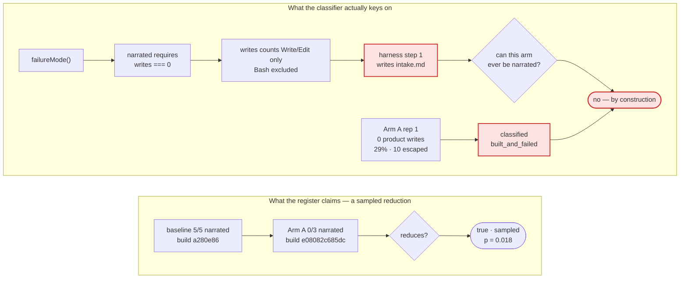

# Day 2's reduction is an artifact of how "narrated" is counted — the harness exits its own error class by writing one file about itself

**Question:** Rev 3 was executed in full. The register now claims 3 of 8 at the Day-2 exit criterion,
one of them `sampled`. Is that claim true, and if not, what makes it true?
**Scope:** `evals/failure-classes.json`, `evals/schemas/day2-failure-class.schema.json`, structural
§48(f), the benchmark's `failureMode()` classifier, and the plan-executor that ran rev 3. Excludes
Day 1 (closed) and every rung above Day 2.
**Sources:** this repo @ `e568e88`; `/Users/teo/workspace/sdd-harness-bench` @ `37db64b` — **an
author-owned benchmark with no git remote, so its numbers are this project's own measurements, not
an independent result**; six live benchmark reps executed 2026-08-06 costing $11.05; transcript
re-analysis of every `f2-budgets`/Haiku/`shapeup-sdlc` run; Fisher exact recomputed here.
**Confidence:** High on everything below — every figure came from running something against the
transcripts or the runner, not from reading a summary of them. **Deliberately not sourced from this
project's own design docs**: rev 3's central error came from trusting a prose description of an
error class instead of reading the code that decides it.
**Status:** Analysis, **revision 4**. The register on `plan/day2-tool-efficacy` currently carries a
claim this document argues is unsupported. Nothing has been withdrawn yet; §6 Stage 1 does that.

> **Revision history — rev 4 reverses rev 3's result, using rev 3's own data.**
>
> Rev 3 was executed end to end: six stages, 39 acceptance rows green, $11.05 spent. It produced
> FC-01 `reduces: true` / `sampled` / `co_attributed_to: ["FC-02"]` at p = 0.018.
>
> **That claim does not survive reading the classifier it depends on.** `failureMode()` calls a run
> `narrated` only when it made **zero** `Write`/`Edit` calls. The shapeup pipeline's first act is to
> write an intake document. So the harness satisfies the exit condition of its own error class with
> a file about itself, before doing any work. Arm A rep 1 wrote exactly one file — `intake.md` —
> shipped **no product code**, scored the baseline's own 29% with 10 escaped defects, and was
> recorded as *not* narrated. Counting it honestly makes Arm A 1/3, and **p = 0.107**.
>
> Rev 4 keeps everything rev 3 got right: the schema fields, the retirement array, the dated
> baselines, the five guards, FC-02's structural claim, and the Arm B attribution finding, which is
> untouched by this and is the strongest result either revision produced. What it withdraws is the
> sampled reduction and the significance that came with it.

---

## 0. The finding in one paragraph

Rev 3 bought a measurement and the measurement was sound; what was unsound was the definition it was
measured against. FC-01's error class is described in the register as *"the orchestrator describes
its own pipeline in future tense and stops, shipping nothing while reading like a clean run."* The
benchmark operationalises that as `failureMode() === "narrated"`, which requires
`writes === 0 && ended_on_promise` (`runner/lib/transcript-metrics.mjs:208-215`), where `writes`
counts only the agent's `Write`/`Edit`-family tool calls (`:40` — **`Bash` is excluded**). The
shapeup harness instructs the agent to write an intake or pitch document as step one. **Six runs in
this cell made exactly one write, and in all six it was that document** — `intake.md`,
`.shapeup/intake.md`, `pitch-f2-category-budgets.md`. One of them is Arm A rep 1: **0 product
writes, 0.2857 acceptance, 10 escaped defects** — numerically indistinguishable from the five
pre-fix baseline runs the register calls the error class — yet classified `built_and_failed`, not
`narrated`. So the register's one sampled claim rests on a discriminator the tool being credited
satisfies by construction. That is FC-04's pathology, which the register already names, occurring
inside the register's answer to it. Corrected to "shipped no product code", Arm A is **1/3**, Fisher
**p = 0.107**, and Day 2 has **no** sampled reduction. The fix is not more reps against the same
metric: it is to make the error class's operational definition a recorded, checkable field, then
re-measure at n ≥ 4. **Withdraw first — $0. Re-measure second — ~$7.**

---

## 1. What is actually being asked, restated

Table II's exit criterion is *"Tool reduces known error class."* Rev 3 read that as: two measured
rates, a basis, attribution. It missed the prior question, which is the one that matters:

> **Does the number that changed measure the error class, or measure something the tool controls?**

Five sub-questions. Rev 3 answered four. The fifth is new and it dominates.

| Sub-question | Rev 3 | Rev 4 |
|---|---|---|
| Is the number **recorded**? | ✅ | ✅ |
| Is it **build-identified**? | ✅ `v1.6.3+e08082c685dc` | ✅ |
| Is it **attributable**? | ✅ Arm B, joint | ✅ **stands, untouched** |
| Does a superseded number stay **addressable**? | ✅ `superseded[]` | ✅ |
| **Is the metric independent of the tool being credited?** | ❌ never asked | ❌ **and it is not** |

---

## 2. The evidence route, and where it breaks

Four facts, each obtained by running something:

**(a) The classifier's discriminator is a tool call the harness makes first.**
`failureMode()` (`transcript-metrics.mjs:202`) returns `narrated` only inside
`if (!wrote && m.assistant_turns > 0)`, where `wrote = (m.writes ?? 0) > 0`. `WRITE_TOOLS` at `:40`
is `{Write, Edit, MultiEdit, NotebookEdit, str_replace_editor, create_file}`. A harness whose first
instruction produces one `Write` has left the class before it starts.

**(b) Every low-write run in this cell wrote the harness's own document.** Scanning all
`f2-budgets`/Haiku/`shapeup-sdlc` transcripts for runs with ≤3 writes returns six, and all six
wrote exactly one file: `.shapeup/intake.md`, `intake.md` (×2), `INTAKE.md`,
`pitch-f2-category-budgets.md`, `F2-category-budgets.md`.

**(c) The reduction survives only under the uncorrected count.**

| Arm A rep | writes | **product writes** | acceptance | escaped | `failure_mode` |
|---|--:|--:|--:|--:|---|
| 1 | 1 | **0** | 0.2857 | 10 | `built_and_failed` |
| 2 | 48 | 9 | 1.0 | 0 | `ok` |
| 3 | 56 | 27 | 1.0 | 0 | `ok` |

Rep 1 is the pre-fix baseline's exact outcome. The separation between a dead run and a working one
is 0 vs 9 vs 27 **product** writes — clean, and nothing to do with the 1-vs-0 boundary the
classifier uses.

**(d) The significance is entirely inside the correction.**

| Comparison | Rate | Fisher one-tailed |
|---|---|--:|
| 5/5 → 0/3 narrated *(as recorded)* | claimed | **0.0179** |
| 5/5 → 1/3 shipped-nothing *(corrected)* | actual | **0.1071** |

Recomputed here, not quoted. At 0 of *n* against a 5/5 baseline, p crosses 0.05 at **n = 4**
(0.0079) — so the corrected claim is not merely weaker, it is *reachable*, for about one more rep.

---

## 3. The central finding

**Day 2's sampled claim measures whether the agent called `Write` once, not whether the harness
shipped working software — and the harness calls `Write` once by design.**

Three consequences.

**The claim must be withdrawn, not patched.** Day 1 set this precedent with HD-004 and the register
already has the vocabulary: `superseded[].cause = "instrument-change"`. The rate was not mis-copied;
the instrument that produced it was measuring the wrong quantity. Patching 0/3 to 1/3 in place would
leave a `sampled` reduction at p = 0.107 claiming an exit criterion it does not meet.

**The register cannot currently express what an error class *is*.** `FailureClass` has
`error_class` (English), `description` (English) and `discovered_by`. There is no field naming the
**mechanical predicate** that decides membership. So no check can ask the question that matters —
*is this predicate satisfiable by the registered tool's own output?* — because the predicate is
not written down anywhere a check can read. Rev 3 added `harness_build` so a rate could say *what*
it measured; rev 4 must add the field that says *how it decided*.

**The cost question is no longer deferrable, and the answer is not the one the caveat implies.**
Rev 3's caveat said the harness "matches the no-harness control at many times the cost." On scored
rows in this cell it does not match it:

| harness | n | mean cost | mean acceptance |
|---|--:|--:|--:|
| `bare` | 1 | $0.195 | 100% |
| `openspec` | 1 | $0.221 | 100% |
| `cc-sdd` | 1 | $0.268 | 100% |
| **`shapeup-sdlc-auto`** | 3 | **$0.456** | **100%** |
| `spec-kit` | 1 | $0.624 | 100% |
| **`shapeup-sdlc`** | 12 | **$1.348** | **64.3%** |

6.9× the bare control's cost at 64% of its acceptance. And `shapeup-sdlc-auto` — a configuration of
this same harness — reaches 100% at a third of the cost, which is the most actionable number in this
document and neither revision has explained it.

---

## 4. Where rev 3's execution was nonetheless right

Stated because rev 4 keeps it, and because a revision that reverses everything is usually wrong.

- **Arm B stands.** Withholding FC-02's grant gave 0/3 receipts — `init-run.mjs` never ran. This
  does not depend on `failureMode()` at all; it is a file-existence check. FC-02's grant is a
  precondition for FC-01's tools, and that finding survives rev 4 intact.
- **The schema additions stand.** `superseded[]`, `harness_build`, `co_attributed_to` are what make
  the withdrawal in §6 Stage 1 expressible rather than destructive.
- **FC-02's structural claim stands** (§11a/§11b, 33 modules scanned / 22 entry points probed).
- **The five guards stand**, mutation-verified in both directions.
- **Three instrument faults in the benchmark were found and fixed** — the run-trace root rename
  (`.shapeup-sdlc/` → `.shapeup/`) hardcoded in three places, one of which recorded
  `run_receipt_present: false` for runs whose receipt was on disk.

---

## 5. What deliberately not to do

- **Do not buy more reps against the current metric.** 0/6 at p = 0.0022 would be a more confident
  measurement of the wrong thing. The metric fix is free; the reps are not.
- **Do not patch 0/3 to 1/3 and keep `reduces: true`.** p = 0.107 does not meet the criterion, and a
  `sampled` basis at that p is the F1 fabrication with a decimal point.
- **Do not delete the v1.6.3 rate.** It is a real measurement of a real cell; it retires with
  `cause: "instrument-change"` and stays addressable. Appendix invariant 4.
- **Do not touch FC-02's `reduces`.** Arm B's finding is about FC-01's dependency on FC-02, not a
  second clearance. One experiment, one clearance.
- **Do not redefine `failureMode()` inside this repo.** It belongs to the benchmark. This repo
  records *which* predicate it relied on; the benchmark owns the predicate.
- **Do not treat "product writes" as obviously correct either.** It is better, not proven. It must
  land as a named, recorded predicate that a future revision can challenge the same way this one
  challenged `narrated` — which is the whole point of writing predicates down.
- **Do not fix the plan-executor by asking agents to be more careful.** Its failure (a run that
  executed zero stages and returned `"outcome":"complete"`) is the same class as FC-01. It needs a
  gate, not a guideline.

---

## 6. Recommendation — five stages, withdraw before re-measuring

**Order: withdraw → define → instrument → re-measure → gate the executor.** About half a day and
**~$7**, of which everything except Stage 3 is free.

### Stage 0 — Withdraw the unsupported claim · ~30 min · $0

- `FC-01.current` (the v1.6.3 rate, 0.0 n=3) moves to `superseded[]` with
  `cause: "instrument-change"` and a `method` recording *why*: the rate counted
  `failureMode() === "narrated"`, whose predicate is `writes === 0`, which this harness's own intake
  write forecloses.
- `FC-01.reduces` → `null`, `reduction_basis` → `null`. `co_attributed_to` **stays** `["FC-02"]` —
  Arm B's finding is unaffected and the field is where it lives.
- `FC-01.current` becomes the corrected rate: `1/3` shipped-nothing, `status: measured`, with the
  Fisher p = 0.1071 and the 0-product-writes evidence for rep 1 in `method`.
- The register `note` gains one sentence: **a claim is only as good as the predicate its rate
  counted, and the predicate must be recorded.**

**Exit:** `npm test` green; **2 of 8** at the exit criterion, both `structural`; FC-01 carries two
retired records and no claim.

### Stage 1 — Make the predicate a field · ~45 min · $0

Add to `FailureClass` in `day2-failure-class.schema.json`:

- **`error_predicate`** — required whenever `reduces` is non-null: `{ expression, source, counts }`
  naming the mechanical rule that decides class membership, the `file:line` that implements it, and
  what it counts. FC-01's would have read
  `failureMode()==="narrated" ⇔ writes===0 && ended_on_promise` @ `transcript-metrics.mjs:208`.
- **`predicate_independence`** — required alongside it: a statement of *why the registered tool
  cannot satisfy the predicate by its own output*, plus the check that establishes it. This is the
  question rev 3 never asked, in the one place a future reader cannot miss it.

**Exit:** schema round-trips; register unchanged; `npm test` green.

### Stage 2 — Guard it · ~45 min · $0

Two rules in `48-day1-day2.mjs`, both mutation-verified in **both** directions:

1. `reduces !== null` requires a non-empty `error_predicate` with a `source` that resolves to a real
   `file:line`.
2. `reduction_basis: "sampled"` requires `predicate_independence` to be present and non-empty.

**Exit — and it is not a green suite:** stripping either field from a claiming class must turn the
suite **red**, and a semantically-null edit must leave it green.

### Stage 3 — Re-measure against the corrected predicate · ~50 min · **~$7**

Add `product_writes` to the benchmark's metrics — writes excluding the harness's own state roots
(`.shapeup/`, `.shapeup-sdlc/`, `shapeup/`) and its intake/pitch documents — and a
`shipped_nothing` failure mode meaning `product_writes === 0`. This is a benchmark change, committed
there, and it is a **prerequisite** of this stage.

Then **Arm A′: n = 4**, same cell, same build. Four rather than three because 0/4 against the 5/5
baseline is p = 0.0079 and 0/3 is p = 0.0179 — the marginal rep is the difference between a claim
that clears the bar with room and one that clears it barely. At ~$1.77/rep this is ~$7.

Re-derive the **baseline** under the same predicate from the five retained pilot transcripts if they
survive; if they do not, say so and carry the baseline as `writes === 0`, which for those runs is
identical because they wrote nothing at all.

**Exit:** an FC-01 rate whose `error_predicate` names `product_writes === 0`, `harness_build` set,
and `reduces` set only if the arithmetic supports it. **If Arm A′ returns 1/4 or worse, `reduces`
stays null and that is a successful stage** — the point is a true answer, not a green cell.

### Stage 4 — Gate the plan-executor · ~45 min · $0

Rev 3's executor returned `"outcome":"complete"` having executed zero stages, because `args` never
reached the script and every field read `undefined`. It spent 97k tokens reading like a clean run.
That is FC-01's error class in the tool that executes the plan about FC-01's error class.

1. **Validate the payload before any model call** — missing `repo`/`workdir`/a non-empty `stages`
   array throws, rather than iterating an empty list.
2. **Zero-work gate** — a run whose stage list is empty, or which produced no commit and no freeze
   directory, exits non-zero and must not report `complete`. Modelled on `hooks/gate-zerowork.mjs`,
   which exists in this repo for exactly this failure.
3. **One contract parser.** The `\|` escaping in the acceptance table was unescaped by one verifier
   and read as a literal pipe by another, which is what produced a comment written to satisfy a
   grep. Ship a single `parse-contract.mjs` that both the workflow and any external verifier import.
   *(Note: this is the plan-executor's own contract, not
   `skills/tech-lead/scripts/lib/contract-md.mjs`, which parses scope contracts and is unrelated.)*

**Exit:** an invocation with empty/absent args exits non-zero; a stage list of `[]` cannot report
`complete`; one parser has one test proving both readers agree on an escaped pipe.

---

## 7. What would change this answer

- **If `product_writes === 0` is itself gameable.** A harness that writes one throwaway product file
  would exit the corrected class the same way. I believe the 0-vs-9-vs-27 separation makes this
  unlikely at this threshold, but I have **not** tested a harness that games it, and Stage 1's
  `predicate_independence` field exists precisely so the next reader can attack this predicate the
  way rev 4 attacked the last one.
- **If the five pilot transcripts do not survive** in the benchmark's `results/transcripts/`. Then
  the corrected baseline cannot be re-derived from primary evidence, only inferred from F-11's
  `writes: 0`. **I did not check.**
- **If Arm A rep 1 is an outlier rather than a rate.** n = 3 with one failure is thin. This is the
  argument *for* Stage 3, not against Stage 0: the withdrawal follows from the predicate being
  wrong, which is true at any n.
- **If `shapeup-sdlc-auto` is the same harness under a different configuration.** It scores 100% at
  $0.456 against `shapeup-sdlc`'s 64.3% at $1.348 on the same cell. If it is genuinely the same
  mechanisms differently invoked, the cost-efficacy finding in §3 is really a *configuration*
  finding and the Betting Table should hear it before any further measurement. **I did not
  investigate which adapter `shapeup-sdlc-auto` runs.**
- **If the operator reads Day 2 as harness-scoped.** Then FC-02 and FC-04's structural claims
  already satisfy the rung, Stage 3's $7 is optional, and Stages 0/1/2/4 remain worth doing because
  they are what stop the next unsupported claim.

---

## Appendix — evidence table

Every row obtained by running something on 2026-08-06.

| # | Claim | Source | How obtained |
|---|---|---|---|
| 1 | `narrated` requires `writes === 0 && ended_on_promise` | `runner/lib/transcript-metrics.mjs:208-215` | read |
| 2 | `WRITE_TOOLS` excludes `Bash`; the receipt is written via Bash | `transcript-metrics.mjs:40-42` | read |
| 3 | Six ≤3-write runs in the cell; all wrote an intake/pitch doc | all `f2-budgets…haiku` transcripts | computed |
| 4 | Arm A rep 1: 1 write, **0 product writes**, 0.2857 acc, 10 escaped | `runs.jsonl` + transcript | computed |
| 5 | Arm A reps 2/3: 48→9 and 56→27 product writes, 1.0 acc | same | computed |
| 6 | Fisher 5/5→0/3 = 0.0179; 5/5→1/3 = **0.1071** | — | computed |
| 7 | 0/n vs 5/5 crosses p<0.05 at n = 4 (0.0079) | — | computed |
| 8 | Cell costs: bare $0.195@100%, shapeup-sdlc $1.348@64.3% (n=12) | `runs.jsonl` scored rows | computed |
| 9 | `shapeup-sdlc-auto` $0.456@100%, n=3 | same | computed |
| 10 | Arm B 0/3 receipts, `would_have_scored` 0.2857 ×3 | `runs.jsonl` | computed |
| 11 | Register today: 3 of 8, FC-01 sampled, `co_attributed_to ["FC-02"]` | `evals/failure-classes.json` | computed |
| 12 | The executor returned `"outcome":"complete"` with `stages: []` | rev-3 run, workflow result | observed |
| 13 | Clean clone runs 1130 checks, 0 failures | `git clone --local` + `npm test` | run |

**Not checked:** whether the five pilot transcripts survive for baseline re-derivation; what adapter
`shapeup-sdlc-auto` uses; whether any harness games `product_writes`; whether `ended_on_promise`'s
regex has its own failure modes — I read the `writes` branch, not the promise branch; whether the
other seven classes' implied predicates are tool-independent, which Stage 1 would force each of them
to answer.
