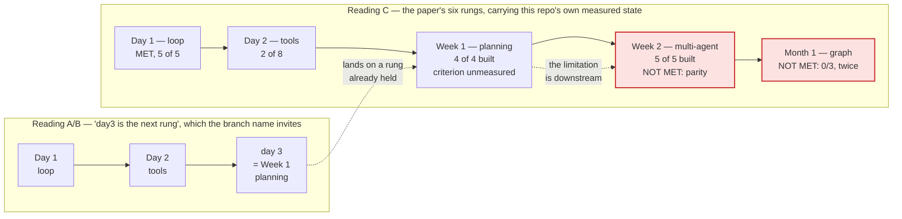
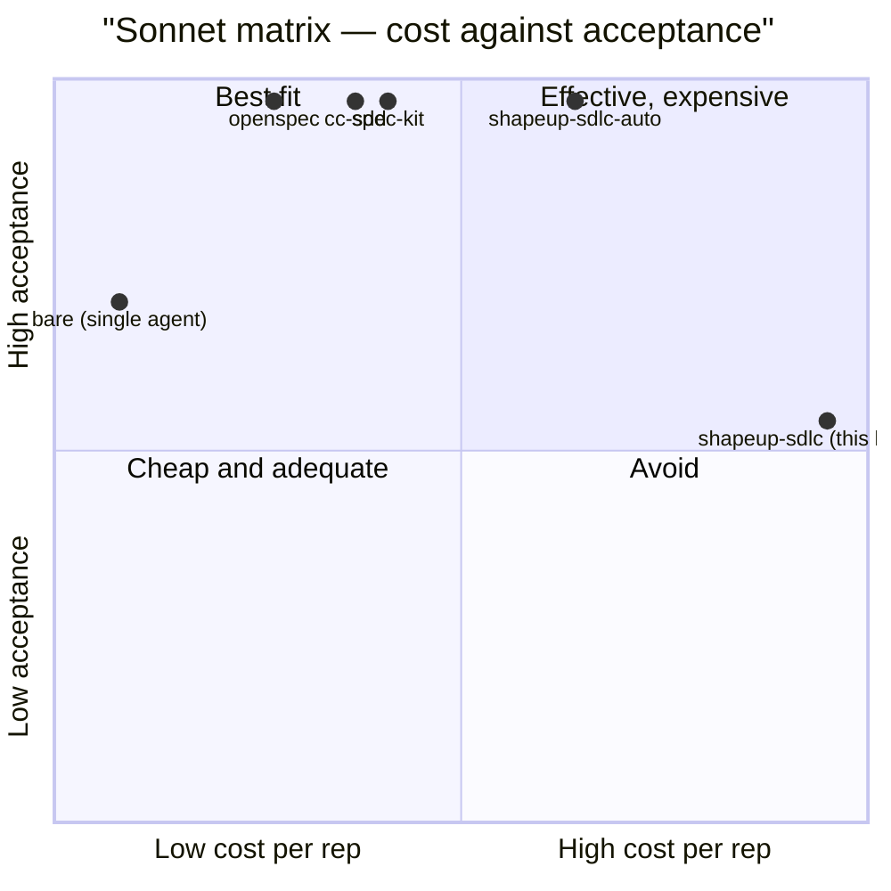
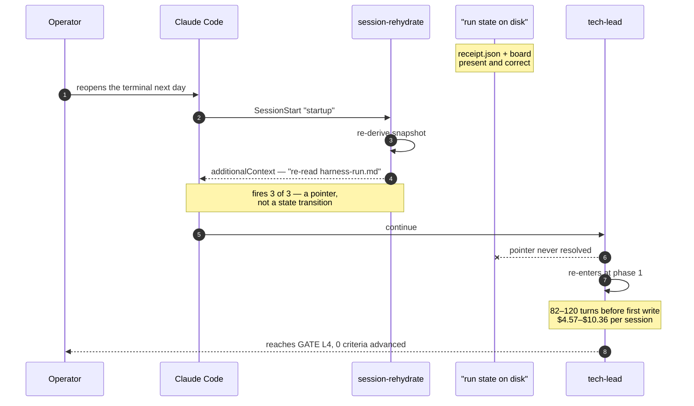
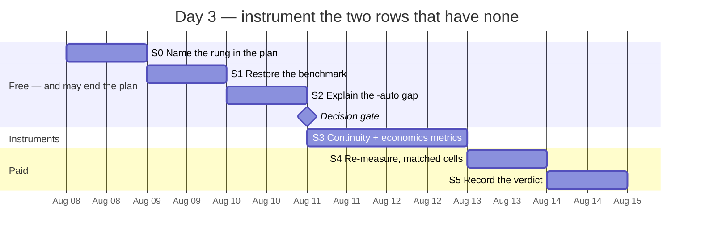

# The reference has no Day 3 — and the two rungs this harness has already measured and failed are Week 2 and Month 1, not the one its branch name points at

**Question:** The branch is `plan/day3-harness-improvement` and no `day3` artifact exists. Against
*Graph Engineering* §VI, what is Day 3, and what should the run that carries that name actually do?
**Sources:** `Karpathy-Graph-Engineering-Systems-2.pdf` (11 pp., July 2026) read in full — §VI Table
II, §VI.C–E, §VIII.A–C, §IX.D–H, §X, Appendix Table VI; this repo @ `b33579d`;
`docs/internal/plan/ratchet-and-receipt-plan.md`, `docs/day1_evidence_chain_review.md`,
`docs/day2_tool_efficacy_review.md`, `docs/design/05-verification-and-quality-strategy.md` §5.1,
`docs/design/03-system-design.md` §3.2, `evals/failure-classes.json`, and the shipped scripts named
inline.
**Confidence:** **High** that the paper defines no Day 3 and that rung 3's primitives are all built
— both read directly off the source and the code. **High** that rungs 4 and 5 have recorded failing
measurements. **Medium** on their magnitude: every one of those figures comes from
`sdd-harness-bench`, which **is not on this machine** (§7) and which the Day-2 review already flags
as author-owned rather than independent.
**Status:** Analysis. Nothing here has been executed.

---

## 0. The finding in one paragraph

**The paper has no Day 3.** §VI's build path runs Day 1 → Day 2 → **Week 1** → Week 2 → Month 1 →
Month 2, and Table II names six rungs of which only the first two are "Days" — the label stops
because the work stops being a day's work. So `day3` is this repo continuing a naming convention its
source abandons at rung 2, and reading it literally produces the wrong plan. It produces the wrong
plan twice over, because of what Day 1 and Day 2 actually were: this harness did not *build* the
loop, the tools, the planning or the role split during those runs — all four already existed. Day 1
and Day 2 **retro-measured rungs the harness had already built** against the paper's exit criteria,
and the value came from the criteria failing. Read that way, rung 3 is **Week 1 — Planning**, and
this harness holds all four things §VI.C prescribes: a typed plan validated before execution
(`hooks/hooks.json:80` hard-denies a malformed WorkOrder), declared dependencies with a cycle guard
(`domain.schema.json:547`, `board-derive.mjs:119`), work preserved across replanning
(`lib/ratchet-tree.mjs:52`), and capped retries and cost (`budget-check.mjs:147`). The paper's own
rule is that *a rung you do not have the limitation for is a rung you should not climb.* **The rungs
this harness fails are 4 and 5, and it has already measured both.** Week 2's criterion is *role
split beats single agent*: 13 roles buy **acceptance identical to no-harness on uninterrupted runs**
(§5.1 row 5) at **$6.695/rep against a bare agent's $0.570** — parity is not "beats". Month 1's is
*cross-session queries work*: **0/3, and 0/3 again after the fix** (§5.1 row 6), at 82–120 turns and
$4.57–$10.36 a session. And the repo has already written the sentence this report only has to act
on: *"the two layers this harness has never been able to measure automatically are the two where it
currently performs worst."* **Day 3 is not a rung to build. It is the instrument for rows 6 and 7 —
the same move Day 1 and Day 2 made, aimed at the two rows that have no instrument at all.**

---

## 1. What is actually being asked

Three readings of "day3" are available, and they lead to different work:

| Reading | What it implies | Verdict |
|---|---|---|
| **A. The next calendar day of building** | Pick up wherever day2 stopped — e.g. day2's held Stage 3, the $5.8 Sonnet probe | Wrong. That stage is *day 2's*, explicitly optional, and its own author predicts a null (`day2_tool_efficacy_review.md:277`) |
| **B. The paper's third rung** | Week 1 — Planning, exit *variable tasks complete* | Correct mapping, **wrong target** — §3 shows all four of §VI.C's prescriptions are already shipped |
| **C. The next rung whose exit criterion this harness fails** | Week 2 and Month 1 | **This one.** Both are measured, both fail, and §VI says the ladder is *directional but not mandatory* |

The evaluation criterion is therefore not "what comes after 2". It is: **which exit criterion in
Table II does this harness currently fail, and does it have an instrument that would notice if that
changed?** The second half of that question is what makes it a Day-3 question rather than a
restatement of §5.1 — because for the two failing rungs the answer is *no*.

**One constraint I am holding throughout.** Day 1's entire finding was that a measurement stored on
one machine is not evidence (`day1_evidence_chain_review.md:65`). Every number in §4 below comes
from `sdd-harness-bench`, and that repository is absent from this machine. I am quoting this
project's own committed records of it, not re-deriving it. That is a weaker basis than Day 1 or Day
2 had, and §6 Stage 1 exists to fix it before anything is bought.

---

## 2. The ladder as the paper defines it, against how this repo has been climbing it

Three facts hold that diagram up, each read off the source rather than inferred.

**(a) Table II has six rows and stops saying "Day" after the second.** Reflective loop / Day 1;
Tool use / Day 2; Planning / **Week 1**; Multi-agent / Week 2; Persistent graph / Month 1; Swarm
workflow / Month 2. §VI's headings match exactly (`§VI.A` Day 1, `§VI.B` Day 2, `§VI.C` Week 1). No
Day 3 exists anywhere in the document.

**(b) This repo's Day 1 and Day 2 were measurement programmes, not construction.** The master plan
says so in its own subtitle — *"the mechanism (Part A) … and the measurement (Part B). The first
built the instrument; the second ran it"* (`ratchet-and-receipt-plan.md:4-7`). Neither run built a
loop or a tool. Day 1 built `tools/skill-loop.mjs` and scored five skills; Day 2 built
`evals/failure-classes.json` and scored eight classes. **The rungs were already there. What was
missing was the ability to tell whether they worked.**

**(c) The harness's failures are already enumerated, by the harness, against the paper's own Table
III.** `docs/design/05-verification-and-quality-strategy.md:39` is a seven-row measurement table
whose closing line is the finding of this report stated a month early:

> Two rows have no instrument at all, and they are rows 6 and 7 — recovery and cost. That is not an
> oversight in this table; it is the table's most useful output. **The two layers this harness has
> never been able to measure automatically are the two where it currently performs worst.**

---

## 3. The central finding

**Rungs 1–4 are all built. Only rungs 1 and 2 have been put to their exit criterion. Day 3's work
is the instrument for the two criteria that have been failed and cannot be re-checked.**

### 3.1 Week 1 is held, 4 of 4 — so building it is not Day 3

§VI.C prescribes exactly four things. Every one is shipped and hook-enforced:

| §VI.C requires | This harness | Verified at |
|---|---|---|
| "Require a JSON plan before execution" | WorkOrder envelope; a `PreToolUse` hook **hard-denies** a dispatch whose order is missing or fails schema | `hooks/hooks.json:80` → `validate-envelope.mjs` |
| "Validate dependencies before execution" | `depends_on` on every task, inverse always derived; longest-chain walk is cycle-guarded and the lint reports the cycle separately | `domain.schema.json:547`, `board-derive.mjs:105-119` |
| "Preserve successful work during replanning" | kept-tree snapshot under shadow ref `refs/shapeup/<scope_id>/kept`; attempt N+1 builds on N's kept tree | `lib/ratchet-tree.mjs:52` |
| "Cap retries and total cost" | three nested breakers — `round_budget`, `attempt_budget`, and the opt-in `wall_clock_budget_s` | `budget-check.mjs:147`, `hooks/gate-deadline.mjs` |

The JSON shape §VI.C prints — `objective` / `steps` / `depends_on` / `success` — is the WorkOrder,
independently arrived at. A Day 3 spent building this rung would be re-buying a thing already owned.

### 3.2 Week 2 is built 5 of 5 and fails its criterion — parity is not "beats"

§VI.D's prescribed configuration maps onto the skill roster almost name for name — planner
(`ba-pitch-analyzer` + `scope-architect`), implementer (`task-executor`), reviewer
(`spec-evaluator`), security/exploratory reviewer (`qa-edge-hunter`), synthesizer (`scope-hammer`);
"every handoff should be an artifact contract" is the envelope; "worktree isolation when multiple
coding agents modify the same repository" is branch-per-scope plus `hooks/sandbox-guard.mjs`. Five
of five.

Table II's exit criterion is **"role split beats single agent."** The repo's own row 5 answers it:

> **acceptance identical to no-harness on uninterrupted runs** … *Acceptance in one context window
> generalizes.* It says nothing about what happens across one. The harness's measured parity here is
> a real result and a narrow one. — `05-verification-and-quality-strategy.md:38`

**Identical is not "beats", and identical is bought at 11.7×** (§4.1). §IX.E is the paper arguing
this against itself: *some tasks require one coherent context — architecture design, tightly coupled
refactors, subtle product decisions degrade when divided into isolated units.* Table III's workflow
row names the misreading directly: *more agents can increase activity without value.* Row 7 —
82–120 turns before the first write — is that misreading measured.

### 3.3 Month 1 fails its criterion twice, and the failure is where the paper predicts

Table II's Month-1 criterion is **"cross-session queries work."** §VIII.A question 5 is *must facts
survive the run?* Row 6: **0/3, and 0/3 again after the fix.** The mechanism is documented at
`03-system-design.md:296` — on a cold start the orchestrator re-entered at phase 1 *while the
receipt and board sat on disk*; one row reached GATE L4 having advanced the deliverable by zero
criteria.

The misreading column of row 6 is the sharpest sentence in this repository, and it is the reason
Day 3 cannot be a prompt change:

> *The hook fired, so it helped.* `session-rehydrate` fired 3/3 and closed 0/3 of the gap — it hands
> a **pointer** where state was needed. **Firing is a precondition for helping, never evidence of
> it.**

That is `AGENTS.md`'s own thesis — *every invariant that matters lives in the runtime, not in a
prompt* — failing on the one axis where the runtime hands over a sentence instead of a state
transition.

### 3.4 The link between 3.2 and 3.3 — labelled inference

Rungs 4 and 5 look like one finding: **the role split cannot beat a single agent because the harness
spends its advantage re-establishing state that a single long context never lost.** Row 7's 82–120
turns is that cost, itemised. **I have not tested this** — it is consistent with rows 5, 6 and 7 but
no measurement in this repo isolates it, and §6 Stage 4 is designed so that the answer falls out
rather than being assumed. It is the paper's §X claim applied here: *the bottleneck is often not the
next model call; it is the placement of memory and evaluation.*

---

## 4. Argued from the numbers

### 4.1 The Sonnet harness matrix — where `shapeup-sdlc` sits

Scored rows from `sdd-harness-bench`, quoted via `day2_tool_efficacy_review.md:158-163` and its
evidence row 11. **Small n, author-owned benchmark, cells not verified to be feature-matched.**

| harness (Sonnet 5) | n | mean $/rep | mean acceptance |
|---|--:|--:|--:|
| `bare` — no harness, single agent | 14 | **$0.570** | **70%** |
| `openspec` | 3 | $1.889 | 100% |
| `cc-sdd` | 3 | $2.616 | 100% |
| `spec-kit` | 3 | $2.898 | 100% |
| `shapeup-sdlc-auto` | 3 | $4.463 | 100% |
| **`shapeup-sdlc`** | **8** | **$6.695** | **54%** |

Three readings, and only the third is safe:

1. **Naive:** the harness is the worst arm in the matrix. Too strong — n=8 against n=14, cells not
   confirmed matched, and row 5 records *parity* on uninterrupted runs, which is inconsistent with a
   54%-vs-70% architecture gap. The 54% cell plausibly contains the handoff scenarios rows 6 and 7
   describe; **I could not check, because the benchmark is not on this machine.**
2. **The `-auto` reading:** the same family, differently invoked, reaches 100% for a third less.
   Day 2 flagged this and dropped it — *"the most actionable number in this document and neither
   revision has explained it"* (`:168`) — with *"I did not investigate which adapter it runs"* in
   its not-checked list. **This is a free question with a large answer**, and §6 Stage 2 asks it.
3. **The safe reading, and the one that decides Day 3:** on *no* reading does this matrix show
   *role split beats single agent*. Best case is parity at 11.7× the cost. That fails Table II's
   Week-2 criterion without needing any of the contested numbers to be true.

### 4.2 The failure path — what the 0/3 actually looks like

Everyone draws the happy path. This is the one that has been measured three times.

The gap between step 5 and step 8 is the whole of rungs 4 and 5. Nothing in that path is a model
quality problem; every artifact the orchestrator needed was on disk the entire time.

### 4.3 What Day 3 costs against what Day 1 and Day 2 cost

| Rung | Instrument built | Spend | Result |
|---|---|--:|---|
| Day 1 | `tools/skill-loop.mjs`, 5 rubrics, fixture spine | ~$61 (P7+P8) | criterion **met** 5/5; 5 production defects found |
| Day 2 | `evals/failure-classes.json` + §48 rules 6–8 | **$0** | criterion **2 of 8**; one claim withdrawn as unsupported |
| **Day 3 (proposed)** | continuity + economics instruments (rows 6, 7) | **~$22** | unknown — that is the point |

Day 2 is the precedent worth quoting: it shipped **at zero external spend** and its deliverable was
*"the machinery that stops the next unsupported claim"* (`.plan-runs/day2-rev5/REPORT.md:115`). Rows
6 and 7 have no machinery at all, so the same move is available at the same price.

---

## 5. What deliberately not to do

- **Do not build the Week-1 planning rung.** §3.1: 4 of 4 shipped and hook-enforced. §VI's own rule
  — *"a rung you do not have the limitation for is a rung you should not climb"* — is the paper
  arguing against its own ladder, which is what makes it usable.
- **Do not build the knowledge graph yet, despite the "ERD without a database" diagnosis being
  fair.** §VIII.C: *do not introduce a knowledge graph merely because the system has agents.* Row
  6's 0/3 is not a missing graph — it is a pointer that is never resolved (§4.2 step 7). A queryable
  graph would not have been read either. Fix the resume transition first; if it closes the gap, the
  graph was never the constraint. The ERD diagnosis belongs at the Betting Table, not in Day 3.
- **Do not spend Day 3 on Day 2's held Stage 3.** The $5.8 Sonnet probe is day 2's, is marked
  optional, and its own author predicts a null (`day2_tool_efficacy_review.md:277`). It moves no
  rung. If the operator wants it, it is a day-2 decision with a day-2 budget.
- **Do not fix row 6 by strengthening the injected prompt.** Row 6's misreading column already
  priced that: the hook fired 3/3 and closed 0/3. A second, better-worded pointer is the same
  instrument.
- **Do not add a role, a gate, or a phase.** Table III's workflow row and §IX.D both say more agents
  can increase activity without value, and row 7 is that sentence with numbers attached. Rung 4
  fails on *cost per unit of acceptance*; adding a role moves the wrong term.
- **Do not quote §4.1's matrix as a finding until Stage 1 lands.** It is this project's own
  benchmark, absent from this machine, at n=3–8, with cells I could not confirm are matched. Day 1's
  entire lesson was what happens when a number lives in one place.
- **Do not re-open Day 1.** Closed, verified on a clone, and its plan pre-registered the refusal to
  escalate further.

---

## 6. Recommendation — five stages, evidence before spend, ~1 day and ~$22

The sequencing is the argument: everything free happens first, and the only paid stage is gated
behind two free ones that may make it unnecessary.

### S0 — Name the rung · ~30 min · $0
Add to `ratchet-and-receipt-plan.md`: the paper defines no Day 3; rung 3 is Week 1 — Planning; its
four prescriptions are held at the four citations in §3.1; the criteria this harness fails are Week
2's and Month 1's. **Exit:** the next reader cannot spend a day rebuilding planning. This is cheap
and it is the single highest-value thing in the plan, because it is the mistake the branch name
actively invites.

### S1 — Restore the benchmark · ~1 h · $0
`sdd-harness-bench` is absent from this machine (`/Users/teo/workspace/sdd-harness-bench`, and
nothing matching under `/`). Rows 5, 6 and 7 — every number that makes the case for Day 3 — are
quoted from it and none is locally reproducible. This is Day 1's finding recurring one level up.
**Exit:** the matrix in §4.1 re-derives locally from `runs.jsonl`, or the report records that it
cannot and every §4.1 figure drops to hearsay.

### S2 — Explain the `-auto` gap before buying anything · ~1–2 h · $0
Read which adapter `shapeup-sdlc-auto` runs. Two outcomes, both decisive: if it is the same
mechanisms differently invoked, then 100% at $4.463 versus 54% at $6.695 is a **configuration**
finding, Day 3 is a config change plus a regression test, and S4 is not bought. If it is a different
pipeline, the comparison is void and §4.1 loses its sharpest row. **Highest information per dollar
in this plan**, and Day 2 left it explicitly unasked.

### S3 — Build the two missing instruments · ~4–6 h · $0
The actual Day-3 deliverable, and the same move Day 1 and Day 2 made.

1. **Row 6 — continuity.** A check that opens a run, discards the session, cold-starts, and asserts
   the orchestrator's *first write* targets the open run rather than re-entering at phase 1. Not
   "did the hook fire" — `gate-zerowork.mjs` and `init-run.mjs`'s exit-3 resume path already give
   the mechanical surface to assert against.
2. **Row 7 — economics.** Harvest turns-to-first-write and $/session into the existing committed
   metrics shard, so the number that priced the v1.4.1 defect is a standing metric rather than a
   benchmark anecdote.

**Exit — deliberately not a green suite, per Day 2's S2 precedent:** each instrument must be
**mutation-verified in both directions** — reintroducing the pre-v1.4.1 resume behaviour must turn
the suite red, and a semantically-null edit must leave it green.

### S4 — Re-measure, matched cells · ~2 h · **~$21.8**
Only if S2 did not already explain the gap. `bare` versus `shapeup-sdlc` on Sonnet, **same features,
same n=3**, half the reps uninterrupted and half carrying a forced handoff — the split that
separates row 5's parity from row 6's 0/3. Cost: 3 × $0.570 + 3 × $6.695 ≈ **$21.8**. Week 1's
unmeasured criterion (*variable tasks complete*) falls out of the same runs at no extra cost.

### S5 — Record the verdict · ~1 h · $0
Write Week 2's and Month 1's states into the plan's rung table with their bases, exactly as Day 2
wrote `reduces` and `reduction_basis`. If role split still does not beat the single agent, that is a
publishable result about this architecture and the strongest thing Day 3 could produce.

**What this deliberately does not do:** it changes no verdict, adds no role, and ships no graph. It
buys the ability to notice, which is the only property rungs 4 and 5 currently lack.

---

## 7. What would change this answer

- **If the operator means "day 3" as a calendar label for the next work session**, not as a rung,
  then §1 reading A is right, this report is over-built, and the answer is one line: *the paper has
  no Day 3; the next rung is Week 1 and you already have it.* §3–§6 still stand as the case for what
  that session should contain.
- **If `shapeup-sdlc-auto` is a different pipeline** rather than this harness differently invoked,
  §4.1's sharpest row is void and S2 ends with "no finding". The Week-2 verdict survives on row 5
  alone — parity is still not "beats".
- **If the 54% cell is not feature-matched to `bare`'s 70%**, the headline gap is an artifact of
  cell selection and only row 5's parity result stands. **I could not check this**; it is the
  primary reason S4 re-measures rather than citing.
- **If `sdd-harness-bench` cannot be restored**, then rows 5, 6 and 7 are permanently unre-derivable
  and Day 3's honest scope shrinks to S3 — build the instruments, take the *first* measurement here,
  and treat every historical figure as provenance rather than evidence.
- **If row 6's 0/3 was fixed by a later release than the one that measured it.** The record says
  0/3 "and 0/3 again after the fix", and `session-rehydrate`'s matcher gained `startup|clear` at
  v1.4.1 — **I did not find a post-v1.4.1 continuity re-measurement**, and its absence is itself the
  gap S3 closes.
- **If the operator reads the harness as optimising something other than acceptance-per-dollar** —
  auditability, teachability, multi-machine work — then Week 2's criterion is the wrong criterion
  and should be replaced on the record rather than failed. §IX.H: the architecture requires
  deliberate human ownership of the quality bar.

---

## Appendix A — evidence table

| # | Claim | Source | How obtained |
|---|---|---|---|
| 1 | Table II has six rungs; rung 3 is **Week 1**, not Day 3 | PDF p. 8, Table II | read |
| 2 | §VI headings are Day 1 / Day 2 / Week 1 / Week 2 / Month 1 / Month 2 | PDF p. 7 §VI.A–F | read |
| 3 | §VI.C's four prescriptions for the planning rung | PDF p. 7 §VI.C | read |
| 4 | "a rung you do not have the limitation for is a rung you should not climb" | `references/graph-engineering.md:100-102`, from §VI | read |
| 5 | WorkOrder hard-denied by PreToolUse hook | `hooks/hooks.json:80` → `validate-envelope.mjs` | read |
| 6 | `depends_on` declared; inverse always derived | `domain.schema.json:547-552` | read |
| 7 | Cycle-guarded longest-chain walk | `board-derive.mjs:105-119` | read |
| 8 | Kept-tree shadow ref preserves work across attempts | `lib/ratchet-tree.mjs:52` | read |
| 9 | Three nested budget breakers incl. wall-clock | `budget-check.mjs:147`, `hooks/gate-deadline.mjs` | read |
| 10 | 13 skills; §VI.D's role list maps 5 of 5 | `ls skills/`, `AGENTS.md` | measured |
| 11 | Row 5: acceptance **identical to no-harness** on uninterrupted runs | `05-verification-and-quality-strategy.md:38` | read |
| 12 | Row 6: continuity **0/3, and 0/3 again after the fix**; no automated metric | `05-verification-and-quality-strategy.md:39` | read |
| 13 | Row 7: 82–120 turns, $4.57–$10.36; no automated metric | `05-verification-and-quality-strategy.md:40`, `03-system-design.md:296` | read |
| 14 | "the two layers … never measured automatically are the two where it performs worst" | `05-verification-and-quality-strategy.md:42-44` | read |
| 15 | Sonnet matrix incl. `bare` $0.570@70%, `shapeup-sdlc` $6.695@54% | `day2_tool_efficacy_review.md:158-163`, evidence row 11 | quoted (not re-derived — see §7) |
| 16 | `-auto` 100% @ $4.463 unexplained; adapter uninvestigated | `day2_tool_efficacy_review.md:168`, `:325` | read |
| 17 | Register today: 8 classes, 2 with `reduces: true`, both `structural`; FC-01 withdrawn | `node -e` over `evals/failure-classes.json` | computed |
| 18 | Day 1 = measurement programme, not construction | `ratchet-and-receipt-plan.md:4-7` | read |
| 19 | Day 2 shipped at $0 external spend, 28/28 rows | `.plan-runs/day2-rev5/REPORT.md:19,102` | read |
| 20 | `sdd-harness-bench` absent from this machine | `ls`, `find / -maxdepth 6 -name sdd-harness-bench` | run |
| 21 | No file, commit or string named `day3` exists in the repo | `find -iname '*day3*'`, `grep -rniE 'day.?3'` | run |

**Not checked:** whether the 54% and 70% cells are feature-matched; which adapter `shapeup-sdlc-auto`
runs; whether any continuity measurement exists after v1.4.1; whether `evals/failure-classes.json`'s
six `unmeasured` classes bear on rungs 4–5; the benchmark's `runs.jsonl` itself, which is not on this
machine; whether the operator's own definition of "day3" matches any of §1's three readings.

## Appendix B — glossary

| Term | Meaning here |
|---|---|
| **Rung** | One row of *Graph Engineering* Table II — a capability plus the exit criterion that says it works |
| **Exit criterion** | The measurable condition that closes a rung. Day 1's is *measured quality improvement*; Week 2's is *role split beats single agent* |
| **Row 5 / 6 / 7** | Rows of this repo's own measurement table, `docs/design/05-verification-and-quality-strategy.md` §5.1 — build round, continuity, run economics |
| **Structural vs sampled** | A Day-2 `reduction_basis`. Structural = made impossible by construction; sampled = observed to become rarer. Different claims, and §48 forces the distinction |
| **Zero-memory handoff** | Each build attempt is a fresh subagent seeing only the envelope. A virtue *within* a run; unrelated to the cross-*session* gap in row 6 |
| **`bare`** | The benchmark's no-harness control arm — one agent, no spec pipeline |
