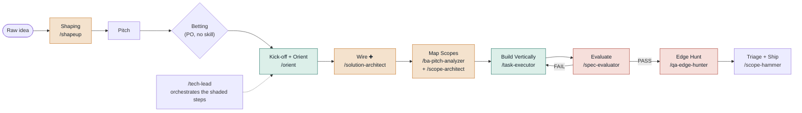

# 02 — High-Level Design

[← Back to index](README.md)

## The three-phase loop

Shape Up runs Shaping → Betting → Building. The harness automates only the last phase; the
first two stay deliberately human, because scope authority is a Product Owner decision the
harness is built to respect, not absorb.

### Phase 1 — Shaping (PO-led, `/shapeup`)

Set boundaries, find the elements (breadboarding), spike risks, write the pitch — the classic
Shape Up shaping sub-steps. Output: `pitch.md` with an appetite (1 / 2 / 6 weeks) in its
frontmatter, which later gates read back to right-size scope.

### Phase 2 — Betting (PO governance, no skill)

The Product Owner decides at the betting table. A rejected pitch loops back to a raw idea. The
harness intentionally has no automation here — betting is a human call about what the team's
time is worth, not something a skill should touch.

### Phase 3 — Building (orchestrated by `/tech-lead`)

| Step | Gate | Action |
|---|---|---|
| Kick-off | **L0** Intake & Config | Language check (`/translator`), workspace roots, model/budget matrix |
| Orient | **L1a** Orient Review | delegate → `/orient` (Scout reads real code before any board exists) |
| Wire ✚ | **L1a.5** Wiring Review | delegate → `/solution-architect` — commits `wiring-map.md` (per-UC engine → seam → entry-point call site → affordance against `project-profile.md`), front-loading the integration seam so no engine ships orphaned |
| Map Scopes | **L1b** Board Review | delegate → `/ba-pitch-analyzer` (spec tree + board; the `coverage` op writes the `requirements.md` registry ✚) then `/scope-architect` (scope contracts) |
| Build Vertically | **L2** Board 100% + T0-green | per dispatch: compile-order → `/task-executor` → ingest-result, sandboxed per scope |
| Eval (once/round) | **L3** Verdict | delegate → `/spec-evaluator`; refuted boxes applied by ingest |
| Fix round r+1 | — | bugs + full Test Surface of the touched use case, never the whole board |
| Ship | **L4** Ship Sign-off | delegate → `/scope-hammer` (census, cut list, ship verdict) |

✚ = traceability-spine steps (v1.3) — active only when the spine artifacts exist
(`wiring-map.md`, `requirements.md`, `project-profile.md`); non-regression on older specs.

> **Load-bearing rule.** The evaluator runs exactly once per build round, only after every task
> is done — never per task. This one timing rule is the entire reason the orchestrator
> exists: no sub-skill can see the whole board, so none of them can enforce it alone.

---
[← Objective & Product Value](01-objective-and-product-value.md) · [Back to index](README.md) · [Next: System Design →](03-system-design.md)
