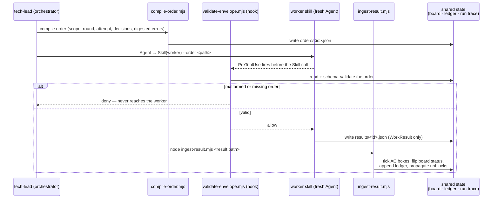
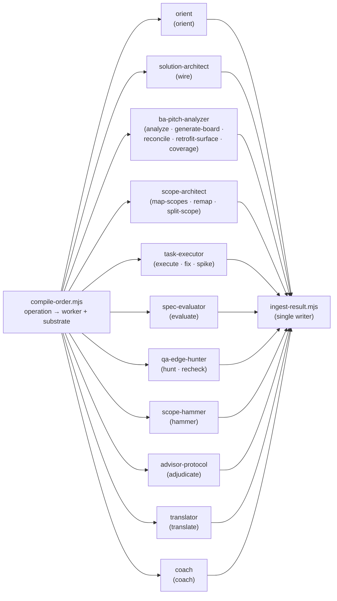
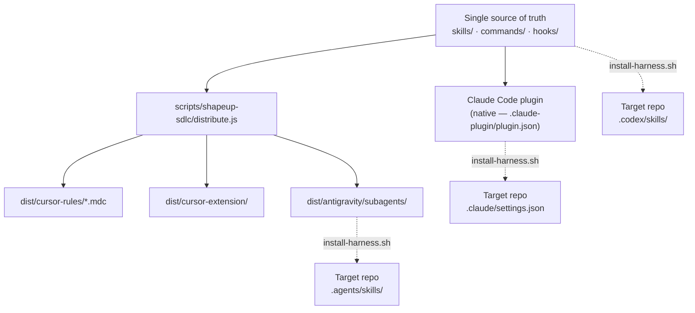

# 03 — System Design

[← Back to index](README.md)

## Components and their contracts

The tech-lead is the only stateful component. Every other skill is a **pure worker**: it
receives a structured order, does its craft, and returns a structured result — it never reads
or writes the run's shared files directly.

## 3.1 — The envelope port

Every worker dispatch is two JSON documents and three scripts, all living beside the
orchestrator skill (`skills/tech-lead/scripts/`, schemas in `skills/tech-lead/schemas/`):

Workers never write boards, ledgers, or run-state. Everything a worker used to write into
shared files directly, it now **returns as data** in its `WorkResult`; `ingest-result.mjs` is
the single, deterministic writer. This closes what the project calls **D6** — "single-writer"
stops being a convention and becomes mechanically true, because no worker holds a path to
write to even if it wanted to.

### WorkOrder (in) — key fields

| Field | Purpose |
|---|---|
| `worker` | One of 11 enumerated skills — the order names its own destination |
| `operation` | Replaces ad-hoc flags (`--tasks-only`, `--remap` …) — the caller knows the pipeline position, the worker never re-derives it |
| `substrate` | The write contract for this order — data the sandbox hook enforces, not prose asking the worker to behave |
| `payload` | Worker-specific inputs: scope contract, tasks, prior decisions, digested errors, KB rules path |

### WorkResult (out) — key fields

| Field | Purpose |
|---|---|
| `task_results[]` | Per-task status + AC pass/fail + evidence — `ingest-result` flips the board row from this alone |
| `escalates[]` | The worker's one outward port for a decision it can't make alone — routed to `advisor-protocol` |
| `discoveries[]` | Raw discovered lines — appended to the discovery ledger by ingest, never by the worker |
| `verdict` | `spec-evaluator` only — overall PASS/FAIL, per-criterion results, refuted AC boxes, T0 citation hashes |

## 3.1b — Operation routing: one compiler, the whole skill set

The envelope port above is drawn once, generically — but there is a *single* compiler
(`compile-order.mjs`) behind every worker in the harness. The order's **`operation` is the
routing key**: `compile-order` resolves the owning worker from the operation alone (its
`OP_OWNER` map, mirroring `domain.schema.json`'s `$defs/Operation` ownership), so a dispatch
never carries a redundant `--worker`, and each operation stamps a fixed `substrate` write
contract (from `substrateFor`) that the sandbox hook then enforces. One compiled order therefore
*is* the dataflow across the skill set — the 20 operations fan out to the 11 worker skills by
pipeline stage:

| Pipeline stage | Operation(s) | Worker skill | Order's `substrate.allowed` (write target) |
|---|---|---|---|
| Orient | `orient` | `orient` | `<local>/orient/**` |
| Wire (spine ✚) | `wire` | `solution-architect` | `docs/…/<slug>/wiring-map.json` |
| Map scopes | `analyze` | `ba-pitch-analyzer` | `<spec>/**` + `<local>/**` |
| | `map-scopes`, `remap`, `split-scope` | `scope-architect` | `<slug>/scopes/*.json` + `scope-board.md` |
| Coverage (spine ✚) | `coverage` | `ba-pitch-analyzer` | `docs/…/<slug>/requirements.md` |
| Board upkeep | `generate-board`, `reconcile`, `retrofit-surface` | `ba-pitch-analyzer` | `<local>/tasks/**` (+ append-only UC Invariants / Test Surface) |
| Build | `execute`, `fix`, `spike` | `task-executor` | the scope's own `allowed_file_substrate` + `<local>/spikes/**` |
| Evaluate | `evaluate` | `spec-evaluator` | `<local>/evaluation/**` |
| QA hunt | `hunt`, `recheck` | `qa-edge-hunter` | `<local>/qa/**` |
| Ship / triage | `hammer` | `scope-hammer` | `<local>/**` (run-trace default) |
| Escalation | `adjudicate` | `advisor-protocol` | `<local>/**` (its answer lands in the committed round-ledger via ingest) |
| Intake | `translate` | `translator` | `<local>/**` (writes the faithful `.en.md` copies) |
| Retro | `coach` | `coach` | `<local>/**` (its rules land in the committed knowledge-base via ingest) |

Two consequences fall out of routing *in the order* rather than in each skill: **(1)** adding a
worker is adding an operation, its `OP_OWNER` entry, and its `substrateFor` case — the
orchestrator owns the vocabulary and workers never re-derive their own pipeline position; and
**(2)** because the write contract travels inside the order, one `sandbox-guard.mjs` hook fences
every skill's writes with zero per-skill code. The return leg is uniform too: whatever any of the
11 workers produces comes back as a `WorkResult`, and `ingest-result.mjs` is the sole writer that
lands it into shared state (§3.1).

## 3.2 — Runtime-enforced guardrails (hooks)

Four `PreToolUse` hooks turn the harness's load-bearing rules from things the model is asked
to respect into things it cannot get past:

| Hook | Fires on | Enforces |
|---|---|---|
| `safety-spine.mjs` | `Bash` / `Read` / `Edit` / `Write` / `MultiEdit` | Denies the provably destructive operations no session ever legitimately needs: `rm -rf` on unrecoverable targets, force-push and push-to-main, `git reset --hard`, `DROP TABLE`/`TRUNCATE`, and secret-file reads (`.env`, `*.pem`, ssh keys, cloud credentials) via shell readers or the `Read` tool. Unlike the other three, it guards the **machine**, not the pipeline. The only escape hatch is the human-authored `.shapeup-sdlc/safety-overrides.json` (schema: `SafetyOverrides`) — mechanically self-protected, and every exercised override is logged to the metrics shard as a `SAFETY-OVERRIDE` pathology row. |
| `gate-l2.mjs` | `Skill → spec-evaluator` (round mode) | Denies the once-per-round EVAL unless every task on the board reads `done` — reading both task frontmatter and the board table independently, and naming the unfinished tasks in the denial. |
| `validate-envelope.mjs` | `Skill` / `Agent` | Denies any worker dispatch whose `--order` file is missing or fails the WorkOrder schema — a malformed envelope never reaches a worker. |
| `sandbox-guard.mjs` | `Edit` / `Write` / `MultiEdit` | Denies a write outside the active scope's `allowed_file_substrate`, with a carve-out for the scope's own local run-trace root so it can still update its own board. |

All four are deliberately **fail-open** when there's nothing to verify (no active scope, no
board, unparseable input) and **fail-closed** the instant they can prove a violation — a guard
that broke legitimate standalone runs would just get disabled, defeating the point of having it.
(The safety spine adds one asymmetry: a *malformed overrides file* fails **closed** — treated
as absent — because a parse error must never disable the spine.)

## 3.2b — Advisory hooks (Stop)

Two `Stop`-event hooks review the session as it ends — and, by architectural invariant, may
only **inform**, never block. "QA is a level-up, not a gate": a blocking Stop hook would be a
second gate behind the single judge, so both hooks exit 0 always and emit at most a
`systemMessage`, never a `decision`. Both are harness-scoped — silent unless a run is active.

| Hook | Checks | Says |
|---|---|---|
| `anti-rationalization.mjs` | The final message claims completion ("done", "all tests pass", "ready to ship") while the run's mechanical facts disagree: unfinished board tasks, a red T0 verdict, unanswered escalates, `final_verdict: fail`. | Names the specific contradicting facts, out loud, to the user. |
| `slop-cleaner.mjs` | The session's diff (git working tree; fallback: the newest WorkResult's `files_touched`) carries leftovers in **added lines**: TODO/FIXME, `console.log`/`debugger`, commented-out code blocks, one file swallowing 400+ added lines. | Lists the files and markers, suggests a cleanup pass. |

## 3.2c — Compaction resilience (PreCompact + SessionStart)

Nothing on disk is ever lost to a context compaction — the two-root storage design (§3.3)
already guarantees that. The residual risk is the orchestrator *continuing on a degraded
summary without noticing*: re-dispatching an already-ingested order, miscounting attempts
(breaking the inner circuit breaker), or "remembering" a hill phase instead of re-deriving it.
The resilience pair makes re-reading the files a reflex:

- **`run-snapshot.mjs`** (in `skills/tech-lead/scripts/`) derives a `RunSnapshot`
  (registered in the domain registry) from **files only** — the active-scope pointer,
  `harness-run.md` frontmatter, board frontmatter, `t0/verdicts/` filenames, and the
  `orders/` vs `results/` diff — and self-validates it against the registry before emitting.
- **`compact-snapshot.mjs`** (PreCompact) persists that snapshot to
  `.shapeup-sdlc/<slug>/run-snapshot.json` before compaction. PreCompact provably cannot
  inject context, so this hook is a pure side effect: the audit anchor and fallback.
- **`session-rehydrate.mjs`** (SessionStart, matcher `compact|resume`) re-derives the snapshot
  **fresh** and injects its `rehydrate_hint` as `additionalContext`: *"re-read
  `.shapeup-sdlc/<slug>/harness-run.md` and the board before continuing — trust the files, not
  the conversation summary."*

## 3.3 — Two storage roots

Every artifact the harness produces lives in one of two roots, split by a single question: does
this need to survive a `git pull` by a teammate, or can it be rebuilt from what's committed?

| Root | Scope | Contents |
|---|---|---|
| **SHARED** — `docs/shapeup-sdlc/<slug>/` | Committed — the durable deliverable | `shaping/`, `spec/` (domain model, use cases, contracts, `scopes/*.json`), `round-ledger.md`, `hill/*.yml`, `knowledge-base/<skill>.md`, `metrics/<machine-id>.jsonl` |
| **LOCAL** — `.shapeup-sdlc/<slug>/` | Gitignored — regenerable run trace | `harness-run.md`, `orient/`, `tasks/` (the board, regenerable on any machine), `orders/` + `results/` (the envelope port), `t0/verdicts/`, `discovery/ledger.md`, `run-snapshot.json` (compaction anchor), `active-scope` (the sandbox hook's pointer), and — at the `.shapeup-sdlc/` root, outside any slug — `safety-overrides.json` (human-authored safety escape hatch) |

The split matters operationally: a second developer who pulls a branch mid-run has the SHARED
spec but no LOCAL board — the harness detects that at GATE L1b and regenerates the board from
the committed spec, rather than treating a missing file as a broken run.

## 3.4 — Distribution: one source, four runtimes

`distribute.js` parses each `SKILL.md`'s frontmatter and inlines its `references/*.md`, so every
compiled target carries the full behavior contract, not a stub. `install-harness.sh` scaffolds
a target project per detected CLI — wiring the plugin via settings for Claude Code, or copying
skill files for Antigravity/Codex, which deliberately enables **local skill evolution**: a team
can tune its copy without forking the plugin. `migrate.sh` upgrades an existing install the
same way a database migration tool does — update code, then apply any pending, idempotent
`NNNN__*.sh` data migration exactly once, recorded in a committed ledger.

---
[← High-Level Design](02-high-level-design.md) · [Back to index](README.md) · [Next: Functional Design →](04-functional-design.md)
