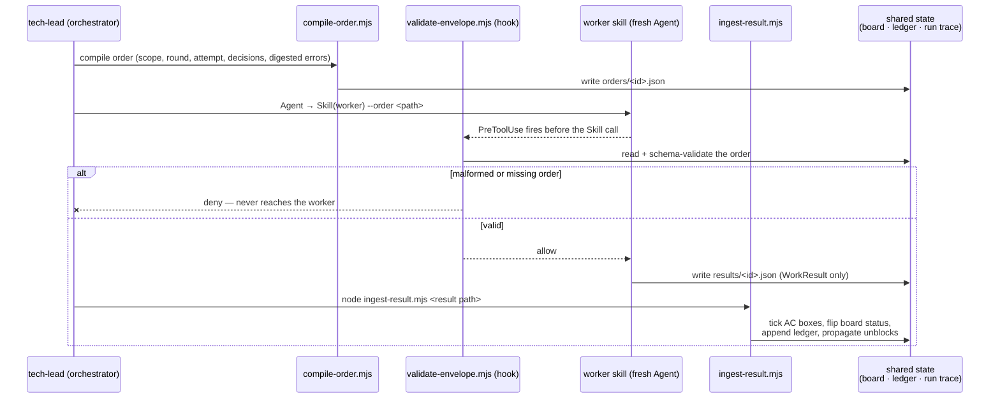
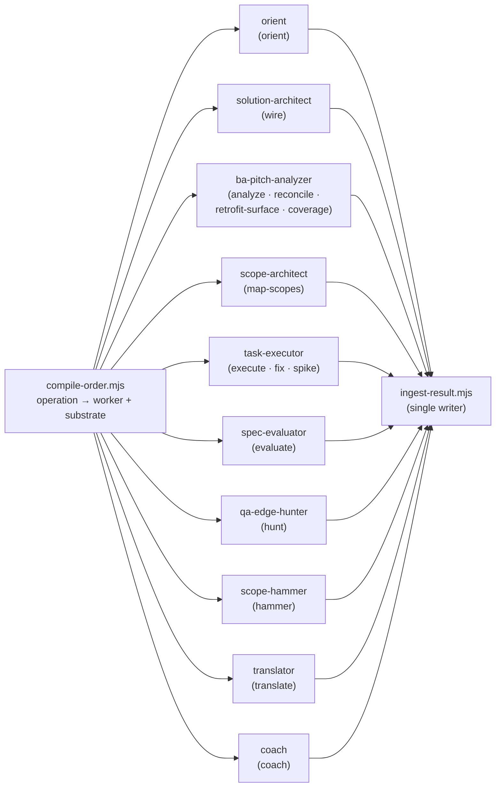
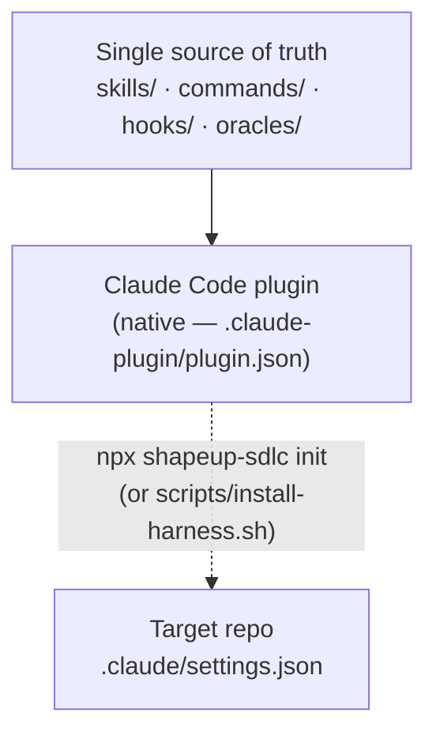

# 03 — System Design

[← Back to index](README.md)

## Components and their contracts

The tech-lead is the only stateful component. Every other skill is a **pure worker**: it
receives a structured order, does its craft, and returns a structured result — it never reads
or writes the run's shared files directly.

## 3.1 — The envelope port

Every worker dispatch is two JSON documents and three scripts, all living beside the
orchestrator skill (`skills/tech-lead/scripts/`, schemas in `skills/tech-lead/schemas/`):



Workers never write boards, ledgers, or run-state. Everything a worker used to write into
shared files directly, it now **returns as data** in its `WorkResult`; `ingest-result.mjs` is
the single, deterministic writer. This closes what the project calls **D6** — "single-writer"
stops being a convention and becomes mechanically true, because no worker holds a path to
write to even if it wanted to.

### WorkOrder (in) — key fields

| Field | Purpose |
|---|---|
| `worker` | One of 10 enumerated worker skills — the order names its own destination |
| `operation` | Replaces ad-hoc flags (`--tasks-only`, `--from-discovered` …) — the caller knows the pipeline position, the worker never re-derives it |
| `substrate` | The write contract for this order — data the sandbox hook enforces, not prose asking the worker to behave |
| `payload` | Worker-specific inputs: scope contract, tasks, prior decisions, digested errors, KB rules path |

### WorkResult (out) — key fields

| Field | Purpose |
|---|---|
| `task_results[]` | Per-task status + AC pass/fail + evidence — `ingest-result` flips the board row from this alone |
| `discoveries[]` | Raw discovered lines — appended to the discovery ledger by ingest, never by the worker |
| `verdict` | `spec-evaluator` only — overall PASS/FAIL, per-criterion results, refuted AC boxes, T0 citation hashes |

## 3.1b — Operation routing: one compiler, the whole skill set

The envelope port above is drawn once, generically — but there is a *single* compiler
(`compile-order.mjs`) behind every worker in the harness. The order's **`operation` is the
routing key**: `compile-order` resolves the owning worker from the operation alone (its
`OP_OWNER` map, mirroring `domain.schema.json`'s `$defs/Operation` ownership), so a dispatch
never carries a redundant `--worker`, and each operation stamps a fixed `substrate` write
contract (from `substrateFor`) that the sandbox hook then enforces. One compiled order therefore
*is* the dataflow across the skill set — the 15 operations fan out to the 10 worker skills by
pipeline stage:



| Pipeline stage | Operation(s) | Worker skill | Order's `substrate.allowed` (write target) |
|---|---|---|---|
| Orient | `orient` | `orient` | `<local>/orient/**` |
| Analyze | `analyze` | `ba-pitch-analyzer` | `<spec>/**` + `<local>/**` |
| Wire (spine ✚) | `wire` | `solution-architect` | `<shared>/<slug>/wiring-map.md` |
| Map scopes | `map-scopes` | `scope-architect` | `<shared>/<slug>/scopes/*.md` + `scope-board.md` |
| Board upkeep | `reconcile` | `ba-pitch-analyzer` | `<local>/tasks/**` + `<spec>/scope-summary.md` + `<local>/working/**` (append-only: UC Invariants / Test Surface) |
| | `retrofit-surface` | `ba-pitch-analyzer` | *(nothing)* — append-only to `<spec>/usecases/*.md#Test Surface` |
| Coverage (spine ✚) | `coverage` | `ba-pitch-analyzer` | `<shared>/<slug>/requirements.md` |
| Build | `execute`, `fix`, `spike` | `task-executor` | the scope's own `allowed_file_substrate` + `<local>/spikes/**` |
| Evaluate | `evaluate` | `spec-evaluator` | `<local>/evaluation/**` |
| QA hunt | `hunt` | `qa-edge-hunter` | `<local>/qa/**` |
| Ship / triage | `hammer` | `scope-hammer` | `<shared>/<slug>/REPORT.md` + `<local>/reports/**` |
| Intake | `translate` | `translator` | `<shared>/<slug>/shaping/*.md` + `glossary.md` |
| Retro | `coach` | `coach` | `<shared>/knowledge-base/*.md` |

Every case also stamps `frozen` (and, where relevant, `append_only`) — the spec core
(`domain-model.md`, use-case `#Steps`, `contracts/**`, `ux-behavior.md`) is frozen for every
operation that is not `analyze`, so board upkeep can add a Test Surface row but can never rewrite
the contract it is graded against.

Two consequences fall out of routing *in the order* rather than in each skill: **(1)** adding a
worker is adding an operation, its `OP_OWNER` entry, and its `substrateFor` case — the
orchestrator owns the vocabulary and workers never re-derive their own pipeline position; and
**(2)** because the write contract travels inside the order, one `sandbox-guard.mjs` hook fences
every skill's writes with zero per-skill code — it reads the *order's* substrate block directly
(§3.2). The return leg is uniform too: whatever any of the 10 workers produces comes back as a
`WorkResult`, and `ingest-result.mjs` is the sole writer that lands it into shared state (§3.1) —
except for the three operations whose product IS a committed design document (`wire`,
`map-scopes`, `coverage`), which write it directly under the substrate the hook enforces.

## 3.2 — Runtime-enforced guardrails (hooks)

Six `PreToolUse` hooks turn the harness's load-bearing rules from things the model is asked
to respect into things it cannot get past — five that deny, and one (GATE L2) that observes and
warns:

| Hook | Fires on | Enforces |
|---|---|---|
| `safety-spine.mjs` | `Bash` / `Read` / `Edit` / `Write` / `MultiEdit` | Denies the provably destructive operations no session ever legitimately needs: `rm -rf` on unrecoverable targets, force-push and push-to-main, `git reset --hard`, `DROP TABLE`/`TRUNCATE`, and secret-file reads (`.env`, `*.pem`, ssh keys, cloud credentials) via shell readers or the `Read` tool. Unlike the other three, it guards the **machine**, not the pipeline. The only escape hatch is the human-authored `.shapeup/safety-overrides.json` (schema: `SafetyOverrides`) — mechanically self-protected, and every exercised override is logged to the metrics shard as a `SAFETY-OVERRIDE` pathology row. |
| `gate-l2.mjs` | `Skill → spec-evaluator` (round mode) | **Advisory since ADR-0001 — the one hook here that never denies.** It still detects the same thing by the same two independent reads (per-task frontmatter *and* the board table), names the unfinished tasks, and permits the call, emitting a `systemMessage` and recording a `warn` row in `decisions.jsonl` so "permitted because green" and "permitted despite not green" never collapse into one fact. The board is local and per-machine, so this gate never protected a team boundary — it protected the operator from their own agent, at the cost of denying a call the operator had asked for. The project chose the signal over the denial. Stated plainly: nothing now mechanically prevents an EVAL on a half-green board. |
| `gate-intake.mjs` | `Skill → tech-lead` | Denies an orchestrator dispatch with no resolvable intake — no `--pitch`, no `--spec`, no `--from` resume, and no free requirement text. Closes the harness's own front door: a `tech-lead` reached as `args:"--unattended"` loses the requirement text on the hand-off and, with nothing to orchestrate, prints the gate names and a confident plan while writing no code — the same "claims done" pathology the harness exists to prevent, at its own entry point. Fails open on `--order` (the envelope port owns that path) and on any ambiguous arg shape. |
| `gate-deadline.mjs` | `Skill → task-executor` | Denies a dispatch that would start new build work once the run's opt-in `wall_clock_budget_s` is spent, routing to GATE H instead. **Deliberately does not deny `spec-evaluator`, `scope-hammer` or `qa-edge-hunter`** — a run past its deadline must still be able to judge, hammer and close, and a breaker that blocked the exit would strand green scopes it could not ship. It exists because the other two breakers count *events* (rounds, T0 attempts), so neither can observe that a single round has been running for half an hour; an externally killed run ships nothing, including the scopes already green. Off unless a budget is configured. |
| `validate-envelope.mjs` | `Skill` / `Agent` | Denies any worker dispatch whose `--order` file is missing or fails the WorkOrder schema — a malformed envelope never reaches a worker. |
| `sandbox-guard.mjs` | `Edit` / `Write` / `MultiEdit` | Denies a write that the **active order's own `substrate` block** does not permit. It follows the `.shapeup/active-order` pointer (written before each worker dispatch) to the compiled WorkOrder and enforces all three surfaces: `allowed` + `shared` permit, `append_only` permits `Edit` but denies `Write` (which would overwrite), and `frozen` denies outright and takes precedence over everything. Carve-out: the active feature's own local run-trace root, so a worker can still update its own board. |

All six are deliberately **fail-open** when there's nothing to verify (no active order, no
board, no configured budget, unparseable input) and — for the five that deny — **fail-closed** the
instant they can prove a violation. A guard that broke legitimate standalone runs would just get
disabled, defeating the point of having it. (The safety spine adds one asymmetry: a *malformed
overrides file* fails **closed** — treated as absent — because a parse error must never disable
the spine.)

> **Why the sandbox reads the order, not the scope contract.** It used to resolve
> `.shapeup/active-scope` → `scopes/<id>.md` and enforce that contract's
> `allowed_file_substrate`. That covered exactly one operation — the build — because only build
> orders carry a scope. Every other dispatch (`analyze`, `wire`, `evaluate`, `hunt`, `coach` …)
> is compiled with a substrate by `substrateFor` (§3.1b) and then ran unfenced, and the
> `frozen`/`append_only` surfaces that table stamps had no enforcer at all. Reading the order
> makes the write contract the compiler already emits the same one the hook enforces, for every
> operation, with no per-operation code.

## 3.2b — The zero-work block (Stop, blocking)

One `Stop`-event hook may block, and its predicate is why the invariant survives intact.

| Hook | Fires on | Enforces |
|---|---|---|
| `gate-zerowork.mjs` | Session end | Blocks a session that **dispatched the orchestrator and left no run receipt** — no `.shapeup/<slug>/receipt.json`, which `init-run.mjs` writes as the run's first act (§3.2d). |

**Why it exists.** Observed repeatedly, not theorized: given a
*valid* spec, the orchestrator loaded a 450-line instruction file describing the gates and
returned a description of those gates — "The tech-lead skill is orchestrating the full Shape Up
harness. It will: 1. …" — then ended. No code, no board, no gate artifacts, and prose that reads
like a successful run, with every defect left in the deliverable.

**Why nothing already caught it.** Two guards existed and both missed it for independent
structural reasons, which is the finding worth keeping:

1. `gate-intake.mjs` fires on an *empty* intake. Intake was valid. Correct no-op.
2. `anti-rationalization.mjs` is scoped to an *active* run, and a run that never started
   produces none of the files it reads — it catches "claimed done on a half-green board" and
   misses "claimed done with no board at all". Its claim detector also matched only past-tense
   completion, while narration is future-tense. **The emptier the failure, the less of it there
   was to detect.**

**Why blocking here does not violate "QA is a level-up, not a gate."** That invariant forbids a
second *judge* behind `spec-evaluator`. This hook makes no judgment about quality — it reports
that no work exists to judge, from a mechanical absence that no phrasing can change. Blocking is
also uniquely safe in this state: a session with zero artifacts has nothing to lose by
continuing, and an *advisory* note at the end of a narrated run simply gets narrated too.
Everything ambiguous fails open, and `stop_hook_active` caps it at one block per stop chain.

## 3.2c — Advisory hooks (Stop)

Two `Stop`-event hooks review the session as it ends — and, by architectural invariant, may
only **inform**, never block. "QA is a level-up, not a gate": an advisory hook here cannot be a
second gate behind the single judge, so both exit 0 always and emit at most a `systemMessage`,
never a `decision`. Both are harness-scoped — silent unless a run is active.

| Hook | Checks | Says |
|---|---|---|
| `anti-rationalization.mjs` | The final message claims completion ("done", "all tests pass", "ready to ship") — **or promises it in future tense** ("will now run", "is orchestrating") as the session's last word — while the run's mechanical facts disagree: unfinished board tasks, a red T0 verdict, unanswered escalates, `final_verdict: fail`. | Names the specific contradicting facts, out loud, to the user. |
| `slop-cleaner.mjs` | The session's diff (git working tree; fallback: the newest WorkResult's `files_touched`) carries leftovers in **added lines**: TODO/FIXME, `console.log`/`debugger`, commented-out code blocks, one file swallowing 400+ added lines. | Lists the files and markers, suggests a cleanup pass. |

## 3.2d — The run receipt and the gate answer set

Two small scripts in `skills/tech-lead/scripts/` close two failures observed in real runs.
Both follow the same rule as the hooks: move the invariant out of the prompt and into the runtime.

**`init-run.mjs` — the run receipt (GATE L0.1).** The orchestrator's first tool call, before any
prose. It writes `receipt.json`, `intake.md` (the requirement verbatim, plus its SHA-256),
`harness-run.md`, and `active-scope`. It supplies the fact that was missing from the system: *a
run started*. Every prior guard could only observe what a run **did**, so a run that did nothing
was invisible to all of them; the receipt makes starting observable independently of progress.
Recording the intake digest also makes "the spec was dropped on the hand-off" a checkable claim
rather than an arguable one — that is routinely the first diagnosis offered for a narrated run,
and previously nothing on disk could settle it either way.

**`gate-answers.mjs` — pre-recorded gate decisions.** Sign-off was the last load-bearing
invariant still living in a prompt, and it failed in both directions:

- *Stall.* An unattended run with no human waits at the first ⏸ until the wall-clock budget
  expires — a run killed at an external time cap having produced nothing scoreable, on a
  feature a bare agent finishes in under a minute. A wait is indistinguishable from work until
  the budget runs out.
- *Consent-by-prose.* The workaround was a paragraph in the prompt ("treat this as advance
  sign-off for every gate"). It worked on one model and was re-summarised instead of acted on
  by another. Consent carried in prose is consent that can be paraphrased.

The answer set is a schema-validated file (`schemas/gate-answers.schema.json`) mapping each gate
id to a decision, with presets `ci` / `guarded` / `interactive`. The orchestrator **resolves**
each gate through the script and branches on its exit code — `0` cross, `4` stop and put the
block to the PO, `5` abort — so a crossing is produced by a tool, not by the model's reading of a
paragraph.

This is **not "gates off."** Every gate still emits its block and still records a decision; what
changes is the decision's *source*, which the ledger names (`preset:ci`, plus the set's
`authorized_by`). An audited bypass and a rubber stamp differ by exactly that record. And
`on_missing: "abort"` — the default for headless presets — converts the stall into a fast,
attributable failure: "GATE L4 has no pre-recorded answer" in ten seconds beats a silent
half-hour that gets reported as a slow harness.

## 3.2f — The ratchet, and the receipt (v1.5)

Two shared libraries and one hook library, added because the harness had built a ratchet,
enforced it beautifully, and never fitted the pawl.

**`skills/tech-lead/scripts/lib/argv.mjs` — the typed argv boundary.** The envelope boundary is
rigorously typed and hook-validated in both directions; that discipline stopped dead at
`process.argv`, which is where the pipeline actually executes. `t0-verify` parsed `--round` with
`Number(argv[++i])` and then `?? 1`, which does not catch `NaN`: a flag passed without a value
wrote a real verdict to `rNaN-a1.json` and **exited 0**, leaving the evaluator's mandatory T0
citation unresolvable. `parseArgs` takes a declarative spec, rejects before any I/O, exits 2, and
puts a machine-readable reason on stderr — the same contract `validate-envelope` applies to a
malformed order. Every entry point exports its `ARGV_SPEC`, which is what makes the contract
inspectable by `tests/structural/13-argv-contract.mjs` rather than guessable.

**`skills/tech-lead/scripts/lib/ratchet-tree.mjs` — `keep` and `revert`.** The attempt loop
branched a red T0 two ways and only one of them reverted anything: a seesaw regression got
`git stash push -u`, while a red on the scope's *own* fixtures got "loop to the next attempt" and
no revert at all — so attempt N+1's fresh, zero-memory subagent began from code it did not write
and could not see the history of. `snapshot()` publishes the working tree as a `git stash create`
object under a **shadow ref** (`refs/shapeup/<scope_id>/kept`), invisible to `git log`/`git status`
and to every branch operation, preserving the standing convention that the harness never writes
commits to the branch under test; `restore()` rewrites the tree from it. Both are best-effort:
outside a work tree, or with no snapshot yet, they report `{ok:false, reason}` and the caller
proceeds exactly as before.

Together with `score()`, `better()` and `trials.jsonl` in `t0-verify.mjs`, these collapse the two
red branches into one rule — *keep what is strictly better, restore what is not* — whose important
consequence is that an attempt moving 2/5 → 4/5 fixtures is **red but better**, and is therefore
**kept**. The ratchet retains improvements, not just greens.

**`hooks/lib/decision.mjs` — `allow` gets a receipt.** Every enforcement tool's failure signature
was identical to its success signature: fed malformed input, all eleven answered `exit=0,
stdout_len=0` — which is also what "inspected and permitted" looks like, what "no rule matched"
looks like, what a thrown exception looks like, and what an inert script looks like. Four states,
one signature, which is how 26 enforcement points sat inert behind 610 green checks. Fail-open is
**retained** (a gate that breaks legitimate runs just gets disabled); what changes is that a
permitting decision now carries evidence. `runHook(name, fn)` is the only exit path a hook has, so
no route out of one can skip the record. Two things fall out at no extra cost: `gate-zerowork`
gains a second `Stop` condition — orchestrator dispatched, zero decision rows ⇒ the enforcement
layer itself never ran, so the detector for "the gates didn't run" stops depending on the gates
running — and `stats.mjs --hooks` can report evaluations, denials and errors per hook, which makes
"never had to fire" and "never ran" separable facts for the first time.

## 3.2g — The run key, and the record plane (v1.8)

Everything above writes JSON. Orders and results are the dispatch's input and output; the launcher
journals one row per agent call with its model, wall time and cost; every hook appends a decision
row; `t0-verify` appends a trial row with a genuine parent edge. The harness has been producing a
complete, schema-registered dataset since v1.0 — and discarding it, because **none of it was
joinable**.

The nearest thing to a key was `order_id`: `<slug>/r<N>-a<M>`. It identifies a dispatch *within* a
run and is identical across every run of the same slug, so two runs of one feature produce two
`checkout/analyze` records with no field that separates them. Two consequences, and they are
precisely the two rows [§5.1](05-verification-and-quality-strategy.md#51--the-measurement-table)
lists as having no instrument: "compare this run against the last one" was not expressible, and
"what did this run cost" could not be computed, because the cost rows (the journal) and the outcome
rows (results, verdicts) had no column in common.

**The key is derived, not drawn.** `lib/run-id.mjs` mints `<slug>-<YYYYMMDDTHHMMSSZ>-<8 hex>` as a
pure function of three fields the receipt already holds — slug, `started_at`, `intake_sha256`. A
`randomUUID()` would have been one line and would have forfeited the property this repo pays for
everywhere else: a random key exists only where it was first written, so any record that missed the
stamp is unjoinable forever. A derived one means every writer holding the receipt computes the same
id without being handed it, and **runs that predate the field are backfillable** — an old receipt
yields the id it would have been given.

| Writer | Record | Stamp |
|---|---|---|
| `init-run.mjs` | `receipt.json` | mints it — the run acquires identity at the moment it starts |
| `compile-order.mjs` | WorkOrder | `run_id` + `compiled_at`, at the one point every lane passes through |
| `t0-verify.mjs` | T0Artifact, TrialRow | read off the receipt in the run root it was pointed at |
| `run-workflow.mjs` | journal row | resolved once at launch, from `RunArgs.runId` or the receipt |
| `hooks/lib/decision.mjs` | decision row | best-effort via `active-scope`; `null` outside a run |
| tech-lead (SHIP S.6) | MetricsRow | copied — the harvest row's only link to its own trace |

**WorkResult deliberately gets no stamp.** It is written by the worker, and a field a worker must
remember to copy goes missing under exactly the conditions you most want the record. Results join
to orders on `order_id`, which they already echo and `validate-envelope` already enforces — so the
key reaches the result leg through a checked join rather than through a worker's cooperation.

### The export, and what it does not do

`export-run.mjs` projects a run's records into ten flat fact tables (JSONL, one object per line)
under `.shapeup/exports/<run_id>/`, plus a manifest carrying row counts, a skipped-record count and
the economics block. The dispatch grain is the spine — one row per compiled order, joined to its
result on `order_id` and to its agent call through the `result_path` the workflow's dispatch prompt
requires. It is read-only over the trace and re-runnable at any time.

Two properties are load-bearing rather than tidy:

- **It never fabricates a join.** The journal exists only on the workflow lane, so a `--tiny` or
  prose-lane dispatch has no cost row. Those rows carry `cost_usd: null` and `agent_join: null`,
  never `0` — an absent value and a zero value must not share a signature, which is the same defect
  `hooks/lib/decision.mjs` exists to close one layer down. `--economics` reports attributed and
  unattributed cost separately for the same reason.
- **It does not cross a machine boundary on its own.** The default destination is LOCAL and
  gitignored. Making it SHARED would put per-run structured data and a machine name back into the
  repository, which is exactly what ADR-0001 moved the metrics shards out of git to prevent. What
  the export fixes is that the LOCAL tier is *regenerable*: a dataset keyed by run id survives the
  per-slug wipe that used to delete it. Travelling further is `--out <dir>`, a human decision.

The read plane grades nothing. Every column is an id, a count, a duration or a copied enum — the
rule `stats.mjs` states in its own header, and the reason a computed "run quality" figure is absent
here: it would be a second judge behind `spec-evaluator`.

## 3.2e — Compaction resilience (PreCompact + SessionStart)

Nothing on disk is ever lost to a context compaction — the two-root storage design (§3.3)
already guarantees that. The residual risk is the orchestrator *continuing on a degraded
summary without noticing*: re-dispatching an already-ingested order, miscounting attempts
(breaking the inner circuit breaker), or "remembering" a hill phase instead of re-deriving it.
The resilience pair makes re-reading the files a reflex:

- **`run-snapshot.mjs`** (in `skills/tech-lead/scripts/`) derives a `RunSnapshot`
  (registered in the domain registry) from **files only** — the active-scope pointer,
  `harness-run.md` frontmatter, board frontmatter, `t0/verdicts/` filenames, and the
  `orders/` vs `results/` diff — and self-validates it against the registry before emitting.
- **`compact-snapshot.mjs`** (PreCompact) persists that snapshot to
  `.shapeup/<slug>/run-snapshot.json` before compaction. PreCompact provably cannot
  inject context, so this hook is a pure side effect: the audit anchor and fallback.
- **`session-rehydrate.mjs`** (SessionStart, matcher `startup|compact|resume|clear`) re-derives the
  snapshot **fresh** and injects its `rehydrate_hint` as `additionalContext`: *"re-read
  `.shapeup/<slug>/harness-run.md` and the board before continuing — trust the files, not
  the conversation summary."*

  The matcher was `compact|resume` until v1.4.1, and that was a real gap rather than a scoping
  choice. Both of those sources continue a conversation that still exists; the commonest continuity
  event in practice has none — you close the terminal and come back tomorrow, or a teammate picks
  the work up in a fresh checkout, and the CLI calls that `startup`. A reflex whose whole purpose is
  *trust the files, not your memory* did not fire in the one case where there is no memory at all.

  The cost has been observed, not imagined: re-entering exactly that scenario with no pointer to
  the open run, the orchestrator started over at phase 1, burning most of a session re-deriving
  state before its first write and closing none of the handoff gap while the receipt and board sat
  on disk — one such run reached GATE L4 having advanced the deliverable by zero criteria. On a
  cold start the injection therefore leads with the failure that actually happens — *a run is already
  open, resume it, do not re-open it* — rather than with a generic pointer to the files, which a
  competent agent finds anyway.

  > Continuity and run economics are also the two measurement-table rows with **no automated
  > instrument** ([§5.1](05-verification-and-quality-strategy.md#51--the-measurement-table)
  > rows **3–4**) — the harness cannot produce those figures for itself, which is why this
  > paragraph reports observations rather than numbers read off a baseline file.

## 3.3 — Two storage roots

Every artifact the harness produces lives in one of two roots, split by a single question: does
this need to survive a `git pull` by a teammate, or can it be rebuilt from what's committed?

| Root | Scope | Contents |
|---|---|---|
| **SHARED** — `shapeup/<slug>/` | Committed — the durable deliverable | `shaping/` (pitch, framing, breadboard, baseline, glossary), `spec/` (domain model, use cases, contracts, ux-behavior, scope-summary), `scopes/*.md`, `wiring-map.md`, `project-profile.md`, `requirements.md`, `hill/*.yml`, `REPORT.md` (frozen at GATE L4), and — at the `shapeup/` root — `knowledge-base/<skill>.md` |
| **LOCAL** — `.shapeup/<slug>/` | Gitignored — run trace and machine state | `receipt.json`, `harness-run.md`, `orient/`, `tasks/` (the board), `working/` (spec analysis that is not contract), `orders/` + `results/` (the envelope port), `t0/verdicts/` + `trials.jsonl`, `workflow-run/journal.jsonl` (the agent-call record), `evaluation/`, `qa/`, `trace/`, `discovery/ledger.md`, `round-ledger.md`, `run-snapshot.json` (compaction anchor), and — at the `.shapeup/` root, outside any slug — `active-scope`, `decisions.jsonl`, `metrics/*.jsonl`, `exports/<run_id>/` (frozen fact tables, §3.2g), `gate-answers.json`, `safety-overrides.json` |

The rule (ADR-0001): **prose is the team's, structured data is the machine's.** The three
contracts are the named exception — they are structured, but they are also low-level design a
reviewer must read, so they are converted to markdown rather than hidden. The knowledge base is
the second: it is policy, but coaching rules describe how an agent should work *in this codebase*,
which is a team property. A third exception once covered the migration bookkeeping files; the
upgrade path no longer migrates data, so it was withdrawn with its subject (ADR-0001).

The split matters operationally: a second developer who pulls a branch mid-run has the SHARED
spec but no LOCAL board — the harness detects that at GATE L1b and regenerates the board from
the committed spec, rather than treating a missing file as a broken run. They also see no run
evidence until the run ends: `REPORT.md` is written once at GATE L4 and carries the verdict, QA
findings, T0 summary and adjudicated decisions, so the deliverable tier gets the conclusions
without the per-attempt churn.

## 3.4 — Distribution: one source, one runtime



Claude Code is the only delivery target — hooks are a per-CLI mechanism, and without them the
gates degrade from enforced to instructed, which is the property the harness exists to provide.

Scaffolding a target project has two entry points that do the same job. `npx shapeup-sdlc init`
(`bin/init.mjs`) is pure Node and works on Windows; `scripts/install-harness.sh` is the bash
equivalent and the published `curl` URL. Both wire the plugin via `.claude/settings.json` and
write the **permission grant** the pipeline needs: the harness's scripts ship *with the plugin*
and therefore live outside the user's project, so running them needs approval that a headless
session has nobody to give. `migrate.sh` upgrades an existing install the way a database
migration tool does — update code, then apply any pending, idempotent `NNNN__*.sh` data
migration exactly once, recorded in a committed ledger. Both shell paths are a frozen URL
contract (`scripts/FROZEN.md`): they may never be renamed or moved.

## 3.5 — The run itself: one workflow launch, not a turn-by-turn drive

Everything above describes a single dispatch. The **run** that strings them together is not the
orchestrator narrating steps in the conversation — it is one background script launch that owns
the whole pipeline:

```bash
node "${CLAUDE_PLUGIN_ROOT}/skills/tech-lead/scripts/run-workflow.mjs" \
  "${CLAUDE_PLUGIN_ROOT}/skills/tech-lead/workflows/shapeup-run.js" \
  --args-file .shapeup/<slug>/run-args.json --run-dir .shapeup/<slug>/workflow-run
```

`tech-lead` holds the GATE L0 intake conversation, writes `project-profile.md`, compiles one
`RunArgs` record (`domain.schema.json#/$defs/RunArgs`) — and hands over. ORIENT → L1a → ANALYZE →
WIRE → L1a.5 → MAP SCOPES → L1b → rounds of BUILD/L2/EVAL → QA → GATE H all run inside
`shapeup-run.js`. Three properties follow, and they are the reason the run is shaped this way:

| Property | Mechanism |
|---|---|
| **A gate pause is a return value, not a stop.** | The launch returns `{status: "paused", paused_at, block}`. The orchestrator emits `block` verbatim, gets the PO's decision, writes it to `.shapeup/<slug>/gate-answers.json`, and **relaunches the same call with the same args**. |
| **A killed session loses nothing.** | `resume-state.mjs` derives the resume point from **artifacts on disk**, never from stored status or conversation memory — every phase predicate is an artifact test. `shapeup-run.js` fast-forwards past finished phases on every launch, fresh or resumed. The same table answers `--require <phase>`, the post-condition checked after each dispatch, so *resume* and *completion* are one predicate by construction. |
| **The launch surface is one an install already grants.** | `run-workflow.mjs` is a plain Node script under `skills/tech-lead/scripts/`, covered by the same permission prefix the installer writes. The `Workflow` tool is deliberately **not** the launch path: that call needs an interactive confirmation, so it is denied in every headless session and no permission string can grant it. |

`RunArgs` is compiled **once** and passed as a single JSON literal: the workflow cannot ask
follow-up questions and cannot read config files itself, so everything a run will ever need
travels in that one record.

**The lane boundary.** `shapeup-run.js` targets specs with committed `scopes/*.md`. A `--tiny`
run, or any spec with no scope contracts yet, takes the unchanged prose loop in
`skills/tech-lead/references/round-protocol.md` — non-regression, by design, and the reason that
file still carries the full step-by-step.

---
[← High-Level Design](02-high-level-design.md) · [Back to index](README.md) · [Next: Functional Design →](04-functional-design.md)
