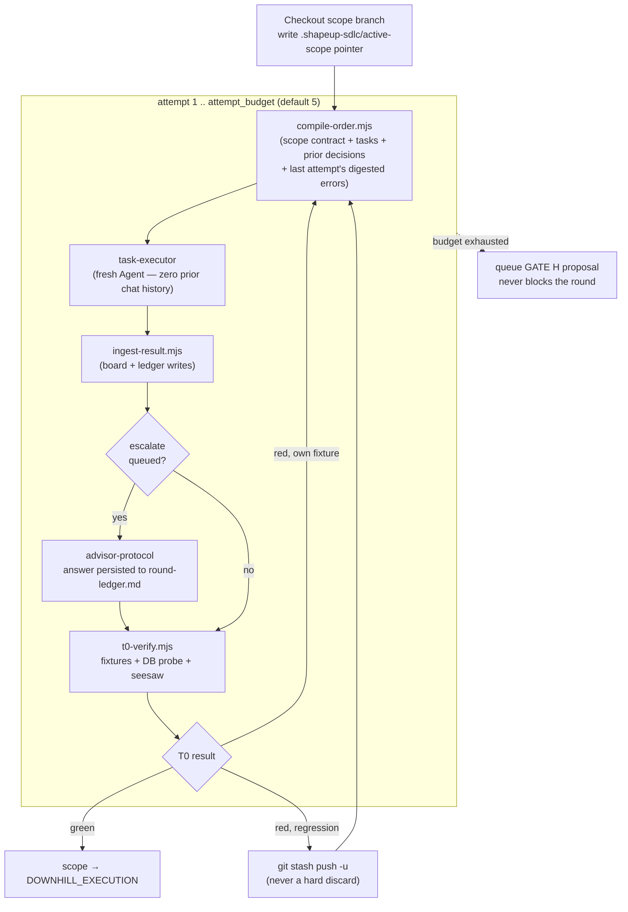

# 04 — Functional Design

[← Back to index](README.md)

## 4.1 — The twelve skills

| Skill | Role | Behavior |
|---|---|---|
| `shapeup` | Shaper | Set boundaries, breadboard, spike risk, write the pitch (Shape Up steps 1–4). |
| `translator` | Intake gate | Normalizes non-English intake to faithful English before anything downstream runs; every other skill HARD-FAILs on non-English input. |
| `orient` | Scout | Builder-led recon (step 7): reads the real code, spikes the single riskiest area, emits a code-surface map *before any board exists*, so the board is reality-born. |
| `ba-pitch-analyzer` | Spec-analyzer | Decomposes an oriented pitch into a linked DDD tree — domain model → use cases → tasks — with BDD scenarios and a derived Test Surface. One craft, four operations: analyze / generate-board / reconcile / retrofit-surface. |
| `scope-architect` | Slicer | Sole writer of committed scope contracts: import-graph slicing by flow, write-whitelisted substrates, affordance manifests, fixtures. |
| `task-executor` | Generator | Implements a WorkOrder's acceptance criteria exactly. Zero-memory (each attempt is a fresh subagent), substrate-sandboxed, never writes boards or ledgers. |
| `spec-evaluator` | Single judge | Verifies the running app against the committed spec. Skeptical by default; requires a T0 artifact citation on scoped specs; verdict returns as data, never edits anything. |
| `qa-edge-hunter` | Explorer | Post-PASS exploratory hunt through six fixed lenses, outside what the evaluator already probed. Findings go to the ledger as `~`; never blocks ship, never issues a verdict. |
| `advisor-protocol` | Adjudicator | Answers a worker's structured `ESCALATE` within a per-scope-per-round budget (default 3); persists the answer immediately so it survives the next attempt's zero-memory reset. |
| `scope-hammer` | Ship arbiter | GATE H: must-have census → baseline comparison (never against a perfect ideal) → cut list + ship verdict. Proposes only; a human promotes or ships. |
| `coach` | RLHF loop | Turns PO feedback at ship sign-off into knowledge-base rules, filed by skill after asking the PO to categorize each one — never assumed. |
| `tech-lead` | Orchestrator | Sequences all of the above through GATE L0–L4, owns the round loop, and is the sole writer of run-state. |

## 4.2 — The build round, in detail

When a spec has scope contracts, BUILD runs an **isolated attempt loop** per scope, riskiest
first:



Two facts make this loop safe to run unattended: **zero-memory handoff** — each attempt is a
fresh subagent that only ever sees what `compile-order.mjs` chose to put in the envelope, never
prior chat — and the **seesaw check** inside T0, which re-runs other scopes' fixtures to catch a
regression before it's mistaken for progress.

## 4.3 — The two-level circuit breaker

| Level | Unit | Default | On exhaustion |
|---|---|---|---|
| Outer — `round_budget` | Build + eval cycles for the whole run | 3 (appetite-informed) | Stop the run; escalate to the PO with the residual bug list |
| Inner — `attempt_budget` | T0 attempts for one scope, inside one round | 5 | Queue a hammer proposal for GATE H; move on to the next scope — never blocks the round |

## 4.4 — Hill position (mechanical, never self-reported)

Progress is reported by Shape Up's Hill position, never by a task count — a 90%-done scope can
still be stuck uphill on the one unknown that matters. The phase is derived only from facts on
disk, per scope, at each round boundary:

| Phase | Derived when |
|---|---|
| `UPHILL_UNKNOWN` | Open unknowns > 0 in the ledger for this scope |
| `UPHILL_SOLVED` | Unknowns resolved, but no T0-green attempt recorded yet |
| `DOWNHILL_EXECUTION` | At least one T0-green attempt; final PASS or seesaw still pending |
| `FINISHED` | Evaluator PASS *and* seesaw green *and* merged to main |

## 4.5 — Gate walkthrough

Five numbered gates pause an interactive or `--auto` run; `--unattended` auto-confirms all of
them and stops only on PASS, max-rounds, or a hard error.

```
⏸ GATE L0 — Intake & Run Config
Feature      : [slug]   (kicked-off pitch: [path])
Intake lang  : [English | translated via /translator]
Appetite     : [~1 week | ~2 weeks | ~6 weeks | ⚠ missing]
Spec folder  : [path]   (lens: [lite|standard])
Model matrix : orch=[model] exec=[model] eval=[model] qa=[model]
Budgets      : round_budget=[N] (outer)   attempt_budget=[N] (inner, per scope)
```

```
⏸ GATE L1a — Orient Review
🗻 area-level Hill: what's uphill / crest / downhill going into mapping
Spiked area + result — confirm before a single scope is cut
```

```
⏸ GATE L1b — Board Review
UC count + actors · scope board (topology, substrate size) · SPIKE blockers
Substrate-disjointness re-asserted via spec-lint.mjs — any red is a hard stop
```

```
⏸ GATE L2 — Build Round Complete
Board        : [N]/[N] tasks ✅   (hook-enforced — see hooks/gate-l2.mjs)
T0           : [k]/[k] touched scopes T0-green
Ready to EVAL: yes
```

```
⏸ GATE L3 — Verdict & Loop
🗻 Hill (slice-level) · Verdict: [PASS | FAIL]   bugs: [N]
PASS → QA edge hunt → ship.   FAIL → approve fix round r+1, or stop at max_rounds
```

```
⏸ GATE L4 — Ship Sign-off
Feature   : [slug] — [SHIPPED (deployed) | BUILT & VERIFIED — deploy pending (PO)]
Verdict   : PASS (dims evaluated; dims NOT evaluated named explicitly)
QA        : [hunt done — N findings, M promoted | skipped | n/a]
```

> Deploy is deliberately never automatic: the harness distinguishes *built & verified* from
> *deployed*, and only the PO's explicit yes crosses that line.

## 4.6 — Open-loop vs. closed-loop conditions

The gate walkthrough above shows *what* each gate prints, not *when* a human is actually
required to cross it. That turns out to be governed by two independent axes: a **PO-confirmation
policy** (the run's auto level) and a set of **mechanically-enforced preconditions** that hold
no matter what the auto level is.

### Conditions that open the loop (a human is required)

| # | Condition | Behavior |
|---|---|---|
| 1 | Run mode = `interactive` (default) | Every gate — L0, L1a, L1b, L2, L3, L4 — stops and waits for explicit PO confirmation. Hard rule: "never auto-proceed." |
| 2 | Run mode = `--auto` | Sub-skills run unattended internally, but the tech-lead still pauses at **L1a, L1b, L3, L4** per its own GATE L0.7 definition and the Flags table. |
| 3 | Max-rounds exhausted (outer breaker) with FAIL | `r+1 > max_rounds` → hard stop, escalate to the PO with the residual bug list. Fires even under `--unattended` — one of only three conditions that mode stops for. |
| 4 | Discovered tasks reconciled mid-BUILD | Any `discoveries[]` folded into new board tasks routes back to **GATE L1b** for PO approval before BUILD resumes. |
| 5 | GATE H verdict = CANNOT SHIP | A must-have item fails scope-hammer's H1.2 → do not proceed to SHIP; escalate to the PO honestly, same spirit as a max-rounds stop. |
| 6 | Hard error | A sub-skill fails irrecoverably (spec folder gone, app won't build) → stop and report; never retry blindly. Mode-independent. |
| 7 | Deploy authorization (standing invariant) | Even after a PASS ship, S.5 never auto-deploys. "PO says yes → deploy … otherwise → record deploy pending (PO)." Never becomes closed-loop, in any mode. |
| 8 | User halt | In any mode where gates are live, the PO may stop at any L-gate; state is preserved for `--from` resume. |

> ⚠️ **A documented inconsistency, not resolved here.** GATE L0's own text says *"Do NOT start
> ORIENT until confirmed **(interactive/auto)**"*, and GATE L2's own text says *"stop and wait
> for PO confirmation **(interactive/--auto)**"* — both explicitly claim they also pause under
> `--auto`. That contradicts the GATE L0.7 auto-level definition and the Flags table, which list
> only **L1a/L1b/L3/L4** for `--auto` and omit L0 and L2. A run built strictly from the L0.7/Flags
> summary would skip L0/L2 confirmation under `--auto`; a run built from each gate's own inline
> text would not. Worth resolving in the skill source before relying on `--auto`'s exact gate set.

### Conditions that allow closed loop (fully autonomous)

| # | Condition | Behavior |
|---|---|---|
| 1 | Run mode = `--unattended` | Auto-confirms all L-gates. Proceeds without a human until PASS, max-rounds, or a hard error — the only three stop conditions in this mode. |
| 2 | Inner breaker (`attempt_budget`) exhausted for one scope | Does **not** stop anything — queues a hammer proposal and moves to the next scope in sequence (DD-9: a struggling scope must not freeze the others). |
| 3 | ESCALATE resolution under `--unattended` | `advisor-protocol` accepts `--unattended` and resolves via precedent / conservative default instead of asking the PO; the 4th+ escalate in a scope/round auto-resolves and only flags a GATE H proposal for later. |
| 4 | GATE L2's board-green check (`hooks/gate-l2.mjs`) | A different axis entirely — runtime-vs-model, not PO-vs-model. Never asks a human; mechanically denies the EVAL dispatch on a partial board in *every* mode, underneath whichever PO-gate policy is active. |
| 5 | `--no-eval` | Tech-lead judgment call (or PO instruction) for trivial features — skips the evaluator, goes straight to SHIP with verdict `not-evaluated` recorded. |
| 6 | `--no-qa` | Skips the post-PASS edge hunt; ledger records `qa: skipped`. |
| 7 | BUILD-loop internals (r=1 tasks, r>1 bugs) | Neither requires a human step-by-step — only the round *boundaries* (L2, L3) are gated per whichever mode is active. |

The practical takeaway: **PO-confirmation policy** and **mechanical preconditions** are
orthogonal. Turning a run fully unattended removes the PO from every *decision* point except the
three unattended stop conditions — it does not, and cannot, remove the hook-enforced
preconditions (GATE L2's board-green check, `validate-envelope.mjs`, `sandbox-guard.mjs`), which
hold in every mode because they are scripts, not prompts.

---
[← System Design](03-system-design.md) · [Back to index](README.md) · [Next: Verification & Quality Strategy →](05-verification-and-quality-strategy.md)
