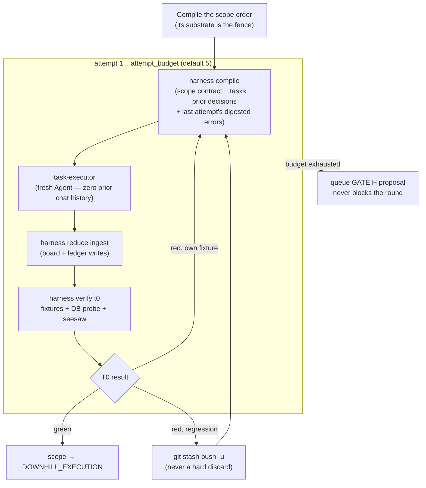

# 04 — Functional Design

[← Back to index](README.md)

## 4.1 — The twelve skills

| Skill | Role | Behavior |
|---|---|---|
| `shapeup` | Shaper | Set boundaries, breadboard, spike risk, write the pitch (Shape Up steps 1–4). |
| `translator` | Intake gate | Normalizes non-English intake to faithful English before anything downstream runs; every other skill HARD-FAILs on non-English input. |
| `orient` | Scout | Builder-led recon (step 7): reads the real code, spikes the single riskiest area, emits a code-surface map *before any board exists*, so the board is reality-born. |
| `ba-pitch-analyzer` | Spec-analyzer | Decomposes an oriented pitch into a linked DDD tree — domain model → use cases → tasks — with BDD scenarios and a derived Test Surface. One craft, four registered operations: `analyze` (the spec tree and board), `reconcile` (fold discovered tasks back in), `retrofit-surface` (append Test Surface rows to existing use cases), `coverage` (extract atomic requirement clauses into the shared `requirements.md` registry that anchors covers-closure). |
| `solution-architect` | Wirer | Sole writer of the committed wiring map (`wiring-map.md`) at GATE L1a.5: per use case, the reachability chain engine → seam → entry-point call site → player-visible affordance, resolved against `project-profile.md` — front-loads the integration seam so no engine ships orphaned. |
| `scope-architect` | Slicer | Sole writer of committed scope contracts: import-graph slicing by flow, write-whitelisted substrates, affordance manifests, fixtures. |
| `task-executor` | Generator | Implements a WorkOrder's acceptance criteria exactly. Zero-memory (each attempt is a fresh subagent), substrate-sandboxed, never writes boards or ledgers. |
| `spec-evaluator` | Single judge | Verifies the running app against the committed spec. Skeptical by default; requires a T0 artifact citation on scoped specs; verdict returns as data, never edits anything. |
| `qa-edge-hunter` | Explorer | Post-PASS exploratory hunt through six fixed lenses, outside what the evaluator already probed. Findings go to the ledger as `~`; never blocks ship, never issues a verdict. |
| `scope-hammer` | Ship arbiter | GATE H: must-have census → baseline comparison (never against a perfect ideal) → cut list + ship verdict. Proposes only; a human promotes or ships. |
| `coach` | RLHF loop | Turns PO feedback at ship sign-off into knowledge-base rules, filed by skill after asking the PO to categorize each one — never assumed. |
| `tech-lead` | Orchestrator | Sequences all of the above through GATE L0–L4, owns the round loop, and is the sole writer of run-state. |

## 4.2 — The build round, in detail

When a spec has scope contracts, BUILD runs an **isolated attempt loop** per scope, riskiest
first:



Two facts make this loop safe to run unattended: **zero-memory handoff** — each attempt is a
fresh subagent that only ever sees what `harness compile` chose to put in the envelope, never
prior chat — and the **seesaw check** inside T0, which re-runs other scopes' fixtures to catch a
regression before it's mistaken for progress.

> This round is row **2** of the measurement table
> ([§5.1](05-verification-and-quality-strategy.md#51--the-measurement-table)). Its verdicts are
> per-run T0/seesaw facts; no acceptance-vs-baseline comparison is maintained. And any acceptance
> observed in an uninterrupted round is a statement about a single context window — it says
> nothing about what survives across one (row 3).

## 4.3 — The circuit breakers

Two count *events* and are always on; a third counts the *clock* and is opt-in.

| Level | Unit | Default | On exhaustion |
|---|---|---|---|
| Outer — `round_budget` | Build + eval cycles for the whole run | 3 (appetite-informed) | Route to GATE H — ship what is green, with the residual bug list |
| Inner — `attempt_budget` | T0 attempts for one scope, inside one round | 5 | Queue a hammer proposal for GATE H; move on to the next scope — never blocks the round |
| Wall clock — `wall_clock_budget_s` | Elapsed seconds for the whole run | **off** (opt-in, `--wall-clock-budget`) | `harness verify budget --strict` at every round boundary; a trip opens no further round and routes to GATE H |

The wall-clock axis exists because the other two are blind to it: a single round can run for half
an hour without spending a round or an attempt. Set it *below* any external kill so the harness
trips its own breaker first — a run killed from outside ships nothing, including the scopes that
already passed T0. All three exits route to **GATE H**, never to a hard stop: the run's ending is
always a ship decision made against what is green.

> The build+eval loop therefore breaks exactly three ways: EVAL PASS → QA → Ship, outer
> `round_budget` exhausted, or the opt-in wall-clock budget tripped.

## 4.4 — Hill position (mechanical, never self-reported)

Progress is reported by Shape Up's Hill position, never by a task count — a 90%-done scope can
still be stuck uphill on the one unknown that matters. The phase is derived only from facts on
disk, per scope, at each round boundary:

| Phase | Derived when |
|---|---|
| `UPHILL_UNKNOWN` | Open unknowns > 0 in the ledger for this scope |
| `UPHILL_SOLVED` | Unknowns resolved, but no T0-green attempt recorded yet |
| `DOWNHILL_EXECUTION` | At least one T0-green attempt; final PASS or seesaw still pending |
| `FINISHED` | Evaluator PASS *and* seesaw green *and* merged to main |

## 4.5 — Gate walkthrough

The numbered gates pause an interactive or `--auto` run; `--unattended` crosses them from the
pre-recorded `ci` answer set (§3.2d) and stops only on PASS, max-rounds, or a hard error. (GATE
L1a.5 is a traceability-spine gate ✚ — present only when the spine artifacts exist.)

```
⏸ GATE L0 — Intake & Run Config
Feature      : [slug]   (kicked-off pitch: [path])
Intake lang  : [English | translated via /translator]
Appetite     : [~1 week | ~2 weeks | ~6 weeks | ⚠ missing]
Spec folder  : [path]   (lens: [lite|standard])
Model matrix : orch=[model] exec=[model] eval=[model] qa=[model]
Budgets      : round_budget=[N] (outer)   attempt_budget=[N] (inner, per scope)
```

```
⏸ GATE L1a — Orient Review
🗻 area-level Hill: what's uphill / crest / downhill going into mapping
Spiked area + result — confirm before a single scope is cut
```

```
⏸ GATE L1a.5 — Wiring Review ✚
Per-UC reachability chain: engine → seam → entry-point call site → player-visible affordance
Committed wiring-map.md checked against project-profile.md entry_point — no orphaned engine
```

```
⏸ GATE L1b — Board Review
UC count + actors · scope board (topology, substrate size) · SPIKE blockers
Substrate-disjointness re-asserted via harness verify spec — any red is a hard stop
```

```
⏸ GATE L2 — Build Round Complete
Board        : [N]/[N] tasks ✅   (derived from the board, advisory)
T0           : [k]/[k] touched scopes T0-green
Ready to EVAL: yes
```

```
⏸ GATE L3 — Verdict & Loop
🗻 Hill (slice-level) · Verdict: [PASS | FAIL]   bugs: [N]
PASS → QA edge hunt → ship.   FAIL → approve fix round r+1, or stop at max_rounds
```

```
⏸ GATE L4 — Ship Sign-off
Feature   : [slug] — [SHIPPED (deployed) | BUILT & VERIFIED — deploy pending (PO)]
Verdict   : PASS (dims evaluated; dims NOT evaluated named explicitly)
QA        : [hunt done — N findings, M promoted | skipped | n/a]
```

> Deploy is deliberately never automatic: the harness distinguishes *built & verified* from
> *deployed*, and only the PO's explicit yes crosses that line.

## 4.6 — Open-loop vs. closed-loop conditions

The gate walkthrough above shows *what* each gate prints, not *when* a human is actually
required to cross it. That turns out to be governed by two independent axes: a **PO-confirmation
policy** (the run's auto level) and a set of **mechanically-enforced preconditions** that hold
no matter what the auto level is.

> **How a crossing is actually produced.** Since the gate-answer set (§3.2d) the auto level is not
> read by the model as a paragraph — each gate resolves through `harness gate` and the
> orchestrator branches on its exit code (`0` cross · `4` stop and put the block to the PO · `5`
> abort). `--auto` implies the `guarded` preset and `--unattended` the `ci` preset unless a set is
> named. Every gate still emits its block and still records a decision; what the preset changes is
> the decision's **source**, which the ledger names.

### Conditions that open the loop (a human is required)

| # | Condition | Behavior |
|---|---|---|
| 1 | Run mode = `interactive` (default) | Every gate — L0, L1a, L1b, L2, L3, L4 — stops and waits for explicit PO confirmation. Hard rule: "never auto-proceed." |
| 2 | Run mode = `--auto` | Sub-skills run unattended internally, but the tech-lead still pauses at **L1a, L1b, L3, L4** per its own GATE L0.7 definition and the Flags table. |
| 3 | Max-rounds exhausted (outer breaker) with FAIL | `r+1 > max_rounds` → hard stop, escalate to the PO with the residual bug list. Fires even under `--unattended` — one of only three conditions that mode stops for. |
| 4 | Discovered tasks reconciled mid-BUILD | Any `discoveries[]` folded into new board tasks routes back to **GATE L1b** for PO approval before BUILD resumes. |
| 5 | GATE H verdict = CANNOT SHIP | A must-have item fails scope-hammer's H1.2 → do not proceed to SHIP; escalate to the PO honestly, same spirit as a max-rounds stop. |
| 6 | Hard error | A sub-skill fails irrecoverably (spec folder gone, app won't build) → stop and report; never retry blindly. Mode-independent. |
| 7 | Deploy authorization (standing invariant) | Even after a PASS ship, S.5 never auto-deploys. "PO says yes → deploy … otherwise → record deploy pending (PO)." Never becomes closed-loop, in any mode. |
| 8 | User halt | In any mode where gates are live, the PO may stop at any L-gate; state is preserved for `--from` resume. |

> **Resolved (v1.2): the GATE L0.7 / Flags table is authoritative** — `--auto` pauses at
> **L1a, L1b, L3, L4** only. The two gate-inline phrasings that appeared to also claim L0 and
> L2 ("confirmed (interactive/auto)", "wait for PO confirmation (interactive/--auto)") are
> harmless in practice and now read against this ruling: **L0** is where the auto level is
> *set*, so the run is necessarily interactive there — the inline text is trivially satisfied;
> **L2**'s board census travels in the gate block itself (closed-loop row 4 below).
> Since ADR-0001 it advises rather than denies, so the inline "wait for PO confirmation" phrasing
> is no longer redundant with a mechanical block — it is the only thing standing there.
> Follow-up: align the two inline
> phrasings in `skills/tech-lead/SKILL.md` at the next prose-touching change (deliberately not
> done in v1.2 — zero orchestrator prose growth). Lane gate sets (§4.7) are defined against
> this authoritative table.

### Conditions that allow closed loop (fully autonomous)

| # | Condition | Behavior |
|---|---|---|
| 1 | Run mode = `--unattended` | Auto-confirms all L-gates. Proceeds without a human until PASS, max-rounds, or a hard error — the only three stop conditions in this mode. |
| 2 | Inner breaker (`attempt_budget`) exhausted for one scope | Does **not** stop anything — queues a hammer proposal and moves to the next scope in sequence (DD-9: a struggling scope must not freeze the others). |
| 3 | *(none — see note)* | A worker `ESCALATE` is **not** auto-resolved. `harness reduce ingest` queues it; in the workflow lane a phase that produced no artifact **aborts**, naming the phase, because a relaunch would re-dispatch the same order and escalate again. Resolving it is a human step in every mode. |
| 4 | GATE L2's board census | A different axis entirely — runtime-vs-model, not PO-vs-model. Never asks a human; the gate block carries `green_scopes` and `hammer_proposals` derived from the round's own results, so an EVAL over unfinished work is visible to whoever answers the gate. Advisory since ADR-0001 — the board is per-machine and the operator asked for the call. |
| 5 | `--no-eval` | Tech-lead judgment call (or PO instruction) for trivial features — skips the evaluator, goes straight to SHIP with verdict `not-evaluated` recorded. |
| 6 | `--no-qa` | Skips the post-PASS edge hunt; ledger records `qa: skipped`. |
| 7 | BUILD-loop internals (r=1 tasks, r>1 bugs) | Neither requires a human step-by-step — only the round *boundaries* (L2, L3) are gated per whichever mode is active. |

The practical takeaway: **PO-confirmation policy** and **mechanical preconditions** are
orthogonal. Turning a run fully unattended removes the PO from every *decision* point except the
three unattended stop conditions — it does not, and cannot, remove the hook-enforced
preconditions (`harness verify envelope`, `sandbox-guard.mjs`, `safety-spine.mjs`,
`gate-zerowork.mjs`), which hold in every mode because they are scripts, not prompts. GATE L2's
board-green check is the one that deliberately does *not* hold that way: it observes in every mode
but decides in none.

## 4.7 — Risk lanes (design — not yet implemented)

> **Status: v1.2 design draft.** The `Lane` type is registered in the domain registry
> (`domain.schema.json#/$defs/Lane`, with its machine-readable `x-lane-policy` table) to
> reserve the name and make this policy reviewable — but no envelope references it and no
> runtime reads it yet. Absorbed from dwarves-kit's tiny/normal/full/bug lanes; this section is
> the shaped pitch-input for the implementation bet.

**The problem.** Today the harness has two ceremony dials — `--no-qa` and the scope-contract
activation switch — so a one-scope bug-fix pays the same Orient → board → gates ceremony as a
six-week feature. Teams route small work *around* a harness that can't right-size, and a
bypassed harness stops accumulating KB entries, ledger history, and metrics: value pillar II
(team inheritance) decays by disuse, not by failure.

**Lane vocabulary** — `tiny | normal | full`, selected at **GATE L0** and recorded in
`harness-run.md` frontmatter (`lane:`); the PO can always pin one with `--lane`.

| Lane | Selection (auto, PO-overridable) | Ceremony delta | Defaults |
|---|---|---|---|
| **tiny** | one-scope pitch **and** appetite ≤ 2 weeks **and** no third-party integration **and** ≤ 3 user-facing actions — deliberately the *same predicate* `ba-pitch-analyzer` already uses to judge `lens: lite`, so lane selection reuses that knob instead of inventing a parallel one | Skips Orient + GATE L1a (no Scout dispatch); board auto-generated `lens: lite`; L1a+L1b collapse into **one merged confirmation gate** | QA `--no-qa`, `round_budget` 2 |
| **normal** | everything else | none — today's behavior, unchanged | `round_budget` 3 |
| **full** | cross-context lens **or** appetite ≥ 6 weeks | adds mandatory QA and GATE H review | `lens: cross-context`, `round_budget` 4 |

**The invariant that makes lanes safe** (also listed in the appendix): **lanes thin
*ceremony*, never *verification*.** No lane ever skips EVAL (single judge), T0, or any hook.
A tiny lane with a skipped judge would just be "prompt harder" with extra steps.

**How the lane travels — and deliberately does not.** The lane is pipeline knowledge, so it
**never rides in `WorkOrderPayload`**: payload fields are worker inputs (registered per worker
in `x-payload-by-worker`), and a worker that reads its lane has learned the pipeline —
breaking the layer separation that makes workers pure. Instead the orchestrator **compiles the
lane away** into knobs that already exist and are already registered: `payload.lens`,
`payload.dimensions`, its own gate policy, and the budget defaults above. For audit only, the
draft reserves an optional top-level informational `lane` field on the WorkOrder *envelope*
(never readable by workers), wired only when lanes are implemented.

**Per-lane `--auto` gate sets**, defined against the authoritative L0.7 table (§4.6):
tiny×`--auto` pauses only at the merged board gate + L4; normal×`--auto` = L1a/L1b/L3/L4;
full×`--auto` = normal + GATE H review.

---
[← System Design](03-system-design.md) · [Back to index](README.md) · [Next: Verification & Quality Strategy →](05-verification-and-quality-strategy.md)
