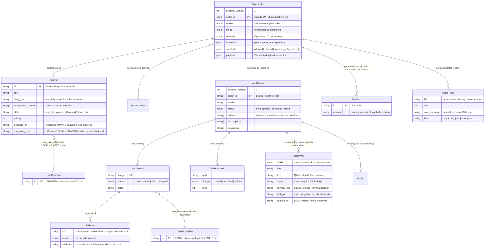
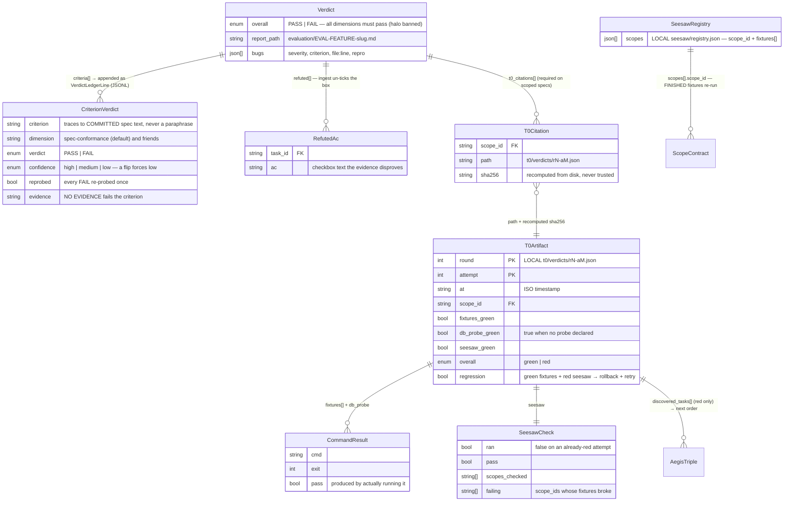
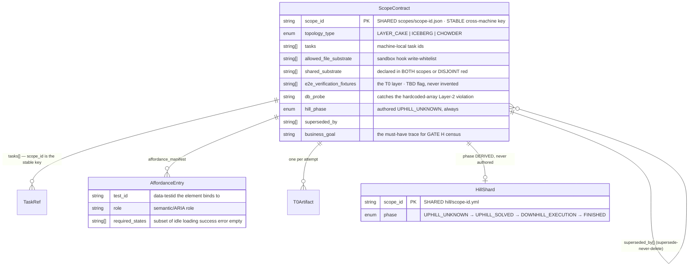
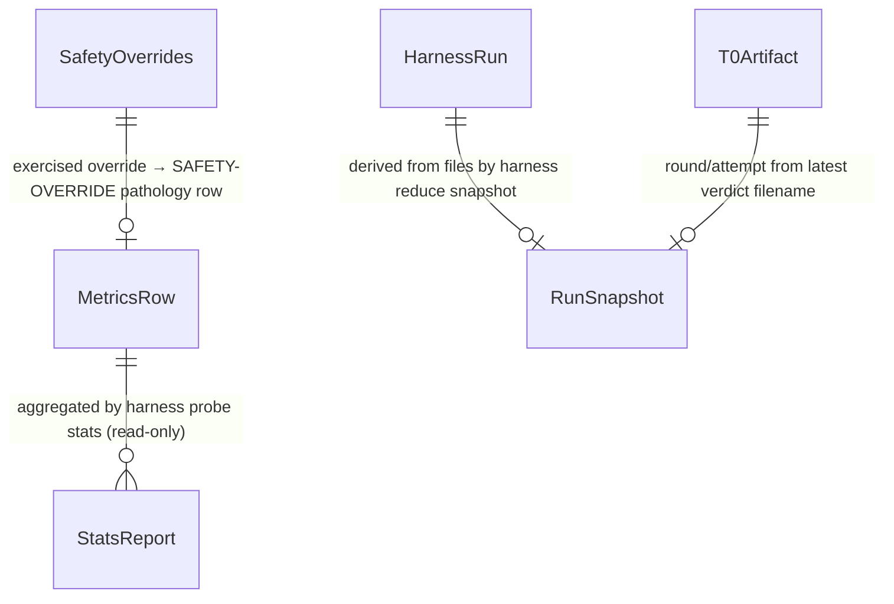
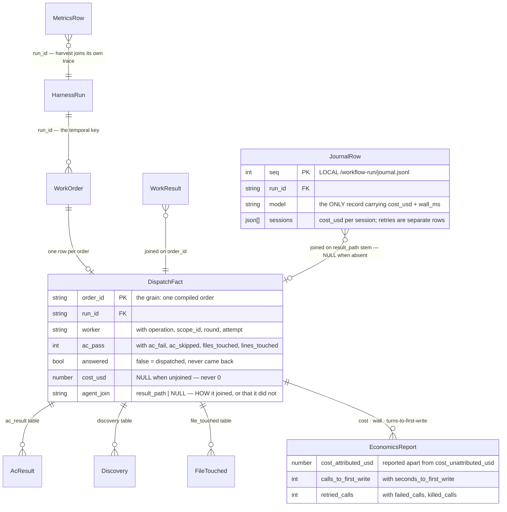

# 07 — Domain ERD

[← Back to index](README.md)

> **Generated from** [`skills/tech-lead/schemas/domain.schema.json`](../../skills/tech-lead/schemas/domain.schema.json)
> — the central domain registry (`$defs` = entities, `x-erd` = relationships,
> `x-payload-by-worker` = worker→field map). The schema is the source of truth; when it
> changes, regenerate this page. Structural test #24 guards the schema's internal consistency.

## Legend — storage tiers

| Tier | Meaning | Root |
|---|---|---|
| **SHARED** | Committed, survives clone + crash | `shapeup/` |
| **LOCAL** | Gitignored, regenerable run-trace | `.shapeup/` |
| **EMBEDDED** | Record type that only lives inside another entity | — |

**Join keys.** `<slug>` (the feature) is the aggregate root every path is keyed off.
`scope_id` is the **stable cross-machine key** — hill shards, T0 history, and branches join
on it. `TASK-NNN` ids are **machine-local** (boards regenerate and renumber); never join on
task id across machines.

`run_id` (v1.8) is the **temporal key**: which *execution* a record came from.
`<slug>-<YYYYMMDDTHHMMSSZ>-<8 hex>`, minted by `harness init run` and derived from the receipt, so
any writer holding the receipt recomputes it and a pre-v1.8 receipt backfills to the id it would
have had. It exists because every other id here is *positional* — `order_id`, `(round, attempt,
trial)` and `trial` all identify a record within one run and repeat in the next — so no record
could be attributed to a run and no two runs could be compared. Join `run_id` to group an
execution; join `slug` or `scope_id` to group across executions. `WorkResult` deliberately carries
no `run_id`: it is worker-written, and it reaches the key through `order_id`, which
`validate-envelope` already enforces.

**Tier direction.** Persisted links flow **LOCAL → SHARED only**: a LOCAL artifact must
fully anchor into the committed tier (a task's `use_case_refs`/`linked_docs`, a T0
artifact's `scope_id`, a discovery line's `[UC-NN]` tag), while a SHARED document links
only its committed siblings — never a LOCAL path or a machine-local task id, which would
dangle on every fresh clone. `harness verify spec` enforces both halves mechanically
(`TIER-DIRECTION` red for a `[[tasks/...]]` link in a spec doc, `UC-ANCHOR` red for a task
with an empty or unresolvable anchor).

## 7.1 — The envelope port (WorkOrder → worker → WorkResult)

Everything a worker receives arrives inside a WorkOrder; everything it used to write into
shared files it now returns inside a WorkResult, and `harness reduce ingest` is the single
writer that projects the result into shared state.

## 7.2 — The judge and the evidence chain (Verdict → T0)

A verdict on a scoped spec is structurally invalid without a T0 citation; the sha256 is
recomputed from disk — content-addressed evidence the generator cannot fabricate.

## 7.3 — Scope contracts and derived state

`scope-architect` is the sole writer of ScopeContract; hill phase is derived from
T0/T1/seesaw facts, never authored (DD-10). Superseded contracts are kept, never deleted.

## 7.4 — Standalone artifacts (no relationships beyond the slug root)

| Entity | Tier | Location | Sole writer | Readers |
|---|---|---|---|---|
| `VerdictLedgerLine` | LOCAL | `evaluation/.verdicts-<target>.jsonl` | harness reduce ingest | spec-evaluator (flip detection), harness reduce verdict |
| `SeesawRegistry` | LOCAL | `seesaw/registry.json` | tech-lead (scope FINISHED) | harness verify t0 |
| `MetricsRow` | SHARED | `metrics/<machine-id>.jsonl` | tech-lead (SHIP S.6) | harness probe stats (v1.2: optional `at` + `attempt_exhaustions` fields) |
| `ActiveScopePointer` | LOCAL | `.shapeup/active-scope` | tech-lead (BUILD step 0) | run-scoping for the advisory/Stop hooks — not writable by any worker |
| `ActiveOrderPointer` | LOCAL | `.shapeup/active-order` | the run (written before each worker dispatch) | sandbox-guard hook — the substrate it enforces is read through this pointer |
| `SafetyOverrides` (v1.2) | LOCAL | `.shapeup/safety-overrides.json` | **human PO only** — outside the run-trace carve-out, so no worker can write it | safety-spine hook |
| `RunSnapshot` (v1.2) | LOCAL | `<slug>/run-snapshot.json` | harness reduce snapshot `--write` (via the PreCompact hook — never a worker) | session-rehydrate hook, tech-lead, human |
| `StatsReport` (v1.2) | EMBEDDED | stdout only — never persisted | harness probe stats (read-only projection) | human / CLI / CI |
| `RequirementClause` (spine v1.3) | SHARED | `<slug>/requirements.md` | ba-pitch-analyzer (`coverage` — extraction only; a `CUT` is a PO governance edit) | harness verify trace (covers-closure), tech-lead, human |
| `WiringMap` (spine v1.3) | SHARED | `<slug>/wiring-map.md` | solution-architect (SOLE writer, direct — like `scopes/*.md`); `entries[]` are `WiringEntry` | harness verify trace (reachability), scope-architect (seam), tech-lead |
| `ProjectProfile` (spine v1.3) | SHARED | `<slug>/project-profile.md` | tech-lead (GATE L0 — not harness compile, which stays pipeline-blind) | harness verify trace (entry_point), solution-architect (`wire`), tech-lead |
| `Lane` (v1.2 · design draft) | EMBEDDED | (when implemented) `harness-run.md` frontmatter `lane:` — never a payload field | tech-lead (GATE L0) | tech-lead only — see design §4.7 |

## 7.4b — Telemetry & resilience read-plane (v1.2)

The absorb-audit additions are all *derived* records: they read the run's files and project
them — none of them is a new write surface for workers, and `harness reduce ingest` remains the
sole SHARED-state writer.

## 7.4c — The record plane (v1.8)

The analysis tier. Every entity here is *derived* — a projection of records the pipeline already
writes, produced by a read-only step that mutates nothing and grades nothing.

| Entity | Tier | Location | Sole writer | Readers |
|---|---|---|---|---|
| `JournalRow` | LOCAL | `<slug>/workflow-run/journal.jsonl` | the Workflow runtime (append-only) | harness report export, human |
| `DispatchFact` + children | LOCAL | `.shapeup/exports/<run_id>/*.jsonl` | harness report export (read-only over the trace) | any warehouse tool, human |
| `EconomicsReport` | EMBEDDED | the export manifest, and stdout from `harness probe stats --economics` | lib/facts.mjs (pure projection) | human / CLI / CI |

**The null discipline.** A dispatch with no agent call carries `cost_usd: null` and
`agent_join: null`, never `0`; a run whose sessions recorded no cost totals to `null`, never
`$0.0000`. An absent measurement and a measured zero must not share a representation — the same
rule `hooks/lib/decision.mjs` applies to `allow`, at the read plane instead of the write plane.

## 7.5 — Vocabulary enums

| Enum | Values |
|---|---|
| `WorkerName` (10) | task-executor · spec-evaluator · ba-pitch-analyzer · scope-architect · solution-architect · orient · qa-edge-hunter · translator · scope-hammer · coach |
| `Operation` (15) | execute, fix, spike · analyze, reconcile, retrofit-surface, coverage · map-scopes · wire · evaluate · orient · hunt · translate · hammer · coach |

## 7.6 — Payload fields by worker (`x-payload-by-worker`)

Which `WorkOrderPayload` fields each worker may rely on — anything absent from an order is
**unknown**, never inferred. A new cross-boundary field is added to the registry first.

| Worker | Payload fields |
|---|---|
| task-executor | `tasks`, `scope_contract`, `decisions`, `digested_errors`, `verify`, `kb_rules_path`, `constraints`, `bugs` |
| ba-pitch-analyzer | `pitch`, `lens`, `orient_dir`, `spec_folder`, `feature`, `discovered_ledger`, `kb_rules_path`, `requirements` |
| scope-architect | `feature`, `spec_folder`, `tasks`, `discovered_ledger`, `scope_id` |
| solution-architect | `feature`, `spec_folder`, `project_profile` |
| spec-evaluator | `spec_folder`, `feature`, `dimensions`, `run_cmd`, `t0_artifacts`, `browser`, `tasks` |
| orient | `pitch`, `stack`, `spec_folder`, `feature` |
| qa-edge-hunter | `feature`, `spec_folder`, `eval_report`, `app_url`, `ledger`, `kb_rules_path` |
| translator | `intake`, `glossary` |
| scope-hammer | `feature`, `baseline`, `breaker`, `scope_id` |
| coach | `feedback` |

## 7.7 — Result fields by worker (`x-result-by-worker`)

Which `WorkResult` fields each worker is allowed to output. Enforces architectural boundaries (e.g., only `spec-evaluator` may return a verdict; only `task-executor` returns task results).

| Worker | Allowed Result Fields |
|---|---|
| task-executor | `task_results`, `files_touched`, `discoveries`, `artifacts`, `assumptions`, `deviations` |
| ba-pitch-analyzer | `discoveries`, `files_touched`, `artifacts`, `assumptions`, `deviations` |
| scope-architect, solution-architect | `files_touched`, `artifacts`, `assumptions`, `deviations` |
| spec-evaluator | `verdict`, `files_touched`, `artifacts`, `assumptions`, `deviations` |
| qa-edge-hunter | `discoveries`, `files_touched`, `artifacts`, `assumptions`, `deviations` |
| orient, translator, scope-hammer, coach | `files_touched`, `artifacts`, `assumptions`, `deviations` |
