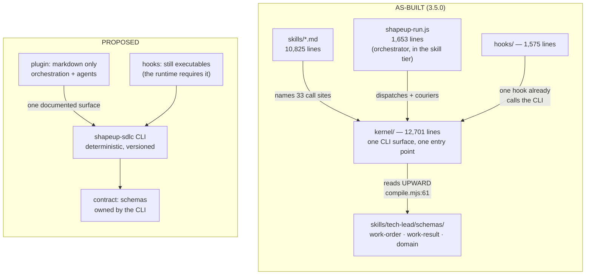
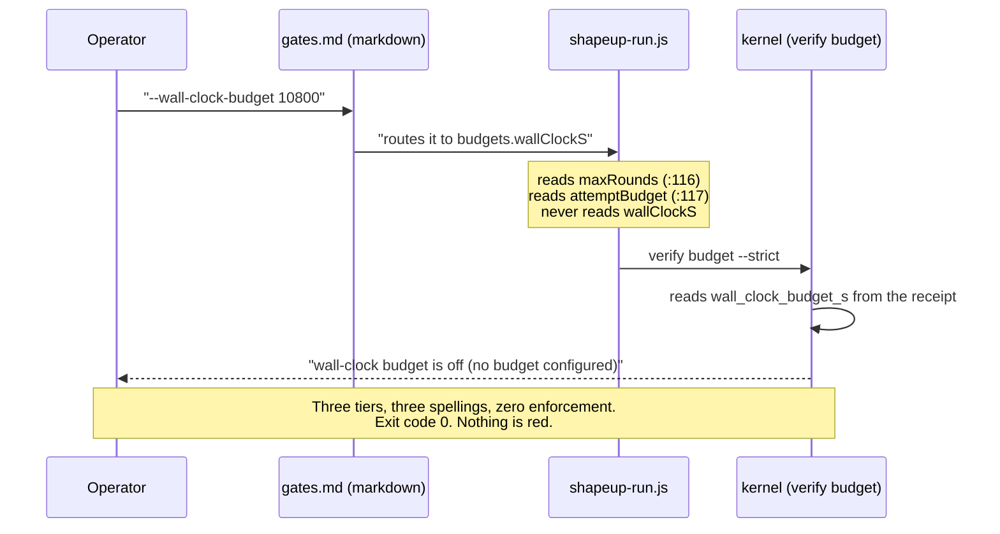
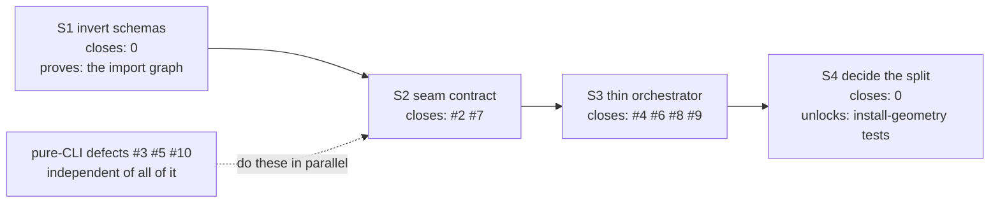

# The split is already 80% built; what is missing is a contract, not a boundary

**Question:** Should 4.0 separate this repo into a published `shapeup-sdlc` CLI (deterministic,
measurable) and a pure-markdown Claude Code plugin (orchestrator, agents, workflow) — and if so,
what does that fix, what does it cost, and in what order?
**Sources:** this repo @ `78d3c6e` (3.5.0, read 2026-09-19): line counts from the filesystem, the
kernel's CLI surface from executing `node kernel/harness.mjs`, the permission grant from
`bin/lib/grant.mjs`, hook registration from `hooks/hooks.json`, coupling from the import graph;
`docs/design/adr/0002-plugin-repo-organization.md` (Accepted, 2026-08-02) as prior art; the eleven
open defects catalogued in `shapeup/knowledge-base/harness-defects.md` and ranked in
`docs/design/plans/which-defect-first.md`, both updated the same day.
**Confidence:** High on the as-built picture and on the defect classification — both derived from
the artifacts, and each defect's declaring and consuming tier read in code. Medium on the staging in
§6. Low on anything resembling an effort estimate; this repo has one maintainer and the constraint
is wall-clock, not money.
**Status:** Analysis. No decision taken, nothing implemented.

---

## 0. The finding in one paragraph

The architecture you are proposing mostly exists. `kernel/` is already 12,701 lines of zero-dependency
Node with a single documented CLI surface (`verify | reduce | probe | init | report | gate | compile`),
already reached through exactly **one** entry point that the installer grants with **two**
permission rules (`bin/lib/grant.mjs:61,81`), and already invoked from a hook the same way a CLI
would be (`hooks/hooks.json`: `node "…/kernel/harness.mjs" verify envelope`). The plugin tier is
already 10,825 lines of markdown. What is *not* split is smaller and more specific than "code versus
markdown": a 1,653-line JavaScript orchestrator lives inside the skill tier
(`skills/tech-lead/workflows/shapeup-run.js`), and the shared contract — the schemas both tiers
depend on — lives in the *skill* tier while the kernel reaches up into it (`kernel/compile.mjs:61`,
`kernel/reduce/ingest.mjs:36`, `kernel/verify/envelope.mjs:31`). That inverted dependency is the
real defect, and it explains the thing that made the fix plan read as contradictory: **seven of the
eleven open defects are seam defects — a fact asserted in one tier and consumed in another with
nothing enforcing the join.** A package boundary does not fix those. It renames the seam and puts a
release cycle across it, which makes every one of the seven harder to close, not easier. Do the
split — but do it *for the contract it forces you to write*, and write the contract first, because
the contract alone closes all seven and the boundary alone closes none.

## 1. What is actually being asked

The decision this unblocks: what shape 4.0 takes. Three constraints bound it, and they are not
negotiable by an architecture document:

- **The runtime is not yours.** Claude Code loads hooks from `${CLAUDE_PLUGIN_ROOT}` as command
  strings (`hooks/hooks.json`), resolves skills by namespace, and gates execution behind a
  permission layer, a workspace-trust layer and an auto-mode classifier — the last two of which this
  plugin has already measured and cannot reach (register, two ⚠ sections). Any split lives inside
  that.
- **Zero dependencies is load-bearing** (`CLAUDE.md`), and one maintainer carries the release.
- **The judge is an LLM.** `spec-evaluator` grades conformance to a spec. No CLI decides that.

So the evaluation criteria, weighted before scoring anything:

| criterion | weight | why |
|---|---|---|
| Does it close open defects | ×3 | eleven are open; seven are seam defects |
| Does it make the deterministic half independently testable | ×3 | the two defect classes this checkout cannot see are both runtime-geometry classes |
| Release and permission surface | ×1 | already collapsed to one entry point and two rules |
| Migration cost for consumers | ×2 | `npx shapeup-sdlc init` is a published URL contract (ADR-0002) |
| Conceptual tidiness | ×0 | not a reason to move code |

## 2. The as-built architecture, and the architecture the proposal assumes

Measured, not assumed — `find` + `wc -l` over the shipped set:

| tier | code (LOC) | markdown (LOC) | ships as |
|---|---|---|---|
| `kernel/` | **12,701** | 0 | plugin files, invoked by path |
| `hooks/` | 1,575 | 0 | command strings in `hooks.json` |
| `oracles/` | 640 | 0 | invoked by user fixtures (ADR-0002) |
| `bin/` | 462 | 0 | `npx shapeup-sdlc init` |
| `skills/` | **1,653** | **10,825** | markdown + one JS orchestrator + 4 schemas |
| `commands/` | 0 | 267 | pure markdown |

The delta is three items, not a rewrite: **the orchestrator's location**, **the schemas' ownership
direction**, and **whether the CLI is separately installable**. Everything else already matches the
picture on the right.

One tension to name, because it is an Accepted ADR: `ADR-0002` organises this repo by *lifecycle* —
"every top-level directory answers one question: when does this run?" The proposal organises by
*determinism*. These are not the same axis, and `oracles/` is the proof: it is deterministic code
that runs inside a **user's** scope-contract fixture, so it belongs to the CLI by nature and to the
plugin by lifecycle. A split must say where it goes; ADR-0002 must be superseded, not ignored.

## 3. The central finding — the defects live at the seam, and the seam has no contract

Every open defect, classified by where the fact is *declared* and where it is *consumed*:

| # | defect | declared in | consumed by | class |
|---|---|---|---|---|
| 2 | `wallClockS` is named and read by nothing | orchestrator JS `:36` + `gates.md:115` | `kernel/verify/budget.mjs` reads a *different* field | **seam** |
| 4 | an abort leaves a trace reading as running | orchestrator (no close-out call) | `kernel` has no harvest to call | **seam** |
| 6 | L0, L4, COACH-1 never resolved | orchestrator `crossGate` × 7 of 10 | `kernel/gate.mjs` ledger | **seam** |
| 7 | `run-args.json` has no writer | `gates.md:126` (prose) | `kernel/probe/concurrency.mjs:313` | **seam** |
| 8 | `rounds_used` reports 0 | orchestrator never writes it | `kernel/reduce/ship.mjs:311` reads it | **seam** |
| 9 | a worker's ESCALATE reaches nothing | worker SKILL.md protocol | counted by `facts.mjs:205`, else nothing | **seam** |
| 11 | WorkOrder names no result path | schema (in the *skill* tier) | every worker derives it from prose | **seam** |
| 1 | an escalated close keeps fencing | `AGENTS.md:72` says otherwise | `hooks/sandbox-guard.mjs:187` | doc↔code |
| 3 | the staged pitch is writable by build legs | — | `kernel/compile.mjs:220` | **pure CLI** |
| 5 | ownership ignores `shared_substrate` | — | `kernel/probe/owner.mjs:130` | **pure CLI** |
| 10 | a locationless diagnostic loses its location | — | `kernel/probe/digest.mjs` | **pure CLI** |

**Seven seam, three pure-CLI, one doc-versus-code.** That ratio is the whole argument, and #7 is its
purest specimen: a markdown file calls `run-args.json` *"the only artifact that records what a run
was configured with"*, a kernel module reads it and admits in its own comment that *"it is absent
from every run recorded so far"*, and no writer exists anywhere outside test fixtures. Nobody wrote a
bug. Two tiers each assumed the other owned the write, and nothing in the system can hold that
assumption to account.

Here is that failure as it actually runs — the path an operator takes when they ask for the wall-clock
breaker the documentation offers them:

**Now the load-bearing question: does the proposed split fix this?** No — and that is the finding
people will resist, so take it concretely. After the split, `gates.md` still says
`--wall-clock-budget`, the markdown orchestrator still has to pass it, and the CLI still reads
`wall_clock_budget_s`. The seam is now a *package boundary*, which means the mismatch is no longer
one repo's structural test away from being caught; it is a cross-version compatibility question
between two artifacts that release on different days. The defect gets **harder**.

What fixes it is the thing a split would *force you to write and could not ship without*: a declared
CLI contract — the arguments, their spellings, their required artifacts — with a conformance check
that fails when a documented flag reaches no reader. You can write that contract today, inside one
repo, with one structural test. That is why the contract comes first and the boundary second.

## 4. Argued from the numbers — and what "mathematically" can actually mean here

**The permission argument is already won.** `pipelineRules()` returns two rules over one entry point
and is *"deliberately not derived from the filesystem… with one entry point there is nothing left to
enumerate"* (`bin/lib/grant.mjs:73-83`). An earlier generation enumerated twenty scripts into forty
rules; that is purged on upgrade. So "a real CLI would collapse the permission surface" describes a
migration that already happened inside the current shape.

**The testability argument is not won, and it is the strongest one for the split.** The register's
standing ⚠ entry says two defect classes are unreachable from this checkout — anything gated on
*where the plugin is installed*, and anything that happens *after* a run ships — because running the
repo as its own plugin puts the plugin root inside the working directory. A CLI installed as a
package, driven by a test that never loads Claude Code at all, reaches the first class directly. That
is a real capability this architecture does not have today.

**Where determinism stops.** The ambition — "the CLI guarantees everything is solved mathematically,
measured, evaluable" — is achievable for one half and impossible for the other, and the split is
worth doing precisely because it draws that line where a reader can see it:

| decidable, and the kernel already decides it | not decidable, ever |
|---|---|
| schema validity of every envelope (`verify envelope`) | whether the code satisfies the spec |
| substrate containment and disjointness (`verify spec`, the sandbox hook) | whether a pitch is well shaped |
| dependency waves, cycles, exclusion pairs (`probe concurrency`) | whether a cited bug is real |
| artifact identity by hash (`verify t0`, re-hashed by the judge) | whether a scope is "done" |
| coverage closure `REQ → AC → criterion` (`probe requirements`) | whether an edge case matters |
| gate ledger completeness, exit codes, budgets | whether the feature is worth shipping |

The CLI can guarantee **conformance of the record**, never **correctness of the product**. Every
defect in the left column is a bug you can fix once and pin with a test; every judgement in the right
column stays probabilistic and is exactly what the gates, the receipts and the single-judge rule
exist to *bound*. A 4.0 that markets the CLI as making the loop "mathematical" will be believed, and
then disbelieved the first time a green run ships a broken feature.

## 5. What deliberately not to do

- **Do not rewrite the orchestrator as prose.** `shapeup-run.js` is a scheduler: dependency edges
  with exclusion pairs (`:237-284`), a release ceiling derived from the contracts, concurrent legs
  awaited per scope (`:319-329`), a round loop with three exits. Markdown cannot hold that, and the
  attempt would reintroduce the class this project keeps measuring — a rule stated in prose with no
  enforcer. "The plugin is pure markdown" should mean *the plugin contains no business logic in
  code*, not *no code runs the workflow*. The orchestrator is CLI-side or it is a third thing; it is
  not a skill.
- **Do not publish two npm packages yet.** Two packages means a compatibility matrix, and today you
  cannot state the contract they would be compatible *about*. Split the repo internally first
  (`cli/`, `plugin/`, one release); split the publish only when a conformance suite exists to
  version.
- **Do not move the hooks.** The runtime requires command strings resolvable under
  `${CLAUDE_PLUGIN_ROOT}`. A hook may *call* the CLI — one already does — but it ships with the
  plugin. Nothing is gained by pretending otherwise.
- **Do not supersede ADR-0001.** The consumer's two-tier layout is orthogonal and is working.
- **Do not defer the three pure-CLI defects behind the split.** #3, #5 and #10 are fixed the same
  way before or after. Fixing them first also proves the CLI half is maintainable in isolation.

## 6. Recommendation — four stages, cheapest evidence first

**Stage 1 — invert the schema dependency.** Move `work-order`, `work-result`, `domain`,
`gate-answers` out of `skills/tech-lead/schemas/` into a tier the kernel owns, and have the skills
reference them. Nothing changes at runtime; the import graph stops pointing upward. *Evidence it
produces:* whether anything else in the kernel secretly depends on the skill tree — the honest answer
is unknown until the move is attempted, and that is the cheapest way to find out.

**Stage 2 — write the seam contract, and let it fail loudly.** One declared surface: every run
argument, its spelling in each tier, the artifact it lands in, and its reader. Then one structural
check with the shape *"a documented flag that reaches no reader is red"*. This single stage closes
#2 and #7, makes #6 and #8 mechanical, and is the prerequisite for ever publishing two packages.

**Stage 3 — make the orchestrator a thin driver.** Every fact it holds in a variable is a fact a
relaunch loses; 3.4.0 already fixed four instances of exactly that. Move close-out, gate emission
and run-args writing into the CLI, leaving the script to schedule and dispatch. Closes #4, #6, #8
and #9 as a group, because all four are "the orchestrator was supposed to tell the kernel something".

**Stage 4 — then decide the package split**, with the contract written, the schemas owned and the
orchestrator thin. At that point the decision is nearly mechanical, and — worth saying plainly — you
may find you no longer want it: with Stages 1–3 done, the remaining benefit is independent
installability for testing, which a test harness can get from the repo without a second package.

Note what the diagram says about the proposal: **the split itself closes no defect.** Stages 1–3 do,
and each is executable today inside one repo.

## 7. What would change this answer

- **If the seam classification is wrong.** It is the load-bearing claim; each row cites the declaring
  and consuming file. Refute a row and the ratio moves.
- **If Claude Code ships a first-class way for a plugin to depend on an external binary** — today the
  `${CLAUDE_PLUGIN_ROOT}` path form is what the hook layer and the grant are built around. A
  supported `requires: { bin }` would make Stage 4 obviously right rather than optional.
- **If a second consumer appears.** The entire case for an independently published CLI strengthens
  the moment something that is not this plugin wants to run `compile` or `verify t0` — CI, an
  editor, a different agent runtime. Today there is none, and that absence is why Stage 4 is last.
- **If the soak keeps failing on run-geometry.** Two consecutive features have stopped before the
  judge. If the next attempt fails on something only an installed-package test could have caught,
  Stage 4 moves ahead of Stage 3.

## Appendix — evidence

| claim | source |
|---|---|
| kernel 12,701 LOC; skills 10,825 md + 1,653 js; commands 0 code | `find`/`wc -l`, 2026-09-19 |
| one CLI surface, seven verbs | `node kernel/harness.mjs` (usage output) |
| one entry point, two permission rules | `bin/lib/grant.mjs:61,73-83` |
| a hook already invokes the CLI | `hooks/hooks.json` PreToolUse `Skill\|Agent` |
| kernel imports schemas from the skill tier | `kernel/compile.mjs:61`, `reduce/ingest.mjs:36`, `verify/envelope.mjs:31` |
| the orchestrator is a scheduler | `skills/tech-lead/workflows/shapeup-run.js:237-284, 319-329` |
| `run-args.json` read but never written | `kernel/probe/concurrency.mjs:304,313`; no writer outside `tests/` |
| lifecycle-based organisation is an Accepted ADR | `docs/design/adr/0002-plugin-repo-organization.md` |
| the eleven open defects and their ranking | `shapeup/knowledge-base/harness-defects.md`; `docs/design/plans/which-defect-first.md` |
