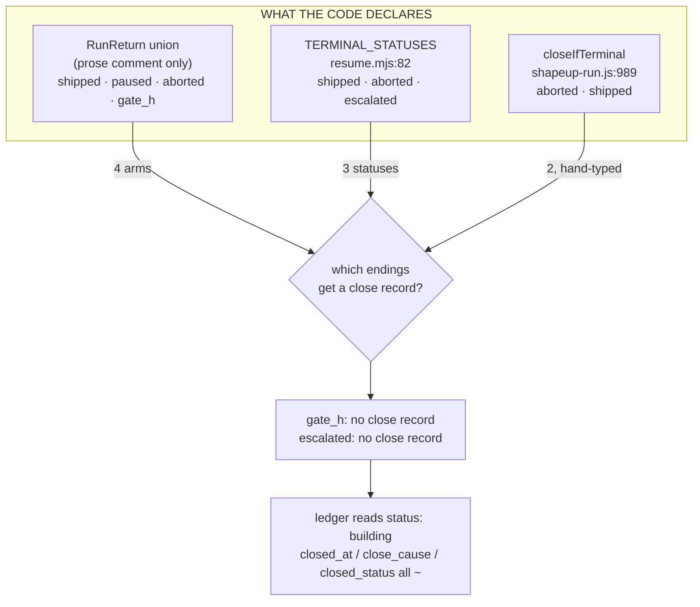
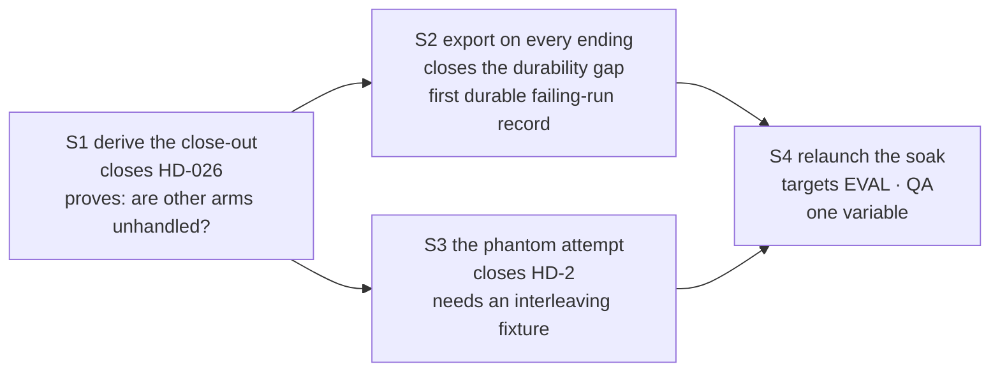

# The acceptance contract has a measured boundary, and both soak defects live just outside it

**Question:** Where does the next unit of effort go, after a release that closed nine defects under
adversarial acceptance and then had two more found by the first real consumer run?
**Sources:** this repo @ `7cc0351` (3.6.0) — enumerations read from the code, not from prose;
`proj-harmony-os-sample` @ `6e4de89`, two launches of one pitch through plugin 3.6.0 installed from
the marketplace, 2026-09-21→22; the 19 acceptance passes of `plans/defect-sweep-execution.md`;
`references/graph-engineering.md` §VIII.A, §VI.G, §IX (Agentic Software Engineering Practice, 2026).
**Confidence:** High on the enumeration mismatch and on the boundary claim — both are derived by
executing greps over declared symbols. Medium on the staging in §6. Low on anything resembling an
effort estimate: one maintainer, and the constraint is wall-clock.
**Status:** Analysis. Recommends; decides nothing.

---

## 0. The finding in one paragraph

The sweep and the soak measured two different things, and the difference is this report. The sweep
verified **named** behaviours: 19 acceptance passes over stated propositions, 11 returning REJECTED,
and every one of those rejections a case where a behaviour someone had named did not happen under
execution. The soak found two defects and **neither is a named behaviour that failed**. HD-026 is an
incomplete case analysis over a four-arm union — the close-out covers two arms. HD-2 is an incomplete
enumeration over interleavings — an attempt was compiled and graded while its predecessor was still
in flight, and the phantom result spent the budget. A proposition can only test a state someone
thought to name; that is not a weakness of the acceptance contract but its boundary, and the boundary
is now measured at 11/19 inside and 2/2 outside. The decisive detail is that **this project already
invented the fix and applied it to exactly one enumeration**: Stage 5's run-argument surface is
*derived* from each entry point's own `ARGV_SPEC` at runtime, so a flag added to one tier and not the
others reds on its own. Generalising that one pattern to the three or four other enumerations the
harness already declares is cheaper than another fix round and catches the only defect class a
proposition structurally cannot.

## 1. What is actually being asked

The maintainer is PO and sole engineer. Four options are live, and the question is the order:

1. Fix HD-026 and HD-2.
2. Harden the acceptance contract — more propositions, more adversaries.
3. Chase the three Stage 9 propositions still unproven (EVAL, QA, and — until launch 2 — GATE H).
4. Resume the architecture split (S4), still NO-GO on its own triggers.

Criteria, weighted before scoring anything:

| criterion | weight | why |
|---|---|---|
| Closes a defect **class**, not an instance | ×3 | two instances of one class arrived in one day |
| Produces evidence the checkout cannot produce | ×3 | the only measurements that moved this week came from a consumer |
| Cost to the one maintainer | ×2 | wall-clock is the binding constraint |
| Reversibility | ×2 | a wrong structural change costs a release |
| Conceptual tidiness | ×0 | not a reason to move code |

## 2. As-built: which enumerations are derived, and which are typed by hand

Read by grepping for the declaring symbol and for any check that references it — not from the docs.

| Enumeration | Declared in | Arms | Exhaustiveness check | Derived? |
|---|---|---|---|---|
| Run arguments | `ARGV_SPEC`, 20 entry points | ~40 | `62-run-args-surface.mjs` | **yes** |
| Gate ids | `kernel/gate.mjs:58` `GATE_IDS` | 10 | `68-gate-coverage.mjs` | **yes** |
| Test modules | `tests/structural.mjs` `MODULE_FILES` | 59 | in the runner itself | **yes** |
| Export fact tables | `kernel/report/facts.mjs:27` `TABLES` | 11 | `19-run-records.mjs` | partial |
| Run statuses | `kernel/probe/resume.mjs:75` `RUN_STATUSES` | 7 | `16-workflows.mjs` | partial |
| Terminal statuses | `kernel/probe/resume.mjs:82` `TERMINAL_STATUSES` | 3 | `67-terminal-closeout.mjs` | partial |
| **RunReturn arms** | **a prose comment** in `shapeup-run.js` | **4** | **none** | **no** |

The last row is the defect. `RunReturn` exists in `kernel/schemas/domain.schema.json` as a `$def`,
but it carries `description`, `x-tier`, `x-location`, `x-writer`, `x-readers`, `type` — and **no
`oneOf`/`anyOf`**. The four arms are enumerated only in the script's header comment. No derived check
over them is possible today, because there is nothing machine-readable to derive from.

## 3. The central finding: three enumerations of "how a run ends", and they disagree

`closeIfTerminal` opens with `if (ret.status !== "aborted" && ret.status !== "shipped") return;`.
It references `TERMINAL_STATUSES` **zero times** — the pair is hand-typed beside an exported
constant that already holds three. So two endings record nothing: `escalated`, which the kernel
itself calls terminal, and `gate_h`, which is a RunReturn arm that maps to no status at all.

**`gate_h` is not an edge case. `AGENTS.md` makes it the designed ending for a run that cannot
pass** — *"Budget trips route to GATE H — ship what's green, never kill the run from outside."* So
the most likely non-passing outcome is the one arm that leaves no trace, and the soak hit it on its
second launch: GATE H and L4 both left gate rows, `REPORT.md` was written and frozen, and the ledger
still read `status: building` with every close field unset.

**This is HD-010's shape, recurring inside the fix for HD-011, in the release that shipped the cure
for HD-010.** HD-010 was a fact spelled three ways across three tiers with nothing enforcing the
join. So is this. The difference is that HD-010's fix built a derived surface and this one typed a
pair by hand — and the acceptance graded it against propositions naming the two arms it typed.

The same asymmetry explains a second gap the soak exposed. The run's execution record — 140
`graph.jsonl` rows, `legs.jsonl`, `receipts/`, 732 hook decisions — lives under `.shapeup/`, which is
gitignored by design (ADR-0001). The mechanism that rescues it is SHIP S.7's export. **S.7 runs on
the ship path.** `.shapeup/exports/` does not exist after either launch. Against
`graph-engineering.md` §VIII.A question 5 — *must facts survive the run?* — the harness answers "yes"
for a run that ships and "no" for a run that does not, and nobody decided that. §VI.G names this
collapse directly: Artifact folded into Execution, *"outputs written to a scratch directory that is
deleted at run end, which silently answers question 5 no."* The runs whose records are worth most are
the ones that do not reach the exporter.

## 4. Argued from the numbers

| measurement | value | source |
|---|---|---|
| Acceptance passes / rejections | 19 / **11** | the sweep, 2026-09-20→21 |
| Rejections caused by an **unnamed** state | **0** | every rejection cites a stated proposition |
| Soak defects caused by an unnamed state | **2 of 2** | HD-026 (union arm), HD-2 (interleaving) |
| Structural checks | 1635 → **1841** | `npm test`, fresh clone |
| Enumerations with a derived check | **3 of 7** | §2 |
| `TERMINAL_STATUSES` references in the orchestrator | **0** | `grep -c` |
| Graph rows preserved by an export | **0 of 140** | `.shapeup/exports` absent |
| Wall-clock budget unspent when the breaker fired | **~2.4 h of 3 h** | launch 2 report |
| Attempts unspent when the breaker fired | **4 of 5** | launch 2 report |

Two readings matter. First, the sweep's yield was real — 11 rejections included a fix that
*reproduced the defect it closed* one level up, a check relaxed to tolerate rather than require, and
an over-correction that broke relaunch. Propositional acceptance works, on the states it names.
Second, HD-2 cost this run more than any code defect did: the breaker ended it with 80% of its
attempt budget and 80% of its wall clock unspent. That is §VIII.B's own criterion inverted — the
budget stopped work it had authorised, which is worse than an unbounded run because it looks
principled.

**One claim I got wrong, recorded because the correction is load-bearing.** I stated twice —
including in a commit message — that this machine has no HarmonyOS SDK, deriving it from
`which hvigorw` returning nothing. `hvigorw` is at
`/Applications/DevEco-Studio.app/Contents/tools/hvigor/bin/hvigorw`, with the SDK beside it; it is
simply not on `PATH`, which is exactly what `KB-TE-001` says. The run's own fixtures found it and
compiled a real `assembleHap`. **EVAL is therefore reachable on this machine**, and the reason four
soaks have not reached it is two ordinary defects, not a missing toolchain. That single correction
moves option 3 from "blocked" to "one launch away", and it is the reason §6 sequences it third rather
than last.

## 5. What deliberately not to do

- **Do not add more propositions.** The boundary is structural, not a coverage shortfall. 11 of 19
  rejections came from propositions; 0 of 19 came from a state nobody named. Writing a proposition
  for `gate_h` closes HD-026 and leaves the next unnamed arm exactly as exposed.
- **Do not build a knowledge graph.** `graph.jsonl` already exists and is append-only and derived.
  Against §VIII.C's test — connected queries, evolving relations, provenance, shared world state —
  this system has provenance and little else pulling; *"do not introduce a knowledge graph merely
  because the system has agents."* The gap is not traversal, it is that the file is gitignored and
  never exported.
- **Do not resume the package split (S4).** None of its three triggers has fired: no second consumer,
  no runtime support for an external binary dependency, and the soak did not fail on run geometry —
  it failed on a naming rule and a race.
- **Do not widen the pitch to reach EVAL.** `find-my-todos` is already the right size; both launches
  died before EVAL for reasons unrelated to scope. A bigger pitch would add scopes without adding
  evidence — §VII's own misreading, *"more agents can increase activity without value."*
- **Do not hand-fix the artifacts a sole writer owns.** The relaunch worked because the knowledge
  base changed the *input* to `solution-architect`, not because anyone edited `wiring-map.md`. That
  is the mechanism to repeat.

## 6. Recommendation — four stages, cheapest evidence first

**Stage 1 — give `RunReturn` a machine-readable union, and derive the close-out from it.**
Add `oneOf` arms to `$defs/RunReturn` in the schema; have `closeIfTerminal` decide from
`TERMINAL_STATUSES` plus an explicit arm→status map read from the schema, not from a typed pair; add
a check that fails when an arm maps to nothing. Closes HD-026 and, more importantly, makes the next
arm someone adds fail loudly. *Cost:* hours. *Evidence it produces:* whether any other arm is
already unhandled — the honest answer is unknown until the map exists, which is the cheapest way to
find out. *Rollback:* revert; additive.

**Stage 2 — export on every terminal path, not only the ship path.** Move SHIP S.7's export to the
close-out from Stage 1, so `aborted`, `escalated` and `gate_h` each leave fact tables behind. This is
the §VI.G plane separation done properly: the Artifact plane stops depending on the Execution plane
reaching its happy ending. *Cost:* small, and it reuses Stage 1's map. *Evidence:* the first
durable record of a failing run this project has ever had — which is the input every later
measurement wants.

**Stage 3 — fix the phantom attempt (HD-2), and pin it with a concurrency fixture.** An attempt
graded while its predecessor is in flight is an interleaving defect, so a single-pass fixture cannot
hold it. This is the one stage that needs a genuinely new kind of test, and it is worth writing:
HD-2 is the class that cost this run 80% of its budget. *Cost:* a day, most of it on the fixture.
*Rollback:* contained to the attempt loop — but that loop was rewritten in 3.4.0, so treat a second
attempt as likely and land it alone.

**Stage 4 — then relaunch the soak, once, and let it reach the judge.** With the enforce rules in the
knowledge base, the close-out covering every arm, and the breaker counting honestly, the three
unproven Stage 9 propositions are one launch away on a machine that has the toolchain. Do not
re-cut the pitch; change only what Stages 1–3 changed, so the launch stays a one-variable
experiment like launch 2 was.

Sequenced this way because Stage 2 is nearly free once Stage 1 exists, and because Stage 4's value
depends on Stage 2: a soak that fails again should leave a record this time.

## 7. What would change this answer

- **If a third soak defect is a named-behaviour failure**, the boundary claim in §0 weakens and
  hardening the propositions rises. Two of two is a pattern, not a law.
- **If HD-2 turns out to live in the Workflow runtime rather than the script**, Stage 3 becomes
  unfixable from here and the recommendation is to bound it instead — treat a phantom result as
  advisory and let the census, which already caught it, be the authority.
- **If a second consumer appears**, S4 of the split moves ahead of everything here, because the
  install-geometry defect class becomes reachable by a test for the first time.
- **If the export in Stage 2 shows the graph was already lossy**, the priority shifts from
  preserving the record to fixing what writes it — and §IX.F applies: *"the graph preserves claims,
  sources, and relations so they can be inspected; it does not convert claims into truth."*
- **What I did not check:** whether `escalated` has ever been reached by a real run (no launch
  produced it), and whether the `paused` arm's relaunch path leaves a correct record — the soak
  relaunched after an `aborted` close, not a `paused` one.

## Appendix — evidence

| claim | source |
|---|---|
| RunReturn has no `oneOf`/`anyOf` | `kernel/schemas/domain.schema.json`, `$defs/RunReturn` keys |
| 4 RunReturn arms | `skills/tech-lead/workflows/shapeup-run.js` header |
| `TERMINAL_STATUSES` = 3 | `kernel/probe/resume.mjs:82` |
| close-out covers 2 | `shapeup-run.js:989` |
| `TERMINAL_STATUSES` unreferenced in the orchestrator | `grep -c TERMINAL_STATUSES` → 0 |
| gate rows incl. `H`, `L4`, `COACH-1` | consumer `gates.jsonl`, launch 2 |
| ledger `status: building`, close fields `~` after `gate_h` | consumer `harness-run.md`, launch 2 |
| `rounds_used: 1` derived vs `0` in frontmatter | consumer `REPORT.md` vs `harness-run.md` |
| 140 graph rows, gitignored, 0 exports | `wc -l graph.jsonl`; `git check-ignore`; `.shapeup/exports` absent |
| toolchain present, not on PATH | `/Applications/DevEco-Studio.app/Contents/tools/hvigor/bin/hvigorw` |
| 11 of 19 acceptance passes REJECTED | the sweep's own records |
| 1841 structural checks | `npm test`, fresh clone @ `7cc0351` |
