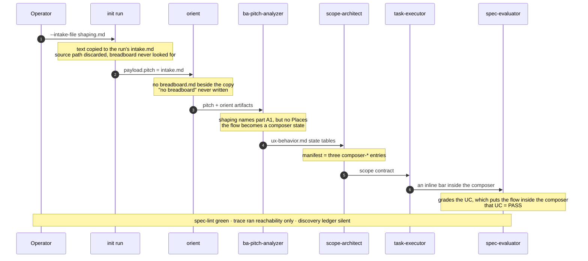
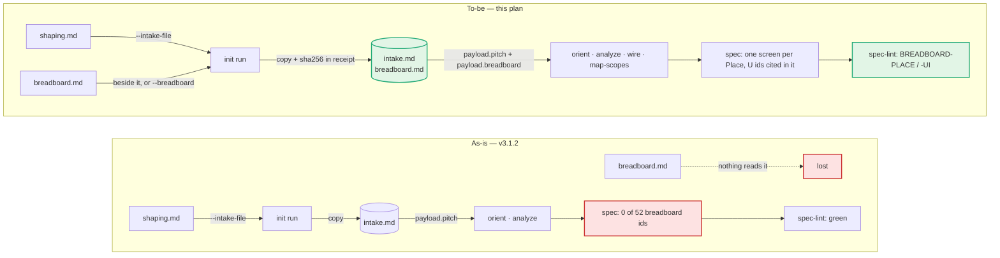

# The pitch is two files and the run reads one

**Question:** What changes, in what order, make the breadboard reach every planning worker and turn
its loss into a red check — shippable as 3.2.0?
**Scope:** `harness init run`, `probe resume`, the run workflow's four planning dispatches, the
WorkOrder payload registry, the orient / ba-pitch-analyzer / solution-architect / scope-architect
craft, `verify spec`, and the L0 / L1a / L1b gate docs. Excludes the judge, the build loop, and
`/shapeup` itself.
**Sources:** this repo @ `7822baf` (v3.1.2, 2026-09-10); one run in a private consumer project,
called the case study here (plugin 3.1.0, 2026-09-09→10) —
its receipt, all 25 orders, orient output, spec, scopes, trace report and REPORT; baseline
`npm test` (1264 checks in a clean clone) and `claude plugin validate . --strict`, both run 2026-09-11.
**Confidence:** High on the mechanism — every link was read in code and confirmed in the run's own
orders. Medium on the lint's false-positive rate: breadboards follow two table layouts and there is
one real sample. Low on the translated-intake finding (Stage 6), which is read from code, not
observed in a run.
**Status:** Recommended. Staged for the plan-executor skill; nothing implemented.

---

## 0. The finding in one paragraph

`/shapeup` writes a pitch as two files — `shaping.md` (problem, requirements, parts) and
`breadboard.md` (Places, affordances, slices) — and this plugin's own `AGENTS.md` says the completed
pitch is both. `harness init run` takes one. It copies `--intake-file` to
`.shapeup/<slug>/intake.md` and discards the path it came from (`kernel/init/run.mjs:399-403`,
`:543`); every planning order points at that copy (`skills/tech-lead/workflows/shapeup-run.js:975`,
`:1018`); and no line in the kernel, the hooks or the workflow has ever read a breadboard — git
history holds two mentions, a comment and a field description. **The pitch is two files and the run
reads one.** That is not a missing nicety. It is the mechanism by which the case study shipped P2 —
a new blocking sheet in its breadboard — as a bar inside the composer: the one Place the feature added
was the one Place with no other carrier, and every downstream step was faithful to a spec that never
heard of it. 12,704 of the pitch's 39,618 bytes (32%) and all 52 of its breadboard IDs never reached
a worker, and nothing — not the 1,264 structural checks, not any run-time lint — looks. The fix makes
the breadboard a pinned run input like the intake, delivers it to the four planning workers, and adds
a lint that fails when a breadboard Place is missing from the spec or its UI affordances are
specified on the wrong screen — because **citing an affordance is not placing it.**

## 1. What is actually being asked

The decision is whether to accept this staged fix as 3.2.0 — a minor release: one new `init run`
flag, one new WorkOrder payload field, two new red spec-lint rules. The maintainer decides; the
system needs no introduction here, so this plan states only what the fix must respect.

**Hard constraints** (each is already enforced somewhere, and each shapes a stage):

| Constraint | Enforced by | Consequence for this plan |
|---|---|---|
| Zero dependencies, `node:` builtins only, no network | CLAUDE.md | The breadboard parser is a small hand-written table reader |
| Single judge — the verdict belongs to spec-evaluator | AGENTS.md invariants | The judge gets nothing new; the spec gets fixed instead (§5) |
| `skills/tech-lead/SKILL.md` ≤ 155 lines | `tests/structural/08-docs.mjs:83` (§25) | It is at **154**. The new flag goes on an existing line |
| Cited paths under `docs/` must exist | `tests/structural/08-docs.mjs:94-200` (§26) | This plan names not-yet-written files only as `<placeholder>` paths |
| A full lint over a no-breadboard fixture has no red | `tests/structural/34-scope-anchor.mjs:137` | The new rules are silent when no breadboard exists |
| A new payload field is declared in schema + registry + the worker's SKILL.md | `05-tech-lead.mjs` §24, `tests/structural/50-payload-contract-parity.mjs:56` (§50) | Three edits per field, four workers |
| Version parity across `package.json` and `.claude-plugin/plugin.json` | release CI | Stage 5 bumps both |

**How the design choices below are judged**, weights set before scoring:

| Criterion | Weight | Why this weight |
|---|---|---|
| Regression-proof — a spec shaped like the case study goes red | 0.35 | The defect is *silent* loss. A fix that adds no failing check reproduces the silence |
| Non-regression — no breadboard ⇒ identical behaviour | 0.25 | Every open run, the `--tiny` lane, and every pre-spine spec must be untouched |
| Invariants in the runtime, not in worker prose | 0.20 | Orient's prose rule for exactly this case existed and failed without a trace |
| Smallest reviewable diff per stage | 0.20 | plan-executor verifies each stage alone, in a fresh clone |

## 2. The as-built, against what the docs promise

Every row is a place where a shipped document describes a breadboard flow that the code does not
have. The delta *is* the defect.

| What is promised | Where | What the code does |
|---|---|---|
| "The completed pitch is formed by `shaping.md` + `breadboard.md`" | `AGENTS.md`, Phase 1 | `init run` accepts one intake (`kernel/init/run.mjs:318-329`) |
| "`/ba-pitch-analyzer` and `/tech-lead` consume it as-is — affordance IDs (U[N], N[N]) are the traceability anchors" | `skills/shapeup/resources/breadboarding.md:360`; `skills/shapeup/SKILL.md:403` | No reader anywhere in `kernel/`, `hooks/`, `bin/`, or the workflow |
| GATE L0.1 collects "path to a shaping.md / pitch.md" | `skills/tech-lead/references/gates.md:34` | One path — the documented usage is what triggers the loss |
| Orient reads "`--pitch` (+ sibling `breadboard.md` if present)" | `skills/orient/SKILL.md:260` | `pitch` is the copy in `.shapeup/<slug>/`, which has no sibling (`kernel/probe/resume.mjs:380`) |
| Orient records "no breadboard" when absent | `skills/orient/SKILL.md:107` | Unenforced: orient completion is four filenames (`kernel/probe/resume.mjs:271-278`). The run's 4 orient files never mention it |
| The planner derives screens "from the pitch breadboarding" | `skills/ba-pitch-analyzer/references/ux-behavior-patterns.md:9` | The planner's payload has no breadboard (`domain.schema.json:302` registry) |
| Shaping artifacts live under `shapeup/<slug>/shaping/` | `kernel/lib/paths.mjs:94-95`; `skills/shapeup/SKILL.md` | `shapingDir` is imported nowhere |
| `surprise_count` measures "scope-drift-from-breadboard" | `skills/tech-lead/references/protocol.md:836` | It counts discovery-ledger rows (`:825`); a Place dropped during analysis writes none |
| `slice_count` comes "from breadboard B5" | `protocol.md:829`, `gates.md:417` | Hand-copied; `kernel/probe/stats.mjs:93` divides by it |
| The translator's `<name>.en.md` is the ORIENT input | `gates.md:36-40`, `protocol.md:321` | **Inference:** no `.en.md` reader in the workflow lane; `RunArgs` has no intake field (`domain.schema.json:2530`) |

This was never implemented, not lost: `git log -S breadboard` over `kernel/`, the workflow, the
schemas, `bin/` and `hooks/` returns two commits — `4b8b353` adds the `shapingDir` comment and
`8e49150` adds the `slice_count` description. No commit ever added a reader.

**The hand-off, as it ran** — the case study, step by step:



Step 2 is the root cause. Steps 3–7 are each *correct* given their input — the orient rule, the
planner's craft, the scope manifest's "an element the manifest lacks is a spec gap → ESCALATE"
(`domain.schema.json:693-714`), the judge's "grade the committed UC" (`skills/spec-evaluator/SKILL.md:70-73`).
No step after 2 can recover what 2 dropped, which is why the fix starts in the kernel.

## 3. The central finding — citing is not placing

The obvious lint is "fail when a breadboard ID is not cited in the spec". It would have fired on
the case study, because the spec cites no breadboard ID at all. It would not have fired on the *next*
one like it. Look at what the spec actually contains:

- P2, a new blocking sheet, owns three UI affordances: U2, U3 and U4.
- All three **are in the spec** — in one state row of the composer's state table in `ux-behavior.md` —
  and in the scope manifest as `composer-*` entries.
- They are under the composer (P1), not in a sheet.

The run did not lose P2's affordances. It lost **where they live** — the Place. And a Place is
precisely the information only a breadboard carries: an *existing* screen is recoverable from code
(orient scans it), a *new* one is not. In the case study, P2 is the only new Place, and the only Place
with no carrier other than the breadboard — P2's name appears 0 times in `shaping.md` and
in 0 spec or scope files. A planner handed the breadboard and told to cite IDs can still write
"U2, U3, U4" under `## Screen: Composer` and pass a presence check. So the lint must check
**placement**: each Place that owns UI affordances has its own screen section tagged with its id, and
each UI affordance is cited inside the section of a Place the breadboard puts it in. It checks which
screen, never where on the screen — layout inside a Place stays the designer's.

The design choices, scored against §1's criteria:

| Choice | Options | Pick | Deciding criterion |
|---|---|---|---|
| Who records whether a breadboard exists | orient writes a line in `code-surface.md` · the kernel records it in the receipt and stages a copy | **Kernel** | Runtime invariant (0.20): orient's rule existed (`:107`) and 4 of 4 orient files ignored it; the kernel knows at t=0 |
| How the breadboard is found | `shapingDir` only · a chain from the intake's own folder outward | **Chain** | Regression-proof (0.35): the only consumer that hit this keeps `shapeup/<slug>/breadboard.md` flat; `shapingDir`-only passes every test here and misses it |
| What the lint checks | ID presence · Place placement | **Placement** | Regression-proof (0.35): presence passes U2–U4 under P1 |
| Where the lint runs | `verify trace` (advisory) · `verify spec` (hard stop at L1b, and the planner's own self-check at ANALYZE) | **`verify spec`** | Regression-proof: trace runs without `--gate` and never blocks (`shapeup-run.js:1172`); spec-lint aborts at L1b (`:1166-1170`) and the planner fixes its reds before returning (`skills/ba-pitch-analyzer/SKILL.md:70-72`) |
| Severity | all red · split | **Red** for Places and UI affordances; **warn** for code affordances, stores and slices | Non-regression (0.25): N#/S# are often backend and out of shape; a hard stop on them would be noise |

## 4. Argued from the numbers

**What the case-study run lost** (2026-09-09→10):

| Measure | Value | Source |
|---|---|---|
| Pitch bytes that reached any worker | 26,914 of 39,618 (68%) | `shaping.md` vs `shaping.md` + `breadboard.md` |
| Breadboard IDs defined / cited in spec + scopes | 52 (P5, U14, N20, S8, V5) / **0** | first-cell table IDs; grep over `spec/` and `scopes/` |
| Shaping IDs cited, for contrast | R# in 14 files, A# in 16, G# in 11 | same grep |
| Orders dispatched / carrying the breadboard | 25 / **0** — four should (orient, analyze, wire, map-scopes) | `.shapeup/<slug>/orders/*.json` |
| P2's UI affordances present in the spec | 3 of 3 — all under P1 | `spec/ux-behavior.md:49-50` |
| Places with no carrier but the breadboard | 1 — P2, the only new Place | name grep, `shaping.md` + spec + scopes |
| EVAL rounds graded against the incomplete spec | 2 — REPORT verdict FAIL on other criteria; the affected UC PASSed | `REPORT.md` |
| `intake.md` = `shaping.md` | byte-identical; the sha256 matches the receipt's | `shasum -a 256` |

**What each lint design reports:**

| Spec | Presence rule | Placement rule (this plan) |
|---|---|---|
| The case study as shipped — no breadboard ID cited anywhere | red: 19 IDs uncited (P1–P5, U1–U14) | red: 4 Places with no screen section (P1–P4; P5 owns no UI affordance), 14 UI affordances uncited |
| A planner that cites IDs but repeats the Place error — U2–U4 under `## Screen: Composer (P1)`, P2 named in a sentence | **green** | red: P2 has no screen; U2, U3, U4 are cited only under P1 |

**Inference:** the second row is constructed, not observed. It is the exact fixture Stage 4's test
builds, and it is the case a presence-only fix would ship.

**The baseline this plan is verified against** (2026-09-11 @ `7822baf`): `npm test` ✅ 1264 checks in a clean clone (1265 in the working tree, which carried uncommitted docs — §26 adds one check per path cited under `docs/`, so committing this plan adds about 20 more; the section count is 90 either way, which is why the acceptance rows count sections);
`claude plugin validate . --strict` ✔; `skills/tech-lead/SKILL.md` 154/155 lines.

**Cost**, in focused engineering hours (**estimate** — not measured; plan-executor spends one
implement and one fresh-clone verify leg per stage, more on red):

| Stage | What | Estimate |
|---|---|---|
| 0 | Baseline | 0 |
| 1 | Pin the breadboard at `init run` | ~4 h |
| 2 | Deliver it to four workers | ~2 h |
| 3 | Planner craft: screens are Places | ~3 h |
| 4 | Placement lint | ~4 h |
| 5 | Gates, docs, release 3.2.0 | ~2 h |
| 6 *(optional)* | Translated pitch reaches the run | ~1 h |
| | **Total** | **~15 h core, ~16 h with Stage 6** |

## 5. What deliberately not to do

**Do not hand the breadboard to spec-evaluator.** It is the obvious move — the judge graded against
a spec missing a Place, so give the judge the Place. But the judge grades the committed spec and
nothing else (`skills/spec-evaluator/SKILL.md:70-73`), and that is the single-judge invariant, not
an oversight. A judge with two sources adjudicates disagreements between them, which makes it a
second planner with a verdict. Fix the spec; the judge follows it.

**Do not slice scopes by breadboard slice.** V1–V5 look like the vertical slices scope-architect is
supposed to produce, and the case study's 8 scopes against 5 slices looks like drift. It is not. Scopes
are cut by import graph so that substrates are disjoint — that disjointness is the concurrency
ceiling in `AGENTS.md` — and V1 alone spans U1–U8, N1–N5 and S1–S5 across three Places. Forcing one
scope per slice makes scopes share entry points and serializes the build. Record which scopes
deliver each slice (a warning when one is missing), never the cut itself.

**Do not make orient's completion depend on writing "no breadboard".** Orient's own rule (`:107`) is
the one that failed, so enforcing it looks like the direct fix. But `hasOrientArtifacts` is the
fast-forward predicate (`kernel/probe/resume.mjs:271-278`, `:319`); a content check there
re-dispatches orient on every existing run at its next relaunch. And it would still be a worker
self-reporting a fact the kernel holds at t=0. Record it in the receipt and show it at L1a.

**Do not read only `shapingDir`.** It is the documented location and the builder already exists,
so a one-line fix that reads it looks complete and passes a fixture built to the documented layout.
The only consumer that hit this keeps its pitch flat in `shapeup/<slug>/`. Resolve from the
intake's own folder first, then the documented locations.

## 6. Recommendation

Six stages, sequenced so that each one's acceptance can only pass on the previous stage's work.
Stages 1–5 are required; Stage 6 is optional because its premise is inferred. Each stage lists its
changes (to copy verbatim into the execution contract), an **Exit** line, and **Acceptance**
commands, run from a fresh clone.

**Until 3.2.0 ships**, a run can be protected by hand: join `shaping.md` + `breadboard.md` (drop
the breadboard's frontmatter, keep the shaping one first) and pass the result as `--intake-file`.
Orient and the planner both read `pitch`, so the breadboard reaches both.

### Guardrails for execution

Copy these and every §5 entry into the contract's Guardrails.

- **Order is load-bearing:** 1 → 2 → 3 → 4 → 5; Stage 6 depends on Stage 1 only. Stage 4 before
  Stage 3 ships a hard L1b stop whose fix — a Place-tagged screen heading — no shipped instruction
  teaches yet.
- Do not raise the §25 ratchet on `skills/tech-lead/SKILL.md` (155, currently 154). The flag goes on
  the existing optional-flags line.
- Never make `AffordanceEntry.source` required — §21 validates a compiled order whose fixture
  affordance table has no such column.
- No `BREADBOARD-*` finding may fire when no breadboard is staged or embedded
  (`tests/structural/34-scope-anchor.mjs:137`).
- `skills/tech-lead/workflows/shapeup-run.js` carries no path literal (16-workflows (b)); the
  breadboard path comes from `rs.breadboard_path`.
- New path builders live only in `kernel/lib/paths.mjs`, under the LOCAL or SHARED root (§45).
- Every new function in `kernel/verify/spec.mjs` has a JSDoc block with `@param` and `@returns`
  (§33).
- Register every new test module in `MODULE_FILES` (`tests/structural.mjs:37-162`); an unlisted
  module never runs.
- Shipped files (`skills/**`, `commands/**`, `hooks/**`, `AGENTS.md`) never cite `tests/`, `docs/`,
  `tools/` or this plan; they speak in skills, commands and options.
- In `docs/**`, a file that does not exist yet is named only as a `<placeholder>` path — §26 fails
  on a cited path it cannot find.
- `node:` builtins only, no network; hooks fail open.
- Never edit or weaken an existing check to reach green. Never hand-edit `docs/assets/demo-gate.svg`.
- Commit subjects: `type(scope): lowercase declarative`.



### Stage 0 — Baseline · 0 h

No edits. Confirms the clone is green before anything is attributed to this plan.

**Exit:** the suite and plugin validation are green at the starting HEAD.

**Acceptance:**

```bash
npm test                          # exit 0; prints "structural tests passed (N checks)"; N = 1264 at 7822baf and moves with docs/
npm test 2>&1 | grep -c "^▸ "       # prints 90 at 7822baf — the section count, which docs/ does not move
claude plugin validate . --strict # exit 0; prints "Validation passed"
```

### Stage 1 — Pin the breadboard at `init run` · ~4 h

Make the breadboard a run input with the same standing as the intake: resolved once, copied
verbatim, hashed into the receipt, reported by `probe resume`.

1. `kernel/lib/paths.mjs` — add, next to `intake` (`:140`), exactly this line (Stage 1's mutation
   check targets it):
   ```js
   /** The breadboard the pitch was shaped with, verbatim, next to its digest in the receipt. */
   export const breadboard = (cwd, slug) => join(localRoot(cwd, slug), "breadboard.md");
   ```
2. New module `kernel/lib/breadboard.mjs` (`node:` builtins only, JSDoc on every export):
   - `parseBreadboard(text)` → `{ places: [{id, name}], ui: [{id, places}], code: [{id, places}],
     stores: [{id, places}], slices: [{id}] }`.
     - An ID is the first cell of a markdown table row matching
       `^(P\d+(?:\.\d+)*|[UNSV]\d+[a-z]?)$` after stripping `**` and backticks. The header's first
       cell may be `#` or `ID` — `skills/shapeup/resources/breadboarding.md` ships both layouts
       (`:128-161` and `:328-358`). Suffixes are real: the case study has `N1b`; the guide has `P2.1`.
     - A row's Places come from the column whose header is `Place` (case-insensitive): every
       `P\d+(?:\.\d+)*` token in the cell (`P1 / P3`, `P2/P1`). A table with no Place column yields
       `places: []`.
     - Places also come from a prose `## Places` section: lines starting `P<n>` followed by `:`, `—`,
       `–` or `-` (the template's `[P1..PN with one-line descriptions]`).
   - `hasBreadboardTables(text)` → true when `parseBreadboard` finds at least one P and one U.
   - `idCounts(parsed)` → `{ P, U, N, S, V }`.
3. `kernel/init/run.mjs`:
   - `ARGV_SPEC` (`:318-347`): add `breadboard: { type: "path" }`, and `[--breadboard <path>]` to
     `usage` and to the header comment's flag list (`:50-59`).
   - Export `resolveBreadboard({ cwd, slug, intakeFile, flag, intake })`, returning
     `{ source, path, text }` or `null`. First hit wins:
     1. `flag` — `--breadboard`, resolved against `cwd`; missing → `fail(2, "--breadboard not found: <p>")`.
     2. `sibling` — `breadboard.md` in the folder of `--intake-file` (skipped for `--intake-text` and stdin).
     3. `shaping-dir` — `shapingDir(cwd, slug)/breadboard.md`.
     4. `shared-root` — `sharedRoot(cwd, slug)/breadboard.md`.
     5. `embedded` — the intake itself, when `hasBreadboardTables(intake)`; nothing is staged.
     6. none — `null`.
     A candidate that is the intake file itself is skipped.
   - When resolved from a file, write it verbatim to `breadboard(cwd, slug)`, beside `intake.md`
     (`:543`). Under `--force`, remove a staged breadboard left by the forced-over run *before*
     resolving, so a re-open without one does not inherit it.
   - `buildReceipt` (`:136-170`) gains `intake_source` (the repo-relative `--intake-file` path, or
     `"text"` / `"stdin"`) and `breadboard`: `null`, or `{ source, path, sha256, chars, ids }` with
     `path` repo-relative (null when embedded) and `ids` from `idCounts`. `RECEIPT_VERSION` stays 1 —
     the change is additive and tests assert individual keys, not the key set; `mintRunId`'s inputs
     do not change.
   - The stdout JSON adds `breadboard` (the staged path via `globLocal(slug, "breadboard.md")`, or
     null) and `breadboard_source`.
4. `kernel/probe/resume.mjs` `deriveResumeState` (`:362`): add `breadboard_path` (`breadboard(cwd, slug)`
   when that file exists, else null) and `breadboard_source` (`receipt.breadboard?.source ?? null`;
   an unreadable receipt gives null).
5. `skills/tech-lead/schemas/domain.schema.json` `$defs/ResumeState` (`:2359`): add both as nullable
   strings. `skills/tech-lead/workflows/shapeup-run.js` `RESUME` (`:399-410`, inside the SCHEMA
   REGION markers): add `breadboard_path: nullable("string"), breadboard_source: nullable("string")`
   — 18-resume-state §52(m) requires every `RESUME` property in `ResumeState` with a matching type.
6. Tests — a new section module under `tests/structural/`, registered in `MODULE_FILES`, with a
   section title containing the word "breadboard". Temp-dir fixtures written inline, spawning
   `kernel/harness.mjs init run` (the `10-run-receipt.mjs` pattern):
   - (a) The case study's layout — `shapeup/demo/shaping.md` and `shapeup/demo/breadboard.md` side by
     side: `receipt.breadboard.source === "sibling"`, its `sha256` equals the fixture's, its `ids`
     equal the fixture's counts, and the staged file at the **literal** path
     `<tmp>/.shapeup/demo/breadboard.md` is byte-identical. Compute that path literally, not through
     the builder, so a moved builder turns the test red.
   - (b) The `shaping/` layout gives `"sibling"`. An intake outside the tree plus
     `shapeup/demo/shaping/breadboard.md` gives `"shaping-dir"`.
   - (c) `--breadboard` beats a sibling; `--breadboard <missing>` exits 2.
   - (d) `--intake-text` with no breadboard anywhere: `receipt.breadboard === null`,
     `intake_source === "text"`, no staged file.
   - (e) An intake embedding a Places table and a UI table, and no file: `"embedded"`, no staged file.
   - (f) `parseBreadboard` reads both layouts (`#` and `ID` first column; prose Places; a code table
     with no Place column) to the same counts.
   - (g) `probe resume --slug demo` prints `breadboard_path` and `breadboard_source` consistent with
     (a) and (d).

**Exit:** a run opened from a `shaping.md` with a `breadboard.md` beside it stages a byte-identical
copy, records its sha256 and ID counts in the receipt, and `probe resume` reports it; a run with no
breadboard behaves exactly as before.

**Acceptance:**

```bash
npm test   # exit 0; prints "structural tests passed"
# Count sections, not checks: §26 adds a check per path cited under docs/ (this plan alone adds about
# 20), while the section count stays at 90. The suite's own floor is 1000+ (docs/design/06-appendix.md:38,
# asserted at tests/structural.mjs:175-178) — too low to notice one module quietly not running.
npm test 2>&1 | grep -c "^▸ " | node -e "process.exit(+require('fs').readFileSync(0,'utf8')>=91?0:1)"   # exit 0: 90 + this stage's section
npm test 2>&1 | grep -iE "^▸ .*breadboard"   # exit 0: the new section ran
# The guard must bite: move the staged copy and the suite must go red.
node -e "const fs=require('fs'),f='kernel/lib/paths.mjs',s=fs.readFileSync(f,'utf8'),t=s.replace('localRoot(cwd, slug), \"breadboard.md\")','localRoot(cwd, slug), \"moved.md\")');if(t===s)process.exit(3);fs.writeFileSync(f,t)" && ! npm test >/dev/null 2>&1   # exit 0
```

### Stage 2 — Deliver it to the four planning workers · ~2 h

1. `domain.schema.json` `$defs/WorkOrderPayload.properties` (`:2185`, beside `pitch` at `:2247`):
   ```json
   "breadboard": {
     "type": "string",
     "description": "orient / ba-pitch-analyzer (analyze) / solution-architect / scope-architect: the run's staged breadboard — Places (P#), UI and code affordances (U#, N#), stores (S#), slices (V#). Absent = the pitch has no separate breadboard (it may carry one inline); never inferred from the pitch's folder."
   }
   ```
   Add `"breadboard"` to `x-payload-by-worker` (`:302`) for `orient`, `ba-pitch-analyzer`,
   `solution-architect` and `scope-architect`.
2. `shapeup-run.js`: add `breadboard: rs.breadboard_path` to the payload object literal of the four
   dispatches — orient `:975`, analyze `:1018`, wire `:1050`, map-scopes `:1081`. `compact()`
   (`:682`) drops it when null, so a run without a breadboard compiles the same orders as today.
3. Worker contracts. §50 matches the literal `payload.breadboard` in each SKILL.md:
   - `skills/orient/SKILL.md`: add `payload.breadboard` to the input prose (`:44-47`). Replace the
     sibling rule at `:107` and `:260` with: "read `payload.breadboard` when present; absent means the
     pitch has no separate breadboard — look for Places and affordance tables in the pitch itself".
     `code-surface.md` rows (`:138-140`) carry the P#, U# or N# of the element they locate.
   - `skills/ba-pitch-analyzer/SKILL.md`: new row after `:28` — `payload.breadboard` | "The breadboard
     (analyze): its Places are your screens; its U# and N# are the affordances you place and cite.
     Absent = none separate; never inferred".
   - `skills/solution-architect/SKILL.md`: new row after `:44` — `payload.breadboard` | "When present,
     name each UC's `affordance` by its U# and Place".
   - `skills/scope-architect/SKILL.md`: new row after `:23` — `payload.breadboard` | "When present,
     every U# the spec places is one manifest entry's `source`; record which scopes deliver each V#
     slice in `scope-summary.md`".
4. Hand-compiled lane: the payload examples at `gates.md:215` and `protocol.md:343` add
   `"breadboard": "<the path init run printed, when it printed one>"`.
5. The producer side, which nothing checks today (§50's own banner says so,
   `tests/structural/05-tech-lead.mjs:1066-1068`). In the Stage 1 module, or in 16-workflows:
   - Assert that the payload object of each of the four
     `worker({ skill: "<name>", operation: "<op>", …` calls contains `breadboard: rs.breadboard_path`.
   - In a temp project, compile an analyze order with
     `--payload '{"pitch":"x","breadboard":".shapeup/demo/breadboard.md"}'` and validate it against
     `work-order.schema.json`, with `payload.breadboard` present on the written order.

**Exit:** every orient, analyze, wire and map-scopes order compiled for a run with a staged
breadboard carries `payload.breadboard`, and each of those four workers' contracts names the field.

**Acceptance:**

```bash
npm test   # exit 0; prints "structural tests passed"
grep -c "breadboard: rs.breadboard_path" skills/tech-lead/workflows/shapeup-run.js   # exit 0; prints 4
node -e "const s=require('./skills/tech-lead/schemas/domain.schema.json'),r=s['x-payload-by-worker'];process.exit(s.\$defs.WorkOrderPayload.properties.breadboard&&['orient','ba-pitch-analyzer','solution-architect','scope-architect'].every(w=>r[w].includes('breadboard'))?0:1)"
grep -n 'sibling `breadboard.md`' skills/orient/SKILL.md   # exit 1: the sibling rule is gone
# The producer check must bite: drop the field from the analyze dispatch and the suite must go red.
node -e "const fs=require('fs'),f='skills/tech-lead/workflows/shapeup-run.js',s=fs.readFileSync(f,'utf8'),i=s.indexOf('skill: \"ba-pitch-analyzer\", operation: \"analyze\"'),k='breadboard: rs.breadboard_path',j=s.indexOf(k,i);if(i<0||j<0)process.exit(3);fs.writeFileSync(f,s.slice(0,j)+'bb_dropped: null'+s.slice(j+k.length))" && ! npm test >/dev/null 2>&1   # exit 0
```

### Stage 3 — The planner places what the breadboard names · ~3 h

This stage is prose, so its real proof is behavioural (the soak, after the plan). Stage 4's lint is
what makes it non-optional.

1. `skills/ba-pitch-analyzer/SKILL.md` INGEST (`:46-47`): "pitch + breadboard (`payload.breadboard`,
   or tables inline in the pitch) + orient artifacts + KB. With a breadboard, list every Place (P#)
   and UI affordance (U#) first — they are the screens and interactive elements Phase 3 must place."
   UX line (`:55-56`): "per screen — with a breadboard, one screen per Place that owns UI affordances".
2. `skills/ba-pitch-analyzer/references/ux-behavior-patterns.md`, "Deriving Screens From Pitch"
   (`:7-16`). Keep the four-step derivation for a pitch with no breadboard, and add this verbatim:
   > **With a breadboard, the screens are its Places.** Write one `## Screen:` section per Place that
   > owns at least one UI affordance, with the Place id in the heading — `## Screen: Payment Sheet (P2)`.
   > Cite each UI affordance's id (`U3`) in the state-table row or behavior rule that specifies it,
   > inside the section of the Place the breadboard puts it in. A Place is a screen boundary: a sheet or
   > modal the breadboard names as its own Place is never folded into its parent's state table, even
   > when the pitch's prose describes it as part of the parent. A Place with no UI affordances (a
   > backend, a store) needs no screen. A Place this shape will not build goes in `## Deferred Places`
   > with the reason; it surfaces at GATE L1b, where the PO accepts or rejects the deferral.
3. `skills/ba-pitch-analyzer/assets/templates/ux-behavior.tmpl.md`:
   - The heading becomes `## Screen: [ScreenName] ([P#] — omit without a breadboard)` (`:32`).
   - The repeat note (`:57`) becomes "one per breadboard Place with UI affordances".
   - Append a `## Deferred Places` section holding a two-column table, `Place` and `Reason`.
4. `skills/ba-pitch-analyzer/references/doc-schemas.md` (`:108-128`): the ux-behavior required
   sections gain "screen headings carry the breadboard Place id when a breadboard exists" and
   "Deferred Places, when any".
5. `skills/ba-pitch-analyzer/assets/templates/_index.tmpl.md` Breadboarding (`:29-37`): with a
   breadboard, the flow names Places and affordances by id — `P1 Cart ──U1──► P2 Payment Sheet`.
6. `domain.schema.json` `$defs/AffordanceEntry` (`:693`): add an optional `source` string — "the
   breadboard UI affordance (U#) this element implements; absent without a breadboard". Not
   `required`; no `pattern` (a malformed id must not make compile refuse a build order).
7. `skills/scope-architect/SKILL.md` affordance_manifest (`:63-67`): "+ `source` — the U# the
   ux-behavior row cites". Checklist (`:136`): "every U# the spec places is some manifest entry's
   `source`". The table parser already keeps unknown columns (`kernel/lib/contract.mjs:331-355`);
   add one explicit round-trip case with a `source` column to the contract-md tests (46 §46).
8. `skills/solution-architect/SKILL.md` `affordance` (`:71-72`): "with a breadboard, name it by U# and
   Place — `U1 Pay (P1) → P2 Payment Sheet`".

**Exit:** the planner's shipped instructions make each breadboard Place with UI affordances its own
screen section tagged with its id, put U# citations in the section of their Place, and let a scope
contract carry each element's U#.

**Acceptance:**

```bash
npm test   # exit 0; prints "structural tests passed"
grep -q "## Deferred Places" skills/ba-pitch-analyzer/assets/templates/ux-behavior.tmpl.md   # exit 0
grep -qE "^## Screen: .*\(\[P#\]" skills/ba-pitch-analyzer/assets/templates/ux-behavior.tmpl.md   # exit 0
grep -q "the screens are its Places" skills/ba-pitch-analyzer/references/ux-behavior-patterns.md   # exit 0
node -e "const d=require('./skills/tech-lead/schemas/domain.schema.json').\$defs.AffordanceEntry;process.exit(d.properties.source&&!(d.required||[]).includes('source')?0:1)"   # exit 0
```

### Stage 4 — Fail the spec that drops or misplaces a Place · ~4 h

1. `kernel/verify/spec.mjs`: export `lintBreadboard({ uxText, specText, scopes, scopeSummaryText, bbText })`
   with a JSDoc block (§33). `lint()` (`:504-528`) calls it after `lintStructure`. `bbText` is the
   staged `breadboard(cwd, slug)` when present, otherwise the intake when
   `hasBreadboardTables(intake)`, otherwise the rule set is skipped entirely — zero findings, the same
   "absent artifact ⇒ arm skipped" precedent as INV-FLOOR and SCOPE-COVERS (`:512-515`).
2. Four rules, emitted in the file's existing shape — `findings.push({ rule: "…", level: "…", detail })`,
   with `rule` and `level` written as adjacent literals (Stage 4's mutation check targets
   `rule: "BREADBOARD-PLACE", level: "red"`):
   - `BREADBOARD-PLACE` **red** — a Place that owns at least one UI affordance has no ux-behavior.md
     heading `## Screen: … (P#)` naming its id (a heading may carry several: `(P1, P3)`), and is not a
     first-cell row of `## Deferred Places`. The detail names the Place id and name.
   - `BREADBOARD-UI` **red** — a UI affordance whose Places are not all deferred is not cited
     (`\bU<n>[a-z]?\b`) inside the section of any one of its Places. The detail says where it is cited
     instead, if anywhere: "U2 (P2 Payment Sheet) is cited only under P1".
   - `BREADBOARD-TRACE` **warn**, one finding aggregating three lists: N#/S# cited nowhere in the spec
     tree; V# absent from `scope-summary.md` (when it exists); U# placed in the spec but in no scope
     manifest entry's `source` (when scope contracts exist).
   - `BREADBOARD-UNPARSED` **warn** — a staged breadboard yields zero IDs. A format this parser cannot
     read must not become a hard stop.
3. `shapeup-run.js:1170`: the L1b abort reason stops claiming every spec-lint red is "a disjointness
   or size problem" — say "spec-lint reported red findings" and pass the detail through. No test pins
   the old text.
4. `gates.md` spec-lint rule list (`:278-283`) and the planner's self-check
   (`skills/ba-pitch-analyzer/SKILL.md:70-72`): name the two red rules and their fix — "add the screen
   or defer the Place; never fold it into another screen". scope-architect's self-check needs no
   change: these are not its reds to fix.
5. Tests — a second new section module (title containing "breadboard"), modelled on
   `tests/structural/32-spec-invariant-floor.mjs`: call `lintBreadboard` directly, and run the
   `kernel/harness.mjs verify spec` CLI end to end at least once.
   - (a) **the case study in miniature:** P1 Composer (U1), P2 Sheet "new blocking modal" (U2, U3), P3
     Backend (N1 only). A ux-behavior.md with only `## Screen: Composer (P1)` citing U1 U2 U3 must
     exit 1, with BREADBOARD-PLACE naming P2 and BREADBOARD-UI naming U2 and U3, and no finding about
     P3.
   - (b) Adding `## Screen: Sheet (P2)` citing U2 U3 leaves no red BREADBOARD-* finding.
   - (c) P2 listed in `## Deferred Places` leaves no red finding.
   - (d) No staged breadboard and a plain intake: zero BREADBOARD-* findings.
   - (e) A breadboard inline in the intake: the rules fire from it.
   - (f) The "Output File" layout (`ID` column, prose Places, a code table with no Place column)
     parses and lints.
   - (g) A breadboard with no IDs: only BREADBOARD-UNPARSED.

**Exit:** `verify spec` exits 1 on a spec that folds a breadboard Place into another screen or leaves
it out, exits 0 once the Place has its own screen or is deferred, and emits no BREADBOARD finding when
there is no breadboard.

**Acceptance:**

```bash
npm test   # exit 0; prints "structural tests passed"
npm test 2>&1 | grep -ciE "^▸ .*breadboard"   # exit 0; prints 2 or more (Stage 1's section and this one)
npm test 2>&1 | grep -c "^▸ " | node -e "process.exit(+require('fs').readFileSync(0,'utf8')>=92?0:1)"   # exit 0: no section lost, two added
# Each red rule must be load-bearing: demote it and the suite must go red.
node -e "const fs=require('fs'),f='kernel/verify/spec.mjs',s=fs.readFileSync(f,'utf8'),t=s.split('rule: \"BREADBOARD-PLACE\", level: \"red\"').join('rule: \"BREADBOARD-PLACE\", level: \"warn\"');if(t===s)process.exit(3);fs.writeFileSync(f,t)" && ! npm test >/dev/null 2>&1   # exit 0
node -e "const fs=require('fs'),f='kernel/verify/spec.mjs',s=fs.readFileSync(f,'utf8'),t=s.split('rule: \"BREADBOARD-UI\", level: \"red\"').join('rule: \"BREADBOARD-UI\", level: \"warn\"');if(t===s)process.exit(3);fs.writeFileSync(f,t)" && ! npm test >/dev/null 2>&1   # exit 0
```

### Stage 5 — Show it at the gates, document it, release 3.2.0 · ~2 h

1. `shapeup-run.js`: add `breadboard: rs.breadboard_source ?? "none"` to the L1a `crossGate` context
   (`:1001-1002`). `gateBlock` prints every key (`:769-771`), so a paused L1a block shows it.
2. `gates.md`:
   - L0.1 (`:34`): "Kicked-off pitch source: `shaping.md` — and its `breadboard.md`, which the run finds
     beside it (or in `shaping/`) or takes from `--breadboard`; a `pitch.md` may carry the breadboard
     inline."
   - L1a (`:168-171`): print `Breadboard: <source> | none`.
   - L1b (`:261` onward): print the Deferred Places from ux-behavior.md — each one needs the PO's yes.
3. `skills/tech-lead/SKILL.md:26`: add `[--breadboard <path>]` to the existing optional-flags line. The
   file is at 154 of the 155-line ratchet: add no line, and do not raise the ratchet.
4. `commands/ship.md`: document `--breadboard <path>` in the flags list, in its `` - `--flag <value>` ``
   form. In the same commit, add `breadboard` to `VALUED_FLAGS` in `hooks/gate-intake.mjs:76`; §39
   fails on either one without the other.
5. `AGENTS.md` Phase 1: extend "(The completed pitch is formed by `shaping.md` + `breadboard.md`)" to
   say how the run takes both and that an unbuilt Place is deferred at L1b. Skills, commands and
   options only — no kernel paths.
6. `protocol.md:829` and `gates.md:417`: harvest `slice_count` from the receipt's breadboard V count
   instead of copying it by hand.
7. `docs/design/03-system-design.md:276` (what `init run` writes) and
   `docs/design/adr/0001-consumer-file-organization.md:88` (the LOCAL tier listing): add
   `breadboard.md`.
8. `CHANGELOG.md`: add `## [3.2.0] — <date> · The breadboard never reached the run`. Bump
   `package.json` and `.claude-plugin/plugin.json` together, in a release commit with the subject
   `chore(release): 3.2.0`.

**Exit:** `npm test` and both plugin validations are green at 3.2.0, the L1a block names the
breadboard, and `/ship` accepts `--breadboard`.

**Acceptance:**

```bash
npm test   # exit 0; §25 ratchet, §26 doc drift and §39 flag parity all run inside it
node -e "const a=require('./package.json').version,b=require('./.claude-plugin/plugin.json').version;process.exit(a===b&&a==='3.2.0'?0:1)"   # exit 0
claude plugin validate . --strict                                  # exit 0
claude plugin validate ./.claude-plugin/marketplace.json --strict  # exit 0
grep -q -- "--breadboard" skills/tech-lead/SKILL.md                 # exit 0
node -e "const s=require('fs').readFileSync('skills/tech-lead/workflows/shapeup-run.js','utf8'),i=s.indexOf('crossGate(\"L1a\"');process.exit(i>=0&&/breadboard/.test(s.slice(i,i+300))?0:1)"   # exit 0
git log --format=%s | grep -qx "chore(release): 3.2.0"              # exit 0
# §39 must bite: drop the flag from VALUED_FLAGS and the suite must go red.
node -e "const fs=require('fs'),f='hooks/gate-intake.mjs',s=fs.readFileSync(f,'utf8'),t=s.replace('|breadboard','');if(t===s)process.exit(3);fs.writeFileSync(f,t)" && ! npm test >/dev/null 2>&1   # exit 0
```

The last row assumes `breadboard` is appended to the alternation as `|breadboard`. If the executing
agent places it first, it must adjust the row's `replace` target, not delete the row.

### Stage 6 *(optional)* — The translated pitch reaches the run · ~1 h

**Depends on:** Stage 1. **Premise:** inferred, not observed. `gates.md:36-40` and
`protocol.md:319-322` route the translator's `<name>.en.md` to ORIENT, but no code reads it:
`RunArgs` has no intake field, and `intake_path` is always `intake.md`.

1. `skills/tech-lead/SKILL.md:46-50`: run the language gate before Step 1, over the pitch *and* its
   breadboard, then name the `.en.md` files in `init run`. Keep the same line count.
2. `resolveBreadboard`: when the intake is `<name>.en.md`, try `breadboard.en.md` before
   `breadboard.md`. Staging an untranslated breadboard beside a translated intake records
   `breadboard.translated: false` and warns on stderr.
3. `gates.md:36-40` and `protocol.md:319-322`: reword to match.
4. Test: with `shaping.en.md`, `breadboard.en.md` and `breadboard.md` side by side, the staged copy is
   `breadboard.en.md`.

**Exit:** a run opened from `shaping.en.md` stages `breadboard.en.md`.

**Acceptance:**

```bash
npm test   # exit 0; prints "structural tests passed"
```

### After the plan — by hand, not by plan-executor

- Run the **harness-maintenance-audit** skill. CLAUDE.md requires it after adding a field, a flag or
  a rule, and a change touching four worker contracts has a wider blast radius than its commits say.
- `npm run demo`, then inspect the SVG diff; never hand-edit it.
- **Soak** (CLAUDE.md, before tagging). Install 3.2.0 from the marketplace in the case study's consumer project,
  not with `--plugin-dir`, and open a run for the P2 fix under a new slug, with `shaping.md` and
  `breadboard.md` as the pitch. Check that:
  - `receipt.breadboard.source` is `"sibling"`;
  - the L1a block names the breadboard;
  - `ux-behavior.md` gives P2 its own `## Screen: … (P2)` section;
  - spec-lint is green at L1b.

  Then run a second feature without cleaning `.shapeup/` in between.

## 7. What would change this answer

- **If a UI table ever arrives without a Place column**, BREADBOARD-UI has nothing to check. Both
  shipped layouts give UI affordances a Place column (`breadboarding.md:128-161`, `:328-358`), so
  this is not expected. If it happens, it shows up as BREADBOARD-UNPARSED or BREADBOARD-UI reds in
  the soak. Demote BREADBOARD-UI to warn before touching BREADBOARD-PLACE.
- **If deferrals become routine** — more than one per feature at L1b — then "a Place with UI
  affordances is a screen" does not hold for this team's breadboards (toasts, inline popovers).
  Re-open the rule rather than defer around it.
- **If most pitches arrive as one `pitch.md`** with the breadboard inline (`README.md:192` calls the
  `/shape` output `pitch.md`), the sibling search is moot and the `embedded` path carries the fix.
  Check `receipt.breadboard.source` on the next three runs.
- **I did not run a non-English intake.** Stage 6's premise is read from code, which is why the stage
  is optional.
- **I have one real breadboard.** The parser's tolerance beyond the case study and the two layouts in
  `breadboarding.md` is unmeasured.
- **The fix does not depend on the planner obeying the new prose**, because the lint catches a folded
  Place either way. Whether the planner gets it right first time, or only on its ANALYZE self-check,
  changes the cost, not the outcome. The first measurement is the soak.

## Appendix A — Evidence

Plugin evidence is at `7822baf`, 2026-09-11. Consumer evidence is one run in a private
consumer project (the case study), plugin 3.1.0, 2026-09-09→10.

| # | Fact | Source |
|---|---|---|
| E1 | `--intake-file` is resolved, read, and its path dropped | `kernel/init/run.mjs:399-403` |
| E2 | The intake is written verbatim to `.shapeup/<slug>/intake.md` | `kernel/init/run.mjs:543` |
| E3 | The receipt records the intake's sha256, chars and lines, but no source path | `kernel/init/run.mjs:136-170` |
| E4 | `intake_path` is always the local copy | `kernel/probe/resume.mjs:380`, `kernel/lib/paths.mjs:140` |
| E5 | Orient and analyze payloads send `pitch: rs.intake_path`; wire sends `{feature, spec_folder, project_profile}`; map-scopes sends `{feature}` | `shapeup-run.js:975`, `:1018`, `:1050`, `:1081` |
| E6 | The caller payload is merged last into the order; `compact()` drops nulls | `kernel/compile.mjs:610-621`; `shapeup-run.js:682` |
| E7 | The payload registry gives none of the four workers a breadboard | `domain.schema.json:302` |
| E8 | The validator ignores undeclared payload keys; the rule against ad-hoc fields is prose | `kernel/verify/envelope.mjs:169-172`; `domain.schema.json:2186` |
| E9 | `shapingDir` is defined and imported nowhere | `kernel/lib/paths.mjs:94-95`; grep |
| E10 | No commit ever added a breadboard reader | `git log -S breadboard` → `4b8b353`, `8e49150` |
| E11 | Shipped docs promise downstream consumption by ID | `skills/shapeup/resources/breadboarding.md:360`; `skills/shapeup/SKILL.md:403`; `AGENTS.md` |
| E12 | Spec-lint is a hard stop at L1b and the planner's self-check; trace is advisory | `shapeup-run.js:1166-1172`; `skills/ba-pitch-analyzer/SKILL.md:70-72` |
| E13 | The scope-contract parser keeps unknown columns, so `source` round-trips | `kernel/lib/contract.mjs:331-355` |
| E14 | The judge's criteria are the committed UC, domain model, contracts and Done-when | `skills/spec-evaluator/SKILL.md:70-73` |
| E15 | Baseline: 1264 checks green in a clean clone (1285 in the working tree with this plan present), 90 sections in both; plugin validation passes; SKILL.md is at 154/155 | run 2026-09-11 |
| C1 | `intake.md` = `shaping.md` byte for byte; both hash to the receipt's `intake_sha256` | `shasum -a 256`; `receipt.json` |
| C2 | The breadboard is 12,704 B, 32% of the pitch | `ls -l` |
| C3 | 0 of 25 orders mention a breadboard; orient and analyze `pitch` = `intake.md` | `orders/*.json` |
| C4 | 0 breadboard mentions in orient output, the run log, the gate log or REPORT | grep |
| C5 | 52 breadboard IDs defined; 0 spec or scope files cite U/N/V/P | grep |
| C6 | `shaping.md` has 0 × sheet / modal / blocking / breadboard | grep |
| C7 | P2 is described as a new blocking modal; U2, U3 and U4 live in P2 | the breadboard's Places and UI tables |
| C8 | U2, U3 and U4 are specified inside one of the composer's states | the spec's `ux-behavior.md` |
| C9 | The scope manifest lists them as three `composer-*` entries | the scope contract's `## Affordances` table |
| C10 | Trace skipped covers-closure (no `requirements.md`) and ran reachability only | `trace/report.json` |
| C11 | REPORT: verdict FAIL, 2 rounds; the affected UC PASSed on a component inside the composer | `REPORT.md` |
| C12 | P2 has been in the breadboard since 2026-09-08; the run started 2026-09-09T08:22Z; the working tree matches HEAD | `git log`; `receipt.json` |

**Looked for and not found:**

- A breadboard reader in `kernel/`, `hooks/`, `bin/` or the workflow.
- An `.en.md` reader in the workflow lane.
- A `pitch_hash` producer, even though `skills/ba-pitch-analyzer/references/task-generation.md:531-536` matches on one.
- A convention in any downstream skill for citing shaping or breadboard IDs.
- A receipt `$def` in `domain.schema.json`.

## Appendix B — Glossary

| Term | Meaning here |
|---|---|
| Place (P#) | A distinct context in a breadboard — a screen, a sheet, a modal, a backend. A new Place is information only the breadboard carries |
| UI affordance (U#) | Something a user sees or does, owned by one or more Places |
| Code affordance (N#), store (S#) | Non-UI elements of the breadboard; warn-level in this plan |
| Slice (V#) | A demo-able vertical slice of the breadboard; mapped to scopes, never used to cut them |
| Staged copy | `.shapeup/<slug>/breadboard.md` — the breadboard as the run saw it, hashed into the receipt |
| Placement | A U# cited inside the screen section of a Place the breadboard puts it in |
| Deferred Place | A Place the shape will not build, listed in `ux-behavior.md` and accepted or rejected at L1b |
