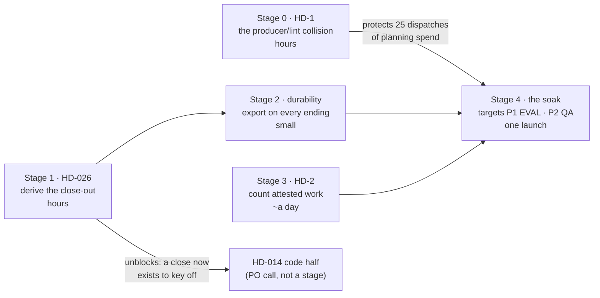

# 3.7 — five stages, and an acceptance contract that now has to test what nobody named

**Question:** What closes next, in an order where the cheapest stage protects the most expensive
one, and where each stage is accepted by evidence rather than by the executor's own report?
**Scope:** `HD-026` and `HD-014`'s code half from this repo's register; `HD-1` and `HD-2`, filed by
real runs into `proj-harmony-os-sample`'s register and **not yet promoted here**; and the three
Stage 9 propositions still unproven after four soak attempts. Excludes `HD-013` and `HD-021` (P3),
`HD-023`/`HD-024` (outside the plugin, doc half shipped in 3.6.0), and S4 of the architecture split
(NO-GO; none of its three triggers has fired).
**Sources:** enumerations read by grepping declared symbols at `865ec79`, never from prose;
`proj-harmony-os-sample` @ `6e4de89`, two launches of one pitch through 3.6.0 installed from the
marketplace, 2026-09-21→22; `docs/design/orchestration-evidence-and-next.md`.
**Confidence:** High that every Exit below is red today — each was executed. High on the
Stage 0 → Stage 4 ordering. Low on duration: one maintainer, wall-clock is the constraint.
**Status:** **Stages 0–3 complete and verified** on branch `plan/defect-3.7` — 30 of 30 acceptance
rows green in clones that never saw the working tree. Stage 4 is deliberately out of this run's
scope and remains a PO decision. §8 is the per-stage record.

**Baseline, measured not remembered:** `npm test` = **1843 checks** green at `b04d285` — the sha that
carries this document — identically in a fresh clone. It read 1841 at `865ec79`, one commit earlier;
the +2 are doc-drift checks this file's own citations created, which is the caveat below in action. `npm run demo` regenerates `docs/assets/demo-gate.svg` byte-identical, md5
`2c97a1e532845ccf33178d1492606a9d`. The count is **not sha-invariant** — it carries one check per
unique path cited anywhere under `docs/`, so this document's own existence moves it. Compare
clone-to-clone at a named sha.

---

## 1. The shape of a stage

Unchanged from the sweep that shipped 3.6.0, because it worked:

| part | rule |
|---|---|
| **Goal** | one sentence, naming the ids it closes |
| **Executor** | Sonnet. The brief names files and lines; if it cannot, the stage is under-specified |
| **Acceptance** | Opus, a fresh agent, given *propositions to test* and the diff — never the executor's reasoning |
| **Exit** | binary, executable, and **failing today** |
| **Rollback** | the revert, and what it costs |

## 2. The acceptance contract — six rules, and a seventh this plan exists to add

The first six are carried over verbatim in spirit; each earned its place by measurement.

1. **Propositions, not conclusions.** An agent handed a conclusion hands it back confirmed.
2. **Execute, don't read.** Reading a diff establishes that the code says something, never that it
   does it.
3. **Print the raw record before declaring anything missing.** "I cannot verify this here" and
   "this is wrong" are different findings. *Measured across the 3.6.0 work: four separate
   near-misses, every one a probe answering a different question than the one asked —* `npm view`
   returning a cached version, a file read one minute before it was written, an edit attributed to
   the wrong author, and `which hvigorw` used to conclude a toolchain was absent when it was
   installed and simply not on `PATH`. The last one reached a commit message.
4. **Mutation is the acceptance, not the green check.** Break the fix; watch the guard go red.
5. **Read-only, and never on the live ledger.** Fixtures under the scratchpad;
   `SHAPEUP_DECISIONS_PATH` redirected before any hook executes.
6. **State the falsifier.** An acceptance that cannot fail did not happen.

**7. A guard that asserts a call must also assert its effect.** This is new, and it is the whole
reason this plan is shaped the way it is. `tests/structural/69-terminal-wrapping.mjs:69` already
recognises `gate_h` as a terminal return and asserts it is wrapped in `withWarnings`. It passes.
`withWarnings` calls `closeIfTerminal`. `closeIfTerminal` returns early for `gate_h` and writes
nothing. **The guard verified the plumbing and not the outcome**, and the release shipped with a
green check over a dead path. So: for every stage below, at least one proposition must drive the
behaviour end to end and read the *artifact on disk*, not the call site in the source.

**Why a seventh rule at all.** The 3.6.0 sweep ran 19 acceptance passes and 11 returned REJECTED —
every rejection a case where a **named** behaviour did not happen. Then the first real consumer run
found two defects and **neither was a named behaviour that failed**: `HD-026` is an incomplete case
analysis over a four-arm union, `HD-2` an incomplete enumeration over interleavings. A proposition
can only test a state someone thought to name. That is the contract's boundary, now measured at
11/19 inside and 2/2 outside, and rules 7 plus the derivation discipline in Stage 1 are the
response.

**Model policy.** Sonnet executes; the work is specified to the file. Opus accepts; the work is
refutation under ambiguity. Never the same agent for both halves, and the acceptance agent never
sees the executor's transcript.

## 3. The common shape of three defects

Worth stating once, because it is why one pattern closes all of them: **a fact counted or
enumerated from where it is easy to write rather than from where it is authoritative.**

| defect | reads | should read |
|---|---|---|
| `HD-010` *(closed in 3.6.0)* | three spellings across three tiers | one derived surface |
| `HD-026` | a hand-typed pair beside a constant holding three | the union, machine-readable |
| `HD-2` | the order set + T0 verdicts — writable with no worker | the attested channels: receipt, leg, WorkResult |

`HD-2`'s own filing states the root cause better than a summary can: *"The three channels the
harness uses to attest work unanimously say attempt 2 never happened, while the two that feed the
breaker say it did. The breaker reads the channels that can be written without a worker."*

## 4. The stages



The shape of the argument: **the cheapest stage guards the most expensive one.** Stage 0 costs hours
and, left undone, costs Stage 4 a full planning pass — 25 dispatches before the run reaches BUILD.
Stage 2 is nearly free once Stage 1 exists, and Stage 4's value depends on it: a soak that fails
again should leave a record this time.


### Stage 0 — Promote the consumer's findings, and close the collision that hard-aborts planning
**Goal:** `HD-1`. Promote `HD-1` and `HD-2` into this register with `HD-0xx` ids. **Blocks Stage 4.**

Two rules are individually correct and jointly unsatisfiable. `harness init run` normalises the
pitch into the **gitignored** run tier at `.shapeup/<slug>/intake.md`, and that is the path
`ba-pitch-analyzer` is handed and actually reads. `requirements.md` is a **committed** artifact, and
spec-lint's `TIER-DIRECTION` rule forbids a committed file from naming a `.shapeup/` path —
correctly, because *"the path dangles on every other clone."* A worker that cites its real source
produces a registry its own lint reds. **Cost when it fired: 25 dispatches, ~28 minutes, ~1.17M
sub-agent tokens, discarded for one sentence of provenance prose.**

Note the craft docs teach the rule more narrowly than the lint enforces it:
`skills/ba-pitch-analyzer/references/doc-schemas.md:268` states tier-direction as a rule about
**wikilinks** (`never [[tasks/...]]`), and the lint applies it to **any path**. The `coverage`
operation has no output preamble schema at all, so the sentence is the worker's own composition.

**Executor:** fix it upstream of the worker, not in the worker's prose. Either hand `coverage` the
committed pitch path alongside the staged copy so it can cite the durable one, or state the tier
constraint in the `coverage` row of `skills/ba-pitch-analyzer/SKILL.md:124` and in
`doc-schemas.md`'s tier-direction rule so the taught rule matches the enforced one. Then promote
`HD-1`/`HD-2` here, keeping the consumer's evidence tables.
**Acceptance — *producer-lint collision tester*:** propositions: *a `coverage` dispatch over a pitch
staged in the run tier produces a `requirements.md` that passes `verify spec` with zero
`TIER-DIRECTION` findings* — driven, not read; *the taught rule and the enforced rule now agree, so
a worker following the docs cannot produce a red*; *no other committed artifact any worker writes
cites a `.shapeup/` path* — derive this by scanning every committed-tier writer, not by checking the
one that bit.
**Exit:** the first proposition, executed against a real staged pitch. Red today: the run that
measured this produced exactly such a file.
**Rollback:** revert; prose and one payload field.

### Stage 1 — Derive the close-out from the union, and move the decision where it can be executed
**Goal:** `HD-026`. Unblocks `HD-014`'s code half.

`closeIfTerminal` (`skills/tech-lead/workflows/shapeup-run.js:989`) opens with
`if (ret.status !== "aborted" && ret.status !== "shipped") return;`. It references
`TERMINAL_STATUSES` (`kernel/probe/resume.mjs:82`, three members) **zero times**. The RunReturn
union has **four** arms — `shipped`, `paused`, `aborted`, `gate_h` — enumerated only in the script's
header comment; `$defs/RunReturn` in `kernel/schemas/domain.schema.json` carries `description`,
`x-tier`, `x-location`, `x-writer`, `x-readers`, `type` and **no `oneOf`/`anyOf`**, so no derived
check is possible today. Two endings therefore record nothing: `escalated`, which the kernel itself
calls terminal, and `gate_h`, which `AGENTS.md` makes the *designed* ending for a run that cannot
pass — *"Budget trips route to GATE H — ship what's green."*

**Executor:** give `$defs/RunReturn` machine-readable arms. Move the arm→status decision into the
kernel, where it can be executed against a fixture — `shapeup-run.js` is a Workflow body that
cannot be imported, which is exactly why rule 7's failure happened there. Have the script call the
kernel rather than deciding locally. `paused` maps to no close **by design**; make that an explicit
row, not an omission.
**Acceptance — *close-out arm adversary*:** propositions: *every RunReturn arm maps to a terminal
status or is explicitly marked non-terminal, derived from the schema and not from a list in the
test*; *a run ending `gate_h` leaves `closed_status`, `close_cause` and `closed_at` on disk* —
driven end to end, artifact read back; *the same for `escalated`*; *`paused` still leaves no close,
and a relaunch after it still resumes*; *adding a fifth arm to the schema with no mapping turns the
new check RED* — mutation, both directions; *`69-terminal-wrapping.mjs` still passes, and now fails
when the close-out declines an arm it should take* — the rule-7 repair.
**Exit:** the `gate_h` proposition, executed. Red today, and verifiably so: the wrapping check
recognises `gate_h` and passes while the ledger keeps `status: building`.
**Rollback:** revert; the schema addition is additive and the script's call site is one line.

### Stage 2 — Export on every ending, not only the one that ships
**Goal:** the durability gap. Makes `HD-025`'s soak evidence survive, and feeds the lesson ratchet
its first real records.

`report export` is called **once**, at `shapeup-run.js:1672`, inside the Ship phase, through
`advisory(...)` — so it neither runs on a failing ending nor blocks when it fails. The run trace is
gitignored by design (ADR-0001) and the export is the mechanism that rescues it. Measured on the
consumer: **140 `graph.jsonl` rows, 732 hook decisions, `legs.jsonl`, `receipts/` — and
`.shapeup/exports/` does not exist after either launch.** Against the selection question *must facts
survive the run?*, the harness answers yes for a run that ships and no for one that does not, and
nobody decided that. The runs whose records are worth most are the ones that never reach the
exporter.

**Executor:** move the export to Stage 1's close-out so `aborted`, `escalated` and `gate_h` each
leave fact tables. Keep it advisory — a failed export must not turn a close into a non-close — but
record the failure in the close's own state warnings rather than swallowing it.
**Acceptance — *durability auditor*:** propositions: *a run closed `aborted` leaves
`.shapeup/exports/<run_id>/` with a `run` row carrying `closed_status` and `close_cause`*; *the same
for `escalated` and `gate_h`*; *a shipped run's export is unchanged from 3.6.0* — non-regression,
compared row by row against the old path; *an export that fails leaves the close intact and says so
in the return's state warnings* — drive it by making the export fail.
**Exit:** the first proposition, executed. Red today: no ending but `shipped` reaches the call site.
**Rollback:** revert; reuses Stage 1's map, so it lands or reverts with it.

### Stage 3 — The breaker counts attested work, not writable artifacts
**Goal:** `HD-2`. The one stage that needs a kind of test this repo does not have.

Measured in run `find-my-todos-20260922T020229Z-9036e2b6`: `r1-a2` was compiled at 02:21:00Z and
T0-verified at 02:22:50Z, **both before `r1-a1` ingested at 02:25:46Z** — while attempt 1 was still
in flight. No worker was ever dispatched for it: `receipts/dispatch.jsonl`, `legs.jsonl` and
`results/` have no `r1-a2` row. The loop opened a second attempt against a scope whose first had not
returned, graded the tree attempt 1 was still writing, and counted it. **The run stopped at GATE H
with 4 of 5 attempts and ~2.4 of 3 hours unspent** — a budget that stopped work it had authorised,
which is worse than an unbounded run because it looks principled.

**Executor:** derive the attempt count from the attested channels — a dispatch receipt, a leg, a
WorkResult — and never from the order set or the T0 verdict set alone. An order with no attested
dispatch is an *open* attempt, not a spent one. Then stop the loop opening an attempt while the
previous one is unanswered, which is the same liveness the sandbox fence already derives.
**Acceptance — *interleaving adversary*:** the specialty here is that a single-pass fixture cannot
hold this defect. Propositions: *a fixture with an order and a T0 verdict but no receipt, leg or
result counts **zero** attempts spent*; *the breaker does not trip while an attempt is unanswered*;
*a genuinely exhausted budget still trips* — the regression that matters, because the easy fix
disarms the breaker; *reverting the derivation makes the new check RED*; *the census and the breaker
now agree on the same fixture* — scope-hammer already refused to call this exhaustion, and the two
readers must stop disagreeing.
**Exit:** the first and third propositions together, executed. Red today.
**Rollback:** revert — but this touches the attempt loop 3.4.0 rewrote, so treat a second attempt as
likely and land it alone.

### Stage 4 — Relaunch the soak, once, and change only what Stages 0–3 changed
**Goal:** `P1` (the run reaches EVAL) and `P2` (it reaches QA) — unproven after four attempts.
Produces the evidence `HD-022` is waiting on.

`P3` (GATE H's census) and `P4` (the close-out) were confirmed on 2026-09-22, launch 2. `P1` and
`P2` were not, and the reason is now known to be two ordinary defects rather than a missing
toolchain: `hvigorw` is at
`/Applications/DevEco-Studio.app/Contents/tools/hvigor/bin/hvigorw` with the SDK beside it, simply
not on `PATH` — which `KB-TE-001` already says. The run's own fixtures found it and compiled a real
`assembleHap`. **EVAL is reachable on this machine.**

**Executor:** a persistent consumer installed from the marketplace, not `--plugin-dir`;
`.shapeup/` **not** cleaned; the same pitch, the same flags, the same baseline. Change only what
Stages 0–3 changed, so it stays the one-variable experiment launch 2 was — that design is what
proved the knowledge base, not the orchestrator's opinion, moved the wiring path to `TodoListPage.ets`.
**Acceptance — *soak evidence auditor*:** the specialty is refusing to summarise. Propositions:
*the run reached EVAL*; *it reached QA*; *GATE H's census ran*; *the close-out ran on whatever
ending it took*; *the export exists* — Stage 2's payoff. **A soak that stops early must be reported
as not having exercised the thing it exists to exercise, never as a run with findings.** Four
attempts have now stopped before the judge.
**Exit:** all five reached at least once, or an honest statement that they were not, naming which.
**Rollback:** n/a.

## 5. What an acceptance agent may never do

- **Edit anything.** It reports; the executor fixes. A reviewer that patches its own finding has
  destroyed the evidence that the finding was real.
- **Accept on a reading** — and, new in this plan, **accept on a call site**. See rule 7.
- **Summarise instead of judging.**
- **Resolve a question reserved for the PO** — `HD-022`'s port-or-abandon call, and whether
  `escalated` should release the sandbox fence, both belong to the PO.
- **Report a defect it has not separated from its own instrument.** Rule 3 has four measured
  near-misses behind it now, not a caution.

## 6. What deliberately not to do, and what is merely out of scope

Two different things, and conflating them hides the cost modelling. The first three are **not to be
built**; the last three are simply not this plan's work.


**Do not build:**

- **A knowledge graph.** `graph.jsonl` exists, is append-only and is derived. The gap is that it is
  gitignored and never exported, which is Stage 2, not a new store.
- **More propositions as a strategy.** The boundary measured in §2 is structural. Writing a
  proposition for `gate_h` closes `HD-026` and leaves the next unnamed arm exactly as exposed;
  deriving the arms closes the class.
- **S4 of the architecture split.** No second consumer, no runtime support for an external binary
  dependency, and the soak did not fail on run geometry — it failed on a naming rule and a race.

**Out of scope, not rejected:**

- **`HD-013`** (the WorkOrder result path) and **`HD-021`** (the per-scope compile fixture) are P3.
  `HD-021` is craft rather than mechanism and belongs in a knowledge base.
- **`HD-014`'s code half** is deliberately *unblocked* here rather than scheduled. It was blocked
  because nothing stamped a close for a non-shipping ending; Stage 1 fixes that, and the fence can
  then key off `closed_status`. Whether an `escalated` close *should* release the fence is a PO
  call, not a stage.
- **`HD-023`/`HD-024`** sit above the permission grant and cannot be reached from inside the
  plugin. The doc half shipped in 3.6.0; there is no code half to write.

## 7. What would change this plan

- **If a third consumer defect is a named-behaviour failure**, §2's boundary claim weakens and
  hardening the propositions rises above deriving the enumerations. Two of two is a pattern, not a
  law.
- **If `HD-2` lives in the Workflow runtime rather than the script**, Stage 3 is not fixable from
  here. The fallback is to bound it: treat an unattested T0 verdict as advisory and let the census,
  which already caught it, be the authority.
- **If Stage 2's first export shows the record was already lossy**, priority moves from preserving
  it to fixing what writes it.
- **If a second consumer appears**, the split's S4 moves ahead of everything here, because the
  install-geometry defect class becomes reachable by a test for the first time.

## 8. Progress — per stage, derived not claimed

**The rule this section follows.** A stage is green here because acceptance was re-run in a clone
that had never seen the working tree, not because the work was reported done. A stage with work
committed but acceptance unverified reads **committed, unverified** — which is not the same fact and
is not rounded up to one.

**Run:** branch `plan/defect-3.7`, baseline `96f760c`, opened 2026-09-22. Stages 0–3.
**Excluded by operator decision:** Stage 4 (the consumer soak). It needs Stages 0–3 landed and
released first, it runs outside this repository against a marketplace install, and its value depends
on staying the one-variable experiment launch 2 was. Handed back to the PO, not silently dropped.

### Baseline, re-measured rather than trusted

Both figures §Baseline states were re-derived in a fresh clone before anything was edited, because a
suite nobody has run is an assumption rather than a baseline.

| check | stated | measured at `96f760c` | |
|---|---|---|---|
| structural suite | 1843 at `b04d285` | **1843**, clone and working tree alike | ✅ holds |
| `npm run demo` md5 | `2c97a1e532845ccf33178d1492606a9d` | identical, byte-for-byte | ✅ holds |
| dependencies | zero, load-bearing | `{}` | ✅ holds |

### Stage status

| stage | goal | acceptance | state |
|---|---|---|---|
| **S0** | `HD-1` — the producer/lint collision; promote `HD-1`/`HD-2` | 7 rows, 2 of them inline anti-gaming guards | ✅ **verified 7/7** at `52fedc2` |
| **S1** | `HD-026` — derive the close-out from the union | 8 rows, incl. a mutation that adds an unmapped arm | ✅ **verified 8/8** at `39ff7a7` |
| **S2** | durability — export on every ending | 7 rows, incl. the driver's own falsifier | ✅ **verified 7/7** at `50919e1` |
| **S3** | `HD-2` — count attested work, not writable artifacts | 8 rows, incl. one that drives the pipeline | ✅ **verified 8/8** at `a1e58ae` |
| **S4** | the soak | P1 EVAL · P2 QA · P3 census · P4 close-out · export | ❌ **launch 3 did not exercise 3.7.0** — invalid, re-soak needed |

#### S0 — verified ✅

Commit `52fedc2`, *fix(ba-pitch-analyzer): teach the bare-path form TIER-DIRECTION already reds*.
Acceptance re-run by the operator in a clone that had never seen the working tree: **7 of 7 green**,
suite **1847 checks** (1843 + 4).

What actually turned out to be wrong is narrower than the stage brief assumed, and the difference is
worth keeping. The lint was never the defect: `lintCommittedTier` already scanned the **whole**
committed tree for any `.shapeup/` reference, not just `requirements.md`, so the plan's third
proposition — *no other committed artifact any worker writes cites a `.shapeup/` path* — was already
structurally guaranteed rather than newly established. The gap was entirely in what the docs taught:
the Tier-direction rule was stated purely in wikilink terms, so a worker following the documentation
had no way to learn that a **bare path in a prose sentence** reds too. The fix extends that section
to the non-wikilink case and points `coverage` at the committed pitch.

- `HD-1` → **`HD-027`**, `HD-2` → **`HD-028`**, promoted into `shapeup/knowledge-base/harness-defects.md`
  with the consumer's evidence tables intact. That file ships nowhere — `npm pack` carries 0 entries
  under `shapeup/` — so the internal ids are correctly placed.
- Both anti-gaming guards still green: `TIER-DIRECTION` still reds a real `.shapeup/` path, and the
  compliant-provenance row still passes. The stage did not buy its green by weakening the lint.
- The falsifier runs in both directions — the parity fixture passes on the fixed doc and goes red
  when the doc is restored to its pre-fix wording.

Every Exit was executed at `96f760c` before the run opened, and **every stage is red today**, as §4
requires. The two rows that are *green* today are guards, not progress: TIER-DIRECTION still reds a
real `.shapeup/` path, and `TERMINAL_STATUSES` is still the three members it should stay. Both must
still be green at the end; the cheap wrong fix to S0 is to weaken the first, and to S1 to widen the
second.

### Two corrections this plan's own discipline caught in this plan

Recorded because §1 says *derive facts from artifacts, never from prose*, and this document is
prose. Both were read out of `domain.schema.json` before Stage 1 was briefed.

1. **The union is enumerable today.** §Stage 1 says `$defs/RunReturn` carries "no `oneOf`/`anyOf`,
   so no derived check is possible today". The first clause is true and the conclusion does not
   follow: `properties.status.enum` exists and is machine-readable. Stage 1 keys off it, and no
   schema restructuring is needed.
2. **There are five arms, not four.** `shipped`, `paused`, `aborted`, `gate_h` — and **`ok`**, which
   the plan never names and the workflow never constructs. An arm nobody thought to name, found in
   the plan written to close exactly that class of defect. It is now an explicit non-terminal row in
   the map rather than an omission, and Stage 1's acceptance reads `ALL 5 ARMS MAPPED`.

#### S1 — verified ✅

Commit `39ff7a7`, *feat(close-out): derive gate_h's ending from the schema, not a typed pair*.
**8 of 8 green**, re-verified in a clean clone. Suite **1861 checks** (1847 + 14).

`RUN_RETURN_CLOSE` now lives in the kernel, where it can be imported and executed against a fixture
— the move that matters, because `shapeup-run.js` is a Workflow body that cannot be imported, which
is *why* rule 7's failure happened there. It maps every arm the schema carries:

| arm | closes as |
|---|---|
| `shipped` | `shipped` |
| `aborted` | `aborted` |
| `gate_h` | `escalated` |
| `paused` | *(non-terminal, by design)* |
| `ok` | *(non-terminal, never constructed)* |

`paused` and `ok` are explicit `null` entries rather than absences, so the two cases are
distinguishable: *deliberately not closed* and *nobody mapped this yet* no longer look identical.

**The rule-7 row, driven end to end and read back off disk** — not a call site, an artifact:

```
closed_status=escalated close_cause=driven by s1-drive-close.mjs (arm=gate_h) closed_at=2026-09-22T07:32:02.533Z
```

and `paused` prints `NO CLOSE`, as designed.

**The falsifier flipped.** Before this stage, injecting a sixth unmapped arm into the schema left all
1843 checks green — `HD-026`'s defect class, reproducible on demand. It now turns the suite **red**,
in both directions: green first, then red under mutation. This is the stage's real result. Writing a
proposition for `gate_h` alone would have closed the instance and left the next unnamed arm exactly
as exposed; deriving the arms closes the class, which is what §6 asked for.

`TERMINAL_STATUSES` is still `[shipped, aborted, escalated]` — the guard held, and the stage did not
buy its green by widening a kernel enum. `HD-014`'s code half is now unblocked: a close exists to
key off. Whether an `escalated` close *should* release the sandbox fence remains a PO call.

#### S2 — verified ✅

Commit `50919e1`, *feat(close-out): export a run's records on every terminal ending, not only the one
that ships*. **7 of 7 green**, re-verified in a clean clone. Suite **1870 checks** (1861 + 9).

The export now hangs off Stage 1's close-out — which is why the ordering was load-bearing and why
this stage was nearly free once S1 existed. Driven, artifacts read back:

```
aborted     → EXPORT OK closed_status=aborted
gate_h      → EXPORT OK closed_status=escalated
fail-export → CLOSE INTACT export on close: ENOTDIR … mkdir '…/.shapeup/exports/…'
```

The last line is the one worth reading twice. The export was **made to fail**, and the close still
stands: the failure surfaces as an `export_warning` copied verbatim into the run's state warnings
rather than being swallowed. A failed export degrades the trace; it does not turn a close into a
non-close.

**On the non-regression proposition.** The plan asks that *a shipped run's export be unchanged*, and
the acceptance table encoded that only weakly — so it was checked directly rather than assumed.
`exportOnClose` covers every terminal ending **except** `shipped`, deliberately: the Ship phase
already had its own `report export` call, and adding a second would double-export the one ending
that was never broken. Module 72 §119 asserts exactly that — `closeRun("shipped")` writes no export
of its own — so the claim is tested, not merely intended.

That is the whole gap closed: against the question *must facts survive the run?*, the harness used to
answer yes for a run that ships and no for one that does not. The runs whose records are worth most
are the ones that never reach the exporter, and those now leave fact tables.

#### S3 — verified ✅, but only after the acceptance was fixed

Commit `449c249`. **All 7 acceptance rows pass** in a clean clone; suite **1882 checks**. And `HD-2`
is **not closed**. Both of those sentences are true, which is the finding.

What landed is correct and worth keeping. `kernel/probe/attempts.mjs` classifies every attempt slot
`unattested` / `in-flight` / `spent` — spent only when a dispatch receipt attests it **and** either a
leg row or a WorkResult does — and trips only when every slot within budget is genuinely spent with
none green, so an attempt still in flight holds the breaker open. That is exactly the derivation the
stage asked for.

**Nothing calls it.** `kernel/compile.mjs` is untouched, so nothing refuses to compile `-aN` while
`-a(N-1)` is unanswered. `shapeup-run.js`'s inner breaker is untouched, still
`roundGreen.length === 0 && roundHammer.length > 0`, consulting no attested channel at all.
`scope-hammer`'s census cites the new probe in **prose**, in a `SKILL.md`. So the run that measured
`HD-2` would measure it identically today: the loop would still open attempt 2 against a scope whose
first had not returned, and still count it.

The stage's executor was lost to a network failure (`ENOTFOUND`) partway through, which is *why* the
second half is missing — but not why nothing noticed.

**Why the acceptance did not catch it, which is the part worth keeping.** Every row drives
`scopeAttempts` directly. Not one drives the *loop*. So the rows measure the derivation's
correctness and are blind to whether anything consults it — a correct function with no call site
passes all seven. That is **rule 7 again, one level up**: the rule says a guard asserting a call must
also assert its effect, and here the guard asserts an *effect* while never asserting the call. The
plan's own Exit line has the same shape: *"the first and third propositions together"* names two
properties of the derivation and nothing about integration, while the Executor brief above it says
*"then stop the loop opening an attempt while the previous one is unanswered."* The Exit does not
cover its own brief.

Third instance of §2's boundary in this run, and the first one inside the contract compiled to
guard against it: **a proposition can only test a state someone thought to name.** Scoring this
stage green on 7/7 would have been the exact failure the plan was written to prevent, reproduced by
the plan's own machinery.

**Closed at `a1e58ae`, and the order of operations is the point.** The missing acceptance row was
written *first* and shown red: it spawns the real `harness compile` over the consumer run's own
interleaving — attempt 1 dispatched and unanswered — and requires a refusal. Only then was the guard
built. `compile` now reads the previous attempt off the attested channels and exits 3 when it is
unanswered.

It **fails open, never closed**, per this repo's own hook discipline. The proof required is the
receipts ledger *existing* while carrying no row for that attempt; a lane that does not attest
dispatches at all has no ledger and is waved through, so `--tiny`, a prose round loop and a
standalone build are untouched. That distinction was not theoretical — the first draft of the
fixture modelled attempt 1 with no ledger at all, the guard correctly declined to fire, and the
fixture had to be corrected to HD-2's actual state before it tested the defect rather than the
exemption.

Verified both directions: red with the guard reverted, green with it restored. Final acceptance
**8/8**, suite **1884 checks**.

#### Discovered by S1, verified separately: a documented flow now refuses

Not a stage, not in any acceptance row, and surfaced by the S1 executor rather than by a check.
`skills/tech-lead/references/gates.md:562` has GATE L4 call `probe resume --close shipped`
unconditionally after a GATE H → L4 ship decision. Since S1, `gate_h` closes the ledger as
`escalated` immediately, and `closeRun` refuses a *different* terminal status over an existing close.
Driven end to end rather than reasoned about:

```
1) gate_h close                → ok=true  status=escalated
2) then --close shipped        → ok=false
   closeRun: this run is already closed as "escalated" … refusing to overwrite it with "shipped".
3) ledger now says closed_status=escalated
```

So a run that trips a breaker, goes to GATE H, and is then shipped at L4 records `escalated` and has
its ship close refused. The once-only close invariant is behaving exactly as designed; what is new
is that `gate_h` now takes that slot first. Whether a later ship should supersede an `escalated`
close, or L4 should stop closing a run that is already closed, is a **PO call** — the plan reserves
questions of this shape, and the acceptance agent may not resolve them.

**Filed as `HD-029`**, with the driven transcript and the three candidate resolutions, to be decided
once alongside `HD-014`'s fence question rather than rediscovered by the next run that trips a
breaker and then ships. No code was changed for it.

#### `HD-028` validated on the defect's own data, before the soak launched

The strongest evidence this release produced, and it is not a fixture. The consumer still carries
launch 2's trace, and the defect's artifact is sitting in it: `orders/` holds
`find-my-todos-screen-r1-a2.json` with **no matching result** — the attempt that was compiled,
graded, counted, and never dispatched.

Running the release's own new census over that untouched trace:

| attempt | receipt | leg | result | state |
|---|---|---|---|---|
| `r1-a1` | ✓ | ✓ | ✓ | **spent** |
| `r1-a2` | ✗ | ✗ | ✗ | **unattested** |
| `r1-a3…a5` | ✗ | ✗ | ✗ | unattested |

`spent: 1`, `tripped: false`.

Launch 2, on 3.6.0, read that same directory as **4 of 5 attempts spent** and tripped its inner
breaker to GATE H with roughly 2.4 of 3 hours unspent. 3.7.0 reads it as **one** attempt spent and
does not trip. Same bytes on disk, same question, opposite answer — and the new answer is the one
the attested channels support.

#### Launch 3 — INVALID: it ran the previous version's script

**Retracted, and the retraction is the finding.** The paragraph below describes what launch 3 was
designed to be. It is not what ran, and the claim that "the only variable is the plugin version" was
false when it was written.

A run stages its own copy of the workflow script into the LOCAL tier when it is **opened**, and
`AGENTS.md` says so in as many words: *"A run in flight keeps the copy it started with: an upgrade
reaches the next run, not the current round."* Resuming a run does not re-open it, so nothing
re-copies. Measured after the abort:

| | |
|---|---|
| staged `shapeup-run.js` in the consumer | written `09:02:29`, the moment the run was opened |
| `--close-arm` occurrences in that staged copy | **0** |
| `--close-arm` occurrences in 3.7.0's shipped script | **3** |
| 3.7.0 published | `19:46`, more than ten hours later |

So the resumed run executed the **3.6.0** orchestrator against the 3.6.0 kernel it names. Every
3.7.0 behaviour the soak existed to exercise — the derived close-out, the export on a non-shipping
ending, the attempt guard — was never reached. The `closed_status: aborted` it recorded is 3.6.0
behaviour, which already closed that one status, and `.shapeup/exports/` was absent afterwards for
exactly the same reason: 3.6.0's close does not export. Neither observation says anything about this
release.

**The mistake was mine, and it was avoidable.** The plan says *don't clean `.shapeup/`*, and I read
that as *resume the existing run*. They are different instructions: not cleaning preserves the
trace, while resuming preserves the **code**. The sentence that says so is in `AGENTS.md`, which I
had already read in this session. A soak of an upgrade must open a **new** run.

#### The soak's one real result — a third instance of the producer/lint collision

Worth more than the invalid launch, and it is the reason the run stopped. It aborted at L1b with
**23 red `TIER-DIRECTION` findings**, all of them in `shapeup/find-my-todos/REPORT.md`:

> `REPORT.md:27 names TASK-001 — a committed file cannot carry a board id.`

`reduce ship` freezes `REPORT.md` into the **committed** tier at L4, and it cites board ids. The
committed-tier lint reds a `TASK-` id anywhere in that tree. So a run that ships makes the *next*
run of the same pitch un-plannable — the report a successful run writes is the thing that hard-aborts
its successor at L1b. Launch 2 never saw it only because the report was committed at `09:41`, after
that launch had already crossed L1b.

Same shape as `HD-027`: a producer writing a committed artifact its own lint then reds. Different
producer, different half of the rule — board ids rather than `.shapeup/` paths.

**And it falsifies something recorded above.** The S0 entry says the plan's third proposition —
*no other committed artifact any worker writes cites a forbidden reference* — was "structurally
guaranteed rather than newly established", because the lint scans the whole committed tree. That
conflated two different claims: the lint's **reach** and the producers' **compliance**. The lint does
scan everything; `reduce ship` still writes a violation into it. The proposition was never
established, and a stage that thought it had covered the class had covered one producer.

#### What launch 3 was designed to be


Plugin updated in the persistent consumer **from the marketplace** (3.6.0 → 3.7.0), not
`--plugin-dir`, and `.shapeup/` deliberately not cleaned. The run resumes at `next_phase: build`
with every planning artifact already committed, so it re-enters exactly where launch 2 died and
nothing before BUILD is re-dispatched. Same flags, same pitch, same budgets: the only variable is
the plugin version.

Targets, and the rule they are read under: **P1** the run reaches EVAL, **P2** it reaches QA, plus
P3's census, P4's close-out and Stage 2's export. *A soak that stops early is reported as not having
exercised the thing it exists to exercise, never as a run with findings.*

### A defect in the acceptance instrument, found by smoke-testing it

Recorded here because §2 rule 6 says an acceptance that cannot fail did not happen, and this was one.

Four rows in the compiled contract had a pass condition of the form *"this command fails"* —
S0's doc falsifier, S1's sixth-arm mutation, S2's disabled-export falsifier, S3's revert check. Every
one of them scored **green** while the fixture it named did not exist yet: `node <missing-file>`
exits non-zero, `!` inverts that to success, and the row passed having measured nothing. It is the
same shape as rule 3's four near-misses — a probe answering a different question than the one asked
— and the fifth instance in this work, the first inside the instrument rather than the subject.

All four now assert **both directions in one command**: the check must be shown to pass in its
normal mode before it is allowed to fail in its mutated one, so a missing fixture fails at the first
call. S1's variant leads with a green suite, so the mutation cannot score over an already-broken one.

Two things are worth noting about how it surfaced. First, it was found by running the verification
harness against the *unfinished* tree on purpose — a harness that passes before the work is done is
worthless, so it was run precisely to watch it fail. Second, the run's own verifier reached the same
verdict independently, minutes later, against the un-hardened contract and with no knowledge of the
operator's pass: *"SPURIOUS PASS, downgraded to FAIL: exit 0 came from `!` negating node's own
'Cannot find module' error … not from a driven falsifier check."*

That same verifier supplied the measurement that justifies Stage 1, by reproducing `HD-026`'s defect
class on demand: **a sixth unmapped arm injected into the schema leaves all 1843 checks green.** The
schema gains an arm nobody mapped and nothing goes red. That sentence is the falsifier Stage 1 has
to overturn.

### Operator decisions taken before execution

Both resolve ambiguity the plan left open. The executing agent may not re-decide them, and the first
is enforced by an acceptance row rather than by instruction.

1. **`gate_h` closes as `escalated`.** `TERMINAL_STATUSES` stays `[shipped, aborted, escalated]`;
   the breaker (`outer`/`inner`/`deadline`) travels in `close_cause`, not in the status. The cost is
   real and accepted: the ledger can no longer distinguish a breaker trip from a worker escalation
   by status alone. Revisit if `HD-014`'s fence decision needs that distinction.
2. **`ok` is non-terminal** — mapped explicitly, never left out.
