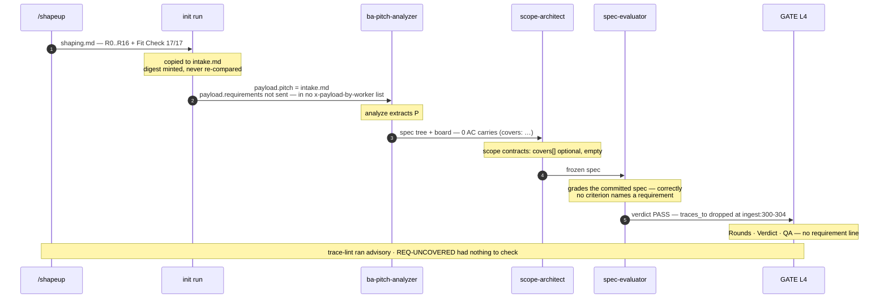
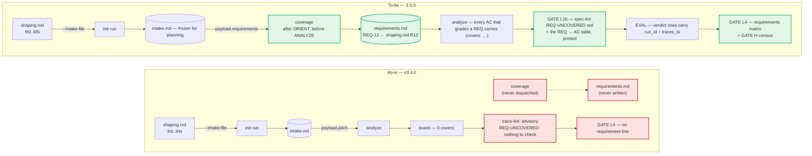

# The run checks what the pitch forbids, not what it asks

**Question:** What changes, in what order, make a pitch's requirements reach the verdict and the
sign-off — and turn a requirement dropped in translation into a red check — shippable as 3.5.0?
**Scope:** `harness init run`'s staged pitch, the `coverage` operation and its registry, the write
fence (`hooks/sandbox-guard.mjs`, `kernel/compile.mjs` substrates), `verify spec`, `verify trace`,
the run workflow's planning lane, the ingest step, GATE L1b, GATE H and GATE L4, and the
ba-pitch-analyzer / spec-evaluator / scope-hammer contracts. Excludes Phase 2 (Betting), whether the
R-list itself is *right*, and — until Stage 7 — `/shapeup` itself.
**Sources:** this repo @ `b49d24d` (v3.4.0, read 2026-09-18); the architecture report
"Chuỗi requirement bị đứt" (2026-09-17), whose mechanism claims were re-derived here rather than
taken on trust; one real soak, `proj-harmony-os-sample` branch `soak/retro-todo-attempt1` @ `efe72c7`
(committed 2026-09-16, run started 2026-09-15 — the run stopped after round 1 and its board was
gitignored and not kept); three fixtures executed 2026-09-17, re-executed 2026-09-18 (trace-lint,
sandbox-guard ×2); the precedent `docs/design/plans/breadboard-reaches-the-run.md`, now shipped;
baseline `npm test` **1530 checks, 104 sections**, green, run 2026-09-18.
**Confidence:** High on the mechanism — every link below was read in code at `b49d24d`, and the
load-bearing ones were executed against fixtures rather than read. Medium on the real magnitude: one
pitch, and its board was not retained, so an acceptance criterion silently covering R12/R15 cannot be
ruled out. **That is exactly what Stage 2 exists to settle, and it blocks the feature stages.**
Low on the effort estimates.
**Status:** Stage 0 and Stage 1 are **implemented and verified** (`f9310f2`, branch
`plan/requirements-reach-the-verdict`). Stage 2 **ran and did not reach L4**; Stages 3–6 are
**re-opened for revision** rather than ready to build — see the correction below. Stage 7 is
untouched: its trigger is neither fired nor cleared.

---

## 0a. Measured correction — 2026-09-18, and it reaches the central claim

A hero-todo soak ran on `proj-harmony-os-sample` (run `hero-todo-20260918T130708Z-baa7c551`, plugin
`ef8b43b` = v3.4.0 + Stage 1). It stopped at GATE L3 with no verdict, so it could not answer its own
gate. It did falsify the premise the rest of this plan is built on.

**This plan says there is no producer. There is one, and the checker for it fires on every run.**

| this plan says | measured 2026-09-18 |
|---|---|
| no producer of requirement links exists | `scope-architect` writes `covers:` into scope-contract frontmatter — **8 of 9 contracts, 20 of 21 requirements** |
| the only checker is `REQ-UNCOVERED`, advisory, with nothing to check | **`verify spec` emits 23 `SCOPE-COVERS` warnings** on that run, each reading *"covers \"R17\" is not a REQ-id — the requirement edge will not resolve"* |
| the missing part is a dispatch | the missing parts are **a registry** and **agreement between two id spaces**: contracts carry `R13`, the schema wants `REQ-13` |

So §3's diagnosis is right one level up from where it was aimed. The harness has been reporting this
defect, at the gate this plan wants to stop at, on every run — as a warning nobody acts on. That is
this plan's own account of `REQ-UNCOVERED` ("advisory-with-no-producer is precisely how it has sat
inert") applied to a rule that *does* have a producer and *is* firing.

A second R-keyed channel exists too: `/shapeup` writes the Fit Check as a fixed-shape table mapping
every `R<n>` to affordance ids (verified identical on two independent pitches), and on hero-todo all
20 board tasks carry those ids in their `tags:`. §0's "enters the run as prose and never comes back"
is true of the table and false of what it maps to.

**Unchanged and confirmed twice:** no acceptance criterion carries a machine-checkable requirement
key. 2 of 103 ACs name one at all, both `R15`, in prose. `covers-closure` reports itself *skipped*
for want of a registry nothing writes. The chain still does not close; it is shorter than this plan
thought.

> ### §0a is itself qualified — a second run, 2026-09-19
>
> §0a above was written on **one run**. A second run of the same pitch on the same build
> (`…190736Z-1f60c60c`) cut **18** scopes instead of 9 and populated `covers:` on **none** of them —
> 0 of 21 requirements reaching a scope contract, against 20 of 21 the day before. `verify spec`:
> `red=0 warn=1`, no `SCOPE-COVERS` at all.
>
> The cause is in the craft: `skills/scope-architect/SKILL.md` marks `covers[]` **optional**. A
> planner may write it or not, and across two runs it did both, at the extremes. (Not an artefact of
> this plan's own fixes: `1931a7d` touches the string `covers` zero times.)
>
> **So "the producer exists" is too strong, and "there is no producer" is still wrong.** The field,
> the oracle and the closure rule all exist, and one real run populated 20 of 21 links. What does not
> exist is any obligation to use them. Stage 3R's payoff — 20 links resolving instead of warning — is
> real on run A and vacuous on run B.
>
> **The correction this implies is not a third rewrite of §0a.** It is that `covers[]` being optional
> is the same failure shape as `SCOPE-COVERS` firing at warn: the mechanism is present and nothing
> obliges anyone to use it. A stage that makes the registry exist and leaves the link optional
> reproduces this plan's own central complaint one level down. Treat "does a planner emit `covers:`"
> as an **open measurement**, not a settled fact in either direction, and do not build a stage whose
> value depends on the answer until a third run has been seen.
>
> The findings measured **twice** are the ones to build on: 0 `(covers: …)` clauses on any acceptance
> criterion, both runs; and severe run-to-run variance in the scope cut and in requirement coverage.

**What this does to the stages.** §3's decision table never considers promoting the rule that is
already firing, and §6's Stages 3–4 budget ~8 h to build a producer that exists. Both need rewriting
before either is built. §4's cost line should be treated as void, not adjusted.

**Blocking the re-measurement:** a defect this soak found and reproduced —
`kernel/lib/contract.mjs`'s `readContract()` parses a nested YAML flow sequence as a scalar, so
`required_states: [idle]` reads as the string `"idle"`; `compile` then refuses the order as failing
its own schema, and the scope is **never dispatched** while spec-lint passes it and the build leg
reports `state: "done", error: null`. Exactly the contracts with a non-empty `affordance_manifest`
are lost — on hero-todo, 4 of 9, and the UI scopes at that. EVAL then refused to grade a round whose
scopes never ran. Filed in `shapeup/knowledge-base/harness-defects.md`; no Stage 2 re-run can reach
L4 until it is fixed.

---

## 0. The finding in one paragraph

A pitch has two halves and the run now carries both, but only one of them has a key. The breadboard
half was fixed by the previous plan: every Place with UI affordances must be its own screen, and its
absence is red at L1b (`kernel/verify/spec.mjs:616`). The requirements half — the `R0..RN` list and
the Fit Check table `/shapeup` writes (`skills/shapeup/resources/shaping.md:52`, `:123`) — enters the
run as prose and never comes back. `analyze`'s INGEST extracts slug, appetite, boundaries, rabbit
holes, third-party mentions, Places and affordances, and no R
(`skills/ba-pitch-analyzer/SKILL.md:47-51`). The `coverage` operation that would build the registry
exists in the compiler (`kernel/compile.mjs:228`) and **the run dispatches it zero times** —
`grep -c coverage skills/tech-lead/workflows/shapeup-run.js` returns 0. With no registry, no
acceptance criterion ever carries a `(covers: REQ-…)` clause, so the one oracle that checks the
chain, `REQ-UNCOVERED` (`kernel/verify/trace.mjs:227-228`), is permanently advisory *by its own
header's admission* — "it goes ~100% red on a board with no covers: yet" (`:22`).
*(**Superseded 2026-09-18, see §0a**: "with no producer" was wrong. Scope contracts carry a `covers:`
field and `scope-architect` populates it — 20 of 21 requirements on a real run — in the pitch's `R<n>`
keys rather than `REQ-<n>`. `SCOPE-COVERS` reports the mismatch 23 times per run, as a warn. What is
absent is the registry and the agreement between the two id spaces, not the producer. The claim about
acceptance criteria stands: 2 of 103 name a key, both in prose.)*
`payload.requirements` is documented in the worker's own contract
(`skills/ba-pitch-analyzer/SKILL.md:30`) but is **in no `x-payload-by-worker` list**, so the schema
registry declares no worker to receive it. `traces_to` is carried into the judge's result and then
dropped by the projection that writes the verdict artifact (`kernel/reduce/ingest.mjs:300-304`). The
L4 block shows rounds, dimensions and QA, and not one requirement
(`skills/tech-lead/references/gates.md:511-516`). The soak shows the shape: 17 requirements, all 17
mentioned downstream **in prose**, `0` `covers:` links, no `requirements.md`, and R12 (4.5:1 contrast)
and R15 (English strings) present in no use case, no ux-behavior row and no scope contract — that is,
in nothing the judge grades. **The harness checks what the pitch forbids better than what it asks:** a
no-go travels pitch → `## Non-Go` → `spec-conformance` → a `TS-NOGO` row in the Test Surface, while a
requirement reaches nothing that grades it. This is not untidiness. EVAL and QA are frozen to the
spec *by design*, so a requirement lost in the pitch→spec translation is invisible to every check that
follows. And the failure path is smooth — no step is wrong: R12 lands in the risk table, no UC carries
it, no AC grades it, T0 is green, the judge grades the frozen spec, PASS, and L4 prints PASS with no
line naming R12.

## 1. What is actually being asked

The decision is whether to accept this staged fix as 3.5.0 — a minor release: one new automatic
dispatch, one new red spec-lint rule, one read-only probe, three gate-block lines, and four
write-fence bug fixes. The report this plan is built on asked a different question first — *does the
harness need a "Product Owner" skill?* — and answered no. §5 keeps that answer and its reasons,
because the cheapest way to undo this plan is to add the agent it exists to avoid.

**Hard constraints** (each is enforced somewhere today, and each shapes a stage):

| Constraint | Enforced by | Consequence for this plan |
|---|---|---|
| Zero dependencies, `node:` builtins only, no network | CLAUDE.md | The registry parser already exists (`kernel/verify/trace.mjs:57`); reuse it, write no second one |
| Single judge — the verdict belongs to spec-evaluator | AGENTS.md invariants | No new judging skill, no second verdict, no new grading input for the judge (§5) |
| Guidance never decides a gate | AGENTS.md | The knowledge base may add a question at L1b; it may never mark a requirement covered |
| `skills/tech-lead/SKILL.md` ≤ 155 lines | `tests/structural/08-docs.mjs:83` | It is at **154**. Nothing in this plan adds a line to it |
| Every `x-payload-by-worker` field exists in `WorkOrderPayload.properties`, and both directions are checked | `tests/structural/05-tech-lead.mjs:670-676` | Declaring `requirements` for ba-pitch-analyzer is a schema edit, not prose |
| Cited paths under `docs/` must exist — `hooks\|skills\|scripts\|tests\|commands\|docs\|tools\|oracles\|evals` only | `tests/structural/08-docs.mjs:165` | This plan names not-yet-written files under those roots as `<placeholder>` paths. `kernel/` is outside the alternation, so new kernel modules are named directly |
| Absent artifact ⇒ arm skipped (non-regression) | `kernel/verify/spec.mjs:357`, `kernel/verify/trace.mjs:245` | No new rule may fire on a run with no `requirements.md` — **and no existing rule may newly fire because one appeared** (§2, D-e) |
| Hook cases are data, not bespoke assertions | `tests/structural/56-hook-decision-table.mjs`, `tests/fixtures/hook-decisions.json` | Stage 1's hook tests are fixture rows. Its own banner records the measurement: per-hook assertions killed 1 of 4 planted mutants, decision-table rows 8 of 8 |
| `reduce` is the single writer for shared state | AGENTS.md; `kernel/probe/owner.mjs:4-12` is the precedent for answering a census with a query | The requirements matrix is a **probe**, not a reduce (§3). Note `probe` is read-only *by default*, not by construction — `probe resume --set-status` writes `harness-run.md` (`kernel/probe/resume.mjs:448`) and `--set-active-order` writes the pointer (`:471`). `probe requirements` takes no write flag |
| Version parity across `package.json` and `.claude-plugin/plugin.json` | release CI | Stage 6 bumps both |

**How the design choices below are judged**, weights set before scoring:

| Criterion | Weight | Why this weight |
|---|---|---|
| Catches the pitch→spec translation loss | 0.35 | It is the one class every later check is blind to *by design*. A fix that adds no failing check reproduces the silence |
| Mechanical evidence over assertion | 0.25 | `kernel/verify/trace.mjs:17` — "if a script can't check it, it's decoration". A second LLM reading the pitch is the kind of evidence this harness removed |
| Non-regression — no registry ⇒ identical behaviour, **and a first registry ⇒ no new red from an old rule** | 0.20 | Every open run and every pre-spine spec must be untouched. The second clause is not decoration: see D-e |
| Fewest new parts | 0.20 | A new worker skill costs 3 steps (SKILL.md → schema → compile + ingest). This plan adds **none** |

## 2. The as-built, against what the docs promise

**A requirement's journey through a run, as the code has it at `b49d24d`:**

| Step | Reads the pitch? | Keeps the R key? | Checked? | Evidence |
|---|---|---|---|---|
| `/shapeup` S2 · S4 | writes `R0..RN` + Fit Check | ✅ | Fit Check, by a human | `skills/shapeup/resources/shaping.md:52`, `:123` |
| `init run` | copies it to `intake.md` | — | digest minted, never re-compared | `kernel/lib/paths.mjs` · `kernel/reduce/ship.mjs` |
| `analyze` (INGEST) | yes | ❌ — appetite, boundaries, rabbit holes, P#/U#; **no R** | breadboard: red at L1b · R: *nothing* | `skills/ba-pitch-analyzer/SKILL.md:47-51` |
| `coverage` | could | re-keys to `REQ-NNN` | **the run never dispatches it** | `kernel/compile.mjs:228` · 0 hits in `shapeup-run.js` |
| AC `(covers: …)` | — | parser exists, `^REQ-\d+$` only | **no skill is taught to write one** | `kernel/compile.mjs:107-108` |
| `REQ-UNCOVERED` | — | red finding, correct logic | advisory — `verify trace` runs through `advisory()` | `kernel/verify/trace.mjs:227-228` · `shapeup-run.js:1177` |
| `spec-evaluator` | ❌ frozen spec + Non-Go | `traces_to` in the schema | judged, then **dropped by the projection** | `domain.schema.json:1097`, `:1146` · `kernel/reduce/ingest.mjs:300-304` |
| `qa-edge-hunter` | ❌ | ❌ | — | `kernel/compile.mjs:249` |
| `scope-hammer` | `baseline.md` or the problem statement | must-have "traces to a pitch boundary", by judgement | compared to baseline | `skills/scope-hammer/SKILL.md:75-77`, `:94` |
| GATE L4 | — | ❌ rounds, dims, QA | PO: "Anything to record?" | `skills/tech-lead/references/gates.md:511-516` |

Every one of these steps is *correct given its input*. That is the point: there is no bug to find at
any single step, which is why 1530 green checks hold the gap.



Step 2 and step 3 are the root: the run never asks for a registry, so step 4 onward has no key to
carry. No step after 3 can recover it, which is why the fix starts at the dispatch, not at the judge.

**Four defects found on the way** (Stage 1 fixes them; each is proven by an executed fixture, not by
the soak, and each is wrong regardless of what Stage 2 measures):

| # | Defect | Evidence | Fix |
|---|---|---|---|
| D-a | Every `frozen:` declaration over `.shapeup/<slug>/**` is inert. The run-trace exemption `continue`s **before** the frozen check | `hooks/sandbox-guard.mjs:238` precedes `:243`; hook executed with a live `evaluate` order writing `tasks/TASK-001.md`: ALLOW | Check `frozen` before the run-trace exemption. Three declarations become live: `map-scopes` (`kernel/compile.mjs:237`), `evaluate` (`:247`), `hunt` (`:249`) |
| D-b | The staged `intake.md` / `breadboard.md` are writable by any worker with a live order, judge included; the `t=0` digest is never re-compared | hook executed with a live `evaluate` order writing `intake.md`: ALLOW | Freeze the staged pitch for the planning and eval operations. The reorder alone does **not** fix this: `analyze`'s `allowed` is `[${spec}/**, ${local}/**]` (`kernel/compile.mjs:217`), which already matches `intake.md` — only a `frozen` entry denies it |
| D-c | `coverage`'s own comment says its REQ source is "frozen alongside the spec core", but `FROZEN_SPEC_CORE` holds only `domain-model.md`, `usecases/*.md#Steps`, `contracts/**`, `ux-behavior.md` — no pitch | `kernel/compile.mjs:229` against `:209` | Same fix as D-b. The comment becomes true instead of aspirational |
| D-e | `COVERS-DANGLING` is not arm-skipped. `closureChecked` (`kernel/verify/trace.mjs:235`) gates the report block, not the findings loop, so `dangling` (`:223`) is computed against an empty id set and fires on a tree with **no registry at all** | `verify trace --gate` over a fixture with no `requirements.md`: covers-closure reports `skipped`, and `COVERS-DANGLING` still fires, exit 1 | Gate the dangling loop on `closureChecked`. Stage 4 reuses this oracle's shape, so copying it would import the defect |

D-a, D-b and D-c are not decoration for this plan: Stage 3 makes `coverage` read the staged pitch and
write a registry the rest of the run is measured against. A planner that can edit the requirements it
is being measured against is not measuring anything — which is what `kernel/compile.mjs:229` already
says it intends, and what the hook does not deliver.

## 3. The central finding — a pointer is not a verdict, and nothing makes the pointer

Two facts have to be held at once, and taking either one alone produces the wrong fix.

**First: there is no producer.** Every piece of the chain exists except the one that starts it. The
registry format, its parser, the `covers:` clause parser, the closure oracle, the red finding, the
schema fields and the CLI flag that would gate it — all shipped. The single missing part is a
dispatch. `verify trace --gate` is one flag away and turning it on is the obvious move; it is also
the wrong one, and §5 says why.

> **Superseded 2026-09-18 (§0a).** Measured on a real run: there *is* a producer at the scope level.
> `scope-architect` populates `covers:` on 8 of 9 contracts, covering 20 of 21 requirements, and
> `SCOPE-COVERS` — an **already-red-capable rule that fires today as a warn** — reports 23 times per
> run that the edge does not resolve. The missing parts are the registry and one decision about the
> key space. The paragraph remains true of **acceptance criteria**, which is the level the rest of
> this plan works at: no AC carries a machine-checkable key. Read "no producer" as "no producer *of
> the AC-level link*" and the argument below survives; read it as written and it is false.

**Second: the closure a `covers:` link proves is weaker than it reads.** Covers-closure proves *a
pointer existed at planning time*. It does not prove the product satisfies the requirement, and it
does not prove the AC tests the right thing. Fixture, executed 2026-09-17: two requirements, one
unticked AC reading `payment works (covers: REQ-1, REQ-2)`, zero lines of product code →
`overall: green`, exit 0. So the plan must place the pointer check where a pointer is all that is
being claimed — **at L1b, at planning time, where it is exactly the right claim** — and put the
*evidence* question somewhere else: at L4, as a matrix from the verdict, which is where the run's own
verdict and T0 hashes live.

That is the split the stages implement. L1b asks "is every live requirement pointed at by an
acceptance criterion?" and answers red/green mechanically. L4 asks "which requirements have PASS
evidence?" and answers with a table a human reads before signing. Neither one is a second judge.

The design choices, scored against §1:

| Choice | Options | Pick | Deciding criterion |
|---|---|---|---|
| The requirement key | widen the schema to accept `R\d+` · keep `REQ-N` and map `R12 → REQ-12`, R-id in the registry's existing `source` column · make `/shapeup` write `REQ-N` at the source | **`REQ-N` + 1:1 map** *(maintainer, 2026-09-18)* | Fewest new parts (0.20): the `source` column already exists (`kernel/verify/trace.mjs:72`), five schema patterns (`domain.schema.json:601`, `:1027`, `:1101`, `:1150`, `:2179`) and the `covers:` parser stay untouched, and one id space stays one id space. The cost — humans read `R12`, machines read `REQ-12` — is paid once by the L1b block, which prints both. The `source` cell is also what makes re-shaping checkable (Stage 3.5) |
| Who produces the registry | a new worker · `coverage` on the existing planner · the kernel parses the R-list itself | **`coverage`** | Fewest new parts: the operation, its substrate, its craft and its output path all ship today and are dispatched zero times. Nothing new is written; something written is finally called |
| Where the red lives | `verify trace --gate` · a new arm in `verify spec` | **`verify spec`** | Catches the loss (0.35): spec-lint is the hard stop at L1b (`shapeup-run.js:1173-1175`); `verify trace` runs through `advisory()` and also carries the reachability arm, which is red for unrelated reasons (§5) |
| Severity at first release | warn, promote later · red with a `CUT (PO-approved)` escape | **Red** *(maintainer, 2026-09-18)* | Catches the loss: advisory-with-no-producer is precisely how `REQ-UNCOVERED` has sat inert since it shipped. The escape is a status the registry parser already normalises (`kernel/verify/trace.mjs:67-68`) |
| Where the L4 matrix comes from | a new `reduce` subcommand · a `probe` query · a section in `reduce ship` | **`probe` + a REPORT section** | Single-writer discipline, and the precedent is exact: `kernel/probe/owner.mjs:4-12` exists *because a census narrated ownership from memory and was wrong in the way that looks most authoritative*. A requirements census has the same failure mode |
| The matrix's authoritative join | the board's `covers:` · the verdict's `traces_to` · their intersection | **`covers:`** *(maintainer, 2026-09-18)* | Mechanical evidence (0.25): `covers:` is what L1b already gates on, and `traces_to` is documented as "a navigation aid, never a grading input" (`domain.schema.json:1103`). A criterion whose `traces_to` names a REQ no AC covers is an inconsistency the probe reports, never evidence it counts |
| What the matrix does at GATE H | blocks ship · enters the census as a must-have candidate | **Census** | The Ship Gate compares against the baseline, never the ideal (`skills/scope-hammer/SKILL.md:94`). A requirement with no PASS evidence is an input to that comparison, not a veto over it |
| **The scope-level edge** *(added 2026-09-18)* | teach `scope-architect` to emit `REQ-<n>` · normalise `R<n> → REQ-<n>` where `covers:` is read · leave it warn | **open — decide before Stage 3** | Not considered when this table was written, because the table assumed nothing produced the edge. Measured: 20 of 21 requirements already have one, and `SCOPE-COVERS` already says it does not resolve, 23 times a run. Whichever option wins, the closure half of `SCOPE-COVERS` is then a candidate for red — which is a gate change, so it is a decision, not an implementation detail |

> **The row above is why §3's framing needs redoing, not just extending.** This section is built on
> "a pointer is not a verdict, and nothing makes the pointer". The second clause is false at the
> scope level: something makes 20 pointers per run and an oracle already grades them. The first
> clause — a pointer proves a pointer, not satisfaction — is untouched and still decides where the
> evidence question lives (§3's L1b/L4 split stands).

## 4. Argued from the numbers

**The measured gap** (soak `proj-harmony-os-sample` @ `efe72c7`; plugin facts @ `b49d24d`):

| Measure | Value | Source |
|---|---|---|
| Requirements in the retro-todo pitch | 17 (R0–R16), Fit Check 17/17 ✅ | consumer `shaping/shaping.md:145` |
| Requirements mentioned outside `shaping/` | 17/17 — all in prose; R8 once | `git grep` @ `efe72c7` |
| `covers:` links anywhere in the consumer tree | **0** | `git grep "(covers:"` @ `efe72c7` |
| `requirements.md` | does not exist | `git ls-tree` @ `efe72c7` |
| Requirements absent from **everything the judge grades** (`usecases/`, `ux-behavior.md`, `scopes/`) | R12, R15. Both still appear elsewhere — R12 in `spec/_index.md` (risk table), `spec/integration.md` and `spec/synthesis.md`; R15 in `spec/_index.md` (a *boundaries* line), `spec/integration.md`, and cited in product code at `shared/uikit/AppText.ets:4` | `git grep` over spec + scopes + app |
| Times the run dispatches `coverage` | **0** | `grep -c coverage skills/tech-lead/workflows/shapeup-run.js` |
| *(correction, 2026-09-18)* Requirements absent from everything the judge grades, **re-measured on the same tree** | **R8, R12, R14 and R15 — four, not two.** The row above understates it. Confirmed two ways: a derivation over the tree, and `grep -rn "\bR<n>\b" spec/usecases/ spec/ux-behavior.md scopes/` returning 0 hits for each. All four are cross-cutting with no natural use-case home — the shape §3.6 diagnoses | re-measured @ `efe72c7` |
| EVAL dimensions graded against a pitch requirement | **0 of 7** | `shapeup-run.js` dimension list |
| Workers declared in `x-payload-by-worker` to receive `payload.requirements` | **0** — though the worker's own contract documents it (`skills/ba-pitch-analyzer/SKILL.md:30`) | `domain.schema.json` `x-payload-by-worker` |
| trace-lint over a fixture with no product code | `overall: green`, exit 0 | fixture, executed 2026-09-17 |
| Guard, live `evaluate` order, Write `intake.md` | ALLOW | fixture, re-executed 2026-09-18 |
| Guard, live `evaluate` order, Write `tasks/TASK-001.md` (declared `frozen`) | ALLOW | fixture, re-executed 2026-09-18 |

The R12/R15 row is deliberately narrower than "they appear only in `_index.md`", which was the
report's claim and is false: both reach several spec documents, and R15 reached product code. The
mechanism claim is the one that survives measurement — **neither requirement reaches any artifact the
judge grades**, and zero `covers:` links exist to check either way.

**The hero-todo measurement, 2026-09-18** (run `hero-todo-20260918T130708Z-baa7c551`, plugin
`ef8b43b`, models exec=sonnet / eval=opus, gate answers `ci`). It reached GATE L3 and stopped: the
evaluator refused to grade a round in which 4 of 9 scopes were never dispatched, so **no verdict
exists** and classes (b), (c) and (d) are not assessable. Not extrapolated.

| Measure | Value |
|---|---|
| Requirements in the pitch | 21 (R0–R20) |
| **class (a)** — no acceptance criterion grades it | **0 of 21**. Every requirement has at least one AC touching it |
| classes (b) / (c) / (d) | **not assessable** — the run produced no PASS evidence of any kind |
| Acceptance criteria on the board | 103 across 20 tasks |
| ACs carrying a `(covers: …)` clause | **0** |
| ACs naming any requirement key at all | **2 of 103** — both `R15`, in prose |
| Scope contracts with a populated `covers:` | **8 of 9**, covering **20 of 21** requirements, in `R<n>` keys |
| `SCOPE-COVERS` warnings from `verify spec` | **23** (`red: 0, warn: 24`) |
| Requirements reaching no artifact the judge grades | **1 — R15**, which is also the one requirement no scope `covers:` and which `spec/synthesis.md` marks "cross-cutting" |
| Hook decisions · denials | **928 · 2**, both `outside-substrate` on one `/tmp` path; **0 `frozen`-rule denials** — Stage 1's newly-armed fences wedged nothing across a full planning lane and concurrent build legs |

Two facts from this run bear on the plan's confidence rather than its mechanism. **The gap is
stochastic**: an earlier attempt on the same pitch and build (`…125240Z-c45a5c60`) orphaned seven
requirements where this one orphaned two, because its spec carried 8 use cases against this one's 14.
And **the run was contaminated by two operator interventions**, both disclosed: a hand-written
`project-profile.md` (the unattended lane cannot produce one, and nothing warns at L0 — the cost
lands at WIRE, 26 minutes later) and an `ohpm install`.

**What is not measured, and why Stage 2 blocks:** the soak's board (`.shapeup/retro-todo/tasks/`) is
gitignored and was not retained, so an acceptance criterion covering R12 or R15 *without naming the
id* cannot be ruled out. That does not change the mechanism — with 0 `covers:` links and 0 `coverage`
dispatches, nothing downstream could have *checked* such an AC either way — but it changes the
magnitude, and magnitude is what decides whether Stage 4's red rule is worth a hard stop at L1b. The
run also stopped after round 1, so no full run to L4 has been observed at all.

**The baseline this plan is verified against** (2026-09-18 @ `b49d24d`, v3.4.0): `npm test` ✅
**1530 checks, 104 sections**; `skills/tech-lead/SKILL.md` at **154/155**; `tests/structural.mjs`
registers **48** modules; `tests/fixtures/hook-decisions.json` holds 31 rows, 8 of them for
`sandbox-guard`.

**Cost**, in focused engineering hours (**estimate** — not measured):

| Stage | What | Estimate |
|---|---|---|
| 0 | Baseline | 0 |
| 1 | The write fence actually fences (D-a, D-b, D-c, D-e) | ~6 h |
| 2 | **Blocking measurement** — hero-todo soak | ~2 h of PO time, 0 lines of code |
| 3 | A producer and a key | ~4 h |
| 4 | Red at L1b | ~4 h |
| 5 | The way back — verdict → REQ → L4 → census | ~5 h |
| 6 | Gates, docs, release 3.5.0 | ~2 h |
| 7 *(conditional, after 3.5.0)* | Acceptance examples | ~3 h |
| | **Total** | **~21 h to 3.5.0, ~24 h with Stage 7** |

## 5. What deliberately not to do

**Do not add a "Product Owner" skill with a verdict.** It matches the Scrum role and looks like it
fills exactly this hole. But `AGENTS.md` makes the PO a *human* responsibility — "Betting Table: PO
decides", "PO governance, no skill" — and sign-off is a file. An agent PO manufactures a signature a
human then rubber-stamps. Give it a verdict and the single-judge invariant is gone; withhold one and
it is a second QA pass. Either way its evidence is an LLM reading the pitch and then reading the
product, which is the class of evidence this harness was built to replace. The repo's own design notes
already concede "nothing proves the judge does"; a second unproven judge doubles that gap instead of
closing it.

**Do not turn on `verify trace --gate` and call it the fix.** The flag exists and switching it on is a
one-line change. It would gate a check that returns green on zero lines of product code — turning a
weak signal into a false guarantee. And on the one real board measured it is red for a reason that has
nothing to do with requirements: `verify trace --gate` over the soak tree at `efe72c7` reports
covers-closure **skipped** (no registry) and six `UC-UNREACHABLE` findings from the *reachability*
arm, exit 1. Gating it would stop every run at L1b on reachability. Build the producer first; the gate
is Stage 4's business and it lives in spec-lint. Note the consequence for Stage 4.3: trace-lint stays
advisory and stays noisy on reachability after 3.5.0, so "two oracles name the same rule" is not the
whole story — the advisory one is loud for a third reason.

**Do not let spec-evaluator read `shaping.md`.** It preserves the single judge and costs almost
nothing, which is what makes it tempting. But criteria invented at grading time are criteria nobody
listed and nobody approved — the thing the hard thresholds and the anti-leniency rules exist to
forbid. And the judge's misreading would correlate with the planner's: same model family, same text,
same blind spot. The chain must be built at planning time, when it can be reviewed.

**Do not turn shaping into a detailed spec.** Shape Up keeps the shape coarse; the Betting Table bets
on a shape, not a specification. The R-list is already at the right altitude — "R1 — Create a list,
blank name refused" is an acceptance sentence as written. Stage 7, if it ever opens, adds *examples*
of the requirement, never a specification of the solution.

**Do not make the L4 matrix block the ship.** A requirement with no PASS evidence is a fact for the
census and the baseline comparison to weigh (`skills/scope-hammer/SKILL.md:94`). A run that has
shipped something strictly better than the status quo does not become unshippable because one
requirement's evidence is thin; that is the Ship Gate's whole principle, and this plan is an input to
it, not an override of it.

## 6. Recommendation

Eight stages. Each one's acceptance can only pass on the previous stage's work, with two deliberate
exceptions stated below. Each stage lists its changes (to copy verbatim into an execution contract),
an **Exit** line, and **Acceptance** commands run from a fresh clone.

**Two things about the ordering, because they were decided and are easy to misread:**

- **Stage 1 runs before Stage 2 and is not gated by it.** The four defects are proven by executed
  fixtures, not by the soak, and they are wrong regardless of what the soak finds. They also sit under
  the ground Stage 3 builds on.
- **Stage 2 is a hard gate on Stages 3–6.** No line of the feature is written until the hero-todo
  measurement produces at least one requirement in class (a), (b) or (c). If every requirement lands
  in class (d) across two features, the fix shrinks to Stage 5's L4 line and the rest is abandoned.

### Guardrails for execution

Copy these and every §5 entry into the contract's Guardrails.

- **Order is load-bearing:** 0 → 1 → **2 (gate)** → 3 → 4 → 5 → 6; Stage 7 depends on Stage 5 and on
  its own trigger. **Both orderings of 3 and 4 ship a hard L1b stop if split.** Stage 4 before Stage 3
  reds `REQ-UNCOVERED` with nothing producing a registry. Stage 3 before Stage 4 arms the *existing*
  red `SCOPE-COVERS` (`kernel/verify/spec.mjs:358-359`) the moment a registry first appears — which is
  why Stage 3.3 registers the ids the contracts already cite. Neither stage may ship alone.
- Do not raise the §25 ratchet on `skills/tech-lead/SKILL.md` (155, currently **154**). No stage here
  adds a line to it.
- No `REQ-*` finding may fire when no `requirements.md` is on disk — the same "absent artifact ⇒ arm
  skipped" rule as `INV-FLOOR` and `SCOPE-COVERS` (`kernel/verify/spec.mjs:357`). D-e is that rule
  being broken today; do not copy it forward.
- Never widen the `^REQ-[0-9]+$` pattern. It appears five times in
  `skills/tech-lead/schemas/domain.schema.json` (`:601`, `:1027`, `:1101`, `:1150`, `:2179`) and once
  as `/^REQ-\d+$/` in `kernel/compile.mjs:108`; the maintainer decided the key stays `REQ-N`.
- One implementation of covers-closure, not two. `kernel/verify/spec.mjs` imports `parseRequirements`
  and `coveredReqIds` from `kernel/verify/trace.mjs`; it must not re-implement either. **And it must
  feed them the right board** — see Stage 4.1; this is the single easiest way to ship a rule that reds
  every requirement on every run.
- Do not add a second parser of the task board. `kernel/reduce/board.mjs:47-49` is an explicit note
  against exactly that; `readBoard` (`kernel/compile.mjs:131`) is the parser that carries
  `acceptance_criteria`.
- `skills/tech-lead/workflows/shapeup-run.js` carries no path literal; paths come from the resume
  state.
- New path builders live only in `kernel/lib/paths.mjs`.
- Every new exported function in `kernel/**` carries a JSDoc block with `@param` and `@returns`.
- Hook cases go in `tests/fixtures/hook-decisions.json` as rows pinning `decision`, `verdict` and
  `rule` — not as bespoke assertions. `tests/structural/56-hook-decision-table.mjs`'s banner carries
  the measurement that justifies this.
- Register every new test module in `MODULE_FILES` (`tests/structural.mjs`); an unlisted module never
  runs. The baseline registers **48**.
- **Every mutation check in an Acceptance block writes a tracked file.** Run it in a throwaway clone,
  or follow it with `git checkout -- <file>`; the blocks below do the latter explicitly.
- Shipped files (`skills/**`, `commands/**`, `hooks/**`, `AGENTS.md`) never cite `tests/`, `docs/`,
  `tools/` or this plan; they speak in skills, commands and options.
- In `docs/**`, a not-yet-written file under `hooks|skills|scripts|tests|commands|docs|tools|oracles|evals`
  is named only as a `<placeholder>` path — §26 fails on a cited path it cannot find.
- `node:` builtins only, no network; hooks fail open.
- Never edit or weaken an existing check to reach green. Never hand-edit `docs/assets/demo-gate.svg`.
- Commit subjects: `type(scope): lowercase declarative`.



### Stage 0 — Baseline · 0 h

No edits. Confirms the clone is green before anything is attributed to this plan.

**Exit:** the suite and both plugin validations are green at the starting HEAD.

**Acceptance:**

```bash
npm test                          # exit 0; "structural tests passed (N checks)"; N = 1530 at b49d24d, and moves with docs/
npm test 2>&1 | grep -c "^▸ "     # prints 104 at b49d24d — the section count, which docs/ does not move
claude plugin validate . --strict                                  # exit 0
claude plugin validate ./.claude-plugin/marketplace.json --strict  # exit 0
```

### Stage 1 — The write fence actually fences · ~6 h · *not gated by Stage 2*

1. **D-a — frozen before the exemption.** In `hooks/sandbox-guard.mjs`, the run-trace exemption at
   `:238` (`if (rel.startsWith(runTracePrefix)) continue;`) runs before the frozen check at `:243`, so
   every `frozen:` glob under `.shapeup/<slug>/**` is inert. Move the frozen lookup above the
   exemption: a path frozen by a live contract is a violation even inside the run trace.
2. **D-a′ — retire an order the run will never answer.** The reorder has a consequence the hook's own
   banner already records for a different case (`hooks/sandbox-guard.mjs:25-35`): liveness is
   "compiled and no result at least as new as `compiled_at`" (`:121-153`), so an `evaluate`, `hunt` or
   `map-scopes` order whose worker never returned a result stays live — and now fences
   `${local}/tasks/**` for the rest of the run. A killed EVAL, a QA dispatch that escalates without a
   result, or a failed `map-scopes` would each wedge the board. **Fix: an unanswered run-level order
   stops being live at its phase boundary.** That matches the window `AGENTS.md` already describes for
   the orchestrator, and the unwedge path it reuses is covered by `tests/structural/27-unwedge.mjs`.
   Implement this in the same commit as step 1 — the reorder without it trades one defect for another.
3. **D-b + D-c — freeze the staged pitch.** These are one change, not two. Keep `FROZEN_SPEC_CORE` as
   the spec-core constant it is and introduce a second constant holding the staged pitch and
   breadboard; add it to the `frozen` list of `coverage`, `analyze`, `map-scopes`, `wire`, `evaluate`
   and `hunt`. A `frozen` entry is what denies the write — `analyze`'s `allowed` already matches
   `${local}/**` (`kernel/compile.mjs:217`), so exempting the path from the run-trace carve-out alone
   changes nothing. `translate` is the one operation that legitimately writes a pitch, and it writes
   the **committed** copy (`:253`), not the staged one.
4. **D-e — arm-skip the dangling loop.** `kernel/verify/trace.mjs`: gate the `dangling` findings loop
   (`:230-233`) on `closureChecked` the way the report block at `:235` already is. Without this, Stage
   4 inherits a rule that fires on a tree with no registry.
5. **Correct the two shipped pages that assert the wrong fence.** Both carry claims that are false
   today, false after step 1, or both:
   - `SECURITY.md:75` — the `sandbox-guard` row asserts both that any write inside `frozen` is denied
     (false today, D-a) and that the active feature's own run trace is always writable (false after
     step 1 for a frozen path).
   - `README.md:224` — the same fence described in the same wrong order.
   Fix both in the same commit as step 1, so the security page never describes a deny the hook does
   not have. This is the same commit Stage 6.4 refers to; it is mandatory, not conditional.
6. **Tests — rows, not assertions.** Add cases (a)–(e) to `tests/fixtures/hook-decisions.json`, each
   pinning `decision`, `verdict` and `rule`, per `tests/structural/56-hook-decision-table.mjs`. Only
   (f) needs bespoke code; put it in `tests/structural/03-hooks.mjs`. **No new section module** — the
   section count stays at 104.
   - (a) A live `evaluate` order freezing `${local}/tasks/**`; `Write .shapeup/demo/tasks/TASK-001.md`
     → **deny**, rule `frozen`. This is the exact case that returns ALLOW today.
   - (b) The same order writing `.shapeup/demo/discovery/ledger.md` — a path **no** live contract's
     `allowed` covers, and the carve-out's own documented job (`hooks/sandbox-guard.mjs:59-67`) — is
     **permitted**. *(Not `evaluation/report.json`: that is permitted by `evaluate`'s own `allowed`
     glob with or without the carve-out, so it discriminates nothing.)*
   - (c) A live `evaluate` order writing `.shapeup/demo/intake.md` → **deny**. This tests step 3, not
     step 1.
   - (d) A live `execute` order writing its own `.shapeup/demo/orders/ORDER-1.json` → **permitted**.
   - (e) An `evaluate-r1` order with no result does **not** deny a round-2 `Write` to
     `.shapeup/demo/tasks/TASK-001.md` — the D-a′ regression guard.
   - (f) `substrateFor("coverage", …).frozen` contains the staged pitch path.
   - (g) `verify trace` over a tree with no `requirements.md` emits **no** `COVERS-DANGLING` — the D-e
     guard. Put this with the trace tests, not the hook fixture.

**Exit:** a `frozen:` declaration over a LOCAL path is enforced; an unanswered run-level order does not
wedge the board; the staged pitch is not writable by a worker mid-run; `coverage`'s comment and its
substrate agree; `COVERS-DANGLING` is arm-skipped; `SECURITY.md` and `README.md` describe the fence the
code has.

**Acceptance:**

```bash
npm test                                   # exit 0
npm test 2>&1 | grep -c "^▸ "              # prints 104 — this stage adds fixture rows, not sections
# The ORDERING must be load-bearing — not merely the existence of the frozen check.
# Move the exemption back in front of it and the suite must go red. Restores the file either way.
node -e "const fs=require('fs'),f='hooks/sandbox-guard.mjs',s=fs.readFileSync(f,'utf8'),ex='    if (rel.startsWith(runTracePrefix)) continue;\n',i=s.indexOf(ex);if(i<0)process.exit(3);const t=s.slice(0,i)+s.slice(i+ex.length),j=t.indexOf('    const freezer =');if(j<0)process.exit(3);fs.writeFileSync(f,t.slice(0,j)+ex+t.slice(j))" \
  && ! npm test >/dev/null 2>&1; r=$?; git checkout -- hooks/sandbox-guard.mjs; [ $r -eq 0 ]   # exit 0
node --input-type=module -e "const{substrateFor}=await import('./kernel/compile.mjs');const f=substrateFor('coverage',{slug:'demo'}).frozen||[];process.exit(f.some(g=>/intake/.test(g))?0:1)"   # exit 0
grep -c "sandbox-guard" tests/fixtures/hook-decisions.json   # exit 0; more rows than the 8 at b49d24d
```

### Stage 2 — Measure it, on hero-todo · ~2 h of PO time · **BLOCKING** · 0 lines of code

The hero-todo soak is already planned. This stage adds two requirements to it and one analysis.

1. **Retain the evidence.** Keep `.shapeup/hero-todo/tasks/` and the eval report after the run — copy
   them out of the gitignored tier before anything cleans up. The retro-todo measurement could not
   answer its own central question because this was not done.
2. **Run to L4.** A run that stops after round 1 measures the planning half only. If the run cannot
   reach L4, say so and record how far it got; do not extrapolate.
3. **Build the table by hand:** one row per pitch requirement, `R → AC(s) → verdict evidence`, and
   classify each requirement:
   - **(a)** no acceptance criterion grades it;
   - **(b)** an AC exists but no PASS evidence cites it;
   - **(c)** an AC PASSed but it tests something other than what the requirement asks;
   - **(d)** fine.
4. **Record the count per class, the date, and the plugin version.** This is a measurement; it belongs
   to a run with a model and a date, and it must never be rescaled later to match a number someone
   re-derives.

**Exit — and this is the gate:**

- **≥1 requirement in class (a), (b) or (c) that no existing gate caught → open Stages 3–6.**
- Class (c) present → Stage 7's trigger has fired; note it, do not act on it until Stage 5 ships.
- **Every requirement in class (d), across two consecutive features → stop.** Build only Stage 5's L4
  line, as reporting, and close the rest of this plan as not-needed. Record that outcome; it is a
  result, not a failure.

**Acceptance:** none automatable. The deliverable is the classified table, the retained board, and the
eval report, committed under `docs/design/plans/` beside this plan or linked from it.

> **Stage 2 ran on 2026-09-18 and did not close. Read §0a before Stage 3 or Stage 4.**
> Outcome: reached GATE L3, evaluator refused to grade, **no verdict**. class (a) = **0 of 21**;
> (b)/(c)/(d) not assessable. The gate's own exit condition is therefore **not met** — no requirement
> is ungraded by every AC — but the run answered a sharper question the gate did not ask: the
> requirement edge is **produced** (20 of 21, in scope `covers:`) and **already reported** as
> unresolvable (`SCOPE-COVERS`, 23 warns), and what is missing is the registry and the id space.
> Stages 3 and 4 below are written against the superseded premise and **must be rewritten before
> they are built**; their ~8 h estimate is void, not merely stale.
>
> A re-run cannot reach L4 until `readContract()`'s flow-sequence parse is fixed — 4 of 9 scopes are
> silently never dispatched, which is what made the round ungradeable.

### Stage 3 — A registry and one key space · ~3 h · **REVISED 2026-09-19**

*Was "A producer and a key". The producer is not what is missing.* Measured: `scope-architect`
populates `covers:` on 8 of 9 contracts, 20 of 21 requirements, in the pitch's `R<n>` keys; the
schema wants `REQ-<n>`; `verify spec` says so 23 times a run as a warn. So this stage writes the
registry and makes the two key spaces agree — after which those 20 links **resolve instead of
warning**, with no new craft taught to anyone.

**3R.1 — Registry.** Dispatch `coverage` once, after ORIENT, before ANALYZE, writing
`shapeup/<slug>/requirements.md` with `REQ-<n>` ids and a `source` cell naming `shaping.md R<n>`.
Steps 1, 2, 4 and 5 of the original list below are unchanged and still correct: declare the payload
field, dispatch with `fastForward()` (never `requirePhase()`, never a `PHASE_ARTIFACT` entry),
add `has_requirements`, and keep the numbering rules. **Original step 3 is superseded** — it asked
`coverage` to register "every `REQ-id` the contracts already cite" so a first registry would not arm
`SCOPE-COVERS`. Measured, the contracts cite `R<n>`, not `REQ-<n>`, so nothing would have matched
and every one would have gone red the moment the registry appeared. Register the ids from the
**pitch**, then let 3R.2 make the contract links resolve against them.

**3R.2 — One key space.** `R<n>` and `REQ-<n>` must stop being two id spaces. Two options, and the
choice belongs to the maintainer:

| option | cost | risk |
|---|---|---|
| **Normalise on read** — where scope `covers:` is parsed, accept `R<n>` and map it to `REQ-<n>` | one function, no worker behaviour change, the 20 existing links resolve immediately, every already-committed contract converges | the file keeps a key the schema does not name, so a reader of the raw contract still sees `R13` |
| **Teach the producer** — `scope-architect` emits `REQ-<n>` | the file and the schema finally agree | a behaviour change in a worker, which nothing can force; every existing contract keeps warning until regenerated |

Recommended: **normalise on read**, and say in `scope-architect`'s craft that `REQ-<n>` is preferred
going forward. It is the option that makes the measured 20 links work today rather than after every
project re-plans. Note the guardrail "never widen `^REQ-[0-9]+$`" still holds — normalising is a
mapping performed before the pattern is applied, not a loosening of it.

**3R.3 — The AC-level link.** Unchanged from original step 6, and it is now the *only* part of this
stage that asks a worker to do something new: an acceptance criterion that grades a requirement ends
with `(covers: REQ-…)`, and a non-functional requirement with no use-case home becomes a task with an
AC rather than a line in the risk table. Measured need: 2 of 103 ACs name a key, both `R15`, in prose
— and `R15` is the one requirement no scope covers either.

**3R.4 — Tests.** The original step-7 list stands, minus (e) which tested the superseded step 3.
Add: a scope contract carrying `covers: [R13]` resolves against a registry holding `REQ-13`, and
`SCOPE-COVERS` emits nothing for it.

---

*Original Stage 3 steps, retained because 1, 2, 4, 5 and 6 are unchanged and 3 is the one superseded:*

1. **Declare the field.** `skills/tech-lead/schemas/domain.schema.json`: add `"requirements"` to
   `x-payload-by-worker["ba-pitch-analyzer"]`. The property already exists in
   `$defs/WorkOrderPayload.properties` and the worker's own contract already documents it
   (`skills/ba-pitch-analyzer/SKILL.md:30`), so `tests/structural/50-payload-contract-parity.mjs`
   passes unchanged; `tests/structural/05-tech-lead.mjs:670-676` checks both directions, and this is
   the edit that makes the registry agree with the contract.
2. **Dispatch it.** `skills/tech-lead/workflows/shapeup-run.js`: after ORIENT and before ANALYZE,
   dispatch `ba-pitch-analyzer` / `coverage` with
   `payload: { requirements: rs.intake_path, feature: slug }`.
   - Follow the ANALYZE block (`shapeup-run.js:1009-1031`) — `phase()`, `setRunStatus()`, `worker()`,
     `advisory("reduce graph …")`, with `fastForward()` in the `else` branch.
   - **Use `fastForward()`, never `requirePhase()`, and do not add `coverage` to `PHASE_ARTIFACT`.**
     `requirePhase()` routes to `probe resume --require`, whose argv spec is an enum of
     `orient | analyze | wire | map-scopes` (`kernel/probe/resume.mjs:489`, `:319-325`); a `coverage`
     value exits 2, and `shapeup-run.js:826-830` reads any exit other than 6 as "the predicate was
     never asked" and reports a false escalation. Adding the key to `PHASE_ARTIFACT` fixes that and
     breaks something worse: `PHASE_ARTIFACT` is also `nextPhase()`'s ordered list, so **every
     pre-3.5.0 run — spec tree, wiring map and scope contracts all on disk — would fast-forward to
     `coverage` instead of `build` on its next relaunch.** Guard the dispatch on the bare
     `rs.has_requirements` boolean instead.
3. **Register what the contracts already cite.** Before writing the registry, `coverage` reads the
   scope contracts and the board and ensures every `REQ-id` they already reference has a row (or is
   reported as a clause it could not find in the source). Without this, the first registry on an
   existing slug arms `SCOPE-COVERS` — an **existing** red rule (`kernel/verify/spec.mjs:358-359`,
   gated on `reqIds` being non-null, i.e. on the registry existing) — and L1b goes red on contracts
   written before any registry existed. Executed against a fixture whose contract declares
   `covers: [REQ-9]`: red 2 before the registry, red 3 after.
4. **Make it resumable.** `kernel/probe/resume.mjs` `deriveResumeState`: add
   `has_requirements: existsSync(requirements(cwd, slug))` beside the other `has_*` predicates
   (`:395-399`) — a plain fact, not a `PHASE_ARTIFACT` entry. Declare it in `$defs/ResumeState` and in
   the `RESUME` schema region of `shapeup-run.js`; the resume-state parity check requires every
   `RESUME` property to exist in `ResumeState` with a matching type.
5. **Keep the number — and do not re-derive it twice.** `skills/ba-pitch-analyzer/SKILL.md`, the
   `coverage` row. Most of this row already ships (`:109` already mandates atomic splitting, frozen
   ids, append-on-rerun, `CUT` only by the PO, and a frozen REQ source); **what is new is the mapping,
   the `source`-cell format, the next-free-number rule and the re-shaping rule.** Add only those:
   - A pitch clause carrying `R<n>` becomes `REQ-<n>`. The `source` cell records the human-facing
     origin verbatim — `shaping.md R12`.
   - A clause with no R-id takes the next free number above the highest `R<n>` in the pitch.
   - **Splitting:** when `R12` splits into atomic clauses, the first keeps `REQ-12`; each further one
     takes the next free number and records `shaping.md R12 (split 2/3)`. *(Open Decision 1.)*
   - **Re-shaping:** the `R<n> → REQ-<n>` map applies only on the **first** `coverage` for a slug. On
     a re-run an id is matched by its frozen `source` cell and its clause text, never by re-deriving
     the number — otherwise inserting a new R5 shifts R5..R16 to R6..R17 and `R6` silently re-points
     `REQ-6`, which is already frozen to the old R5's clause, and every `(covers: REQ-6)` on the board
     now means something else. An `R<n>` whose `REQ-<n>` is held by a different `source` takes the
     next free number. **The `source` cell is what makes this checkable, and that is the reason it is
     the map's home.**
6. **Teach the link.** `skills/ba-pitch-analyzer/SKILL.md`, the `analyze` craft: an acceptance
   criterion that grades a requirement ends with `(covers: REQ-…)`. A requirement with no natural
   use-case home — a non-functional one such as contrast or localisation — becomes a task with an AC,
   not a line in the risk table. That last clause is the one the soak's R12 and R15 needed.
7. Tests — a new section module registered in `MODULE_FILES`, title containing "requirements":
   - (a) `x-payload-by-worker["ba-pitch-analyzer"]` includes `requirements`, and the field exists in
     `WorkOrderPayload.properties`.
   - (b) The workflow's coverage dispatch uses `skill: "ba-pitch-analyzer", operation: "coverage"` and
     a payload containing `requirements:`; and `PHASE_ARTIFACT` has **no** `coverage` key.
   - (c) `probe resume --slug demo` reports `has_requirements` false with no registry, true with one;
     and a slug with a full spec tree, wiring map and scope contracts but no registry still resumes at
     `build` — the migration guard.
   - (d) Compiling a `coverage` order and validating it against the work-order schema succeeds, with
     `payload.requirements` present on the written order.
   - (e) A run whose scope contracts carry `covers:` ids written before any registry existed does not
     go red at L1b after `coverage` writes one — the step 3 guard.
   - (f) A second `coverage` over a pitch whose R-ids shifted does not re-point an existing REQ-id.

**Exit:** a run with a pitch dispatches `coverage` once, before ANALYZE, and a
`shapeup/<slug>/requirements.md` exists whose ids are `REQ-<n>` matching the pitch's `R<n>`, whose
`source` cells name the pitch clause, and which already holds every id the contracts cite; a relaunch
does not re-dispatch it, and a pre-3.5.0 run still resumes where it left off.

**Acceptance:**

```bash
npm test                                            # exit 0
npm test 2>&1 | grep -iE "^▸ .*requirements"        # exit 0: the new section ran
npm test 2>&1 | grep -c "^▸ " | node -e "process.exit(+require('fs').readFileSync(0,'utf8')>=105?0:1)"   # exit 0: 104 + this stage's section
grep -c 'operation: "coverage"' skills/tech-lead/workflows/shapeup-run.js   # exit 0; prints 1
node -e "const s=require('./skills/tech-lead/schemas/domain.schema.json');process.exit(s['x-payload-by-worker']['ba-pitch-analyzer'].includes('requirements')?0:1)"   # exit 0
node -e "const s=require('fs').readFileSync('kernel/probe/resume.mjs','utf8'),i=s.indexOf('PHASE_ARTIFACT');process.exit(/coverage/.test(s.slice(i,i+400))?1:0)"   # exit 0: coverage is NOT a phase
# The dispatch must be load-bearing: remove it and the suite must go red. Restores the file either way.
node -e "const fs=require('fs'),f='skills/tech-lead/workflows/shapeup-run.js',s=fs.readFileSync(f,'utf8'),t=s.replace('operation: \"coverage\"','operation: \"analyze\"');if(t===s)process.exit(3);fs.writeFileSync(f,t)" \
  && ! npm test >/dev/null 2>&1; r=$?; git checkout -- skills/tech-lead/workflows/shapeup-run.js; [ $r -eq 0 ]   # exit 0
```

### Stage 4 — Red at L1b · ~2 h · **REVISED 2026-09-19**

*Was ~4 h to build a new arm. Most of the arm is already there.* `SCOPE-COVERS` reaches L1b, emits a
closure finding, and is **already red** when the registry exists (`kernel/verify/spec.mjs:358-359`).
Once Stage 3R lands, those 20 measured links resolve and that half starts doing real work with no
change at all. What remains is genuinely new, and it is one rule, not two.

**4R.1 — The one new arm: a requirement no scope and no AC covers.** After 3R the scope layer
carries most of the closure. The gap it cannot see is a requirement that **no scope claims and no
acceptance criterion grades** — on the measured run that is exactly `R15`, one row, which is what a
low-noise red looks like. Emit it as `REQ-UNCOVERED`, red, from `verify spec`, with `rule` and
`level` as adjacent literals on one line (the mutation check targets that).

Everything the original step 1 says about **`readBoard` versus `parseBoard`** still applies and is
still the easiest way to ship a rule that reds every requirement on every board: `lint()`'s `tasks`
comes from `parseBoard`, whose records carry no `acceptance_criteria` at all, and `coveredReqIds`
reads exactly that field. Verified again 2026-09-19: `kernel/verify/spec.mjs` imports only
`parseBoard, deriveUnlocks` from `board.mjs`; `readBoard` is not imported there at all.

**4R.2 — Decide the `SCOPE-COVERS` shape half.** It warns 23 times a run today. After 3R.2 it should
warn **zero** times, because every key resolves. If it still warns, something is emitting a key
neither space recognises and that is worth a red — but make that call *after* measuring, not now.

**4R.3 — The L1b table.** Unchanged from original step 4: print a `REQ → AC` table beside the
Deferred Places lines. It is a printed artifact, not an answer.

**4R.4 — Tests.** The original step-5 list stands. Replace case (a)'s framing: the case that catches
the `parseBoard` mistake is still "a covered requirement must NOT be reported as uncovered", and it
is still the one clause without which the test passes on the broken implementation.

**What this stage no longer does.** It does not add a second `COVERS-DANGLING`. Stage 1 arm-skipped
the existing one (`f9310f2`), and after 3R the scope layer is where a dangling key surfaces first.

1. `kernel/verify/spec.mjs`: export `lintRequirements({ reqText, board })` with a JSDoc block.
   - **`board` is `readBoard(cwd, slug)` from `kernel/compile.mjs:131` — not `lint()`'s existing
     `tasks`.** `lint()`'s `tasks` comes from `parseBoard` (`kernel/reduce/board.mjs:69-94`), whose
     records carry **no `acceptance_criteria` field at all**; `coveredReqIds`
     (`kernel/verify/trace.mjs:85-94`) reads exactly that field, so feeding it `parseBoard` output
     returns an empty set and **reds every requirement on every board**. `readBoard` is the parser that
     yields `{text, covers}` entries (`kernel/compile.mjs:100-110`) and the one
     `kernel/verify/trace.mjs:40` already imports for this purpose. `lint()` calls both parsers; do not
     extend `parseBoard` — `kernel/reduce/board.mjs:47-49` is an explicit note against a second parser
     of the same file.
   - It **imports** `parseRequirements` and `coveredReqIds` from `kernel/verify/trace.mjs` — one
     implementation, two reporters. This closes an import cycle
     (`spec → trace → compile → probe/resume → spec`, via `trace.mjs:40`, `compile.mjs:42`,
     `resume.mjs:63`). It is safe only while no module in the ring dereferences an imported binding at
     module-evaluation time: **do not add a top-level `const X = someImportedFn()` to any of the
     four.** It also pulls `hooks/sandbox-guard.mjs` into `verify spec`'s module graph for the first
     time, via `compile.mjs:48`.
   - Two rules, emitted in the file's existing finding shape:
     - `REQ-UNCOVERED` **red** — a clause whose status is `covered` is named by no AC's `covers:`. The
       detail carries the id, the `source` cell (so the PO reads `REQ-12 ← shaping.md R12`) and the
       first 60 characters of the clause, and names the two ways out: cover it with an acceptance
       criterion, or mark it `CUT (PO-approved)`. **Emit it as exactly
       `findings.push({ rule: "REQ-UNCOVERED", level: "red", detail: … })` with `rule` and `level` as
       adjacent literals on one line** — this stage's mutation check targets that literal.
     - `COVERS-DANGLING` **red**, same literal discipline — an AC declares `(covers: REQ-N)` for an id
       the registry does not hold. Stage 1's D-e fix is what keeps this arm-skipped; do not re-derive
       the gate here.
   - The whole arm is skipped — zero findings — when `shapeup/<slug>/requirements.md` does not exist.
     `lint()` already computes `reqIds` from exactly that file (`kernel/verify/spec.mjs:681-684`, the
     existence test at `:682`); reuse that check rather than adding a second one.
2. `lint()` calls it alongside `lintStructure` and `lintBreadboard`. The L1b abort
   (`shapeup-run.js:1173-1175`) already passes spec-lint's detail through; no change there.
3. `verify trace` keeps reporting `REQ-UNCOVERED` and stays advisory — and stays red on reachability
   for unrelated reasons (§5). Add a comment at both sites saying which oracle blocks and why, so the
   next reader does not "de-duplicate" the blocking one away.
4. **The human check at L1b.** `skills/tech-lead/references/gates.md`, GATE L1b: print a `REQ → AC`
   table beside the Deferred Places lines already there (`:298-299`) — one row per requirement, its
   source R-id, and the acceptance criterion sentence that grades it. This is the PO's independent read
   of translation fidelity and it is cheap: 17 rows for retro-todo. It is a printed artifact, not an
   answer — guidance never decides a gate.
5. Tests — extend Stage 3's module (no new section):
   - (a) A registry with `REQ-1`, `REQ-2` (both `covered`) and a board whose ACs cover only `REQ-1`:
     `verify spec` exits 1 with `REQ-UNCOVERED` naming `REQ-2` **and emits no `REQ-UNCOVERED` for
     `REQ-1`**. The second clause is the one that catches the `parseBoard` mistake — without it this
     test passes on the broken implementation.
   - (b) `REQ-2` marked `CUT (PO-approved)`: exit 0, no red.
   - (c) An AC covering `REQ-9`, absent from the registry: `COVERS-DANGLING` red.
   - (d) No `requirements.md`: zero `REQ-*` findings from `verify spec` — the non-regression case.
   - (e) The `verify spec` CLI is run end to end at least once, not only the exported function.

**Exit:** `verify spec` exits 1 when a live requirement is graded by no acceptance criterion, exits 0
once it is covered or cut, emits nothing when the run has no registry, and does not report a covered
requirement as uncovered; L1b prints the `REQ → AC` table.

**Acceptance:**

```bash
npm test                                   # exit 0
npm test 2>&1 | grep -c "^▸ " | node -e "process.exit(+require('fs').readFileSync(0,'utf8')>=105?0:1)"   # exit 0: no section lost
grep -n "REQ-UNCOVERED" kernel/verify/trace.mjs kernel/verify/spec.mjs   # exit 0; both files, by design
node -e "const s=require('fs').readFileSync('kernel/verify/spec.mjs','utf8');process.exit(/readBoard\s*\(/.test(s)?0:1)"   # exit 0: it reads the parser that carries acceptance_criteria
# Each red rule must be load-bearing: demote it and the suite must go red. Restores the file either way.
node -e "const fs=require('fs'),f='kernel/verify/spec.mjs',s=fs.readFileSync(f,'utf8'),t=s.split('rule: \"REQ-UNCOVERED\", level: \"red\"').join('rule: \"REQ-UNCOVERED\", level: \"warn\"');if(t===s)process.exit(3);fs.writeFileSync(f,t)" \
  && ! npm test >/dev/null 2>&1; r=$?; git checkout -- kernel/verify/spec.mjs; [ $r -eq 0 ]   # exit 0
node -e "const fs=require('fs'),f='kernel/verify/spec.mjs',s=fs.readFileSync(f,'utf8'),t=s.split('rule: \"COVERS-DANGLING\", level: \"red\"').join('rule: \"COVERS-DANGLING\", level: \"warn\"');if(t===s)process.exit(3);fs.writeFileSync(f,t)" \
  && ! npm test >/dev/null 2>&1; r=$?; git checkout -- kernel/verify/spec.mjs; [ $r -eq 0 ]   # exit 0
```

Both mutation rows assume the finding is emitted with `rule` and `level` as adjacent literals on one
line, as 4.1 requires. If the implementer wraps the line, it must adjust the row's `split` target —
not delete the row.

### Stage 5 — The way back: verdict → REQ → L4 → census · ~5 h · *gated on Stage 2*

1. **Fill the field that already exists.** `skills/spec-evaluator/SKILL.md`: a `CriterionVerdict`'s
   `traces_to` is populated from the `covers[]` of the acceptance criteria the criterion grades. The
   schema field is already optional and already documented as a navigation anchor, "never a grading
   input" (`domain.schema.json:1103`, `:1152`) — that stays exactly true. The judge gains no new
   grading source; it records which requirement its existing criterion maps back to.
2. **Stop dropping it, and key it to a run.** `kernel/reduce/ingest.mjs:300-304` projects each
   `CriterionVerdict` into `.verdicts-<target>.jsonl` as
   `{run, dimension, criterion, verdict, confidence, reprobed, evidence, at}` — `traces_to` is dropped
   there. Add it to that object. In the same change add **`run_id`**: the row carries only a monotonic
   `run` counter (`:295-299`), and `AGENTS.md` is explicit that `run_id` "is the only key that
   separates two runs of the same feature", so without it any projection over this file silently mixes
   two runs of one slug. A WorkResult carries no `run_id` and reaches it through `order_id`. *(`:281`,
   the discovery tag string, is a different path and is unchanged.)*
3. **A read-only query.** New `kernel/probe/requirements.mjs` — `probe requirements --slug <slug>` —
   projecting one row per registry clause: `REQ-id · source · status · covering AC(s) · criterion ·
   verdict · T0 artifact hash`. It is a **probe** for the reason `kernel/probe/owner.mjs:4-12` is one:
   a census that narrates a fact from memory is wrong in the way that looks most authoritative. Every
   figure is derived from files on disk — the registry, the board, the verdict artifacts, the T0
   artifacts — and nothing is passed in, and nothing is written. Register it in `kernel/harness.mjs`
   beside the other probes.
   - **`covers:` is the authoritative join** *(maintainer, 2026-09-18)*. A requirement has evidence
     when an AC covers it **and** a criterion grading that AC passed. `traces_to` is the navigation
     path from a criterion back to a requirement, matching what the schema already says it is. A
     criterion whose `traces_to` names a REQ that no AC covers is printed as an **inconsistency row**,
     never counted as evidence — otherwise the L4 line is derived from two unreconciled sources, which
     is the exact failure `probe owner` exists to prevent.
   - It projects **one run**, named in its output, resolved from the receipt's `run_id` via the rows
     step 2 adds. Rows written before 3.5.0 have no `run_id`; report them as `run_id: unknown` rather
     than folding them into the current run.
4. **Show it at L4.** `skills/tech-lead/references/gates.md`, the GATE L4 block (`:511-516`): one new
   line between `QA` (`:515`) and `Ledger` (`:516`), citing the probe the way GATE H cites
   `probe owner` — `Requirements: 15/17 PASS · 1 CUT (PO) · 1 no evidence (REQ-12 ← R12)`.
5. **Freeze it in the report.** `kernel/reduce/ship.mjs`: a `## Requirements` section in `REPORT.md`,
   derived the same way as every other figure there — the file's own rule is that every number is
   derived, never passed in (`:15-19`).
6. **Feed the census.** `skills/scope-hammer/SKILL.md`, GATE H0: a new census input — requirements with
   no PASS evidence, cited from `probe requirements`, classified by H0.5's existing rule (a requirement
   that traces to a pitch boundary is a must-have candidate). H1 then compares against the **baseline**
   (`:94`), which is where the decision belongs. This adds no veto: §5 is explicit that the matrix
   never blocks a ship.
7. Tests — extend Stage 3's module:
   - (a) `probe requirements` over a fixture with a registry, a board with `covers:`, and one verdict
     artifact produces the expected rows, including the T0 hash.
   - (b) A requirement covered by an AC with no PASS verdict shows as "no evidence".
   - (c) A `CUT (PO-approved)` requirement is reported as cut and counted separately.
   - (d) No registry: the probe exits cleanly with an empty projection, never an error.
   - (e) A criterion whose `traces_to` names a REQ no AC covers produces an inconsistency row and is
     **not** counted as PASS.
   - (f) Two runs of one slug in `.verdicts-*.jsonl`: the probe projects only the named run, and rows
     with no `run_id` report as unknown.
   - (g) `reduce ship` writes the `## Requirements` section, and omits it when there is no registry.

**Exit:** a verdict row carries its `run_id` and the requirement its criterion maps to;
`probe requirements` answers the matrix from disk for one named run, with `covers:` as the
authoritative join; L4 prints one requirement line; `REPORT.md` freezes the matrix; GATE H's census
names requirements with no evidence and cites the probe.

**Acceptance:**

```bash
npm test                                   # exit 0
node kernel/harness.mjs probe requirements --slug demo --cwd /tmp/nonexistent-$$ >/dev/null 2>&1   # exit 0: a missing run is an empty projection, never a crash
node -e "const s=require('fs').readFileSync('kernel/harness.mjs','utf8');process.exit(/requirements:\s*\".\/probe\/requirements\.mjs\"/.test(s)?0:1)"   # exit 0: registered in the probe table
node -e "const s=require('fs').readFileSync('kernel/reduce/ingest.mjs','utf8'),i=s.indexOf('.verdicts-');process.exit(/run_id/.test(s.slice(i,i+900))&&/traces_to/.test(s.slice(i,i+900))?0:1)"   # exit 0
grep -n "probe requirements" skills/tech-lead/references/gates.md skills/scope-hammer/SKILL.md   # exit 0; both cite the query
node -e "const s=require('fs').readFileSync('skills/tech-lead/references/gates.md','utf8'),i=s.indexOf('GATE L4 — Ship Sign-Off');process.exit(i>=0&&/Requirements\s*:/.test(s.slice(i,i+900))?0:1)"   # exit 0
```

### Stage 6 — Gates, docs, release 3.5.0 · ~2 h · *gated on Stage 2*

1. `AGENTS.md`, Phase 3 table: name `coverage` in the planning lane the way `analyze` and `wire` are
   named, and say that a requirement with no acceptance criterion is red at L1b unless the PO cuts it.
   Skills, commands and options only — no kernel paths.
2. `AGENTS.md`, Architectural Invariants: the requirements matrix is a projection, never a verdict, and
   never blocks a ship.
3. `docs/design/03-system-design.md`: register the new probe in the query inventory.
4. `SECURITY.md` and `README.md` are corrected in **Stage 1.5**, not here — Stage 1 changes a
   documented deny, so those edits belong in its commit. Confirm here that §26's three-way hook check
   is still green and that neither page describes a fence the code does not have.
5. `CHANGELOG.md`: `## [3.5.0] — <date> · The run checks what the pitch forbids, not what it asks`.
   Record Stage 2's measurement with its date and plugin version; do not restate it as a general
   figure.
6. Bump `package.json` and `.claude-plugin/plugin.json` together, in a release commit subject
   `chore(release): 3.5.0`.

**Exit:** `npm test` and both plugin validations are green at 3.5.0; the shipped docs describe the
chain the code now has.

**Acceptance:**

```bash
npm test                                                           # exit 0; §25, §26 and §39 all run inside it
node -e "const a=require('./package.json').version,b=require('./.claude-plugin/plugin.json').version;process.exit(a===b&&a==='3.5.0'?0:1)"   # exit 0
claude plugin validate . --strict                                  # exit 0
claude plugin validate ./.claude-plugin/marketplace.json --strict  # exit 0
git log --format=%s | grep -qx "chore(release): 3.5.0"             # exit 0
node -e "process.exit(require('fs').readFileSync('skills/tech-lead/SKILL.md','utf8').split('\n').length<=155?0:1)"   # exit 0: the ratchet holds
```

### Stage 7 *(conditional, after 3.5.0)* — Acceptance examples · ~3 h

**Trigger:** Stage 2 or Stage 5 found at least one requirement in class (c) — an acceptance criterion
that PASSed while testing something other than what the requirement asked. Without that, this stage
does not open: covers-closure and the L4 matrix already answer (a) and (b), and a rule built for a
class nobody has observed is a rule nobody can falsify.

1. `skills/shapeup/resources/shaping.md`: a new step **S4.5 — Acceptance examples**. For each `R<n>`,
   one to three observable examples, written with the PO **before the bet and before any spec exists**.
2. A new `acceptance` dimension for `spec-evaluator`, graded against those examples. It is a dimension
   of the existing judge, not a second judge — the single-judge invariant is untouched.
3. **The independence comes from time, not from a fence.** Reading is free; nothing stops a planner
   from reading the examples. The only thing that keeps them uncontaminated by the spec is that they
   were written before the spec existed. State that in the step, because it is the whole reason the
   step sits in Phase 1.
4. The model already exists in this repo's own release criteria: `examples/todo-cli/EXPECTED.md` and
   its contract are written from the idea, not from the implementation. Note that `examples/` is not in
   the `files` allowlist, so consumers never received it — the pattern has to be taught in the shipped
   skill, not pointed at.

**Exit:** still no new skill — the author is the shaper, the judge is still `spec-evaluator`.

**Acceptance:**

```bash
npm test   # exit 0
```

### After the plan — by hand, not by an executor

- Run the **`harness-maintenance-audit`** skill. CLAUDE.md requires it after adding an operation
  dispatch, a rule or a probe, and a change touching four worker contracts and three gates has a wider
  blast radius than its commit subjects claim.
- `npm run demo`, then inspect the SVG diff; never hand-edit it.
- **Soak before tagging.** Install 3.5.0 from the marketplace in `proj-harmony-os-sample` — not with
  `--plugin-dir` — and run a feature end to end. Check that `requirements.md` exists with `REQ-<n>` ids
  matching the pitch's `R<n>`, that L1b prints the `REQ → AC` table, that spec-lint is green (or red
  for a real reason), that L4 prints the requirements line, and that `REPORT.md` carries the matrix.
  Then run a second feature **without cleaning `.shapeup/` in between** — the run-boundary class of
  defect is invisible from this checkout.
- **Relaunch an existing pre-3.5.0 run** in that project and confirm it resumes at `build`, not at
  `coverage`. This is the migration case Stage 3.2 is shaped around and the one no fixture fully
  covers.

## Open decisions

Two choices in this plan are recommendations, not settled facts. They are listed here so a reviewer
can find them without reading the stages. *(A third — whether `COVERS-DANGLING` should be red — is no
longer open: Stage 1's D-e makes it arm-skipped, which removes the case that made it doubtful.)*

1. **Split numbering (Stage 3.5).** When `coverage` splits `R12` into three atomic clauses, the
   recommended rule gives the first clause `REQ-12` and the rest fresh numbers, each recording
   `shaping.md R12 (split n/3)`. The alternative is to refuse to split a numbered clause at all,
   keeping the 1:1 map exact at the cost of a compound requirement nothing can test atomically. The
   recommendation trades map purity for testability; the maintainer may prefer the reverse.
2. **Escape hatch for the dispatch (Stage 3.2).** This plan adds no flag: a run that should not have a
   registry is a run whose pitch has no requirements, and the arm skips itself. If a project needs to
   opt out deliberately, that is a new flag with a `VALUED_FLAGS` entry and a `commands/` doc — a §39
   parity pair — and it should be decided before Stage 3, not bolted on after.

## 7. What would change this answer

**Three of these fired on 2026-09-18. Recorded here rather than rewritten away, because a falsifier
that fires is the section working.**

- **"If hero-todo shows every requirement already has an AC…"** — it did, on its own terms:
  **class (a) = 0 of 21**. The bullet's conclusion ("the gap is *reporting*, not *grading*; drop
  Stage 4's red rule") does **not** follow, because the run produced no verdict, so (b) and (c) were
  never testable. What it does establish is that the AC-level gap is about the **key**, not about
  coverage: every requirement is graded by something, and nothing can prove which.
- **"If most pitches do not come through `/shapeup`…"** — the opposite fired. Two pitches, identical
  Fit Check shape, and every board task carrying the affordance ids it maps to. The `source` cells
  §3.5 worries about are more derivable than assumed, not less.
- **"If `REQ-UNCOVERED` turns out to be noisy at red"** — the live analogue already is: 23
  `SCOPE-COVERS` warns per run, all correct, none acted on. The lesson is the one this bullet draws
  in reverse: the fix is in the producer and the key space, and demoting is what has already
  happened by default.
- **Still not observed:** a full run to L4. Two attempts, neither reached EVAL with a gradeable
  round. Everything this plan says about the EVAL → L4 half remains read from code.

### Original falsifiers, as written

- **If hero-todo shows every requirement already has an AC with PASS evidence** — that is, R12 and R15
  had hidden acceptance criteria all along — then the gap is *reporting*, not *grading*. Drop Stage 4's
  red rule entirely and ship only Stage 5's L4 line. This is the Stage 2 exit, and it is the single
  most likely thing to change the plan.
- **If the PO never uses the L4 matrix across two features**, it is ritual. Move it out of the gate
  block and leave it in `REPORT.md`.
- **If most pitches do not come through `/shapeup`** and carry no numbered R-list, `coverage` has to
  extract clauses from prose, the key is far less stable, and Stage 3.5's mapping rule is moot. Check
  the `source` cells on the next three runs.
- **If `REQ-UNCOVERED` turns out to be noisy at red** — false positives on requirements genuinely
  satisfied by an AC whose author did not write the clause — the fix is in the producer (Stage 3.6's
  craft), not in the severity. Demoting the rule returns the harness to the state this plan is written
  to end.
- **If Stage 1's D-a′ fix turns out to be wider than one phase boundary** — if orders legitimately
  outlive their phase in a way this plan has not found — then the reorder should be scoped to the
  committed tier only, and the dead LOCAL `frozen` declarations deleted rather than armed. That is the
  alternative D-a fix, and it is cheaper; it is not chosen because it gives up an enforcement the
  substrates already ask for.
- **I have not observed a full run to L4.** The retro-todo soak stopped after round 1. Everything this
  plan says about the EVAL → L4 half is read from code, which is why Stage 2 requires a run that
  reaches L4 before Stages 3–6 open.
- **I have not established that the common failure is a dropped requirement rather than a wrong one.**
  Nothing in the build loop can catch a requirement that is itself wrong; that only surfaces after ship,
  through the feedback → raw idea path. This plan does not address it and should not be read as doing so.

## Appendix A — Evidence

Plugin evidence is at `b49d24d`, v3.4.0, read 2026-09-18. Consumer evidence is one run in
`proj-harmony-os-sample` @ `efe72c7`. Fixtures marked *executed* were run 2026-09-17 and re-run
2026-09-18.

| # | Fact | Source |
|---|---|---|
| E1 | `coverage` is a compiled operation owned by ba-pitch-analyzer | `kernel/compile.mjs:176`, `:228` |
| E2 | The run never dispatches it | `grep -c coverage skills/tech-lead/workflows/shapeup-run.js` → 0 |
| E3 | The `covers:` clause parser accepts `^REQ-\d+$` only | `kernel/compile.mjs:107-108` |
| E4 | `/shapeup` writes `R0..RN` and a Fit Check table | `skills/shapeup/resources/shaping.md:52`, `:123` |
| E5 | `analyze`'s INGEST extracts appetite, boundaries, rabbit holes, P#/U# — no R | `skills/ba-pitch-analyzer/SKILL.md:47-51` |
| E6 | `payload.requirements` is documented in the worker contract but is in no `x-payload-by-worker` list | `skills/ba-pitch-analyzer/SKILL.md:30`; `domain.schema.json` `x-payload-by-worker` |
| E7 | Both directions of `x-payload-by-worker` are structurally checked | `tests/structural/05-tech-lead.mjs:670-676` |
| E8 | `REQ-UNCOVERED` exists, is correct, and is red inside trace-lint | `kernel/verify/trace.mjs:227-228` |
| E9 | trace-lint is advisory by design — "~100% red on a board with no covers: yet" | `kernel/verify/trace.mjs:22` |
| E10 | The run calls it through `advisory()`; spec-lint through `cmd()` and aborts L1b on red | `shapeup-run.js:1172-1177` |
| E11 | The registry parser and `coveredReqIds` are exported and reusable | `kernel/verify/trace.mjs:57`, `:85` |
| E12 | The registry row already has a `source` column | `kernel/verify/trace.mjs:46`, `:72` |
| E13 | `CUT (PO-approved)` is already normalised by the parser | `kernel/verify/trace.mjs:67-68` |
| E14 | `traces_to` on a criterion is explicitly "a navigation aid, never a grading input" | `domain.schema.json:1103`, `:1152` |
| E15 | The verdict-artifact projection drops `traces_to` and carries no `run_id` | `kernel/reduce/ingest.mjs:295-304` |
| E16 | The L4 block shows Feature, Rounds, Verdict, QA, Ledger — no requirement | `skills/tech-lead/references/gates.md:511-516` |
| E17 | L1b already prints a breadboard-derived line the PO must answer | `skills/tech-lead/references/gates.md:298-299` |
| E18 | spec-lint's arm-skip discipline: `lint()` computes `reqIds` and skips when absent | `kernel/verify/spec.mjs:357`, `:681-684` |
| E19 | `lintBreadboard` is the shape a new arm follows, including the absent-artifact rule | `kernel/verify/spec.mjs:582-616` |
| E20 | `parseBoard` carries no `acceptance_criteria`; `readBoard` does | `kernel/reduce/board.mjs:69-94` against `kernel/compile.mjs:100-110`, `:131` |
| E21 | A second board parser is explicitly forbidden | `kernel/reduce/board.mjs:47-49` |
| E22 | `probe resume --require` is an enum of four phases; `PHASE_ARTIFACT` is also `nextPhase()`'s list | `kernel/probe/resume.mjs:489`, `:319-325` |
| E23 | A non-6 exit from that predicate is read as a worker escalation | `shapeup-run.js:826-830` |
| E24 | `SCOPE-COVERS` is red and armed by the registry's existence | `kernel/verify/spec.mjs:358-359`, gated on `reqIds` at `:681-684` |
| E25 | `probe owner` exists because a census narrated ownership from memory | `kernel/probe/owner.mjs:4-12` |
| E26 | `probe` is read-only by default, not by construction | `kernel/probe/resume.mjs:448`, `:471` |
| E27 | GATE H classifies must-have by trace to a pitch boundary, then compares to baseline | `skills/scope-hammer/SKILL.md:75-77`, `:94` |
| E28 | `reduce ship` derives every figure, never accepts one | `kernel/reduce/ship.mjs:15-19` |
| E29 | The run-trace exemption precedes the frozen check | `hooks/sandbox-guard.mjs:238` before `:243` |
| E30 | Liveness is "compiled and no newer result", so an unanswered order stays live | `hooks/sandbox-guard.mjs:121-153`, and the banner at `:25-35` |
| E31 | The carve-out's documented job is run state, execution logs and the P3.7 ledger | `hooks/sandbox-guard.mjs:59-67` |
| E32 | `map-scopes`, `evaluate` and `hunt` all declare `${local}/tasks/**` frozen | `kernel/compile.mjs:237`, `:247`, `:249` |
| E33 | `analyze`'s `allowed` already matches the staged pitch, so only `frozen` can deny it | `kernel/compile.mjs:217`; `hooks/sandbox-guard.mjs:243` before `:250` |
| E34 | `coverage`'s comment claims a frozen REQ source; `FROZEN_SPEC_CORE` holds no pitch | `kernel/compile.mjs:229` against `:209` |
| E35 | `translate` is the only operation that writes the committed pitch | `kernel/compile.mjs:253` |
| E36 | `COVERS-DANGLING`'s loop is not gated on `closureChecked`; only the report block is | `kernel/verify/trace.mjs:223`, `:230-233` against `:235` |
| E37 | Hook cases are data; the measurement behind that is in the module's own banner | `tests/structural/56-hook-decision-table.mjs`; `tests/fixtures/hook-decisions.json` |
| E38 | §26 only sees paths under `hooks\|skills\|scripts\|tests\|commands\|docs\|tools\|oracles\|evals` | `tests/structural/08-docs.mjs:165` |
| E39 | The `skills/tech-lead/SKILL.md` ratchet is 155; the file is at 154 | `tests/structural/08-docs.mjs:83`; `wc -l` |
| E40 | Baseline: 1530 checks, 104 sections, 48 registered modules, green | `npm test`, 2026-09-18 |
| C1 | 17 requirements in the retro-todo pitch, Fit Check 17/17 | consumer `shaping/shaping.md:145` |
| C2 | All 17 mentioned downstream, in prose; 0 `covers:` links anywhere in the tree | `git grep` @ `efe72c7` |
| C3 | No `requirements.md` in the consumer tree | `git ls-tree` @ `efe72c7` |
| C4 | R12 and R15 reach no `usecases/`, no `ux-behavior.md` and no `scopes/` file. They do appear in `spec/_index.md` (R12 in the risk table, R15 as a boundaries line), `spec/integration.md`, and R12 also in `spec/synthesis.md`; R15 is cited in product code at `shared/uikit/AppText.ets:4` | `git grep` @ `efe72c7` |
| C5 | The run stopped after round 1; `.shapeup/` is absent from both the commit and the working tree | run log; `git ls-tree` @ `efe72c7` |
| F1 | trace-lint: green, exit 0, over 2 requirements, one unticked covering AC, 0 lines of product code | fixture, executed |
| F2 | Guard: live `evaluate` order, Write `.shapeup/<slug>/intake.md` → ALLOW | fixture, executed |
| F3 | Guard: live `evaluate` order, Write `.shapeup/<slug>/tasks/TASK-001.md` (declared frozen) → ALLOW; `shapeup/<slug>/spec/domain-model.md` → deny | fixture, executed |
| F4 | `coveredReqIds(parseBoard(…))` = `[]` while `coveredReqIds(readBoard(…))` = `[REQ-1, REQ-2]` on one tree | fixture, executed |
| F5 | `probe resume --require coverage` → exit 2, `invalid_value` | executed at `b49d24d` |
| F6 | With `coverage` in `PHASE_ARTIFACT`, a fully-planned registry-less run resumes at `coverage` | fixture, executed in a temp clone |
| F7 | A registry appearing on a slug whose contract cites `REQ-9`: spec-lint red 2 → red 3 (`SCOPE-COVERS`) | fixture, executed |
| F8 | After the reorder, a live unanswered `evaluate` order denies `tasks/TASK-001.md` and `tasks/_index.md`, and still allows `intake.md` | fixture, executed in a temp clone |
| F9 | `verify trace --gate` with no registry: covers-closure `skipped`, `COVERS-DANGLING` still fires, exit 1 | fixture, executed |
| F10 | `verify trace --gate` over the soak tree: covers-closure `skipped`, 6 × `UC-UNREACHABLE`, exit 1 | executed @ `efe72c7` |

**Added 2026-09-18 — the hero-todo soak and the re-measurements it prompted.** Consumer evidence:
`proj-harmony-os-sample`, branch `soak/hero-todo`, run `hero-todo-20260918T130708Z-baa7c551`, plugin
`ef8b43b`. Retained under `.soak-evidence/hero-todo/<run_id>/`, 209 files, one directory per run.

| # | Fact | Source |
|---|---|---|
| H1 | Scope contracts carry a populated `covers:` — 8 of 9 contracts, 20 of 21 requirements, in `R<n>` keys | the nine `scopes/*.md` frontmatter blocks |
| H2 | `verify spec` over that tree: `red: 0, warn: 24` — **23 × `SCOPE-COVERS`**, each "covers \"R17\" is not a REQ-id — the requirement edge will not resolve" | `harness verify spec --slug hero-todo`, executed |
| H3 | `readContract()` parses `required_states: [idle]` as the **string** `"idle"`; `compile` then refuses the order against its own schema and the scope is never dispatched, while spec-lint passes it and the leg reports `state: "done", error: null` | executed against the shipped contract file |
| H4 | 0 ACs carry `(covers: …)`; 2 of 103 name a requirement key at all, both `R15`, in prose | board `TASK-*.md` |
| H5 | R15 is dropped by all three channels — no use case (`synthesis.md`: "cross-cutting"), no scope `covers:`, no graded artifact | `git grep`, executed |
| H6 | 928 hook decisions, 2 denials, both `outside-substrate` on one `/tmp` path, **0 `frozen`-rule denials** across the planning lane and concurrent build legs | `.shapeup/decisions.jsonl` |
| H7 | Two runs of one pitch and build produced 8 vs 14 use cases and 7 vs 2 orphaned requirements — the gap is stochastic | frozen at `.plan-runs/requirements-reach-the-verdict/freeze/attempt{1,2}-*` |
| H8 | `/shapeup`'s Fit Check is a fixed-shape `\| R# \| Requirement \| Covered by \| Status \|` table mapping every `R<n>` to affordance ids — identical on two independent pitches; all 20 hero-todo board tasks carry those ids in `tags:` | both `shaping.md` files; board frontmatter |
| H9 | retro-todo re-measured: **four** requirements (R8, R12, R14, R15) reach nothing the judge grades, not two | `grep -rn` over `usecases/`, `ux-behavior.md`, `scopes/` @ `efe72c7` |
| H10 | The unattended lane produces no `project-profile.md`; nothing warns at L0 and the run aborts at WIRE ~26 min later | run return, `aborted_at: "WIRE"` |

**Looked for and not found:**

- Any caller of `coverage` in the workflow, the kernel, the hooks or `bin/`.
- Any reader of `traces_to` that uses it for grading, reporting or a gate — the projection that would
  carry it drops it (`kernel/reduce/ingest.mjs:300-304`).
- Any worker listed in `x-payload-by-worker` as receiving `payload.requirements`, though
  `skills/ba-pitch-analyzer/SKILL.md:30` documents the field — which is why
  `tests/structural/50-payload-contract-parity.mjs` accepts Stage 3.1 unchanged.
- Any EVAL dimension whose criterion is a pitch requirement.
- Any re-comparison of `intake_sha256` after it is minted.
- Any second language edition of this repo's documentation. (The write-fence material exists in one
  language here; Stage 1.5 names the two files that actually carry the wrong claim.)

## Appendix B — Glossary

| Term | Meaning here |
|---|---|
| R-id (`R12`) | A requirement as `/shapeup` numbers it in `shaping.md`. Human-facing; never a machine key |
| REQ-id (`REQ-12`) | The frozen registry key. Assigned once, never renumbered, `CUT (PO-approved)` rather than deleted |
| Registry | `shapeup/<slug>/requirements.md` — the committed table `\| REQ-id \| clause \| source \| status \| note \|` |
| Covers-closure | Every `covered` requirement is named by ≥1 acceptance criterion's `(covers: …)`. A pointer check, at planning time |
| Class (a)/(b)/(c)/(d) | Stage 2's classification: no AC · AC but no PASS evidence · AC PASSed but off-target · fine |
| Requirements matrix | The L4 projection `REQ → criterion → verdict → T0 hash`, derived by `probe requirements` for one named run |
| Inconsistency row | A criterion whose `traces_to` names a requirement no AC covers. Reported, never counted as evidence |
| Live order | Compiled and not yet answered. After Stage 1 an unanswered run-level order stops being live at its phase boundary |
| Verification | Building the product right — graded against the frozen spec. What EVAL and QA already do |
| Requirement acceptance | Does the product satisfy the R-list that was *bet on*? What this plan adds |
| Validation | Does the R-list solve the business problem? Only knowable after ship; out of scope |
