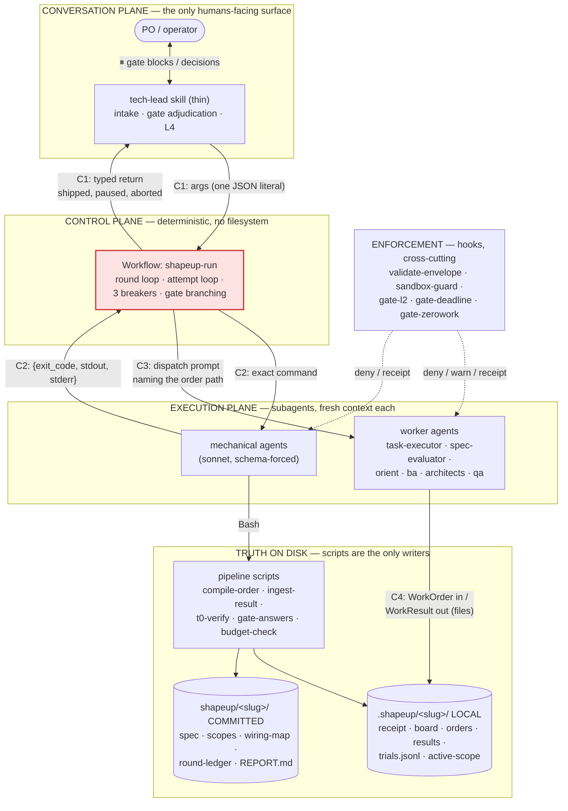
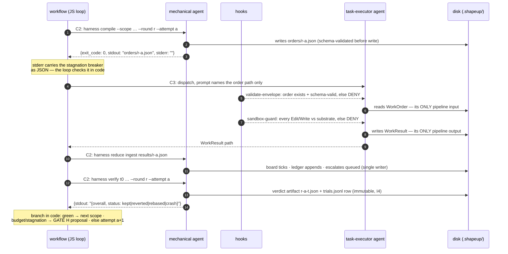
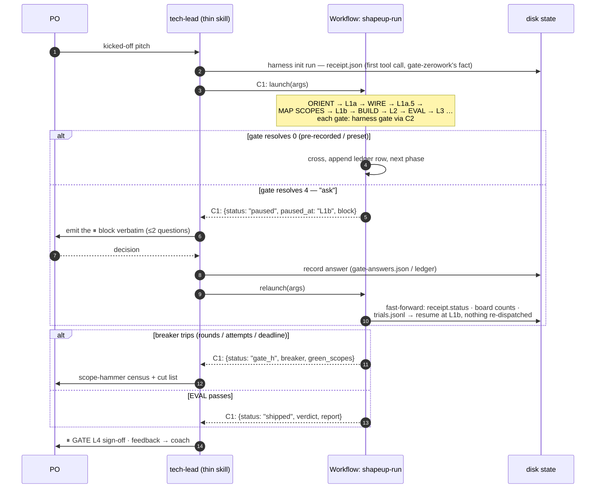
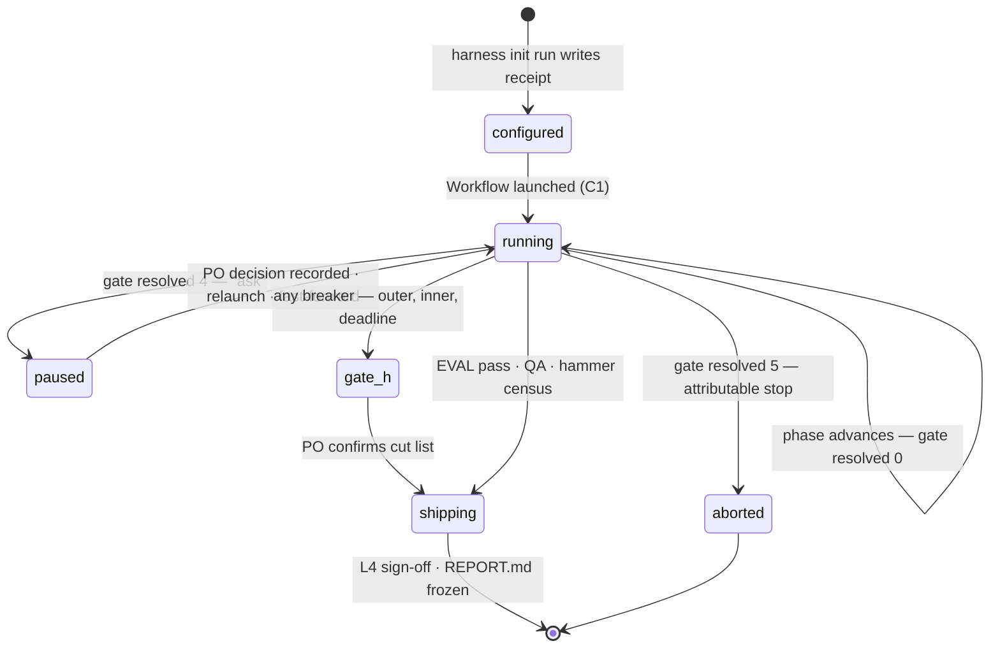

# To-be architecture — how the system communicates once the control plane is a Workflow

The extraction review that argued *whether* to move the control plane into a workflow has been
retired now that the cutover has shipped; this document is what survives it, and it draws *how*:
every component, every channel between them, and the exact shape of what travels on each channel —
with the workflow's four communication channels as the focus.

The design rule carried over from the harness unchanged: **every channel is typed, and every
channel has exactly one writer.** Prose crosses no boundary. What used to be "the orchestrator
reads the runbook and talks to workers" becomes six named channels, each with a schema, a carrier,
and a single writer.

---

## 1. The system map — who talks to whom



Three structural facts the picture encodes:

- **The workflow touches no file.** It has no filesystem — every read and write goes through a
  script, run by a mechanical agent. Single-writer (D6) stops being a discipline and becomes a
  physical property of the orchestrator.
- **The hooks sit under the execution plane, not the control plane.** They intercept the
  *worker-side* tool calls (`Skill`, `Edit/Write`) exactly as today — which is why they survive
  the change of orchestrator unmodified.
- **The PO never meets the workflow.** Every human interaction goes through the thin skill; the
  workflow's only human-visible surface is the progress tree (`phase()`/`log()`) and its typed
  return.

---

## 2. The six channels — the communication contract

| # | Channel | Carrier | Shape | Writer → Reader |
|---|---|---|---|---|
| C1 | Launch / return | Workflow `args` in, return value out | `RunArgs` / `RunReturn` (below) | tech-lead → workflow → tech-lead |
| C2 | Mechanical | agent prompt (exact command) in, schema-forced JSON out | `{exit_code, stdout, stderr}` | workflow ↔ sonnet courier agent |
| C3 | Dispatch | agent prompt naming the order path | prompt carries only the path + report-back instruction | workflow → worker agent |
| C4 | Envelope | files on disk | `work-order.schema.json` / `work-result.schema.json` — **unchanged** | compile-order → worker; worker → ingest-result |
| C5 | Enforcement | PreToolUse/Stop stdin JSON; `decisions.jsonl` receipts | deny / warn / allow + one receipt row per evaluation | hooks → runtime + audit |
| C6 | Gate & resume | `gate-answers.json` + exit codes; disk facts for fast-forward | answers schema; exit 0/4/5; `receipt.json` + board + `trials.jsonl` | scripts ↔ workflow; PO decision via tech-lead |

C4 and C5 are **today's channels, verbatim** — the envelope port and the hook layer do not change
by one byte. C1, C2, C3 and the pause half of C6 are the new material; the rest of this document
specifies them.

### C1 — launch and return, the workflow's only conversation

The skill passes everything the run will ever need as one literal, because the workflow cannot ask
follow-ups and cannot read config files itself:

```jsonc
// args (RunArgs) — compiled by tech-lead at GATE L0, from harness init run output
{
  "slug": "island-escape",
  "autoLevel": "unattended",            // interactive | auto | unattended
  "answers": "ci",                       // preset name or path to gate-answers.json
  "models":  { "exec": "sonnet", "eval": "sonnet", "qa": "sonnet" }, // L0.8 matrix — floor: sonnet, no haiku (PO decision)
  "budgets": { "maxRounds": 3, "attemptBudget": 5, "wallClockS": 1800 },
  "pluginRoot": "/…/plugins/shapeup-sdlc",
  "startedAt": "2026-08-06T09:14:00Z",   // Date.now() is unavailable in-script — passed in
  "lane": "full"                          // fit-check verdict: full | tiny
}
```

The return value is the *only* way the workflow speaks, so it is a tagged union — one `status`
field the skill branches on, mirroring how the scripts speak in exit codes:

```jsonc
// return (RunReturn)
{ "status": "shipped",                    // the happy ending
  "verdict": "pass", "rounds_used": 2,
  "dims_not_evaluated": ["performance"], "qa_findings": 3,
  "report": "shapeup/island-escape/REPORT.md" }

{ "status": "paused",                     // every gate answered "ask" lands here
  "paused_at": "L1b",
  "block": "⏸ GATE L1b — Board Review\n…", // emitted VERBATIM by the skill — the block is the contract
  "valid_decisions": ["proceed", "ask", "abort"],
  "context": { "round": 1, "scopes": 3, "spec_lint": "green" } }

{ "status": "aborted",                    // exit-5 path, attributable
  "aborted_at": "L4", "reason": "no pre-recorded answer in an unattended lane" }

{ "status": "gate_h",                     // any breaker tripped — ship what is green
  "breaker": "deadline",                  // outer | inner | deadline
  "hammer_proposals": ["scope-auth"], "green_scopes": ["scope-map", "scope-hud"] }
```

### C2 — the mechanical channel: scripts, spoken through agents

The workflow's substitute for Bash. One helper, one schema, model pinned to the run's floor —
**Sonnet, on every agent including these couriers (PO decision, 2026-08-06: no Haiku in any
phase)** — this is DD-7 ("deterministic tooling, zero LLM tokens") adapted to a runtime where
*someone* must hold the shell:

```js
const MECH = { type: 'object',
  properties: { exit_code: {type:'integer'}, stdout: {type:'string'}, stderr: {type:'string'} },
  required: ['exit_code', 'stdout', 'stderr'] }

const mech = (cmd, phase) => agent(
  `Run exactly this command, change nothing, and return its outcome as data:\n${cmd}`,
  { model: 'sonnet', effort: 'low', schema: MECH, phase, label: cmd.split('/').pop().slice(0, 30) })
```

The agent adds no judgment — the schema forces it to return the script's own words. The workflow
then branches on `exit_code` and parses `stdout`/`stderr` itself, in code. Every deterministic
decision stays in the script; every branch on that decision stays in the workflow; the model in
between is a courier.

### C3 — the dispatch channel: the zero-memory boundary, kept

A worker dispatch is a fresh `agent()` whose prompt carries **only the order path** — the payload
travels on C4, not in the prompt, exactly as `protocol.md` prescribes today:

```js
await agent(
  `Call Skill(shapeup-sdlc-plugin:task-executor) --order ${orderPath}.
   Report back: the WorkResult path (.shapeup/${args.slug}/results/${id}.json).`,
  { model: args.models.exec, phase: 'Build', label: `build:${scopeId}-a${attempt}` })
```

Fresh context per `agent()` call **is** the zero-memory handoff (PA6) — the isolation the attempt
loop assumes is now guaranteed by the runtime rather than by the instruction "dispatch a fresh
Agent". The `validate-envelope` hook fires on the `Skill` call inside this agent (C5), so a
malformed order is denied at the same point in the same way as today.

---

## 3. One attempt, all channels — the core interaction



The property to notice: **steps 1–15 contain no prose decision.** The only model-shaped work is
inside step 5–9, where it belongs — the worker's craft. Everything the old orchestrator could get
wrong between dispatches (skip the ingest, eval a partial board, forget the breaker, narrate) is
now either a line of code or unrepresentable.

---

## 4. The run lifecycle — gates as returns, resume as re-derivation



**The fast-forward algorithm (step 13)** is the same derivation `harness init run` already performs
for its exit-3 RESUME STATE, moved to where it can never be skipped:

```
on launch, before phase 1:
  receipt   = mech(read receipt.json)          — absent → fresh run, start at ORIENT
  status    = receipt.status                    — orienting|mapping|building|evaluating|…
  board     = mech(board-derive / read _index)  — done/total counts
  trials    = mech(tail trials.jsonl)           — last attempt per scope, kept/reverted
  jump to the first phase whose artifacts are incomplete; never re-dispatch an order
  that already has a result (orders/ vs results/ set difference — pure code)
```

This is why the pause protocol needs no session affinity: a relaunch in a fresh session, a crash,
or the Workflow runtime's own `resumeFromRunId` all converge on the same disk facts. "Progress is
derived, never claimed" was written to stop workers lying about done-ness; it turns out to be
exactly the property that makes an orchestrator resumable.

---

## 5. Run states — what the skill can observe



Two transitions deliberately absent, and their absence is the design: there is no
`running → done-by-claim` (the narrated-run arc — a workflow ends only through a typed return),
and no `paused → timeout` (the F3 arc — a pause is a *return*, so nothing is waiting; the clock
only runs while the workflow runs, and `harness verify budget` is consulted at every round boundary by
code).

---

## 6. Design decisions worth recording

Rows marked **[D1–D5]** were confirmed by the PO on 2026-08-06, against the staging the extraction
review proposed: D2 revised its original staging; D5 revised its original Haiku courier tier;
D1/D3/D4 adopted it as drafted. The rows below are now the record — the review they amended is not
in the tree.

| Decision | Alternative rejected | Why |
|---|---|---|
| **[D2] One lane from the cutover release** — the prose orchestrator is deleted, both interactive and unattended move to the Workflow at once; rollback = pin the previous plugin version | keeping the inline prose lane as a "frozen" in-tree fallback (the review's original draft) | dual paths are a measured defect class here (v1.6.1); a frozen lane diverges silently the moment loop semantics change, and it is the copy nobody tests — a pinned release cannot diverge. Conditions priced in: headless availability is a Stage-0 kill-switch, and both lane types green is the cutover's ship gate |
| **[D4]** Pause = return + relaunch, state on disk | in-flight human input to a running workflow | the runtime has no such channel; and disk-derived re-entry works across sessions/crashes, which in-flight input never would |
| Mechanical agents per script call | folding compile/ingest into the worker's agent | keeps the worker blind to pipeline mechanics (v1.0's point); a worker that ingests its own result sits inside its own trust boundary |
| One `RunReturn` union, skill branches on `status` | free-text workflow summaries | the exit-code lesson (`harness gate`) applied to the orchestrator itself: prose gets paraphrased, tags get branched on |
| **[D3]** ~~Scopes sequential~~ — resolved in v2.0 | `pipeline()` over scopes, `args.maxParallelScopes` (default 4) | The singleton substrate pointer this deferral rested on is gone: `sandbox-guard` reads every LIVE order, so no shared mutable state decides which contract a leg is held to. Worktree isolation stays out — a fresh worktree does not carry the gitignored run state the legs need |
| Gate blocks composed by the workflow, emitted verbatim by the skill | skill re-summarizing gate state | the block is the handoff contract today (Hard Rules); re-phrasing is the paraphrase channel this design exists to close |
| `args.startedAt` passed in | reading the clock in-script | `Date.now()` is unavailable in workflow scripts by design; the deadline breaker (`harness verify budget`) computes elapsed itself in Node, where the clock lives |
| **[D5]** Model floor: Sonnet on every agent — workers, judge, QA, and the mechanical couriers alike | Haiku couriers and QA tier (3–5× cheaper) | PO decision 2026-08-06: courier fidelity over cost — a mis-transcribed `stdout` corrupts the pipeline at its narrowest channel, and the delta is ≲ $1/round. Historical benchmark rows measured on Haiku 4.5 remain valid as *history*; no future phase runs below Sonnet |

**[D1]** Open items are gated, not assumed: Stage 0 is the kill-switch and now carries three
checks — hooks fire inside workflow subagents (every dashed arrow in diagram §1), the permission
grant covers their Bash calls (every `mech()` call), and the Workflow tool exists under
`claude -p` (the unattended lane's existence after D2). The migration starts only if all three
pass.
