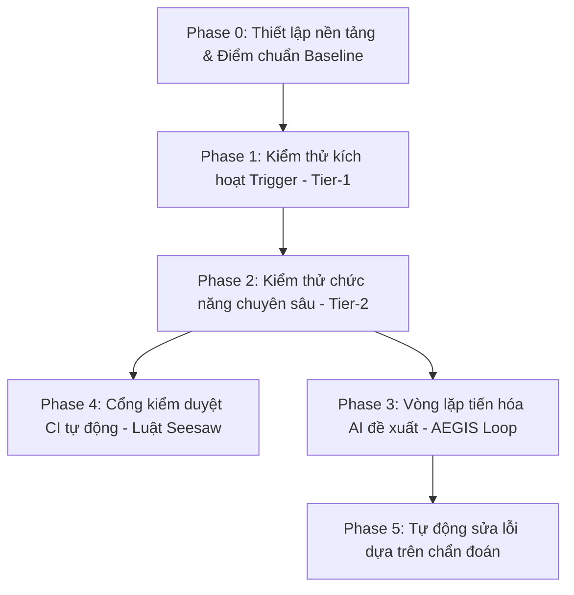

# Giải thích chi tiết Evolution Roadmap — Tạo cơ chế tự cải tiến cho Agent Harness

Tài liệu này giải thích chi tiết về [evolution-roadmap.md](file:///Users/teo/workspace/proj-harness-plugin/docs/plan/evolution-roadmap.md) bằng tiếng Việt, giúp bạn hiểu rõ mục đích của từng phase, lý do tại sao chúng ta cần xây dựng hệ thống này, và đưa ra ví dụ minh họa đơn giản để dễ hình dung.

---

## 1. Tại sao chúng ta cần hệ thống này? (Why we need this?)

Hiện tại, các kỹ năng (skills) của AI Agent nằm trong thư mục `skills/` được viết bằng tiếng Anh (ngoại trừ skill `translator` đóng vai trò làm cổng dịch thuật song ngữ tiếng Việt sang tiếng Anh). Khi chúng ta chỉnh sửa các file này (ví dụ: thay đổi điều kiện kích hoạt, tối ưu hóa câu từ, sửa đổi logic đầu ra):
- **Không có cách nào đo lường định lượng**: Chúng ta không thể biết thay đổi đó thực sự giúp Agent thông minh hơn hay đang làm hỏng các tính năng cũ (lỗi ngầm - *silent regression*).
- **Nguy cơ lỗi trigger**: Việc thay đổi prompt thủ công rất dễ khiến mô hình hiểu sai ngữ cảnh hoặc kích hoạt nhầm skill (ví dụ: hỏi về lập trình nhưng lại kích hoạt nhầm skill dịch thuật).

**Mục tiêu của Evolution Roadmap:** Tạo ra một **vòng lặp tiến hóa tự động (Evolution Loop)** để mọi thay đổi đối với skill đều được kiểm tra, chấm điểm tự động dựa trên một bộ dữ liệu mẫu chuẩn (baseline). Một thay đổi chỉ được phép tích hợp (merge) nếu nó **tốt hơn hoặc bằng** kết quả cũ, bảo đảm không xảy ra lỗi giật lùi (regression).

---

## 2. Mục đích chi tiết của từng Phase (Phase Purpose)

Quy trình tiến hóa được chia làm 6 giai đoạn (từ Phase 0 đến Phase 5) đi từ việc xây dựng nền tảng thử nghiệm cho tới tự động hóa cải tiến bằng AI:

### 🔴 Phase 0: Foundations & baseline (Thiết lập nền tảng & Điểm chuẩn) — *Đã hoàn thành*
- **Mục đích**: Định hình cấu trúc quản lý các file test cho từng skill (nằm trong thư mục `evals/` của mỗi skill) và lưu giữ điểm số chuẩn ban đầu (`baselines/<name>.json`).
- **Luật mới**: Kể từ phase này, bất kỳ khi nào nhà phát triển nâng cấp phiên bản của skill (ví dụ từ v2.9 lên v3.0), họ bắt buộc phải chạy test, cập nhật file baseline này và chứng minh không làm giảm chất lượng hệ thống.

### 🔴 Phase 1: Tier-1 trigger-evals (Kiểm thử kích hoạt - Tier-1) — *Đã hoàn thành & Đo lường*
- **Mục đích**: Tập trung vào khả năng kích hoạt đúng skill (routing).
- **Cách hoạt động**:
  - Viết khoảng 20 câu lệnh mẫu (queries) bằng tiếng Anh cho mỗi skill (ngoại trừ skill `translator` được viết bằng cả tiếng Anh và tiếng Việt để kiểm thử cổng dịch thuật L0).
  - Bao gồm các câu test kích hoạt đúng (positive) và kích hoạt sai/gây nhiễu chéo (hard negatives) để kiểm tra xem hệ thống có bị nhầm lẫn giữa các skill tương tự nhau hay không.
  - Sử dụng AI để viết lại và tối ưu hóa mô tả (`description`) của skill cho đến khi đạt điểm số nhận diện tốt nhất mà không bị quá khớp (overfitting).

### 🟡 Phase 2: Tier-2 per-skill functional golden fixtures (Kiểm thử chức năng - Tier-2)
- **Mục đích**: Kiểm tra xem skill có thực hiện đúng nhiệm vụ chuyên môn của nó và đem lại giá trị thực tế hay không.
- **Cách hoạt động**: 
  - Tạo ra các kịch bản kiểm thử chức năng (fixtures) kèm theo các điều kiện khẳng định (assertions) bắt buộc.
  - Thực hiện so sánh kết quả khi chạy **có dùng skill (with-skill)** và **không dùng skill (without-skill)** để tính toán giá trị chênh lệch (delta). Agent phải chứng minh nó giúp giải quyết công việc tốt hơn chứ không chỉ đơn giản là chạy qua bài test.

### 🟡 Phase 3: The evolution loop (Vòng lặp tiến hóa thích ứng AEGIS)
- **Mục đích**: Sử dụng chính AI Agent để tự đọc các lỗi kiểm thử, tự sửa prompt/cấu trúc của skill và đề xuất bản vá.
- **Quy trình 4 bước (AEGIS Loop)**:
  1. **Digester (Bộ tiêu hóa)**: Phân tích log lỗi từ các bài test hoặc từ production để tìm ra skill nào đang yếu.
  2. **Planner (Bộ lập hoạch)**: Xác định những lỗi cụ thể cần sửa và lên kế hoạch chỉnh sửa.
  3. **Evolver (Bộ tiến hóa)**: Đề xuất nội dung chỉnh sửa prompt mới kèm theo một bản kê khai thay đổi (change manifest).
  4. **Critic (Bộ phê bình)**: Dừng lại ở đây và gửi đề xuất cho lập trình viên (con người) đánh giá và duyệt (Human-in-the-loop). Hệ thống **không tự động commit** vào code chính để đảm bảo an toàn.

### 🔴 Phase 4: CI seesaw gate (Cổng kiểm duyệt CI tự động - Luật Seesaw) — *Đã hoàn thành*
- **Mục đích**: Bảo vệ mã nguồn tự động trên môi trường Tích hợp liên tục (CI) mà không tốn chi phí gọi API của mô hình ngôn ngữ lớn (LLM).
- **Luật Bập bênh (Seesaw Constraint)**: Khi bạn gửi một Pull Request (PR) thay đổi một skill, CI sẽ chạy kiểm tra:
  - So sánh kết quả của PR với baseline đã commit.
  - **Bắt buộc**: Tất cả các test case đã PASS ở bản cũ thì ở bản mới *vẫn phải PASS* (không được thụt lùi). Đồng thời, tổng điểm tổng quát phải lớn hơn hoặc bằng baseline cũ. Nếu vi phạm, PR sẽ bị chặn (block merge).

### 🟡 Phase 5: Diagnosis-driven repair (Tự sửa lỗi dựa trên chẩn đoán) — *Tương lai*
- **Mục đích**: Tự động hóa ở mức độ cao hơn. Khi hệ thống vận hành thực tế gặp lỗi (triệu chứng như: xử lý quá nhiều vòng lặp, người dùng phản hồi không tốt), hệ thống sẽ tự động gửi yêu cầu sửa lỗi tới **Phase 3** để tiến hóa và vá lỗi dựa trên bộ nhớ sửa chữa (`repair-memory.md`).

---

## 3. Ví dụ minh họa thực tế dễ hiểu

Hãy tưởng tượng bạn đang quản lý một AI Agent hỗ trợ lập trình và có 2 skill chính:
1. `translator`: Chuyên dịch thuật tài liệu Anh - Việt.
2. `task-executor`: Chuyên đọc yêu cầu lập trình và viết code.

### Tình huống:
Bạn muốn cập nhật prompt của skill `translator` để nó dịch thuật ngữ IT sang tiếng Việt mượt mà và tự nhiên hơn (ví dụ: thay vì dịch thô "deployment pipeline" thành "đường ông triển khai", nó nên dịch là "quy trình triển khai").

### Quy trình áp dụng Roadmap:
1. **Thiết lập Test case (Phase 1 - Trigger & Phase 2 - Functional)**:
   - **Test Trigger (Tier-1)**:
     - Câu hỏi: *"Dịch hộ tôi đoạn này sang tiếng Việt"* -> Mong đợi: kích hoạt `translator` (Positive).
     - Câu hỏi: *"Hãy viết code Python tạo một API"* -> Mong đợi: **không** kích hoạt `translator` mà phải kích hoạt `task-executor` (Hard Negative).
   - **Test Chức năng (Tier-2)**:
     - Cho Agent dịch một đoạn văn có từ khóa "deployment pipeline". Assert (Khẳng định): Kết quả dịch bắt buộc phải chứa cụm từ *"quy trình triển khai"*.

2. **Chạy baseline và cập nhật (Phase 0 & Phase 4)**:
   - Bạn chạy thử bản cũ (v1.0), hệ thống PASS 100% các bài test và lưu vào `evals/baselines/translator.json`.
   - Bạn tiến hành sửa prompt trong `skills/translator/SKILL.md` để tối ưu câu từ tiếng Việt.

3. **Kiểm tra thông qua CI Gate với Luật Seesaw (Phase 4)**:
   - Bạn gửi code lên GitHub (Pull Request). CI tự động chạy kiểm thử.
   - **Trường hợp A (Thất bại)**: Prompt mới của bạn dịch tiếng Việt rất hay, nhưng vô tình làm mô hình bị nhầm lẫn. Khi gặp câu hỏi *"Hãy viết code Python"*, nó lại nhảy vào skill `translator` để dịch thay vì viết code.
     - **Kết quả**: Test case Hard Negative bị FAIL (bản cũ vốn đã PASS). CI áp dụng luật **Seesaw**, chặn không cho merge PR này và yêu cầu bạn sửa lại.
   - **Trường hợp B (Thành công)**: Prompt mới vừa dịch chuẩn thuật ngữ IT, vừa phân biệt đúng câu hỏi code và câu hỏi dịch. Tất cả test case cũ vẫn PASS và điểm số dịch thuật tăng lên.
     - **Kết quả**: CI cho phép merge. Bạn cập nhật file baseline mới lên hệ thống.

---

> [!NOTE]
> Sự kết hợp giữa **Luật Seesaw (Deterministic Gate)** ở Phase 4 và **Vòng lặp tiến hóa (AEGIS Loop)** ở Phase 3 đảm bảo các AI Agent của chúng ta có thể liên tục cải tiến một cách an toàn mà không sợ bị hỏng hóc các tính năng cốt lõi đã xây dựng từ trước.
