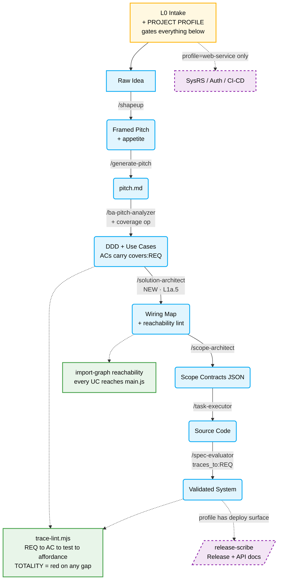

# ShapeUp SDLC — Documentation-Gap Review & Workflow Redesign

> **Input:** a Software-Engineering-lens review of the ShapeUp SDLC plugin arguing it leaves
> **4 core documentation gaps** (SysRS/infra, UML diagrams, Traceability Matrix, Ops/Maintenance
> docs) versus classical SWE standards (SRS/URS/SysRS/Traceability Matrix).
>
> **This document:** triages those four gaps against what the harness actually is, and
> re-designs the roles/skills that would close the *real* gap without deepening the failure mode
> the conformance audit found. Companion to `retro-blobber/conformance-audit-report.md`.

---

## 1. The framing trap (why "add 4 documents" is the wrong move)

The input review measures maturity by **which documents exist**. The conformance audit proved
that metric is necessary-but-not-sufficient, and dangerously so.

The `retro-blobber` run **had** a domain model, use-cases, and per-module contracts. The customer
clause *"Players can side-step or lure enemies into traps"* (§2.2) was dropped anyway, and 152
unit tests + 18 browser tests stayed green. **A document existing did not preserve the
requirement.**

Therefore "add 4 more documents" repeats the exact failure at higher cost: four more LLM-authored
artifacts, none checked by a script, each a fresh place to soften a clause. The disease was never
missing paper — it was **no mechanical closure check** between the customer's words and the
running code.

> **Governing rule for everything below:**
> If a script can't check it, it's decoration — and decoration is where requirements go to die.
> Every role added here must emit a *checkable* artifact (a graph with a reachability assertion, a
> `covers:` field with a totality lint), or it does not get added.

**Second-order irony:** this repo's own knowledge base already contains **KB-BA-002**, which warns
against applying "the web/mobile monorepo archetype (HTTP repositories, DB migrations, cross-context
events)" to a client-only game. The input review demands Swagger, ERD, Auth flows, and CI/CD for a
**single-file three.js game with no backend, no database, no API, and no deploy target** — i.e. it
does the precise thing KB-BA-002 exists to prevent.

---

## 2. Triage of the 4 proposed gaps

| Review's gap | Verdict for this harness | Rationale |
|---|---|---|
| **#3 Traceability Matrix + QA Plan** | ✅ **Real, universal, highest priority** | This is the clause-coverage + Green-Fixture finding in SWE vocabulary. Archetype-independent. The one to build. |
| **#2 UML / Architecture Diagrams** | 🟡 **Real *only if* made checkable** | A hand-drawn Sequence/ERD is decoration that drifts and can lie. A *generated* wiring graph with a reachability assertion is the real fix for orphan modules. ERD is moot — no DB. |
| **#1 SysRS / CI-CD / Auth flows** | 🔴 **Archetype-specific — must be conditional** | This project has no infra, no auth, no pipeline. Mandating these fires KB-BA-002. Legitimately real for a *web-service* project. |
| **#4 Ops / API Manuals / Swagger / Migration** | 🔴 **Archetype-specific — must be conditional** | No API, no persistence, no migration (`db_probe` was already deliberately omitted per DEFECT-001). Real for a backend project only. |

The review treats all four as flat and mandatory. Two are gaps only **relative to an archetype
this project isn't.** That distinction *is* the redesign.

---

## 3. The redesign — one profile gate + two roles + one spine

### 3.0 `L0` intake gains a **Project Profile** (mechanism, not a skill)

`/tech-lead` at kickoff classifies the project:
`client-only-game | web-service | mobile | library | data-pipeline`.

The profile **gates which document-roles are even eligible to fire**:

- `client-only-game` → SysRS, Auth, CI/CD, ERD, Swagger, migration are **structurally skipped**
  (absent by declaration, not "forgotten").
- `web-service` → those same roles become **mandatory**.

This is what stops the harness from cargo-culting docs into a game *or* dropping them from a real
backend. It is the direct answer to the review's Q1 ("where is infra defined before code?"):
infra is **profile-gated intake**, not something "left to Scope."

### 3.1 `/solution-architect` — new gate **L1a.5** (between BA and scope-architect)

Subsumes the review's gap #2, but as a **checked graph, not a drawing.** Owns the integration
topology: for every UC, `engine → wiring seam → entry-point call site → player-visible affordance`.

- **Artifact:** a machine-readable wiring map.
- **Oracle it emits:** an **import-graph reachability lint** folded into `spec-lint.mjs` — a UC
  whose engine does not reach `main.js` (the entry point) goes **red**.
- **Diagram, for free:** the Sequence/architecture diagram the review wants is **auto-rendered
  from that graph** (Mermaid), so it cannot drift or lie — same principle as "hill phase is
  mechanical, never self-reported."

Closes the 631-line orphan `src/assets/*` and the four duplicate `main.js` substrate escalations
*before* build starts.

### 3.2 The **Traceability Spine** — gap #3, done as an oracle (NOT a decorative doc)

The one that matters. It must **not** be a Markdown file an agent writes — it is a
**field obligation + a closure script**:

- `/ba-pitch-analyzer` gains a `coverage` operation: extract every atomic clause from
  `docs/req-*.md` as `REQ-ids`; every AC declares `covers: [REQ-id]`; every clause is `covered` or
  explicitly `CUT (PO-approved)`.
- `/spec-evaluator` and `/qa-edge-hunter` findings carry a back-link `traces_to: [REQ-id]` — which
  answers the review's Q3: an edge case maps to a business requirement by **id**, not by reading a
  linear `ledger.md` log.
- New oracle **`trace-lint.mjs`**: asserts **totality** — every `REQ-id` reaches ≥1 AC **and**
  ≥1 test. An unmapped clause is **red**.

`side-step` and `low-res textures` would have been red on day one. Judgment (LLM) produces the
mapping; arithmetic (script) proves closure. That is the only configuration in which an LLM
document-role is safe.

### 3.3 `/release-scribe` — gap #4, **profile-gated and generated, not authored**

Eligible only when the profile has a deploy/API surface. Even then it **generates** release notes
and API specs *from* the shipped contracts + the trace matrix — never hand-writes them. For this
game: it does not fire.

---

## 4. Revised document-flow architecture

Legend: blue = existing/adapted skill · amber = gate · green = deterministic oracle (no LLM) ·
purple dashed = profile-gated, fires only for the archetypes that have that surface.

---

## 5. What each proposed gap maps to (summary)

| Review gap | Owner in redesign | Machine-checkable artifact | Fires for this game? |
|---|---|---|---|
| #3 Traceability | `/ba-pitch-analyzer` `coverage` + spine | `trace-lint.mjs` totality closure | ✅ yes |
| #2 UML/architecture | `/solution-architect` (L1a.5) | reachability lint + auto-Mermaid | ✅ yes |
| #1 SysRS/CI-CD/Auth | profile-gated intake | conditional SysRS contract | ❌ no (client-only) |
| #4 Ops/API/migration | `/release-scribe` | generated from contracts+RTM | ❌ no (no deploy surface) |

---

## 6. Answering the review's Q&A directly

1. **Infra / CI-CD:** not "left to Scope" — declared at **L0 via the Project Profile**. Absent by
   declaration for `client-only-game`; mandatory contract for `web-service`.
2. **UML tooling:** Mermaid, but **generated from the solution-architect's wiring graph**, never
   hand-drawn — so the diagram is a *view* of a checked structure and cannot drift from the code.
3. **Traceability of a QA edge case → business requirement:** via a `traces_to: [REQ-id]` field on
   every finding, closed by `trace-lint.mjs`, instead of grepping a linear `ledger.md`.

---

## 7. Bottom line

The review's instinct — *"this workflow is under-documented"* — is half right. The precise
diagnosis is: **it is under-*verified*, and adding unverified documents deepens the hole.**
Traceability (gap #3) is the correct fix precisely because it is the one gap that is inherently
mechanical. The other three are real only for project archetypes this one is not, which is why they
belong behind a **profile gate**, not in the mandatory path.

**Smallest step that proves the whole redesign:** write `trace-lint.mjs` (`covers:`-closure +
import-graph reachability) and run it against this repo. It should go **red** on the dropped clauses
and on `src/assets/*` — which is how you validate the spine before trusting a single new agent.
