Shape Up Skills Roadmap — v2 (post QA-meeting, 2026-06-11)

Reflects the implemented state: `ba-pitch-analyzer` **v2.9** (Test Surface + `--surface-only`),
`spec-evaluator` **v0.5** (dimension `test-surface-conformance`), `tech-lead` **v0.10**
(automated discovered tasks + regression rule + QA wiring + SHIP S.0 triage + SHIP S.6 metrics harvest + Two-root workspace), `qa-edge-hunter`
**v1.1** (new skill), `shapeup` **v2.2** (per-run context-compaction digest + Two-root workspace).

```mermaid
graph TD
    %% PHASE 1: SHAPING — covered by /shapeup
    subgraph Phase1 ["PHASE 1: SHAPING — skill: /shapeup"]
        A([Raw Idea]) --> B["(1) Set Boundaries<br>/shapeup shaping"]
        B --> C["(2) Find the Elements<br>/shapeup breadboarding"]
        C --> D["(3) Risks & Rabbit Holes<br>/shapeup spike"]
        D --> E["(4) Write the Pitch<br>/generate-pitch → pitch.md"]
    end

    %% PHASE 2: BETTING — human governance gap
    subgraph Phase2 ["PHASE 2: BETTING — NO SKILL (PO governance)"]
        E --> F{"(5) The Betting Table<br>PO decides"}
        F -. "Skip" .-> A
    end

    %% PHASE 3: BUILDING — orchestrated by /tech-lead v0.10
    subgraph Phase3 ["PHASE 3: BUILDING — orchestrator: /tech-lead v0.10"]
        F -- "Bet (kicked-off pitch)" --> G["(6) Kick-off<br>PO-personal<br>(/shapeup kickoff-doc assists)"]
        G --> L0[/"⏸ GATE L0 — Intake & Config<br>(/translator if non-English)"/]
        L0 --> H["(7) Orient<br>delegate → /orient (Scout)"]
        H --> L1a[/"⏸ GATE L1a — Orient Review 🗻"/]
        L1a --> J["(8) Map the Scopes<br>delegate → /ba-pitch-analyzer v2.9<br>UC + Invariants + ## Test Surface ★<br>(D1 Inv · D2 Err · D3 Contract · D4 No-go)"]

        H -. "discovered-task seed" .-> I2(("DISCOVERED TASKS<br>.shapeup-sdlc/&lt;slug&gt;/discovery/ledger.md"))
        J --> L1b[/"⏸ GATE L1b — Board Review"/]
        L1b --> K["(9) Build Vertically<br>delegate → /task-executor loop"]

        K -- "P3.7 logs discovered tasks" --> I2
        I2 -- "ba --tasks-only --from-discovered<br>(new INV → with TS-INV row ★)" ==> J

        K --> L2[/"⏸ GATE L2 — Board 100% ✅"/]
        L2 --> EV["EVAL — ONCE per round<br>/spec-evaluator v0.5<br>dims: spec-conformance<br>+ completeness (auto)<br>+ test-surface-conformance (auto ★)"]
        EV --> L3{"⏸ GATE L3 — Verdict<br>(10) Report 🗻 Hill slice-level"}
        L3 -- "FAIL → fix round r+1<br>regression rule ★: bugs<br>+ FULL Test Surface<br>of touched UC" --> K
    end

    %% QA EDGE HUNT — /qa-edge-hunter v1.1
    subgraph PhaseQA ["QA EDGE HUNT — /qa-edge-hunter v1.1 (pure worker · post-PASS · pre-ship · --no-qa to skip)"]
        L3 -- "first PASS" --> Q0[/"⏸ GATE Q0 — Preflight<br>hard: app · EVAL-PASS · ledger<br>soft: Test Surface?<br>missing → DEGRADED MODE<br>(suggests ba --surface-only)"/]
        Q0 --> QC["Phase Q1 — Charter Map<br>6 fixed lenses ①–⑥<br>− area EVAL already probed<br>(EVAL report = negative space)"]
        QC --> Q1[/"⏸ GATE Q1 — Charter Review<br>scope hammer on QA itself"/]
        Q1 --> QH["Phase Q2 — HUNT 🔍<br>session-based · repro required<br>on the running app"]
        QH -- "every finding defaults to ~<br>+ severity-hint + contradicts:" --> I2
        QH --> QR["Phase Q3 — .shapeup-sdlc/&lt;slug&gt;/qa/hunt-report.md<br>NO verdict · NO score<br>+ shaping-quality signal per lens"]
    end

    %% SHIP + TRIAGE
    QR --> M["(11) Decide When to Stop & Ship<br>SHIP S.0 ★ — TRIAGE findings<br>vs BASELINE · PO/TL decides<br>promote or keep ~"]
    L3 -. "--no-qa → straight to SHIP<br>(ledger: qa skipped)" .-> M
    M --> L4[/"⏸ GATE L4 — Ship Sign-off<br>QA status shown ★"/]

    %% Promoted loop
    M -- "promote → fix round r+1<br>(only those items)" --> K
    L4 -. "after fix: eval --single-pass<br>→ qa --recheck (only re-probe<br>promoted items, annotate ✦)" .-> M

    L4 -. "remaining ~ findings + new feedback<br>→ raw idea (debt-free)" .-> A

    %% Retrofit path for legacy specs
    OLD["Spec pre-v2.9<br>(no Test Surface yet)"] -. "ba --surface-only ★<br>frozen zone untouched<br>append-only" .-> J

    %% Styling
    classDef shape fill:#e3f2fd,stroke:#1e88e5,stroke-width:2px;
    classDef pitch fill:#bbdefb,stroke:#0d47a1,stroke-width:3px;
    classDef bet fill:#fff3e0,stroke:#f39c12,stroke-width:2px;
    classDef build fill:#e8f5e9,stroke:#43a047,stroke-width:2px;
    classDef gate fill:#fffde7,stroke:#fbc02d,stroke-width:1px,stroke-dasharray: 3 3;
    classDef idea fill:#f3e5f5,stroke:#8e24aa,stroke-width:2px,stroke-dasharray: 5 5;
    classDef discovered fill:#ffcdd2,stroke:#d32f2f,stroke-width:3px,color:#000;
    classDef eval fill:#ede7f6,stroke:#5e35b1,stroke-width:2px;
    classDef qa fill:#fce4ec,stroke:#c2185b,stroke-width:2px;
    classDef old fill:#eceff1,stroke:#607d8b,stroke-width:1px,stroke-dasharray: 4 4;

    class B,C,D shape;
    class E pitch;
    class F bet;
    class G,H,J,K,M build;
    class L0,L1a,L1b,L2,L4,Q0,Q1 gate;
    class L3 eval;
    class EV eval;
    class A idea;
    class I2 discovered;
    class QC,QH,QR qa;
    class OLD old;
```

## Legend of changes (★)

| ★ | Location | Skill / version | Content |
|---|---|---|---|
| 1 | Step 8 | `ba-pitch-analyzer` v2.9 | UC gains a `## Test Surface` — mechanically derived from 4 sources (D1–D4), anti-invention hard rule |
| 2 | `--tasks-only` branch | v2.9 | A new invariant appended to a UC → also carries a `TS-INV-NN` row |
| 3 | EVAL | `spec-evaluator` v0.5 | Dimension `test-surface-conformance` auto-enables when a UC has a Test Surface; report lists every TS row probed (= negative space for QA) |
| 4 | FAIL loop | `tech-lead` v0.10 | Regression rule: round r+1 grades bugs + the full Test Surface of any touched UC |
| 5 | Pink zone | `qa-edge-hunter` v1.1 | New skill — Q0 preflight (degraded mode first-class) → Q1 charter (6 lenses − covered) → Hunt (repro required, findings `~` → ledger) → report with no verdict |
| 6 | SHIP | `tech-lead` v0.10 | Step S.0 triage = "Decide When to Stop" — compare to baseline, PO/TL promotes; QA never self-promotes or blocks ship |
| 7 | GATE L4 | v0.10 | Shows QA status; the recheck loop only re-probes promoted items |
| 8 | Retrofit | v2.9 | `--surface-only` upgrades a legacy spec — frozen zone untouched |

## Architectural invariants preserved

- **A single judge** — the verdict still belongs to `spec-evaluator`; QA has no verdict and no score.
- **EVAL exactly once per round** — QA is not a second evaluation pass; it sits after PASS, outside the loop.
- **Ledger = single source of truth** — Orient, task-executor P3.7, and now QA all flow into `.shapeup-sdlc/<slug>/discovery/ledger.md`; QA only writes in its own section.
- **QA is a level-up, not a gate** — `--no-qa` can skip it; the circuit breaker outranks the Hunter; findings default to `~`.
- **Judge/generator/hunter role separation** — the Evaluator grades, task-executor fixes, QA discovers; no one does another's job.
