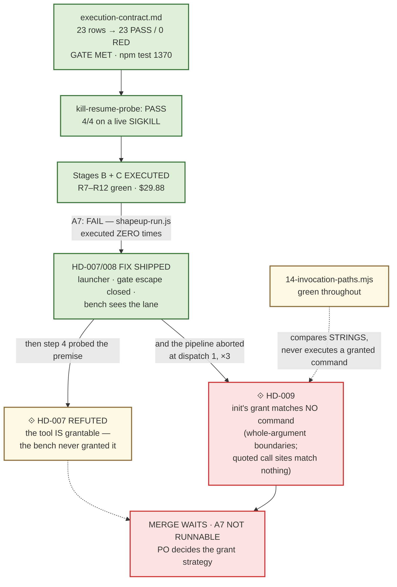
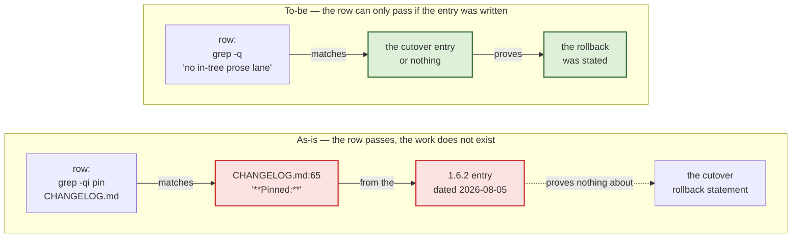
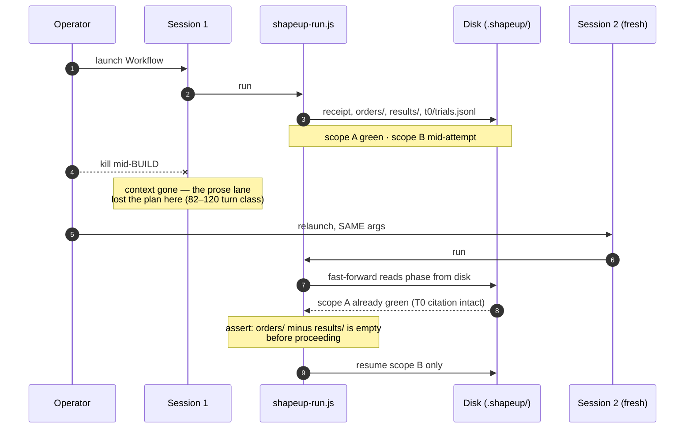
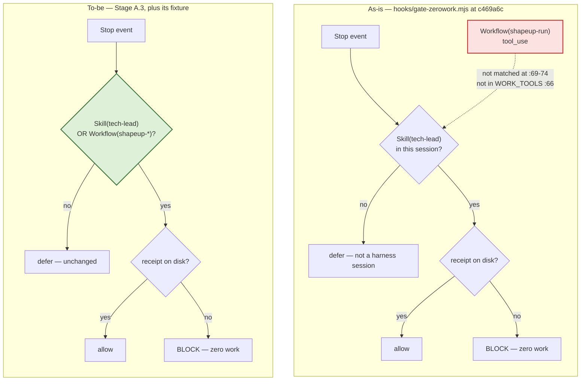
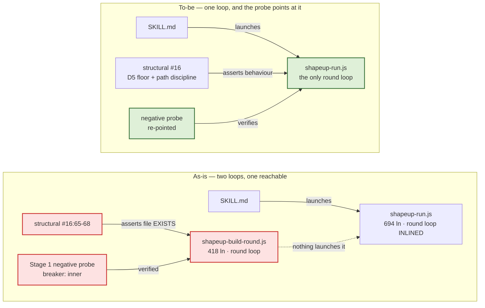
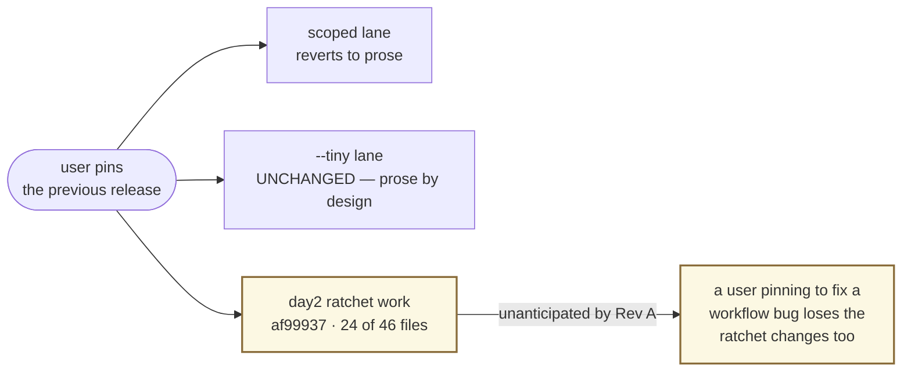
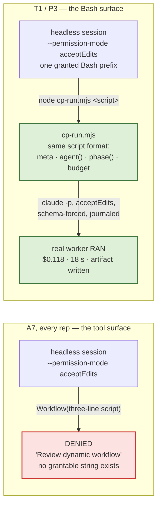
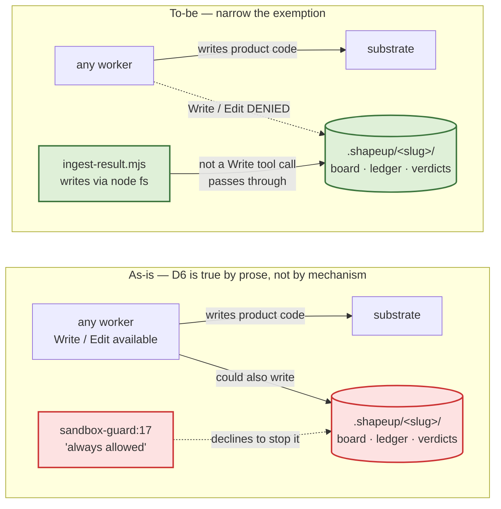
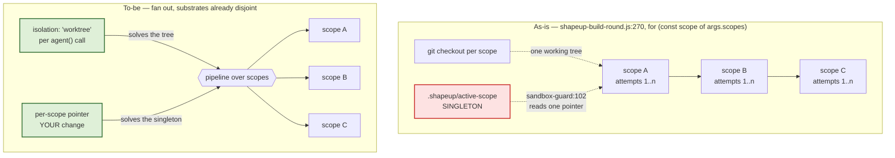
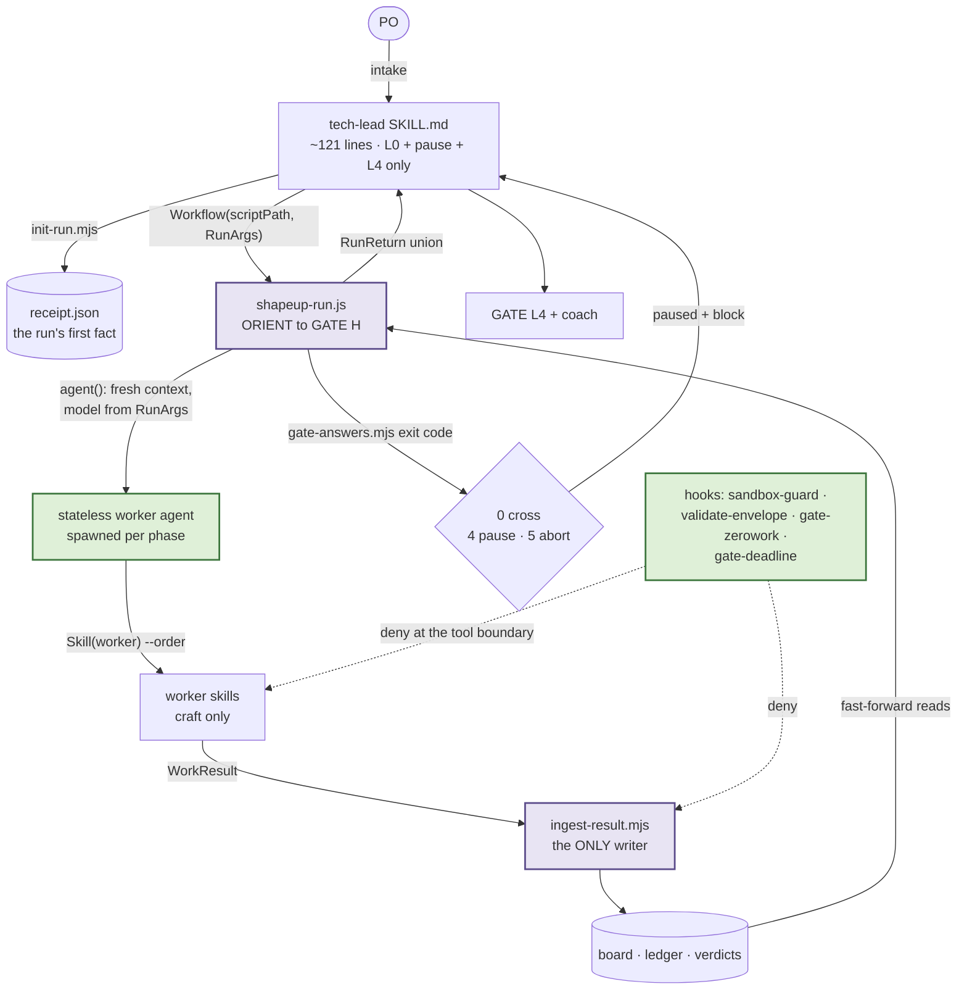

> # ⟐ Figures updated 2026-08-12 — every stage through C has now run, and the merge waits
>
> These figures were drawn on 2026-08-10 at `c469a6c`, when Stages A–D were still future work.
> Since then, on this branch (`89e07cd` · `npm test` 1363 · contract **23 PASS / 0 RED — GATE MET**):
>
> - **Stage A ran and its probe FAILED. A2 ran — FAIL again. A3 ran — `kill-resume-probe: PASS`**,
>   4/4 assertions on a live SIGKILL. Two failures, each buying a defect unreadable off the code.
> - **Stage B ran** — R7–R11 green; `shapeup-build-round.js` deleted, four assertions moved with it.
> - **Stage C ran** — the PO took C2, A7 ran, **`A7: FAIL`** — and the lane it was built to measure
>   never started: every `Workflow` call denied headlessly (**HD-007**). The merge waits (plan §5).
> - **The HD-007 probe answered the mechanism**: the lane starts under `acceptEdits` when Bash
>   carries it (`hd007-control-plane-probe.md` · `tools/control-plane/cp-run.mjs`).
> - ⟐ **The fix then shipped — and step 4 refuted the reason for it.** The launcher is
>   `skills/tech-lead/scripts/run-workflow.mjs`, HD-008's escape is deleted, and the benchmark can
>   tell a lane that ran from one that was imitated. But the `Workflow` tool **is** grantable (a bare
>   `"Workflow"` token; the bench's settings never carried it), and **`HD-009`** — `init`'s grant
>   matches no command at all — **blocks the lane and the A7 re-run** (`hd007-fix-evidence.md`).
>
> Panels corrected in place: *Where the migration actually stands*, A.2's probe record, the Stage
> B and C banners, the contributions table — and one new section, *The HD-007 probe*. Stage A's
> other panels and Stage D are left as drawn: they are the reasoning that produced shipped work,
> and the work that is still future.
>
> One-page position: `docs/migration/README.md`.

# What each stage buys you — and what the harness becomes when they're all done

**Question:** What does each remaining stage buy, and what is the harness once they are all done?
**Scope:** Figures only. This is the companion to `docs/migration/remaining-stages-plan.md` (the
work, the acceptance rows, the guardrails) and `docs/migration/status-review-2026-08-10.md` (the
evidence and the position). The finding, the negative space, the recommendation and the falsifiers
live in those two — deliberately not restated here.
**Sources:** repo state at `c469a6c`, 2026-08-10; `npm test` green at 1168 checks. *(Current tree:
`89e07cd`, 1363 checks — the corrected panels cite that; every other figure is as-of `c469a6c`.)*
**Confidence:** High — every figure redraws something verified in the review; no new measurement is
introduced. **Validity:** re-check any figure whose cited `file:line` has moved.

**Every figure states one claim.** Nothing here is a new measurement — the numbers are the ones
already on disk at `c469a6c`, cited where they appear.

---

## Where the migration actually stands

*Corrected 2026-08-12, the third reading of this panel. The first (17 PASS, two false) was true of
the instrument and false about the migration; the second (19/4 above a failed probe) is history —
A3 made the probe pass, Stage B closed the four red rows, Stage C closed R12.*

The contract now reads **23 PASS / 0 RED** above **GATE MET** — every row green for the first time
on this branch. The panel's lesson did not change, it moved: **a full scoreboard sits above a merge
that must not happen**, because the contract has no row for the defect that blocks it.



**The claim:** the green scoreboard above a stop is this page's recurring lesson, and HD-009 is its
purest instance yet. First, two rows passing on pre-existing text. Then six green rows above a
failed probe. Then 23/23 above a lane that could not start. Now a **green test asserting the
permission grant covers every call site — by comparing strings**, while the grant it describes
matches no command the CLI will run. Every one of these was found by *executing* something, never
by reading it.

---

# Stage A — the gauge stops lying, and the one untested failure class gets tested

**⟐ EXECUTED 2026-08-10 at `2a134cd`.** All five items delivered; rows R1–R6 green. **The gate it
opened is not met** — A.2's probe FAILED (panel below). The panels in this section are the plan as
drawn, kept because they are the reasoning behind shipped work.

**Cost as estimated: ~2–3 h, $0 external.** Rows R1–R6.

## A.1 · Two contract rows cannot fail



**The claim:** a row that matches pre-existing text scores work nobody did. The same defect sits in
`grep -rqli 'gate-zerowork' tests/` — it matches three test files that predate the branch — and in
`grep -qiE 'kill|resume'`, which **a sentence saying the probe was not run would satisfy.** Stage A
replaces all three. R3's replacement is a literal status line, `kill-resume-probe: PASS|FAIL|NOT-RUN`,
so "not run" gets *recorded* rather than inferred from absence.

## A.2 · The kill/resume probe — the failure path nobody has driven

This is the class the whole migration exists to retire, and it has never been tested.



**The claim:** step 6 is where the prose orchestrator lost everything and the workflow lane is
supposed to lose nothing. Steps 9–11 are the assertion.

> **⟐ Run 2026-08-10 — `kill-resume-probe: FAIL`.** The sequence above is what was supposed to
> happen. Two of the four assertions held: no already-green scope was rebuilt, and every pre-kill T0
> verdict survived byte-identical. Two did not — **ORIENT re-ran from scratch**, rewriting three
> orient artifacts, adding a spike, and mutating the discovery ledger and two task files. WIRE and
> MAP SCOPES fast-forwarded correctly, because they gate on their own artifacts; ORIENT gates on a
> stored `status` field that never moved. **The kill is incidental** — the interactive lane's normal
> pause-and-relaunch hits the same branch on every leg.
>
> Per the plan, that is a stop: A3 is not green, S2's ship gate is not met, every Stage B item
> unwinds. Full evidence in `stage2-evidence.md` §4; the fix is `stage-a2-plan.md`.

> **⟐ Resolved 2026-08-12 — `kill-resume-probe: PASS`, 4/4, on a live SIGKILL**
> (`stage-a3-evidence.md` §4). It took two more stages. A2 fixed the ORIENT `status` gate and proved
> ORIENT byte-identical across a kill — and still failed, because an escalating WIRE was recorded
> complete and re-dispatched on every relaunch. A3 closed the class: **a phase is complete only when
> its ARTIFACT exists**, and `analyze` runs before WIRE so the escalation never recurs. The grader
> that recorded PASS is byte-identical to the one that recorded both FAILs.

## A.3 · The hook documents an arm it does not have



**The claim:** `SKILL.md:12-14` already tells operators the hook blocks a session leaving *"neither a
receipt NOR a `Workflow` tool_use naming `shapeup-run`"*. The dotted edge is the arm that does not
exist. Exposure is small — the receipt decides the block, and `init-run.mjs` writes it first — but
this is **an invariant living in a prompt**, which `AGENTS.md` says must never happen. Verified
against HEAD: `dispatchedOrchestrator(<Workflow event>)` returns `false` today.

---

# Stage B — one round loop instead of two, and a rollback story that is true

**⟐ EXECUTED 2026-08-12** (`stage3-evidence.md`). R7–R11 green. B.1 deleted
`shapeup-build-round.js` and moved **four** assertions in one commit — the plan named three; the
fourth (`17-gate-zerowork-workflow.mjs:70`) used the filename in a synthetic event that never
touches disk. The honest-cost arrow below was half-paid: the live inner-breaker branch is
demonstrated by A3's leg 2, the degenerate `shapeup-run.js:774` branch has never run (§3). Panels
left as drawn.

**Cost: ~2–3 h, $0.** Rows R7–R11.

## B.1 · The verified implementation is the one that does not run



**The claim:** `stage1-evidence.md`'s breaker probe exercised `shapeup-build-round.js:351`;
production takes `shapeup-run.js:593`. **The Stage-1-verified implementation is not the one that
runs**, and the only thing keeping the dead file alive is a test asserting it exists. That is
`fd5ad3d`'s class — *"board-derive's entry point was dead, and testing its parts could not see it"* —
recurring one layer up.

**The honest cost is the arrow, not the deletion.** Re-pointing the probe means driving a run
through ORIENT → WIRE → MAP SCOPES to reach BUILD. Budget that, not the `git rm`.

## B.4 · What "pin the previous release" actually reverts



**The claim:** the CHANGELOG cannot say "there is no in-tree prose lane" — that is false for
`--tiny` and pre-scope-contract specs — and it cannot describe the rollback as migration-scoped,
because `af99937` merged unrelated work onto the branch. Both corrections ship in B.4, alongside
the `CLAUDE_CODE_PRINT_BG_WAIT_CEILING_MS=0` hazard, which is documented nowhere today and turns a
truncated headless run into an exit-0 success.

---

# Stage C — the fork, recorded either way

**⟐ EXECUTED 2026-08-12 — and the figure's premise was refuted first.** `s3-feasibility.mjs`
returned **C1 yes / C2 yes**: the bench sits at `~/workspace/sdd-harness-bench`, and the script's
one failing check belongs to the day-2 plan's arm, not A7 — so the "exit 3" edge below could never
have fired honestly, and C1's defer-at-no-cost premise was gone. The PO took **C2**. R12 was
repaired first (it accepted a bare `A7: PASS` with no logs), then six reps, $29.88 —
**`A7: FAIL`**, candidate 1 of 3 on the absolute bar, control 0 of 3. The headline is not the
score: `shapeup-run.js` executed **zero** times — the new section below. Figure left as drawn.

**Cost: $0 on C1 · $40–60 on C2.** Row R12.


**The claim:** the recommended path is C1, and its whole content is that **"A7 passed" must not be
reachable by grep.** The precedent is on record: day2's S3 hit this exact blocker and its
`RESUME.md` reads *"No number was invented in the meantime."* The one condition is that Stage A.2
actually ran — deferring the cost question while also skipping the correctness probe rests the
cutover on two unrun tests.

---

# ⟐ The HD-007 probe — same mode, same script shape, different launch surface

**Ran 2026-08-12, after Stage C** (`hd007-control-plane-probe.md`; prototype at
`tools/control-plane/`, not in the npm `files` set). A7's six reps never measured the lane, because
the `Workflow` tool is denied headlessly and **no permission string exists that could grant it**.
The probe moves the launch to the surface that *is* grantable.



**The claim:** T1 against §7.5 is a controlled pair — same permission mode, same three-line script
shape, only the launch surface differs: **tool denied; Bash ran, `permission_denials: []`.** P1
executed the **unmodified** `shapeup-run.js` to its own arg-validation abort, so the script format
survives the surface swap with no fork.

> ⟐ **Corrected 2026-08-12 by probing the permission layer instead of concluding from denials
> (`hd007-fix-evidence.md` §4).** The measurements above stand; the *explanation* does not. **The
> `Workflow` tool is grantable** — a bare `"Workflow"` token in `permissions.allow` runs it
> headlessly in the benchmark's own configuration; scoped forms are denied. The bench's settings
> never carried the entry, because `init` writes Bash prefixes only, so six paid reps went to a
> missing allowlist line. The surviving argument for this lane is that the tool grant **cannot be
> narrowed**, not that it does not exist.
>
> **And a defect upstream of both surfaces:** `HD-009` — `init`'s pipeline grant matches **no
> command at all** (Bash prefix rules bind on whole-argument boundaries; the quoted call-site form
> matches no rule in either spelling). The full pipeline has now been attempted three times through
> the shipped launcher and **aborted at dispatch 1 every time**. F2 is answered: an untrusted
> workspace ignores `permissions.allow` in full, and the CLI says so by name.

---

# Stage D — Phase 2: the invariants move down a layer

**Not part of the cutover.** A separate release, listed so the arc is visible.

## D.1 · The enforcement ladder — where each invariant lives

> **Corrected 2026-08-10.** An earlier revision of this figure claimed declared `agents/*.md` would
> convert four invariants from prose to runtime. **Two of the four do not survive inspection** —
> `Agent(plugin:name)` whitelists restrict delegation that never happens (the workers are leaves),
> and `tools:` restricts tool *names*, not paths, so it cannot remove board reach. The agents spike
> was proposed and **rejected**. What follows is the finding that replaced it.

**No hook enforces single-writer.** `hooks/sandbox-guard.mjs:17-18` says `.shapeup/<slug>/` writes
are *"always allowed … the doer is REQUIRED to write"* — and `safety-spine` guards the machine and
the git remote, not the board. So any worker can write the board, the ledger and the verdicts today.



**The claim:** `AGENTS.md` states *"D6 closed: single-writer is mechanically true."* It is true by
the envelope port and worker prose — the hook explicitly declines to enforce it. And the exemption's
own rationale is **stale**: it cites "task-executor P3 status/AC ticks + `tasks/_index.md`," exactly
the writes `ingest-result.mjs` took over at v1.0. Narrowing it is one hook arm plus a fixture — the
same shape as Stage A.3, in the layer already trusted for this class, and it covers `task-executor`
too, which `tools:` never could because it legitimately needs `Write` for product code.

## D.3 · The serialization point that blocks parallel scopes



**The claim:** design doc **[D3]** named two blockers and they are no longer equal. *"Branch-per-scope
assumes one tree"* is now a parameter the runtime offers. *"`active-scope` is a singleton"* is
yours, at `hooks/sandbox-guard.mjs:102`, and it is the real one. Both scripts contain **zero**
`parallel()` and **zero** `pipeline()` today.

Why it matters beyond speed: invariant #3 — per-scope write-whitelists, hook-enforced — is capacity
you built and have never spent, and **parallel scopes are the only place the workflow lane can win
A7's comparative bar** (`candidate ≤ control on wall clock`), which it is not allowed to lose. The
one cost number on record runs the other way: candidate **$2.010** vs control **$1.461**, Sonnet
both arms (`stage1-evidence.md`).

---

# The high-level design — what the harness is when all stages are done

## The run, end to end



**The claim:** the skill shrinks to three jobs — open the run, relay gate blocks verbatim, close at
L4. Everything between ORIENT and GATE H is a JS control plane. Workers hold craft and nothing else.
**One writer** touches shared state. Hooks deny at the tool boundary, below every prompt. The two
purple nodes are the invariants the migration bought: control flow in code, and a single writer.

## The pause protocol — how a gate actually crosses

```mermaid
sequenceDiagram
  autonumber
  participant PO as PO
  participant SK as tech-lead skill
  participant WF as shapeup-run.js
  participant GA as gate-answers.mjs
  participant D as .shapeup/

  SK->>WF: Workflow(RunArgs)
  WF->>GA: resolve L1b
  GA-->>WF: exit 4 — ask
  WF-->>SK: {status:"paused", paused_at:"L1b", block}
  SK->>PO: emit block VERBATIM
  PO-->>SK: decision
  SK->>D: write gate-answers.json
  SK->>WF: relaunch, SAME args
  WF->>D: fast-forward — orders minus results is empty
  WF->>GA: resolve L1b
  GA-->>WF: exit 0 — cross
  Note over WF: proceeds; nothing already done is re-dispatched
```

**The claim:** the gate decision is an **exit code**, not a paragraph a model interprets, and the
block text reaches the PO unparaphrased. Step 9 is the property four relaunches already
demonstrated at run 3 — and the one the kill/resume probe still has to prove survives an *ungraceful*
death, not just a clean pause. ⟐ **Proven 2026-08-12** — `stage-a3-evidence.md` §4, on a live
SIGKILL.

## What each stage contributes to that picture

| Stage | What the diagram above gains |
|---|---|
| **A / A2 / A3** ⟐ done | The `Workflow(shapeup-*)` arm on `gate-zerowork`; the fast-forward proven against an ungraceful kill — on the third attempt; a contract whose rows can fail |
| **B** ⟐ done | One round loop instead of two; a rollback statement that matches what pinning actually reverts |
| **C** ⟐ done | ⟐ Measured: **`A7: FAIL`** — and the measurement's real yield is HD-007/HD-008, the two defects no contract row asked about |
| **HD-007 probe** ⟐ done | The launch surface that works headlessly: the same scripts under Bash-carried `cp-run` |
| **HD-007/008 fix** ⟐ done | The launcher ships; the zero-work gate stops exempting busy sessions; the benchmark can tell a lane that ran from one imitated. ⟐ And two refutations: the tool *was* grantable, and **`HD-009`** — the grant matches no command — blocks the lane |
| **D** | `sandbox-guard`'s stale always-allow narrowed, so D6's single-writer claim becomes mechanical; a token breaker beside the other three; `pipeline()` over scopes once the pointer stops being a singleton |

**Read the arrows that are dotted.** `HOOKS -.-> WORK` and `HOOKS -.-> ING` are the only edges in
the finished design that no prompt can talk its way past. Every stage above is, in the end, about
moving one more claim onto a dotted arrow.
