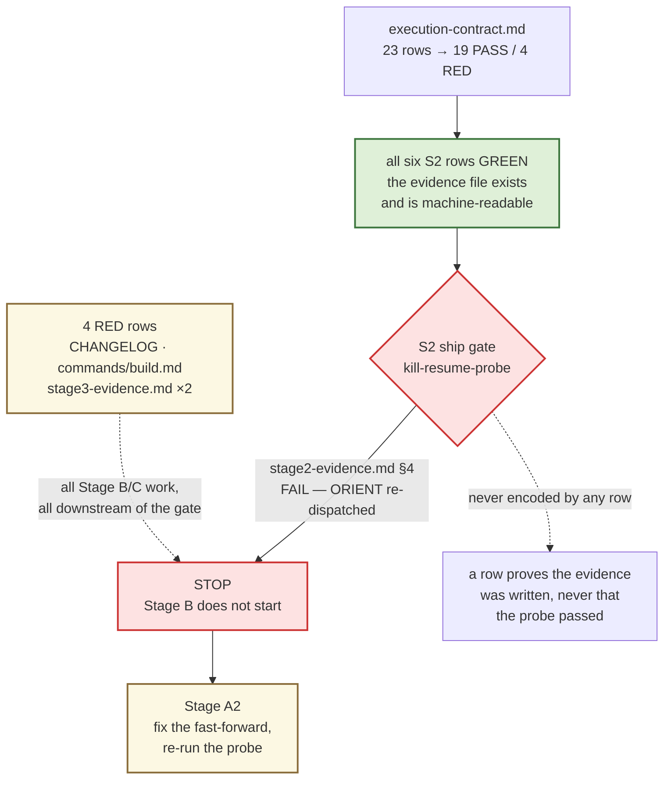
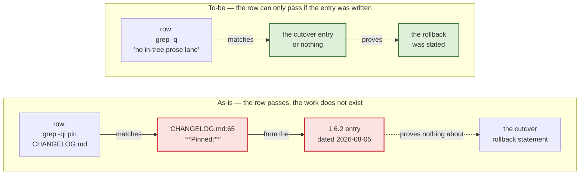
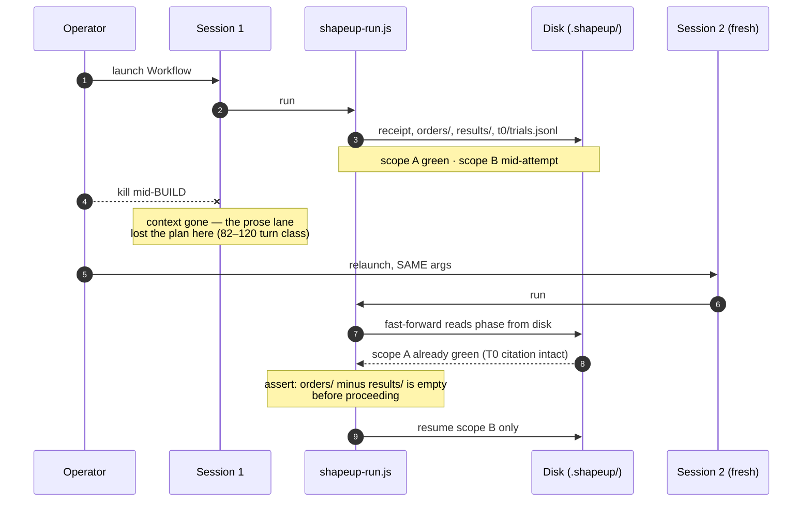
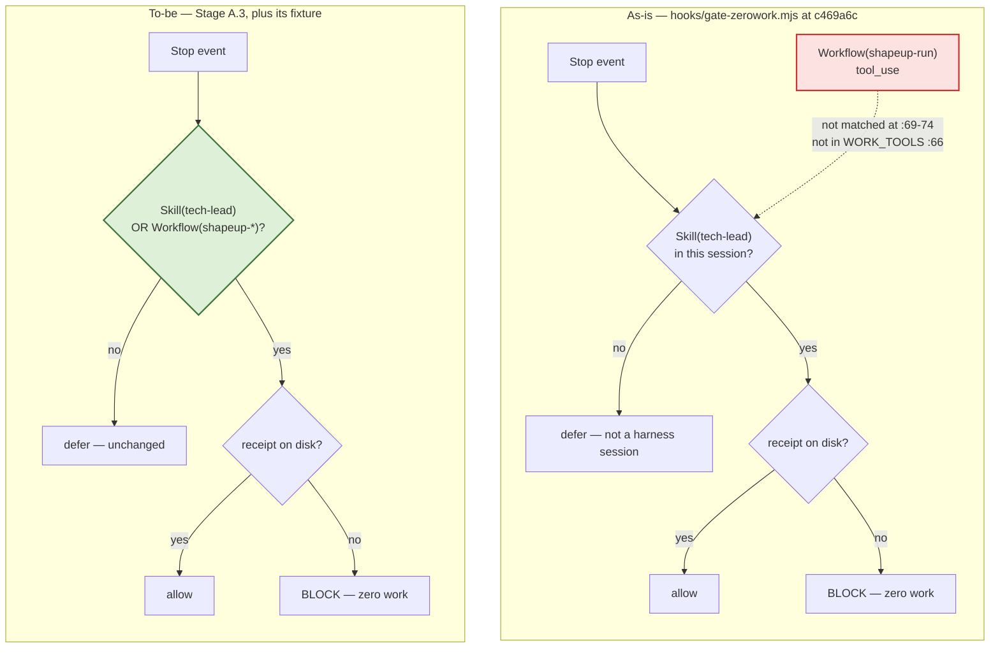
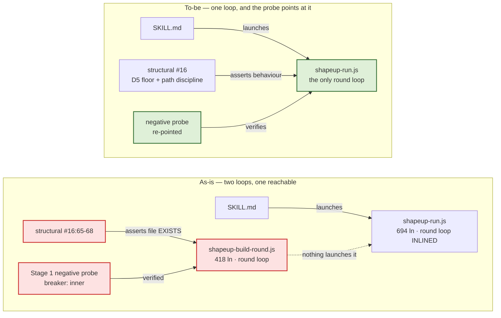
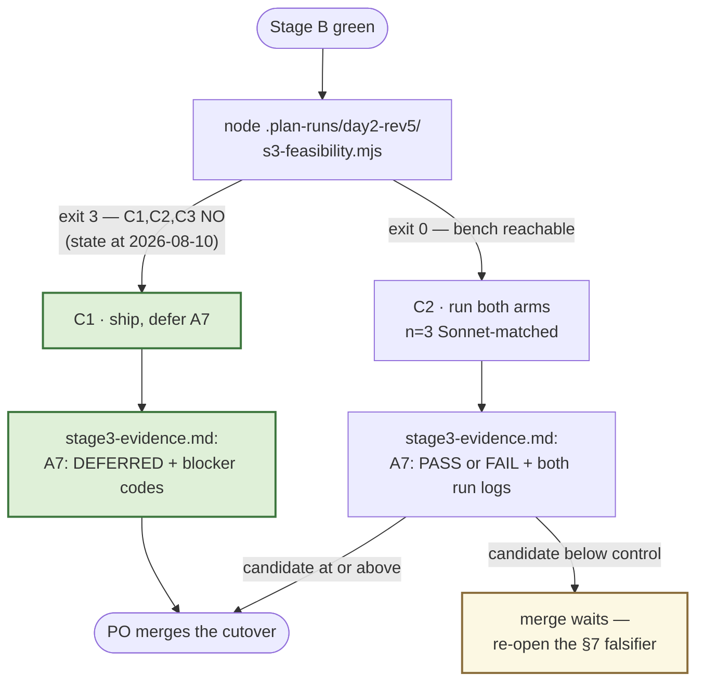
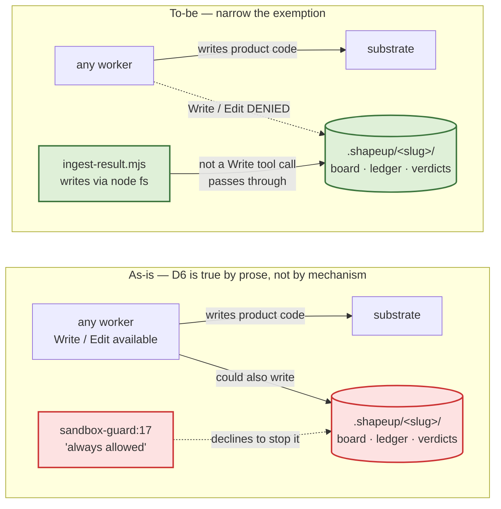
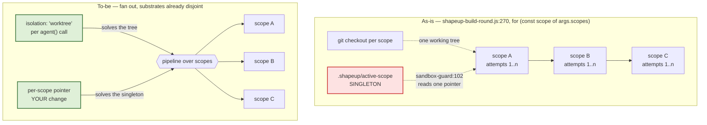

> # ⟐ Figures updated 2026-08-11 — Stage A has since run, and its probe failed
>
> These figures were drawn on 2026-08-10 at `c469a6c`, when Stage A was still future work. Stage A
> ran that day (`2a134cd`): its five deliverables all landed, and **the kill/resume probe it exists
> to record came back `FAIL`** — a completed ORIENT phase was re-dispatched on resume.
>
> Two panels below are corrected in place (*Where the migration actually stands*, and *A.2*).
> The rest of Stage A's panels are left as drawn: they describe work that has since shipped, and
> they are the reasoning that produced it. **Stage A2** — `docs/migration/stage-a2-plan.md` — now
> sits between Stage A and Stage B, and Stage B does not start until its G6 probe passes.
>
> One-page position: `docs/migration/README.md`.

# What each stage buys you — and what the harness becomes when they're all done

**Question:** What does each remaining stage buy, and what is the harness once they are all done?
**Scope:** Figures only. This is the companion to `docs/migration/remaining-stages-plan.md` (the
work, the acceptance rows, the guardrails) and `docs/migration/status-review-2026-08-10.md` (the
evidence and the position). The finding, the negative space, the recommendation and the falsifiers
live in those two — deliberately not restated here.
**Sources:** repo state at `c469a6c`, 2026-08-10; `npm test` green at 1168 checks. *(Current tree:
`5209df7`, 1328 checks — the two corrected panels cite that; every other figure is as-of `c469a6c`.)*
**Confidence:** High — every figure redraws something verified in the review; no new measurement is
introduced. **Validity:** re-check any figure whose cited `file:line` has moved.

**Every figure states one claim.** Nothing here is a new measurement — the numbers are the ones
already on disk at `c469a6c`, cited where they appear.

---

## Where the migration actually stands

*Corrected 2026-08-11. The 2026-08-10 reading of this panel — 17 PASS, two of them false, "every
red row is a file that was never written, not a behaviour that fails" — was true of the instrument
and false about the migration. Stage A fixed the instrument and then failed the gate.*

The contract now reads **19 PASS / 4 RED** against the tightened rows. **All six S2 rows are green
and S2's ship gate is not met** — which is the only thing on this page worth remembering.



**The claim:** a green row count sitting above a failed gate is the mis-navigation this whole
instrument revision exists to end. 19 of 23 is not "nearly done" — the four red rows are downstream
of a stop.

---

# Stage A — the gauge stops lying, and the one untested failure class gets tested

**⟐ EXECUTED 2026-08-10 at `2a134cd`.** All five items delivered; rows R1–R6 green. **The gate it
opened is not met** — A.2's probe FAILED (panel below). The panels in this section are the plan as
drawn, kept because they are the reasoning behind shipped work.

**Cost as estimated: ~2–3 h, $0 external.** Rows R1–R6.

## A.1 · Two contract rows cannot fail



**The claim:** a row that matches pre-existing text scores work nobody did. The same defect sits in
`grep -rqli 'gate-zerowork' tests/` — it matches three test files that predate the branch — and in
`grep -qiE 'kill|resume'`, which **a sentence saying the probe was not run would satisfy.** Stage A
replaces all three. R3's replacement is a literal status line, `kill-resume-probe: PASS|FAIL|NOT-RUN`,
so "not run" gets *recorded* rather than inferred from absence.

## A.2 · The kill/resume probe — the failure path nobody has driven

This is the class the whole migration exists to retire, and it has never been tested.



**The claim:** step 6 is where the prose orchestrator lost everything and the workflow lane is
supposed to lose nothing. Steps 9–11 are the assertion.

> **⟐ Run 2026-08-10 — `kill-resume-probe: FAIL`.** The sequence above is what was supposed to
> happen. Two of the four assertions held: no already-green scope was rebuilt, and every pre-kill T0
> verdict survived byte-identical. Two did not — **ORIENT re-ran from scratch**, rewriting three
> orient artifacts, adding a spike, and mutating the discovery ledger and two task files. WIRE and
> MAP SCOPES fast-forwarded correctly, because they gate on their own artifacts; ORIENT gates on a
> stored `status` field that never moved. **The kill is incidental** — the interactive lane's normal
> pause-and-relaunch hits the same branch on every leg.
>
> Per the plan, that is a stop: A3 is not green, S2's ship gate is not met, every Stage B item
> unwinds. Full evidence in `stage2-evidence.md` §4; the fix is `stage-a2-plan.md`.

## A.3 · The hook documents an arm it does not have



**The claim:** `SKILL.md:12-14` already tells operators the hook blocks a session leaving *"neither a
receipt NOR a `Workflow` tool_use naming `shapeup-run`"*. The dotted edge is the arm that does not
exist. Exposure is small — the receipt decides the block, and `init-run.mjs` writes it first — but
this is **an invariant living in a prompt**, which `AGENTS.md` says must never happen. Verified
against HEAD: `dispatchedOrchestrator(<Workflow event>)` returns `false` today.

---

# Stage B — one round loop instead of two, and a rollback story that is true

**Cost: ~2–3 h, $0.** Rows R7–R11.

## B.1 · The verified implementation is the one that does not run



**The claim:** `stage1-evidence.md`'s breaker probe exercised `shapeup-build-round.js:351`;
production takes `shapeup-run.js:593`. **The Stage-1-verified implementation is not the one that
runs**, and the only thing keeping the dead file alive is a test asserting it exists. That is
`fd5ad3d`'s class — *"board-derive's entry point was dead, and testing its parts could not see it"* —
recurring one layer up.

**The honest cost is the arrow, not the deletion.** Re-pointing the probe means driving a run
through ORIENT → WIRE → MAP SCOPES to reach BUILD. Budget that, not the `git rm`.

## B.4 · What "pin the previous release" actually reverts


**The claim:** the CHANGELOG cannot say "there is no in-tree prose lane" — that is false for
`--tiny` and pre-scope-contract specs — and it cannot describe the rollback as migration-scoped,
because `af99937` merged unrelated work onto the branch. Both corrections ship in B.4, alongside
the `CLAUDE_CODE_PRINT_BG_WAIT_CEILING_MS=0` hazard, which is documented nowhere today and turns a
truncated headless run into an exit-0 success.

---

# Stage C — the fork, recorded either way

**Cost: $0 on C1 · $40–60 on C2.** Row R12.



**The claim:** the recommended path is C1, and its whole content is that **"A7 passed" must not be
reachable by grep.** The precedent is on record: day2's S3 hit this exact blocker and its
`RESUME.md` reads *"No number was invented in the meantime."* The one condition is that Stage A.2
actually ran — deferring the cost question while also skipping the correctness probe rests the
cutover on two unrun tests.

---

# Stage D — Phase 2: the invariants move down a layer

**Not part of the cutover.** A separate release, listed so the arc is visible.

## D.1 · The enforcement ladder — where each invariant lives

> **Corrected 2026-08-10.** An earlier revision of this figure claimed declared `agents/*.md` would
> convert four invariants from prose to runtime. **Two of the four do not survive inspection** —
> `Agent(plugin:name)` whitelists restrict delegation that never happens (the workers are leaves),
> and `tools:` restricts tool *names*, not paths, so it cannot remove board reach. The agents spike
> was proposed and **rejected**. What follows is the finding that replaced it.

**No hook enforces single-writer.** `hooks/sandbox-guard.mjs:17-18` says `.shapeup/<slug>/` writes
are *"always allowed … the doer is REQUIRED to write"* — and `safety-spine` guards the machine and
the git remote, not the board. So any worker can write the board, the ledger and the verdicts today.



**The claim:** `AGENTS.md` states *"D6 closed: single-writer is mechanically true."* It is true by
the envelope port and worker prose — the hook explicitly declines to enforce it. And the exemption's
own rationale is **stale**: it cites "task-executor P3 status/AC ticks + `tasks/_index.md`," exactly
the writes `ingest-result.mjs` took over at v1.0. Narrowing it is one hook arm plus a fixture — the
same shape as Stage A.3, in the layer already trusted for this class, and it covers `task-executor`
too, which `tools:` never could because it legitimately needs `Write` for product code.

## D.3 · The serialization point that blocks parallel scopes



**The claim:** design doc **[D3]** named two blockers and they are no longer equal. *"Branch-per-scope
assumes one tree"* is now a parameter the runtime offers. *"`active-scope` is a singleton"* is
yours, at `hooks/sandbox-guard.mjs:102`, and it is the real one. Both scripts contain **zero**
`parallel()` and **zero** `pipeline()` today.

Why it matters beyond speed: invariant #3 — per-scope write-whitelists, hook-enforced — is capacity
you built and have never spent, and **parallel scopes are the only place the workflow lane can win
A7's comparative bar** (`candidate ≤ control on wall clock`), which it is not allowed to lose. The
one cost number on record runs the other way: candidate **$2.010** vs control **$1.461**, Sonnet
both arms (`stage1-evidence.md`).

---

# The high-level design — what the harness is when all stages are done

## The run, end to end


**The claim:** the skill shrinks to three jobs — open the run, relay gate blocks verbatim, close at
L4. Everything between ORIENT and GATE H is a JS control plane. Workers hold craft and nothing else.
**One writer** touches shared state. Hooks deny at the tool boundary, below every prompt. The two
purple nodes are the invariants the migration bought: control flow in code, and a single writer.

## The pause protocol — how a gate actually crosses

```mermaid
sequenceDiagram
  autonumber
  participant PO as PO
  participant SK as tech-lead skill
  participant WF as shapeup-run.js
  participant GA as gate-answers.mjs
  participant D as .shapeup/

  SK->>WF: Workflow(RunArgs)
  WF->>GA: resolve L1b
  GA-->>WF: exit 4 — ask
  WF-->>SK: {status:"paused", paused_at:"L1b", block}
  SK->>PO: emit block VERBATIM
  PO-->>SK: decision
  SK->>D: write gate-answers.json
  SK->>WF: relaunch, SAME args
  WF->>D: fast-forward — orders minus results is empty
  WF->>GA: resolve L1b
  GA-->>WF: exit 0 — cross
  Note over WF: proceeds; nothing already done is re-dispatched
```

**The claim:** the gate decision is an **exit code**, not a paragraph a model interprets, and the
block text reaches the PO unparaphrased. Step 9 is the property four relaunches already
demonstrated at run 3 — and the one the kill/resume probe still has to prove survives an *ungraceful*
death, not just a clean pause.

## What each stage contributes to that picture

| Stage | What the diagram above gains |
|---|---|
| **A** | The `Workflow(shapeup-*)` arm on `gate-zerowork`; the fast-forward proven against an ungraceful kill; a contract whose rows can fail |
| **B** | One round loop instead of two; a rollback statement that matches what pinning actually reverts |
| **C** | A7 recorded as `DEFERRED` with its blocker codes — or measured |
| **D** | `sandbox-guard`'s stale always-allow narrowed, so D6's single-writer claim becomes mechanical; a token breaker beside the other three; `pipeline()` over scopes once the pointer stops being a singleton |

**Read the arrows that are dotted.** `HOOKS -.-> WORK` and `HOOKS -.-> ING` are the only edges in
the finished design that no prompt can talk its way past. Every stage above is, in the end, about
moving one more claim onto a dotted arrow.
