# The workflow migration is finished as engineering and stalled as paperwork — except for one row that money cannot buy from this machine

**Question:** What happens next on `feat/workflow-orchestrator` — does it merge, and if not, what is
the shortest admissible path to a cutover release?
**Sources read:** `docs/workflow_migration_plan.md` (sha `949dab98…`), `docs/migration/execution-contract.md`,
`docs/migration/execution-report.md`, `docs/migration/stage{0,1}-evidence.md`, `skills/tech-lead/SKILL.md`,
`hooks/gate-zerowork.mjs`, `tests/structural/16-workflows.mjs`, `.plan-runs/day2-rev5/{REPORT,RESUME}.md`.
All 23 contract acceptance rows re-executed against `HEAD c469a6c` on 2026-08-10.
**Confidence:** High on status and on the blocker (both re-derived by running commands, not by reading
claims). Medium on the cost projection in §4 — it extrapolates from one trivial feature.
**Status:** Analysis + recommended sequence. Nothing merged, nothing spent.

---

## 0. The finding in one paragraph

The migration is **code-complete and behaviourally proven through Stage 2's hard half**, and it is
stalled on artifacts that were never written rather than on behaviour that fails. Of the execution
contract's 23 acceptance rows, **17 pass and 6 are red at `c469a6c`** — and every red is a *file that
does not exist*, not a *check that failed*. Three reds grep into `docs/migration/stage2-evidence.md`,
a file whose content was already produced and quoted on 2026-08-07: A2 returned
`{"status":"shipped","verdict":"pass"}` from a headless run, and A3 crossed L1a and L1b across four
fresh-session relaunches with zero completed work re-dispatched (`execution-report.md:37-69`). Two
reds grep into `stage3-evidence.md`, which is gated behind the A7 benchmark. One red — the
`gate-zerowork` Workflow arm — is roughly twenty lines of hook code plus a fixture, and `SKILL.md:12-14`
**already tells operators that arm exists** while `hooks/gate-zerowork.mjs:69-74` matches only
`Skill(tech-lead)`. Worse for the instrument than for the work: **two of the 17 passes are false** —
`grep -qi pin CHANGELOG.md` matches `**Pinned:**` in the 1.6.2 entry (`CHANGELOG.md:65`) and
`grep -rqli gate-zerowork tests/` matches three pre-existing test files, so the contract scores S3
work that has not been done. The honest count of *done* rows is 15/23. And the one item that is
genuinely, permanently blocked here is **A7's $40–60 model-matched benchmark**: it needs
`sdd-harness-bench`, and `s3-feasibility.mjs` proves that repository is absent from this machine with
no remote to fetch it from — **the identical blocker that terminated the day2 plan's S3 on 2026-08-08**.
The migration therefore has two remaining costs, and they are of different kinds: about **half a day of
writing and twenty lines of code**, obtainable right now, and **one measurement that this machine
cannot buy at any price**.

---

## 1. What is actually being asked

The plan (`docs/workflow_migration_plan.md:23-38`) binds the migration to seven acceptance criteria,
A1–A7, and to one hard sequencing rule: *Stage 2 is the ship gate of the cutover — Stage 3 does not
begin until A2 and A3 are both green* (`execution-contract.md:64`). The decision now pending is not
"is the workflow lane good" — Stage 1 and Stage 2 answered that with artifacts. It is **whether A7's
unobtainability is a stop or a deferral**, and what the branch may carry across the merge if it is a
deferral.

Two constraints the reader holds that the plan does not:

- **The plan's §0 worktree premise is dead.** `git worktree list` returns a single checkout at
  `/Volumes/LibertyMobi/workspace/proj-harness-plugin`, on the branch directly. The plan's paths are
  `/Users/teo/workspace/…` (`workflow_migration_plan.md:46-48`) — a different machine. The "main
  checkout is the control arm" rule (`:56`) has had no control arm available since run 2.
- **The branch is no longer only this migration.** 41 commits ahead of `main`, of which 10 are
  `wf-migration(…)`; `af99937` merged the day2 ratchet work in. 24 of the 46 changed files fall
  outside the plan's own Appendix file-touch map (`:216-233`), whose guardrail says a diff outside it
  "is scope creep and should be challenged at review." This review is that challenge — see §5.

---

## 2. The as-built scorecard

`npm test` at `HEAD c469a6c`: **green, 1168 checks** (contract baseline 1112 at `78e56bc`; 1120 at
run 3's `7c1b15e`). All 23 contract rows re-executed 2026-08-10:

| Stage | Rows | Result | What the red rows actually mean |
|---|---|---|---|
| S0 — kill-switch spike (D1) | 3 | **3 PASS** | — |
| S1 — `shapeup-build-round` | 6 | **6 PASS** | — |
| S2 — `shapeup-run` + thin skill | 6 | **3 PASS / 3 RED** | All three red rows grep `stage2-evidence.md`. The file is unwritten; **its content exists** in `execution-report.md:32-78` |
| S3 — cutover + benchmark | 8 | **5 PASS / 3 RED** | 2 of those 5 passes are false (below). Real state: 3 PASS / 3 RED / 2 FALSE-PASS |
| **Total** | **23** | **17 PASS / 6 RED** | **Honest: 15 done, 6 undone, 2 mis-scored** |

### The two false passes — the instrument is scoring work nobody did

| Contract row | Why it passes | Why that is wrong |
|---|---|---|
| `grep -qi pin CHANGELOG.md` (`execution-contract.md:50`) | matches `**Pinned:**` at `CHANGELOG.md:65`, from the **1.6.2** entry | The row exists to prove the *cutover* entry states "pin the previous release; there is no in-tree prose lane". The newest CHANGELOG entry is **1.6.3, dated 2026-08-05** — written before Stage 1 landed. No cutover entry exists |
| `grep -rqli 'gate-zerowork' tests/` (`:48`) | matches `tests/structural/{10-run-receipt,11-is-main,15-hook-receipts}.mjs` | All three predate the branch. A5's *new* unit fixture for the Workflow predicate arm does not exist |

This matters beyond bookkeeping. The execution report's own headline — "15 PASS / 7 RED"
(`execution-report.md:17`) — was computed by the same instrument, so the run has been navigating by a
gauge that reads two rows high on exactly the stage it has not started.

### A1–A7 against the plan's own contract

| # | Criterion | Verdict | Evidence |
|---|---|---|---|
| A1 | Stage-0 kill-switch, all three checks | **GREEN** | `stage0-evidence.md`, `Decision: GO`, ≥2 quoted `deny` rows, cost labelled Sonnet |
| A2 | Unattended run through `shapeup-run`, preset `ci` | **GREEN — evidence file unwritten** | `{"status":"shipped","verdict":"pass","rounds_used":1,…}`; 9 orders / 9 results; exactly one `evaluate-r1` order (`execution-report.md:37-48`) |
| A3 | Interactive, ≥2 gates via pause → decision → relaunch, nothing re-dispatched | **SUBSTANTIALLY GREEN — evidence file unwritten** | L1a and L1b crossed across 4 fresh-session relaunches; redone-completed-work set empty at every leg (`:56-78`). **Never carried to `shipped` in one run** |
| A4 | Prose runbook deleted; `SKILL.md` ≤ ~150 lines; workflows the only normative home | **PARTIAL — and the criterion is now wrong** | `SKILL.md` = **121 lines** ✓. But `SKILL.md:50-55` deliberately routes `--tiny` and scope-less specs to `references/round-protocol.md`, so the workflows are *not* the only normative home. See §3 |
| A5 | `gate-zerowork` blocks a Workflow-lane session with no receipt; new fixture | **RED** | `hooks/gate-zerowork.mjs:66` — `WORK_TOOLS` has no `Workflow`; `:69-74` — `dispatchedOrchestrator()` matches only `Skill(…tech-lead)`. No arm, no fixture |
| A6 | `npm test` green in worktree **and** a fresh `git clone --local` | **PARTIAL** | Green in-tree at 1168. Last fresh-clone derivation was run 3 at `7c1b15e`/1120; not re-derived at `c469a6c` |
| A7 | Benchmark F2, Sonnet-matched, candidate n=3 vs control n=3 | **BLOCKED — not merely unstarted** | `s3-feasibility.mjs` → C1 NO, C2 NO: `/Users/teo/workspace/sdd-harness-bench` absent; no `*harness-bench*` directory or archive under `/Users` or `/Volumes` |

```mermaid
flowchart LR
  S0["S0 · kill-switch<br/>3/3 rows"] --> S1["S1 · build-round<br/>6/6 rows"]
  S1 --> S2["S2 · shapeup-run + thin skill<br/>behaviour proven<br/>3 rows red = 1 unwritten file"]
  S2 --> W["write<br/>stage2-evidence.md"]
  W --> S3a["S3 · hook arm + fixture<br/>~20 lines"]
  S3a --> S3b["S3 · commands + CHANGELOG<br/>+ upgrading.md"]
  S3b --> A6["A6 · fresh-clone npm test"]
  A6 --> FORK{"A7 benchmark<br/>obtainable here?"}
  FORK -->|"no — C1,C2 NO"| DEF["defer A7<br/>ship on absolute bar"]
  FORK -->|"yes, on the bench machine"| BUY["n=3 x 2 arms<br/>~$40-60"]
  DEF --> MERGE["cutover merge<br/>PO decision"]
  BUY --> MERGE

  classDef done fill:#dff0d8,stroke:#3c763d,stroke-width:2px
  classDef todo fill:#fcf8e3,stroke:#8a6d3b,stroke-width:2px
  classDef blocked fill:#fde2e2,stroke:#c33,stroke-width:2px
  class S0,S1 done
  class S2,W,S3a,S3b,A6 todo
  class FORK,BUY blocked
```



---

## 3. The central finding: two of the plan's own criteria have gone stale against the code that satisfies them

This is the part a status table cannot show, and it is why the plan needs editing rather than just
ticking.

### A4 is now false by design, and following Stage 3 step 1 literally would break a shipped lane

The plan's Stage 3 step 1 (`:190-192`) orders: delete "the round/attempt runbook from `SKILL.md`
remnants and `gates.md`/`round-protocol.md` normative sections… no commented-out corpses." A4 restates
it as "the workflow scripts are the loop's only normative home" (`:32`).

Stage 2's implementation deliberately refused that. `SKILL.md:50-55` reads:

> **`--tiny`, or the spec has no committed `scopes/*.md` yet** (pre-v0.3.0 spec): `shapeup-run.js` is
> out of scope for this lane by design… Run the unchanged legacy loop instead — `references/round-protocol.md`
> (BUILD(r)/EVAL) + `references/delegation.md` carry the full step-by-step … verbatim, non-regression.

And `round-protocol.md:11-22` was rewritten to match: the scoped loop **is** code now, and the file
"keeps … unchanged, the loop below for a `--tiny` run or a spec with no scope contracts, which
`shapeup-run.js` is out of scope for by design."

That is the right engineering call — it preserves non-regression for pre-v0.3.0 specs, which is the
harness's standing discipline. But **it silently shrank D2's scope**, and nobody amended the plan. As
written, Stage 3 step 1 instructs the executor to delete the prose that `SKILL.md` routes an entire
supported lane to. A4 must be restated as *"no scoped-lane loop prose survives; the tiny/scope-less
lane keeps its prose loop, and `SKILL.md` names the boundary"* — which the code already satisfies.

### The skill documents a hook arm that does not exist

`SKILL.md:12-14`:

> `hooks/gate-zerowork.mjs` (Stop) blocks a session that dispatches this skill and leaves **neither a
> receipt NOR a `Workflow` tool_use naming `shapeup-run`** — loading these instructions is not running
> them.

The hook does not implement that. `WORK_TOOLS` (`hooks/gate-zerowork.mjs:66`) is
`{Write, Edit, MultiEdit, NotebookEdit, Bash, Task, Agent}` — no `Workflow`. `dispatchedOrchestrator()`
(`:69-74`) returns true only for a `Skill` block whose name resolves to `tech-lead`. There is no
`shapeup-` predicate anywhere in the file.

The practical exposure is small — the block is decided by receipt absence, and `init-run.mjs` writes
the receipt before the Workflow launches, so no legitimate session is mis-blocked. The *principled*
exposure is not small, and it is this repo's own stated organising idea (`AGENTS.md`): **"every
invariant that matters lives in the runtime, not in a prompt."** Here an invariant lives only in the
prompt. Structural test #26 ("doc-drift — documented counts, hook inventory, and cited paths match the
filesystem") passed anyway, because it checks paths and counts, not claimed predicates. A5's fixture
is what closes this, and it should land before the cutover for exactly the reason the harness exists.

### A third finding, smaller but load-bearing: run 3's defect ledger no longer exists

`execution-report.md:130` cites `.plan-runs/workflow-migration/ledger/run3-environment-findings.md`.
`.gitignore:83` ignores `.plan-runs/`, and `git ls-files .plan-runs` returns **only `day2-rev5`** — that
directory was force-added, the workflow-migration one never was. The file is not on this machine and
not in history. All that survives is the seven-line summary at `execution-report.md:134-156`, and at
least three of those seven are live defects in shipped code:

| Finding | Still live at `c469a6c`? | Check |
|---|---|---|
| `project-profile.md` written by prose, validated by nothing; a run emitted `cli`, not in the enum | **Yes** | `domain.schema.json:2079-2089` defines the shape and names `tech-lead (GATE L0)` as writer; no writer-side validator exists — `SKILL.md:44-47` just says "write it yourself" |
| `ship-report.mjs` reports `rounds_used: 0` for a 1-round run | **Likely** | `ship-report.mjs:174,267` reads `run.rounds_used`; the field's producer was the defect |
| `CLAUDE_CODE_PRINT_BG_WAIT_CEILING_MS=0` mandatory for headless runs — without it `claude -p` truncates at 600 s and **exits 0** | **Yes, and undocumented** | No occurrence anywhere in `docs/` or `skills/` |

The third is the dangerous one and it is not in any shipped document: an unattended user gets a
truncated run that reports success. That belongs in `docs/upgrading.md` at cutover, not in a deleted
scratch file.

---

## 4. Argued from the numbers

**The only cost measurement this migration has produced says the workflow lane is more expensive.**
`stage1-evidence.md` (Sonnet both arms, D5-matched):

| Arm | Cost | Outcome |
|---|---|---|
| Candidate — `shapeup-build-round.js` via Workflow | **$2.010** | 1 attempt to green, EVAL PASS |
| Control — conversational session, no Workflow | **$1.461** | 1 attempt to green, EVAL PASS |

**+37.6% for an identical outcome** on one trivial, single-scope, single-attempt feature. Stage 1's own
evidence file is careful about this: it is not a Stage 1 pass/fail criterion, and the overhead
(schema-forced structured output, fresh context per `agent()` call) is expected to amortise on a
multi-scope, multi-round feature where the prose lane's failure mode — narration, handoff loss — is the
thing being bought out. **That amortisation is a hypothesis, and A7 is the only test of it that exists.**

Which is precisely why A7's unobtainability is more than a missing file. The migration's own §7
falsifier (`plan:212`) says a workflow lane scoring below the prose lane "has not paid for itself."
The single number in hand points the wrong way, and the instrument that would settle it is 3-for-3 NO:

```
NO   C1  benchmark repository present at its recorded path
         /Users/teo/workspace/sdd-harness-bench does not exist on this machine
NO   C2  benchmark reachable anywhere on this machine
         no directory or archive matching *harness-bench* under /Users or /Volumes
NO   C3  adapter prerequisites present at pre-fix build a280e86
```
— `node .plan-runs/day2-rev5/s3-feasibility.mjs`, run 2026-08-10, unchanged from `3640c04` (2026-08-08).

Commit `8fe70bc` records the last two search axes closed: **npm 404, global GitHub 0 results.** The
benchmark is not merely misplaced; it has no recoverable source. Rebuilding a lookalike produces a
*different instrument*, which is the pooling error the day2 plan exists to refuse.

**What deferral actually costs.** A7 has two bars (`plan:35`). The **absolute** bar — 3× 14/14 oracle,
0 narrated, receipts present — measures the candidate against a fixed standard and needs only the
benchmark harness, not the control arm's history. The **comparative** bar — candidate ≥ control on
acceptance, ≤ control on wall clock — is the one that needs both arms on the same machine. Deferring
A7 wholesale forfeits both. Deferring only the comparative bar forfeits the falsifier but keeps the
correctness floor. That distinction is the whole content of the recommendation below.

---

## 5. What deliberately not to do

- **Do not rebuild `sdd-harness-bench` locally to unblock A7.** A reconstructed benchmark is a
  different instrument, and the resulting number would be uncomparable to every historical row while
  *looking* comparable. This is the exact mislabelling class `docs/day2_tool_efficacy_review.md`
  was written to close, and `s3-feasibility.mjs`'s own output says so in its refusal text.
- **Do not fix the seven run-3 environment findings inside this migration.** They are outside the
  plan's Appendix touch-map (`:216-233`), and the guardrail against scope creep is the reason the
  branch is auditable at all after 41 commits. Transcribe them into a committed register and file
  them as a raw idea; fix them on `main` after cutover. The one exception is documentation of the
  `CLAUDE_CODE_PRINT_BG_WAIT_CEILING_MS` requirement, which is a shipping-safety note, not a code fix.
- **Do not delete `round-protocol.md`'s loop.** See §3. Deleting it removes the only normative home
  the `--tiny` and pre-scope-contract lanes have, and `SKILL.md:50-55` still routes to it.
- **Do not "fix" the two false-passing contract rows by deleting them.** Tighten them
  (`grep -q 'no in-tree prose lane' CHANGELOG.md`; `test -f tests/structural/<n>-gate-zerowork-workflow.mjs`).
  A row that cannot fail is worse than no row — it produces a green that a human trusts.
- **Do not un-merge the day2 work to restore the touch-map.** `af99937` is already in history and
  `npm test` is green across both. Name the widened blast radius in the cutover CHANGELOG instead —
  the rollback story ("pin the previous release") must state that pinning also reverts the ratchet
  changes, which the current draft plan does not anticipate.

---

## 6. Recommendation — staged, costed, and forked exactly once

### Stage A — close the clerical debt · ~2–3 h · $0 external

Every item here is unblocked on this machine, today.

1. **Write `docs/migration/stage2-evidence.md`.** Its content already exists in
   `execution-report.md:32-125` — A2's verbatim `RunReturn`, A3's six-leg table, both defect
   write-ups. Transcribe with the citations, and state plainly what is *not* demonstrated: no single
   interactive run reached `shipped`, and **the kill/resume probe was never run**. Do not let the
   `grep -qiE 'kill|resume'` row be satisfied by the word appearing in a sentence that says it did
   not happen — tighten the row or run the probe.
2. **Run the kill/resume probe** (plan `:180-181`). It is the criterion that retires the 82–120-turn
   handoff class, A3's legs 2/5 already demonstrate the mechanism incidentally, and it is one
   scratch-project run. If it is skipped, the plan must say so in writing and A3 must be marked
   partial, not green.
3. **Implement A5**: the `Workflow`-tool_use arm in `hooks/gate-zerowork.mjs` + its unit fixture.
   This also repairs the `SKILL.md:12-14` divergence — the doc becomes true rather than the code
   becoming looser.
4. **Tighten the two false-passing contract rows** (§2) and re-derive the count.

### Stage B — cutover paperwork · ~2 h · $0

5. `commands/build.md` and `commands/ship.md`: name the Workflow launch (plan `:197-198`).
6. CHANGELOG cutover entry + `docs/upgrading.md`: D1–D4 named; rollback stated as *pin the previous
   release, there is no in-tree prose lane*; **plus** the two things the plan did not anticipate —
   the `--tiny`/scope-less lane is prose by design and is not part of what was deleted, and pinning
   also reverts the merged day2 ratchet work.
7. `docs/upgrading.md`: the `CLAUDE_CODE_PRINT_BG_WAIT_CEILING_MS=0` headless requirement.
8. **A6**: fresh `git clone --local` + `npm test` at the final commit. Paste the count.

### Stage C — the fork. This is the PO's decision, and it is the only one that costs money

| | **C1 — ship on the absolute bar, defer the comparative** | **C2 — hold the merge for the bench machine** |
|---|---|---|
| What ships | Cutover release with A7 marked **deferred**, its absolute bar unmet-but-unmeasured | Nothing until the benchmark machine is reachable |
| Cost | $0 now | $40–60 + the machine, at an unknown date |
| What you give up | The §7 falsifier. The one cost number in hand (+37.6%) stays unrefuted at scale | Time. Stages A/B evidence ages; the branch keeps absorbing unrelated work, as it already has |
| Honest framing required | `stage3-evidence.md` must say **"A7 not run — instrument unobtainable, C1/C2 NO at 2026-08-10"**, not omit the section | — |
| Precedent | This is exactly what day2's S3 did (`RESUME.md`: *"No number was invented in the meantime"*) and it was the right call there | — |

**Recommendation: C1, with one condition.** The precedent is already set on this same blocker eight
weeks-of-commits ago and it held up. But C1 is only honest if `stage3-evidence.md` carries the
unobtainability as a *finding*, and if the plan's A7 row is rewritten from a gate into a **deferred
obligation with a named trigger** — the first run on a machine that holds `sdd-harness-bench`. The
alternative reading, "A7 passed," is unavailable and must not be reachable by grep.

The condition: **C1 does not license skipping Stage A item 2.** A7 was the plan's answer to "does this
pay for itself"; the kill/resume probe is the plan's answer to "does it do the thing it was built for."
Deferring the first while also skipping the second leaves the cutover resting on two unrun tests, and
the +37.6% number pointing the wrong way. One deferral is a judgement call; two is a hope.

---

## 7. What would change this answer

| Trigger | Effect |
|---|---|
| `sdd-harness-bench` located, or a machine that holds it becomes available | A7 runs; C2 becomes free. `node .plan-runs/day2-rev5/s3-feasibility.mjs` is the test — **exit 0 means runnable**, and it currently reports 3 blockers |
| A7 runs and the candidate scores **below** control on acceptance or above on wall clock | The merge waits (plan `:212`). Re-open the review's §7 third falsifier. The +37.6% single-feature number becomes a signal rather than an anecdote |
| The kill/resume probe fails | A3 is not green, S2's ship gate is not met, and **Stage 3 must not have started** (`execution-contract.md:64`). Everything in Stage B unwinds |
| A fresh-clone `npm test` at `c469a6c` comes back red | A6 fails; the 1168-check in-tree green is not transferable. Last clone-derived count was 1120 at `7c1b15e` |
| The branch absorbs another unrelated merge | The touch-map guardrail stops being a usable audit and the rollback story widens again. Freeze the branch at Stage B |

**What I did not check:** I did not re-run A2 or A3 — both are asserted from `execution-report.md`'s
quoted artifacts, written 2026-08-07 at `7c1b15e`, and 29 commits have landed since. I did not
re-derive A6 in a fresh clone. I did not read `shapeup-run.js` or `shapeup-build-round.js` line by
line — the claims here about them come from their acceptance rows, `tests/structural/16-workflows.mjs`,
and the execution report. If any of those three matter to the merge decision, they are cheap to run
and I did not run them.

---

## Appendix — evidence table

| Claim | Source | Value at 2026-08-10 |
|---|---|---|
| Branch state | `git rev-list --count main..HEAD` | 41 commits, 10 tagged `wf-migration`, HEAD `c469a6c` |
| Test suite | `npm test` | green, **1168 checks** (1112 baseline, 1120 at run 3) |
| Contract rows | 23 rows re-executed from `execution-contract.md:31-53` | 17 PASS / 6 RED; 2 passes false → **15 honest** |
| A2 result | `execution-report.md:37-39` | `{"status":"shipped","verdict":"pass","rounds_used":1,"qa_findings":6}` |
| A3 result | `execution-report.md:58-69` | L1a + L1b crossed, 4 relaunches, redone-work set empty at every leg |
| A4 line count | `wc -l skills/tech-lead/SKILL.md` | **121** (target ~150, ceiling 160) |
| A5 hook arm | `hooks/gate-zerowork.mjs:66,69-74` | absent — `WORK_TOOLS` has no `Workflow`; predicate matches `Skill(tech-lead)` only |
| Doc/code divergence | `skills/tech-lead/SKILL.md:12-14` | claims the arm exists |
| A7 feasibility | `node .plan-runs/day2-rev5/s3-feasibility.mjs` | **C1 NO, C2 NO, C3 NO** — 3 blockers |
| Bench search closed | commit `8fe70bc` (2026-08-08) | npm 404, global GitHub 0 results |
| Cost delta | `stage1-evidence.md` | candidate **$2.010** vs control **$1.461** = **+37.6%**, Sonnet both arms |
| Missing files | `ls docs/migration/` | `stage2-evidence.md`, `stage3-evidence.md` absent |
| CHANGELOG | `head -30 CHANGELOG.md` | newest entry **1.6.3, 2026-08-05** — predates Stage 1 |
| `commands/build.md` | `grep -qi workflow` | no match |
| Lost ledger | `.gitignore:83`, `git ls-files .plan-runs` | only `day2-rev5` tracked; `workflow-migration/ledger/` never committed, not on disk |
| Scope drift | `git diff --name-only main...HEAD` | 46 files; **24 outside** the plan's Appendix touch-map |
| Worktree | `git worktree list` | one checkout; plan §0's two-checkout premise no longer holds |
