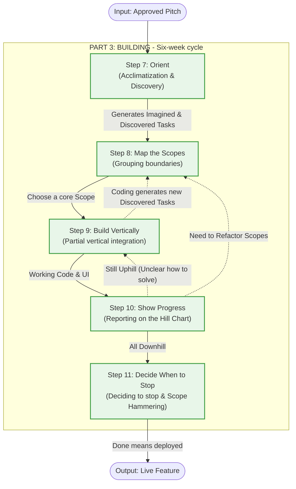

Here is a detailed report outlining all the activities in **Part 3: Building** (from step 7 to step 11) of the Shape Up methodology. This report focuses on clarifying how the development team transforms a **Pitch** into actual software through a closed loop, with strictly defined inputs, processing, and outputs.

---

### PART 1: HIGH-LEVEL DIAGRAM - THE CLOSED LOOP TO COMPLETE A PITCH

The "Building" process is not a linear waterfall. It is a closed loop where writing code (doing real work) continuously generates new data, forcing the team to regroup and push tasks through milestones on the chart until they are fully completed.

---

### PART 2: DETAIL COMPONENT ANALYSIS - STEP-BY-STEP TASK DETAILS

Below is a detailed Component Diagram analysis specifying the exact data flow: **Input $\rightarrow$ Processing $\rightarrow$ Output** for each step.

#### Step 7: Orient (Acclimatization & Discovery)

This is the phase of "radio silence" during the first few days, where developers and designers dig deep into the system themselves instead of jumping straight into coding.

* **Inputs:** The **Pitch** (boundaries, rough solution) and the existing codebase.
* **Processing:**
* The team investigates how the current system works.
* They map out **Imagined tasks** (the work they *think* they need to do based on reading the Pitch).
* They conduct small experiments (spiking) with the code to find **Discovered tasks** (real-world risks and constraints that only appear when actually touching the system).

* **Outputs:** A raw, mixed list of **Imagined tasks** and **Discovered tasks**.

#### Step 8: Map the Scopes (Grouping Work Boundaries)

No one assigns tasks to the team. They must structure the project themselves based on the actual volume of data just discovered.

* **Inputs:** The chaotic list of tasks from the Orient step.
* **Processing:**
* Group closely related tasks together into independent containers called **Scopes**. Do not divide by person (e.g., Frontend list, Backend list), but by functionality (e.g., "Checkout", "Cart Creation").
* Categorize the variety of Scopes data:
* **Layer cakes:** Scopes with a thin, balanced mix of UI and Backend.
* **Icebergs:** Scopes with an extremely simple UI but a highly complex Backend (or vice versa).
* **Chowder:** A small list containing miscellaneous tasks that do not belong to any specific scope.

* Use the tilde `~` to mark improvement tasks that are optional, known as **Nice-to-haves**.

* **Outputs:** An anatomical map of the project with clear **Scopes**, becoming the common language of the project for discussions.

#### Step 9: Build Vertically (Vertical Integration - Get One Piece Done)

Do not build the project in horizontal layers (i.e., finishing all the Backend before starting the Frontend), but work in vertical slices.

* **Inputs:** A core, small, and novel Scope that the team prioritizes to work on first.
* **Processing:**
* Design basic **Affordances** (buttons, basic text flows) to connect the code; absolutely do not get bogged down in pixel-perfect design at this stage.
* Developers program just enough to combine with the affordances so that the feature works.
* Continuously capture new **Discovered tasks** arising from the integration process and throw them back into the Scope.

* **Outputs:** A working piece of the feature that can be clicked for validation (demoable), building momentum for the team.

#### Step 10: Show Progress (Reporting Progress via the Hill Chart)

Instead of reporting progress by counting tasks (since the number of tasks keeps growing), the team reports shifts in certainty and understanding.

* **Inputs:** The actual status of the **Scopes**.
* **Processing:**
* The team moves dots (representing Scopes) across the **Hill Chart**.
* Drag dots from the **Uphill** phase (Figuring things out - solving unknowns) to the top of the hill.
* Drag dots down to the **Downhill** phase (Making it happen - execution / knowns).
* Refactor if a Scope gets stuck on the hill for too long (splitting a large Scope into smaller Scopes).
* *Solve in the right sequence:* Prioritize pushing the most high-risk, unknown Scopes over the hill first, leaving the predictable work for the end of the cycle.

* **Outputs:** A visual representation of project risk. Managers can see the status on their own without disturbing the team (Status without asking).

#### Step 11: Decide When to Stop (Deciding to Stop & Handoff)

As the six-week timebox winds down, the **Circuit breaker** is prepared to trigger. The team must cut back on perfectionist ambitions.

* **Inputs:** An imperfect product, a list of edge cases, bugs, and unfinished **Nice-to-haves** (`~`) tasks.
* **Processing:**
* Execute the **Scope hammering** technique: The team uses a sledgehammer to cut away everything that is not a **Must-have**.
* *Trade-off algorithm:* Instead of comparing the current product to a perfect ideal, the team compares it down to the **Baseline** (the status quo customers are currently suffering through). If it is better than the Baseline, it is deemed "good enough."
* **QA is for the edges:** Treat all bugs reported by QA as **Nice-to-haves**. Fix only critical, show-stopping bugs; the rest can be left behind if time runs out.

* **Outputs:** The feature is deployed directly to the live environment (**Done means deployed**). The project closes, the team is completely debt-free, and they are ready to enter the 2-week Cool-down period.