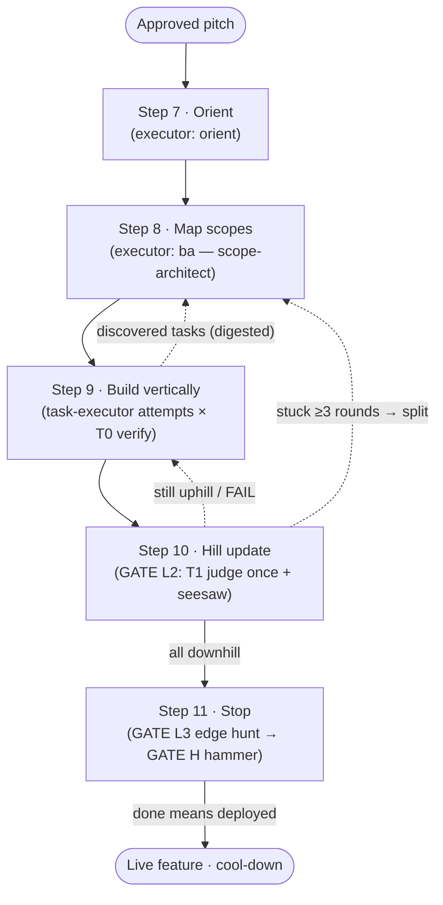

# ShapeUp SDLC Harness Plugin — Software Design Specification

| | |
|---|---|
| **Document** | Design Specification **v1.1** (Blueprint v2.1 + grill-report integration) |
| **Target release** | shapeup-sdlc-plugin v0.3.0 |
| **Baseline** | shapeup-sdlc-plugin v0.2.6 · Design Spec v1.0 |
| **Status** | Draft for review — paper experiments only, nothing executed |
| **Author** | Liberty Nguyen (design assisted by Claude) |

**Change log v1.0 → v1.1** (source: architecture grill report, "Bản Đặc Tả Thẩm Định — Map Scopes & Build Vertically", 2026-07-11; Vietnamese source normalized to English per the harness's own GATE L0 rule):

1. New **P6**: catalog of six AI-agent pathologies; new §4.5 pathology → countermeasure map.
2. New **scope contract** artifact (`.harness/scopes/<id>.json`) with `allowed_file_substrate` write-whitelist, enforced by a PreToolUse sandbox hook (Blueprint B2, E).
3. **Two-tier verification**: T0 mechanical (Playwright fixtures + seesaw regression, every attempt, zero LLM cost) under T1 spec-evaluator (one judge, once per round, verdict requires the T0 artifact) — reconciles the report's per-attempt verification with the *one judge / eval-once-per-round* invariants (§3.5, DD-7).
4. **Seesaw regression gate** + rollback + branch-per-scope isolation (§3.5, Blueprint A).
5. **Zero-memory handoff** context policy and **AEGIS digester** log distillation (§3.6).
6. **Two-level circuit breaker**: inner per-scope attempt budget nested in the global round budget (DD-9).
7. Hill positions re-based on the report's **phase enum**, made fully *derivable* from mechanical facts; self-reported `confidence_score` rejected (DD-10, closes R3).
8. **3-layer UI anatomy** (affordance contract → raw scaffolding → pixel-polish postponed) folded into executor/evaluator contracts (§4.6).
9. New hypotheses H6, H7; new paper experiments E6, E7; checklist merged into §10.

---

## 1. Problem statement

### 1.1 Context

The software under design is a **Claude Code plugin that orchestrates AI tools through the Shape Up methodology**, implemented as a *harness pattern*: a `planner → generator → judge` loop with a thin orchestrator on top. Version 0.2.6 ships eight skills (shapeup, translator, orient, ba-pitch-analyzer, task-executor, spec-evaluator, qa-edge-hunter, tech-lead), a `/ship` command, a reviewer agent, hooks, and a marketplace-in-repo distribution model.

### 1.2 Problems

**P1 — The pipeline is linear; Shape Up's building phase is not.**
Steps 7–11 describe a *closed loop*: coding generates discovered tasks, discovered tasks force scope remapping, scope certainty (not task counts) drives progress, and a circuit breaker forces a stop. v0.2.6 has exactly one loop (`EVAL FAIL → BUILD`) — a *correctness* loop, not a *certainty* loop. The orient skill emits a hill signal nothing consumes; `ba-pitch-analyzer` never re-plans; steps 10 and 11 have no mechanism at all.

**P2 — One model runs everything, so cost and quality are coupled.**
Frontier models make hundreds of mechanical build turns expensive; small models make judgment moments (scope trade-offs, stuck-scope splits, ship/kill) unreliable. There is no way to decouple the two.

**P3 — Methodology adherence is by convention, not by construction.**
Invariants ("one judge", "eval once per round", "QA never blocks ship", "done means deployed") live in skill prose. An LLM following prose *usually* complies; a mechanism it cannot bypass *always* complies.

**P4 — No stop condition.**
Nothing implements the six-week timebox analog: no circuit breaker, no scope hammering, no baseline comparison.

**P5 — Users cannot control model assignment.**
Model choice per role must be configurable via flags, environment, or committed settings, with shipped defaults.

**P6 — Known AI-agent pathologies are undefended.** *(new in v1.1)*
The grill report catalogs six systematic failure modes observed when LLM agents run Map-Scopes/Build-Vertically without hard constraints:

| # | Pathology | Description | Shape Up rule it breaks |
|---|---|---|---|
| PA1 | Folder-based grouping bias | Scopes formed along the directory tree (Frontend/, Backend/) instead of business flows | Build vertically |
| PA2 | Scope drift / over-inflation | Agent pulls the whole repo into one scope "to be safe"; token blow-up | Independent, finishable scopes |
| PA3 | Cross-scope contamination | Editing scope B silently changes files/logic belonging to scope A | Scopes integrate independently |
| PA4 | Hospitality trap | Generator and evaluator share a session (or the judge reads generator prose); mock-data frontends get PASSed while the backend is hollow | One skeptical judge |
| PA5 | Catastrophic forgetting | Fixing scope B modifies shared utilities and silently breaks accepted scope A; no regression check exists | Done stays done |
| PA6 | Context anxiety / noise explosion | Raw stack traces and engine logs dumped into the agent's window destroy its planning ability | Focus on one piece |

v1.0 enforced methodology but never named these failure modes; each now has a designed countermeasure (§4.5).

### 1.3 Non-goals

Unchanged from v1.0: shaping (steps 1–6) is out of scope; no multi-repo orchestration; human touch-points remain the PO gates; Section 8 experiments are paper-only. Added: pixel-perfect visual styling is explicitly **postponed** out of v0.3.0 (§4.6, Layer 3).

---

## 2. Hypotheses

**H1 — Mechanical gates outperform prose conventions for methodology adherence.** Rules encoded as code paths/budgets/schemas will show ~0% invariant violations versus a measurable rate for prose-only rules.

**H2 — A hill-chart-driven closed loop converges faster than a linear FAIL loop.** Routing by scope certainty (riskiest-first + stuck-split) reduces rounds-to-ship versus PASS/FAIL routing alone.

**H3 — Model tiering preserves quality at a fraction of cost.** Frontier at gates + Sonnet/Haiku per-turn achieves ≥95% of all-frontier quality at ≤35% of its cost.

**H4 — A budgeted escalation protocol beats both extremes.** Capped ESCALATE resolves ambiguity better than guessing (all-cheap) and cheaper than micromanagement (all-frontier).

**H5 — The judge is the tier floor.** Downgrading the evaluator below Sonnet-class produces false PASSes costing more than the tokens saved.

**H6 — Substrate sandboxing + context isolation eliminate cross-scope pathologies.** *(new)* With a write-whitelist enforced by hook (PA2, PA3) and zero-memory handoff per attempt (PA6), cross-scope contamination incidents drop to ~0 and per-attempt token cost stays flat instead of growing with history.

**H7 — Two-tier verification blocks false PASSes at near-zero marginal cost.** *(new)* Requiring the T1 judge's verdict to cite a deterministic T0 artifact (Playwright fixture log + DB probe + seesaw result) removes the hospitality trap (PA4) without adding LLM tokens, because T0 is machine-time, not model-time.

---

## 3. High-level design

### 3.1 Architecture overview

```
┌──────────────────────────────────────────────────────────────┐
│  ORCHESTRATOR (Fable 5 / Opus — on-demand, gates only)       │
│  tech-lead agent: hill-state machine, round ledger,          │
│  escalation adjudication, scope hammer, ship verdict         │
├──────────────────────────────────────────────────────────────┤
│  EXECUTORS (Sonnet 4.6 / Haiku 4.5 — run every turn)         │
│  translator · orient · ba(--remap, the scope-architect) ·    │
│  task-executor · spec-evaluator · qa-edge-hunter ·           │
│  aegis-digester — stateless subagents                        │
├──────────────────────────────────────────────────────────────┤
│  T0 MECHANICAL LAYER (no LLM — hooks, scripts, Playwright)   │
│  sandbox hook (write-whitelist) · fixture runner ·           │
│  seesaw regression registry · git rollback                   │
├──────────────────────────────────────────────────────────────┤
│  STATE (files in repo — the only shared memory)              │
│  .harness/scopes/<scope_id>.json      (scope contracts)     │
│  docs/shapeup-sdlc/hill-state.md      (aggregate, derived)  │
│  docs/shapeup-sdlc/round-ledger.md                           │
│  discovery/ledger.md (imagined|discovered, ~ marks)          │
│  docs/shapeup-sdlc/knowledge-base/<skill>.md · metrics.jsonl │
└──────────────────────────────────────────────────────────────┘
```

Design laws:

1. **Subagents are pure functions over files** — read inputs from disk, return a structured block, keep no run-state.
2. **The orchestrator is the only writer** of `hill-state.md` and `round-ledger.md`; `ba` is the only writer of scope contracts; workers append (never edit) `discovery/ledger.md`.
3. *(new)* **A T0 mechanical layer sits below the executors**: deterministic tooling (hooks, Playwright runner, git) that costs machine-time, not tokens, and that no model can talk its way past.

### 3.2 The closed loop (unchanged shape, hardened edges)



### 3.3 Orchestrator gate lifecycle

| Gate | Step | Trigger | Orchestrator action | Dispatch |
|---|---|---|---|---|
| **L0** | intake | run start | non-EN check; **L0.5** model-resolve (flags → env → frontmatter); write matrix + `round_budget` + `attempt_budget` to ledger header | `translator` (conditional) |
| **Seed** | 7 | post-intake | consume orient return; `ba` writes initial scope contracts; derive `hill-state.md`, all scopes `UPHILL_UNKNOWN` | `orient`, `ba` |
| **L1** | 8 | scope board ready | validate taxonomy + **substrate disjointness** (no file in two scopes' write-lists except declared shared substrates); PO approves; lock sequence riskiest-first | — |
| **Round loop** | 9 | per round | pick current uphill scope; run **attempt loop** (Blueprint A): generate → T0 verify → digest on fail, ≤ `attempt_budget`; fold digested discovered tasks; answer ESCALATE (≤3/scope/round); remap when tasks don't fit | `task-executor`, `aegis-digester`, `ba --remap` |
| **L2** | 10 | attempts done | dispatch **T1 evaluator exactly once** (verdict must cite T0 artifact); run **seesaw** over regression registry; derive and move hill phase; stuck ≥3 rounds → forced split; `round_budget -= 1`; 0 → GATE H | `spec-evaluator` |
| **L3** | — | first all-downhill PASS | edge hunt once, outside loop; findings `~` | `qa-edge-hunter` |
| **H** | 11 | post-hunt or breaker | must-have census; comparator = **baseline from pitch**; cut list + ship verdict; also receives per-scope hammer *proposals* from inner-breaker trips | none (frontier-only) |
| **L4** | 11 | ship verdict | deploy evidence required; close ledger debt-free; archive `~`; feed `/coach` | none |

### 3.4 Executor contracts

| Executor | Tier | Input | Output block | ESCALATE on |
|---|---|---|---|---|
| `translator` | Haiku | non-EN docs | EN copies + glossary | never |
| `orient` | Sonnet | pitch + codebase | surface map, spike findings, task seed (imagined/discovered), hill signal | pitch unbuildable |
| `ba` / `--remap` (scope-architect) | Sonnet | pitch + ledger delta + **import graph** | scope contracts (`.harness/scopes/*.json`), TASK specs, test surface, **affordance manifests** | inseparable scopes |
| `task-executor` | Sonnet | **isolated brief** (contract + substrate files + digested errors + ledger decisions) | slice diff (within substrate), AC ticks, discovered tasks, demo pointer | design decision · spec ambiguity |
| `spec-evaluator` | **Sonnet (pinned, H5)** | spec folder + running app + **T0 artifact** | PASS/FAIL + file:line bugs; verdict invalid without T0 citation | never |
| `qa-edge-hunter` | Haiku | spec + EVAL report (negative space) | ledger findings, all `~` | never |
| `aegis-digester` *(new)* | Haiku (script-first) | raw build/test/Playwright logs | `{file, line, core_message}` triples → scope's `discovered_tasks_pool` | never |

The digester is implemented script-first (regex/parser over known log formats) with a Haiku fallback for unrecognized formats — mechanical work belongs at the cheapest tier that does it reliably, and the cheapest tier is *no model*.

### 3.5 Two-tier verification and the seesaw gate *(new)*

The grill report correctly demands empirical verification on every attempt; the v1.0 invariant correctly demands one judge per round. Both hold by splitting verification:

- **T0 — mechanical (every attempt, zero tokens):** the Playwright MCP fixture flow declared in the scope contract (fill/click via `data-testid`, assert states, plus a real DB probe), followed on green by the **seesaw check**: re-run the fixtures of every scope already `FINISHED` (the regression registry). Any red → automatic `git` rollback of the workspace to the last safe point and one attempt consumed. T0 produces an artifact (log + verdict file) that no agent can fabricate.
- **T1 — the judge (once per round):** `spec-evaluator` grades spec-conformance, TDD surface, and integration *and must cite the T0 artifact*; a verdict without it is structurally invalid. The generator's own prose ("tests pass, looks good") is not admissible evidence — closing PA4.

Branch isolation: each scope builds on its own git branch/worktree; merge to main is gated on T0-green + seesaw-green + T1-PASS. This replaces the report's vaguer "folder fork" with the git boundaries the plugin already manages.

### 3.6 Context policy — zero-memory handoff *(new)*

Per attempt, the generator receives a **fresh context** containing only: the scope contract, current contents of `allowed_file_substrate` files, digested error triples, and any ledger decisions (escalation answers) for this scope. Chat history from prior attempts and other scopes is never carried — closing PA6 and keeping per-attempt token cost flat. Escalation memory survives resets *because it lives in the ledger*, not in the session (see DD-8).

---

## 4. Combining Shape Up with the harness pattern — and why

### 4.1 The mapping principle

> **Every Shape Up principle becomes either (a) a code path in the orchestrator, (b) a schema constraint in an artifact, (c) a structural limitation of a subagent, or — new in v1.1 — (d) a T0 mechanical guard beneath the model layer entirely. Never merely a sentence in a prompt.**

### 4.2 Principle → mechanism table

| Shape Up principle | Class | Mechanism |
|---|---|---|
| Radio silence / orient first | (c) | `orient` is a mandatory pre-L1 dispatch with no production-write capability |
| Imagined vs. discovered tasks | (b) | ledger schema requires `origin:`; hill math reads it |
| Scopes by function, not person | (b)+(d) | contract schema has no assignee; substrate whitelist forces vertical slices (a scope owning only `frontend/` fails L1 disjointness+flow checks) |
| Build vertically, demoable | (b)+(d) | Done-when requires demo pointer; T0 fixture drives the running app end-to-end incl. DB probe |
| Hill = certainty, not counts | (a)+(b) | progress = derived phase enum only; no task-percentage output exists |
| Status without asking | (b) | PO reads `hill-state.md` from the repo |
| Stuck scope → refactor | (a) | `rounds_at_position ≥ 3 → forced ba --remap split` |
| Circuit breaker | (a) | two-level budgets decremented by construction (DD-9) |
| Scope hammer vs. baseline | (a)+(b) | GATE H comparator argument is the pitch baseline |
| QA is for the edges | (a)+(c) | qa post-PASS once; findings hard-default `~` |
| Done means deployed | (a) | L4 refuses to close without deploy evidence |
| Done stays done *(new)* | (d) | seesaw regression registry + rollback |
| Cool-down, debt-free | (a) | archive `~`, route lessons to `/coach` |

### 4.3 Why the model tiers sit where they do

Unchanged from v1.0 (two-level Executor/Advisor: structural + budgeted ESCALATE, answers persisted to the ledger), with one addition: the T0 layer means the *cheapest* tier in the system is now "no model at all" — every check that can be a script must be a script before it is a Haiku call, and a Haiku call before a Sonnet call.

### 4.4 Model configuration

Three layers, highest precedence first — unchanged (§4.4 v1.0): `/ship` flags → `SHAPEUP_*` env in settings.json → agent frontmatter defaults, resolved at GATE L0.5, matrix recorded in the ledger header. New knobs: `SHAPEUP_ATTEMPT_BUDGET` (default 5), `SHAPEUP_DIGESTER_MODEL` (default: script, fallback haiku).

### 4.5 Pathology → countermeasure map *(new)*

| Pathology | Countermeasure | Class |
|---|---|---|
| PA1 folder-grouping bias | scope-architect slices by import-flow (frontend + backend files sharing an API call chain must share a substrate); L1 rejects boards whose scopes align 1:1 with top-level directories | (a)+(b) |
| PA2 scope drift | substrate size lint at L1 (warn > N files, hard-cap configurable); chowder absorbs strays | (b) |
| PA3 cross-contamination | PreToolUse sandbox hook blocks writes outside the active scope's substrate; violation logged to `metrics.jsonl` as a pathology event | (d) |
| PA4 hospitality trap | generator/judge never share a session (separate subagents); T1 verdict requires T0 artifact; black-box testing only via affordance selectors | (c)+(d) |
| PA5 catastrophic forgetting | seesaw regression registry + auto-rollback + branch-per-scope | (d) |
| PA6 context anxiety | AEGIS digester distills logs to `{file, line, message}`; zero-memory handoff per attempt | (c)+(a) |

### 4.6 UI discipline inside Build Vertically — the 3-layer anatomy *(new)*

Adopted from the grill report; Shape Up's affordance-first stance made mechanical:

1. **Layer 1 — Affordance contract** (in the scope contract's `affordance_manifest`): every interactive element declared with `data-testid`/`aria-label` and its required states (`idle | loading | success | error | empty`) expressed as `data-state` attributes. Semantic HTML only.
2. **Layer 2 — Raw UI scaffolding**: the generator builds unstyled semantic markup bound to *real* API/DB data. **Hardcoded data arrays are banned** — the T0 DB probe exists precisely to catch a pretty frontend over a hollow backend. This layer is what T0 fixtures drive and what "demoable" means.
3. **Layer 3 — Pixel-perfect polish**: **postponed out of v0.3.0 entirely.** No CSS/visual work in generator briefs; the evaluator is *forbidden* from asserting on pixels, colors, or fonts — only on affordance existence and behavior. Future modules (design-token injectors, Figma-to-code) attach here without touching domain logic.

Rationale: the CSS-tweak loop is the single largest token sink observed in agent build transcripts, and it produces zero hill movement — styling is definitionally downhill work with no unknowns, which is exactly what Shape Up says to leave for last (or, here, for a later cycle).

---

## 5. Blueprints

### 5.1 Blueprint A — orchestrator state machine (revised)

```text
run(pitch, flags):
  # GATE L0 / L0.5
  models  = resolve(flags, env, frontmatter_defaults)
  rounds  = flags.rounds   or env.SHAPEUP_ROUND_BUDGET   or 6
  tries   = flags.attempts or env.SHAPEUP_ATTEMPT_BUDGET or 5
  ledger.header = {models, rounds, tries, baseline: pitch.baseline}
  if non_english(pitch): dispatch(translator, models.exec)

  # Step 7 + contracts
  seed  = dispatch(orient, models.exec)
  board = dispatch(ba, models.exec, seed)          # writes .harness/scopes/*.json
  hill  = derive_hill(board)                        # all UPHILL_UNKNOWN

  # GATE L1 (step 8)
  assert board.substrates_disjoint_or_declared_shared()
  assert board.no_directory_aligned_scopes()        # PA1 guard
  sequence = po_approve(order_by_risk_desc(board.scopes))

  # Round loop (steps 9–10)
  while rounds > 0 and not hill.all(FINISHED):
    scope = hill.riskiest_uphill(sequence)
    checkout(branch_of(scope))                      # PA3/PA5 isolation

    # ---- inner attempt loop (T0, zero LLM judging) ----
    for attempt in 1..tries:
      brief  = isolated_brief(scope)                # zero-memory handoff (PA6)
      result = dispatch(task_executor, models.exec, brief)   # sandbox hook active (PA3)
      handle_escalations(result, cap=3)             # answers → ledger
      t0 = run_fixtures(scope.e2e_verification_fixtures)     # Playwright MCP + DB probe
      if t0.green:
        if seesaw_green(regression_registry): break # PA5 gate
        else: git_rollback(); continue
      scope.discovered_tasks += digest(t0.raw_logs) # AEGIS (PA6)
    if not t0.green:                                # inner breaker tripped
      hammer_proposals += scope                     # judged later at GATE H
    if not board.fits(scope.discovered_tasks):
      board = dispatch(ba_remap, models.exec, ledger.delta())

    # ---- GATE L2: T1 judge EXACTLY once per round ----
    verdict = dispatch(spec_evaluator, models.eval, scope, evidence=t0.artifact)
    hill.set(scope, derive_phase(scope, t0, verdict, seesaw)) # never self-reported
    if verdict.pass and seesaw_green: merge_to_main(scope); registry += scope.fixtures
    if hill.stuck(scope, rounds=3):
      board = dispatch(ba_remap, models.exec, split(scope))
      hill.replace(scope, board.new_scopes())
    rounds -= 1

  # GATE L3 → GATE H → GATE L4 (unchanged from v1.0)
  if hill.all(FINISHED) and not flags.no_qa: dispatch(qa_edge_hunter, models.qa)
  cuts = scope_hammer(open_items + hammer_proposals, comparator=ledger.header.baseline)
  verdict = ship_or_kill(cuts)
  require(deploy_evidence()); ledger.close_debt_free(); coach_handoff()
```

Invariant placement: *eval once per round* is a single straight-line dispatch outside the attempt loop; T0 runs per attempt but is deterministic tooling, not a judge. Both breakers are loop conditions. The baseline comparator is a function argument.

### 5.2 Blueprint B — artifact schemas (revised)

**B1 · `.harness/scopes/<scope_id>.json` — the scope contract** *(new, adapted from the grill report)*

```json
{
  "scope_id": "cart-creation",
  "topology_type": "ICEBERG",              // LAYER_CAKE | ICEBERG | CHOWDER
  "business_goal": "Shopper can create a cart and see it persist",
  "allowed_file_substrate": [
    "src/pages/cart/*.tsx", "src/api/cart/*.ts",
    "src/domain/cart/*.ts", "db/migrations/012_cart.sql"
  ],
  "shared_substrate": ["src/lib/http.ts"], // declared, seesaw-guarded
  "discovered_tasks_pool": ["DT-041"],
  "e2e_verification_fixtures": ["fixtures/cart-create.spec.ts"],
  "affordance_manifest": {
    "interactive_elements": [
      {"test_id": "add-to-cart-btn", "role": "button"},
      {"test_id": "cart-count-badge", "role": "status"}
    ],
    "required_states": ["idle", "loading", "success", "error", "empty"]
  },
  "hill_phase": "UPHILL_UNKNOWN"           // derived — see B2
}
```

Deltas from the report's schema: `CHOWDER` added to the topology enum; `shared_substrate` added (declared shared files are legal but every write to them forces a full seesaw run); **`confidence_score` removed** (DD-10); `hill_phase` is derived, never written by an executor.

**B2 · Hill phase derivation rules** *(replaces v1.0 percentage positions)*

| Phase | Derivation (mechanical facts only) |
|---|---|
| `UPHILL_UNKNOWN` | `open_unknowns > 0` in the ledger for this scope |
| `UPHILL_SOLVED` | unknowns = 0, but no T0-green attempt recorded yet |
| `DOWNHILL_EXECUTION` | ≥1 T0-green attempt; T1 PASS or seesaw still pending |
| `FINISHED` | T1 PASS **and** seesaw green **and** merged to main |

`hill-state.md` remains the orchestrator-owned aggregate view (round, budgets, per-scope phase + `rounds_at_position`), now computed from contracts + verdicts rather than declared.

**B3 · Ledger entry & escalation record** — unchanged from v1.0 (origin tag, `~` priority, decision records), plus a new event type `pathology: {kind: PA1..PA6, detail}` written by the T0 layer to `metrics.jsonl`.

### 5.3 Blueprint C — agent and config files

Unchanged from v1.0 (tech-lead `model: opus`, `tools: [Read, Task]`; builder/evaluator/hunter/scout/mapper on sonnet/haiku), plus:

```json
// .claude/settings.json additions
{
  "env": {
    "SHAPEUP_ATTEMPT_BUDGET": "5",
    "SHAPEUP_DIGESTER_MODEL": "script"
  }
}
```

### 5.4 Blueprint D — repo delta v0.2.6 → v0.3.0 (revised)

```
skills/
  advisor-protocol/SKILL.md      NEW   ESCALATE grammar + budgets
  scope-hammer/SKILL.md          NEW   GATE H census → baseline → verdict (+ inner-breaker proposals)
  tech-lead/SKILL.md             REWRITE  gate machine, two-level breaker, hill derivation
  ba-pitch-analyzer/SKILL.md     EDIT  scope-architect role: contracts, import-graph slicing,
                                       --remap, affordance manifests, PA1/PA2 lints
  task-executor/SKILL.md         EDIT  isolated-brief protocol, substrate discipline,
                                       Layer-1/2 UI rules (no CSS, no hardcoded data), ESCALATE
  spec-evaluator/SKILL.md        EDIT  verdict-requires-T0-artifact; affordance-only assertions
  qa-edge-hunter/SKILL.md        EDIT  optional hill-state lens targeting
agents/*.md                      NEW   per-role model frontmatter
hooks/
  hooks.json                     EDIT  + PreToolUse sandbox hook (substrate whitelist, PA3)
scripts/
  t0-verify.sh                   NEW   fixture runner + DB probe + seesaw + artifact writer
  aegis-digest.(sh|ts)           NEW   log distiller (script-first)
  install-harness.sh             EDIT  model frontmatter templating fallback
.harness/scopes/                 NEW   generated per run (gitignored via .shapeup-sdlc rule review)
commands/ship.md                 EDIT  + --attempts, model flags, --rounds
```

Build order: advisor-protocol → scope-hammer → **t0-verify + sandbox hook** (everything downstream depends on them) → tech-lead rewrite → ba/executor/evaluator edits → skill-creator evals on fixture repo → v0.3.0.

### 5.5 Blueprint E — sandbox hook sketch *(new)*

```json
// hooks/hooks.json (PreToolUse)
{ "matcher": "Edit|Write|MultiEdit",
  "command": "scripts/sandbox-guard.sh",   // reads .harness/active-scope,
  "onFailure": "block" }                    // globs substrate, exits non-zero on violation
```

The guard also appends a `pathology: PA3` event to `metrics.jsonl` on every blocked write — turning defense into telemetry that E-series experiments can later consume.

---

## 6. Design decisions and rationale

**DD-1 … DD-6** — unchanged from v1.0 (advisor-not-micromanager; ESCALATE via structured return; hill as file not UI; breaker in rounds not wall-clock; evaluator pinned Sonnet; remap as a `ba` mode not a new skill).

**DD-7: Two-tier verification instead of per-attempt LLM judging.** *(adjudicates the grill report)*
The report's pseudocode runs verification inside every attempt, which — read as evaluator calls — violates *eval once per round*. Resolution: T0 (deterministic, per attempt) under T1 (judge, per round). This keeps the report's empiricism, keeps the invariant, and strengthens the judge: a verdict must cite the T0 artifact, so generator prose can never substitute for a green fixture (PA4).

**DD-8: Zero-memory handoff is compatible with escalation memory.**
Context resets wipe *sessions*; decisions persist in the *ledger* and are injected into every fresh brief. Memory lives in files, not in chat — consistent with design law 1.

**DD-9: Two-level circuit breaker.**
The report's `maxRetries=5` per scope becomes the inner attempt budget (T0 retries, cheap); the v1.0 round budget remains the outer breaker (T1 judgments, the six-week analog). Inner trip → per-scope hammer *proposal* queued for GATE H; outer trip → GATE H immediately. Both are loop conditions, not prompts.

**DD-10: Phase enum adopted; confidence_score rejected.**
The report's discrete phases (`UPHILL_UNKNOWN / UPHILL_SOLVED / DOWNHILL_EXECUTION / FINISHED`) are better than v1.0's percentages — discrete, meaningful, and *derivable*. Its self-reported `confidence_score ∈ [0,1]` is exactly risk R3 (model-declared progress) and is dropped; every phase now derives from mechanical facts (B2), closing R3 outright.

**DD-11: Scope-Architect folded into `ba`; slicing algorithm adopted pragmatically.**
No new agent (upholds DD-6). The report's algorithm — dependency analysis → vertical slicing by import flow → contract writing — becomes `ba`'s method. Implementation note: start with an import graph (`madge`/`tsc --listFiles`-class tooling or grep heuristics) rather than a full multi-language AST parser; the AST is an optimization, not a prerequisite, and R6 tracks its weight.

**DD-12: Pixel-perfect postponed as a rule, not a preference.**
Styling produces no hill movement and dominates token waste (§4.6). Layer 3 is frozen in v0.3.0; the evaluator is barred from visual assertions so the freeze cannot leak back in through the judge.

---

## 7. Requirements traceability

| Problem | Addressed by |
|---|---|
| P1 linear pipeline | §3.2 feedback edges; GATE L2 hill routing; `ba --remap` |
| P2 coupled cost/quality | §3.1 tiering; §4.3 advisor pattern + script-before-model rule |
| P3 adherence by convention | §4.2 enforcement classes (a)–(d) |
| P4 no stop condition | DD-9 two-level breaker; GATE H; GATE L4 deploy proof |
| P5 model configurability | §4.4 three-layer resolution at L0.5 |
| P6 agent pathologies | §4.5 map: sandbox hook (PA2/PA3), T0-cited verdicts (PA4), seesaw (PA5), digester + reset (PA6), slicing lints (PA1) |

---

## 8. Paper experiments (design only, nothing executed)

Common fixture and relative price units unchanged from v1.0 (Frontier 15× / Sonnet 3× / Haiku 1×; TS app ~40k LOC, 4 scopes, ~22 tasks). **E1–E5 carry over from v1.0 unchanged** (cost model → tiered ≈ 23% of all-frontier; hill- vs FAIL-routing convergence; breaker/hammer adversarial walkthrough; judge-tier ablation; escalation-cap ablation), with one E1 amendment: T0 verification adds **zero** model tokens to any configuration, so the cost table is unaffected while quality guards increase — strengthening H3's margin.

### E6 — Seesaw cost/benefit and placement (tests H6 partly, PA5)

**Setup (analytical).** Registry grows with finished scopes: after scope *k*, a full seesaw runs *k−1* fixture suites (machine-time ≈ 1–3 min each, token cost 0). Candidate policies: (A) seesaw on every attempt; (B) seesaw only on T0-green attempts (design choice); (C) seesaw only at L2.
**Paper computation.** With `tries=5`, 4 scopes, ~40% attempt-green rate: policy A ≈ 5×(k−1) suite-runs per scope round; B ≈ 2×(k−1); C ≈ 1×(k−1) but detects regressions after the executor context is gone, forcing a *new* round (~1,000 units tiered) instead of an in-round rollback+retry (~180 units).
**Prediction.** B dominates: ~60% less machine time than A, and it catches PA5 while the fixing context is still cheap. One silently shipped regression (post-ship hotfix ≈ 1,000+ units plus trust damage) exceeds an entire cycle's seesaw machine cost.
**Falsifier.** If fixture suites exceed ~10 min each (heavy E2E), B's in-round latency stalls throughput — trigger for a "changed-substrate-intersection" filter (only re-run suites of scopes sharing files with the diff).

### E7 — Context-isolation ablation (tests H6, H7; PA4/PA6)

**Setup (paper matrix).** Three context policies for the generator across a 5-attempt scope: (1) shared session, raw logs appended (v0.2.6-style); (2) shared session + digested logs; (3) zero-memory handoff + digested logs (design).
**Prediction table.**

| Policy | Tokens by attempt 5 | Expected pathology profile |
|---|---|---|
| 1 | ~5× attempt-1 size, growing | PA6 dominant: local, panicky fixes; PA4 risk if judge shares session |
| 2 | ~2–3× | PA6 reduced; drift from stale earlier reasoning persists |
| 3 | **flat ≈ 1×** | pathology events ≈ 0 by construction; any residual PA3 blocked-write events surface in metrics.jsonl as telemetry, not failures |

**Metric.** Per-attempt input tokens (flat vs. growing) and pathology-event count from the sandbox/T0 telemetry.
**Falsifier.** If policy 3 shows *worse* fix rates than 2 on multi-attempt bugs, the digester is losing necessary causal context — the fix is enriching the digest schema (add the failing assertion + 3 lines of surrounding diff), not restoring chat history.

---

## 9. Risks and open questions

| # | Risk / question | Mitigation |
|---|---|---|
| R1 | `Task()` may not accept per-call model override | installer templates `model:` frontmatter from env |
| R2 | Frontier unavailable on a plan | L0.5 degrades to Sonnet orchestrator with ledger warning; invariants are code paths so adherence survives |
| R3 | ~~Hill positions self-reported~~ | **Closed in v1.1** — phases derive from T0/T1/seesaw facts (B2, DD-10) |
| R4 | Escalation answers drift | ledger persistence + injection on every brief (DD-8) |
| R5 | Hammer cuts something critical | GATE H output is a proposal; PO confirms |
| R6 *(new)* | Import-graph slicing quality on non-TS stacks | grep-heuristic fallback; AST parsers added per-language as optimizations; PA1 lint at L1 catches bad slices regardless |
| R7 *(new)* | Substrate whitelist too rigid — legitimate cross-cutting change blocked | `shared_substrate` declaration + full-seesaw tax on shared writes; ESCALATE type `substrate-expansion` lets the orchestrator amend a contract deliberately |
| R8 *(new)* | Fixture flakiness makes T0/seesaw noisy | one auto-retry on T0 red before it counts; flaky fixtures logged and quarantined to chowder as `~` tasks |
| Q1 | QA lenses read hill-state? | optional, post-v0.3.0 telemetry |
| Q2 | Per-scope vs per-task escalation budget | E5 falsifier defines the switch trigger |
| Q3 *(new)* | Who authors T0 fixtures — `ba` at contract time (design) or executor at build time? | design says `ba` (contract-first, judge-independent); revisit if contract-time fixtures prove too speculative for iceberg scopes |

## 10. Roadmap and quality checklist

| Milestone | Contents | Exit criteria |
|---|---|---|
| **M1** | `advisor-protocol` + `scope-hammer` via `/skill-creator` | skill-creator evals green |
| **M2** *(new)* | T0 layer: `t0-verify.sh`, sandbox hook, `aegis-digest`, seesaw registry | blocked-write test passes; artifact file produced; regression rollback demonstrated on fixture repo |
| **M3** | `tech-lead` rewrite (gates, two-level breaker, hill derivation) | dry-run trace matches Blueprint A on E3's adversarial states |
| **M4** | `ba` scope-architect + executor/evaluator edits + agents + installer | `claude plugin validate . --strict`; model matrix in ledger header; PA1/PA2 lints firing on seeded bad boards |
| **M5** | `/ship` flags + docs + CHANGELOG | tag v0.3.0; E1/E5/E6/E7 assumptions re-checked against first real `metrics.jsonl` |

**Release quality checklist** (merged from the grill report, restated as verifiable gates):

1. Generator cannot read/write outside `allowed_file_substrate` — sandbox hook throws; test with a seeded violation.
2. Generator and evaluator never share a session — separate subagent dispatches by construction; verify in dispatch logs.
3. T1 verdicts cite a T0 artifact produced by a live server run via Playwright MCP — a verdict without the artifact fails schema validation.
4. Evaluator asserts only on affordances (`data-testid`, states, behavior) — never pixels, colors, fonts.
5. Layer-3 styling frozen: no CSS/Tailwind aesthetic edits in generator briefs; lint the diff for style-only changes.
6. Seesaw green required before any hill dot reaches `FINISHED` and before any merge to main.

---

*End of specification v1.1. The grill report's contributions are integrated under DD-7 through DD-12; where the report conflicted with harness invariants (per-attempt judging, self-reported confidence) the invariants won, and the reconciliations are recorded rather than silently resolved.*
