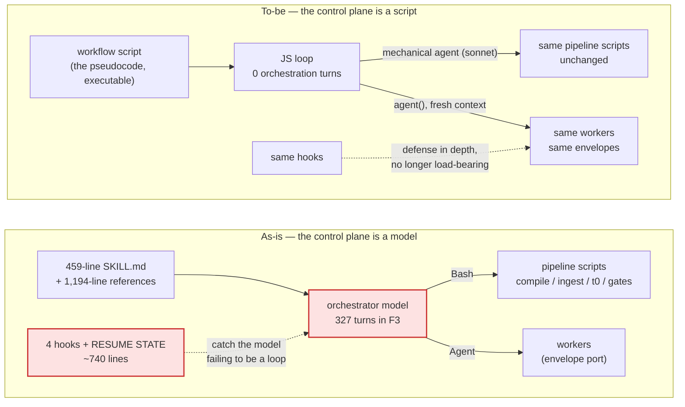
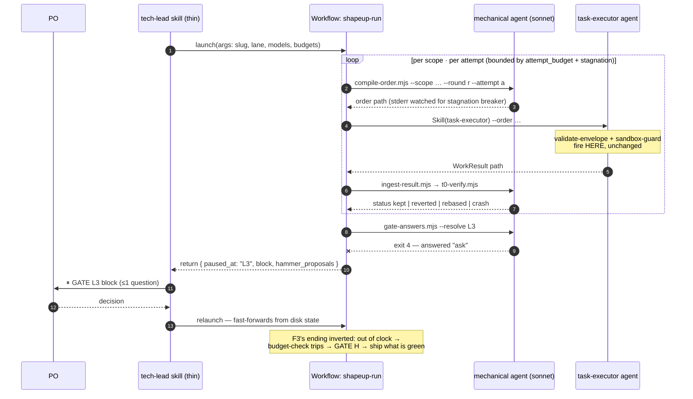

# The control plane is the last plane still running on a model — extract it into a Workflow, keep the scripts as the truth, and tech-lead shrinks to the conversation

**Question:** Can the `/tech-lead` orchestrator be extracted into a Claude Code Workflow script?
If yes — what moves, why, and what remains of the skill?
**Sources:** this repo @ `bc30d11` (working tree): `skills/tech-lead/SKILL.md` (459 lines) + its 7
reference files (1,194 lines), all 6 pipeline scripts, all 5 enforcement hooks + `hooks.json`, the
3 envelope schemas; the Workflow tool contract as shipped in this Claude Code session (script
sandbox: no fs, no `Date.now()`; `agent()/pipeline()/parallel()/phase()`; schema-forced structured
outputs; same-session `resumeFromRunId`); *Graph Engineering — The Karpathy Loop* (July 2026)
§VI.G, §VIII.A, §II.B via the skill's distillation. Read 2026-08-06.
**Confidence:** High on everything read from the repo (cited by file:line). Medium on two runtime
behaviors of the Workflow tool that nothing in this repo can prove — whether plugin PreToolUse
hooks fire inside workflow-spawned subagents, and whether the Workflow tool exists in the headless
lane the benchmark uses. Both are named as the Stage-0 checks in §6, and §7 says what changes if
either fails.
**Status:** analysis + recommendation. Nothing executed; no file outside `docs/` touched.

---

## 0. The finding in one paragraph

Yes — and this harness is unusually ready for it, because the v1.0 pure-skill architecture already
did the hard half. Every worker sits behind a schema-validated envelope port
(`compile-order.mjs` in, `ingest-result.mjs` out), every verdict is derived by deterministic
tooling (`t0-verify.mjs`), gate sign-off is already a file and an exit code
(`gate-answers.mjs:48-52`), and enforcement lives in hooks keyed to the *worker-side* `Skill` and
`Edit/Write` tool calls — not to who orchestrates them. What remains in `tech-lead` is a 459-line
prose state machine whose only job is to call those scripts in the right order and branch on their
exit codes — and every measured failure of this harness is a failure of exactly that job: the
narrated run (29% acceptance, 10 escaped defects, n=5 zero variance — `SKILL.md:12-13`), the blind
handoff (82–120 turns before the first write — `SKILL.md:44-46`), the F3 DNF (killed at 1800 s
*while working*, 327 orchestration turns — `references/round-protocol.md:133-137`), and
consent-by-prose (`gate-answers.mjs:14-18`). The extraction target is precisely the control flow —
the round loop, the per-scope attempt loop, the three breakers, the dispatch mechanics, the gate
branching — which `round-protocol.md:12-22` already writes as pseudocode; a Workflow script is that
pseudocode made executable, and a `for` loop cannot narrate itself. What must *not* move: the
`.mjs` scripts (they stay the single truth, invoked via cheap mechanical agents), the hooks
(orthogonal defense in depth), worker craft (already pure), and the PO conversations — a workflow
cannot ask a question, so every `ask` becomes a **pause**: the workflow returns at the gate, the
remaining skill converses, records the answer, and relaunches — which works precisely because this
harness derives progress from disk instead of claiming it. The remaining `tech-lead` is the
conversational shell: intake and L0 config, one Workflow launch, and gate adjudication on pause.

---

## 1. What is actually being asked

The decision this unblocks: **whether the next architectural investment in this plugin is porting
`tech-lead`'s pipeline management onto the Workflow tool**, versus continuing to harden the
prose-orchestrator with more hooks. The decider is the plugin author, who already knows the
harness's design intimately — so this report does not re-explain the harness; it maps it onto the
Workflow runtime and prices the move.

Constraints that bind the answer, all from the repo's own record:

- **The invariants must survive the move intact.** AGENTS.md's organising idea — *"every invariant
  that matters lives in the runtime, not in a prompt"* — is non-negotiable; an extraction that
  weakens single-writer, single-judge, EVAL-once-per-round, or the substrate sandbox is a
  regression whatever else it gains.
- **Two lanes exist.** Interactive runs (a PO at the keyboard) and headless runs (`--unattended`,
  the benchmark). The extraction must serve both or explicitly assign lanes.
- **The plugin is distributed.** Whatever ships must work from `npx shapeup-sdlc init` on a
  machine that is not this one, with the same one-time permission grant (the measured 26 approval
  denials — AGENTS.md, Setup & Execution).
- **The Workflow tool's opt-in policy.** A workflow may be launched when a slash command's
  instructions say to — so `/build` and `/ship` can legitimately trigger it; the model may not
  infer it. This fits the harness's front door as-is.

Sharpest defensible reading of "orchestrator": the `tech-lead` skill's *pipeline management* —
not the worker skills, not the scripts, not the hooks. That is also the boundary v1.0 already
drew, which is why the question has a clean answer.

---

## 2. The as-built control plane — one plane still made of prose

Score the harness against the five-planes model (Graph Engineering §VI.G — the separation that
prevents *"one chat transcript from becoming the database, workflow engine, and audit log"*):

| Plane | Implemented by | Mechanized? |
|---|---|---|
| **Execution** | Worker skills behind the envelope port; fresh `Agent` per dispatch (`references/delegation.md:9-16`) | ✅ envelope schema-validated before any worker sees it |
| **Artifact** | Two-tier storage, ADR-0001: committed `shapeup/`, gitignored `.shapeup/`; immutable T0 verdicts (`r<N>-a<M>-t<T>.json`, never overwritten — I4) | ✅ |
| **Evaluation** | `t0-verify.mjs` (deterministic, zero LLM tokens — DD-7), `spec-evaluator` (single judge), hooks recording every decision to `decisions.jsonl` | ✅ |
| **Graph** | Partial by design: `trials.jsonl` lineage, `x-erd` in `domain.schema.json`, hill shards | ➖ out of scope here |
| **Control** | **A model, reading 459 lines of SKILL.md + 1,194 lines of references, asked to behave like a state machine** | ❌ the last prose plane |

The delta between the believed and the actual architecture is exactly here. AGENTS.md says "gates
are enforced, not requested" — and that is true *at the enforcement layer*: a malformed order is
denied, an out-of-substrate write is denied, sign-off resolves from a file. But the **sequencing
between the gates is still requested**, of a model, in prose. The repo knows this: it has built a
defense industry around it.

Count what exists solely because the control plane is an LLM:

| Defense | Lines | What it defends against |
|---|---:|---|
| `SKILL.md` "▶ RUN THIS FIRST" block (`:8-83`) | ~75 | the model summarising the pipeline instead of running it |
| `hooks/gate-zerowork.mjs` | 264 | dispatched orchestrator + no receipt = narrated run |
| `hooks/anti-rationalization.mjs` | 244 | "done" claimed against a half-green board |
| `hooks/session-rehydrate.mjs` + `compact-snapshot.mjs` | 156 | the orchestrator losing its own run state across compaction |
| `init-run.mjs` exit-3 RESUME STATE (`SKILL.md:38-46`) | — | a fresh session re-running intake instead of resuming |
| Hard-rules table (`SKILL.md:427-458`), 30 rows | ~32 | the model overriding its own runbook |

Roughly **740 lines of hook code and ~110 lines of skill prose exist to make a language model
execute a loop it was told to execute.** None of it is wasted today — each entry cites a measured
incident — but all of it is compensation, and §VIII.A question 2 of the graph-engineering lens
names the alternative directly: *"Are the steps stable? If yes — use a chain: predictable,
testable stages."* The steps here are not merely stable; they are versioned, schema-bound, and
documented as pseudocode (`round-protocol.md:12-22`). This is the textbook case for a
deterministic orchestrator.



---

## 3. The central finding

**Extracting the orchestrator into a Workflow is not a re-architecture — it is the completion of
the architecture this project already chose.** The v1.0 envelope port made workers
orchestrator-blind: a worker receives `orders/<id>.json` and returns `results/<id>.json`, and
nothing in it can tell whether the order was compiled at the request of a model or a `for` loop
(`delegation.md:18-34`). The enforcement hooks key off the *worker-side* calls — `gate-l2.mjs`
fires on `Skill(spec-evaluator)` (`gate-l2.mjs:56-60`), `validate-envelope.mjs` greps `--order`
out of any `Skill`/`Agent` input (`validate-envelope.mjs:243-249`), `sandbox-guard.mjs` fires on
`Edit/Write` wherever they happen — so the enforcement layer transfers to workflow-spawned agents
unmodified, *provided plugin hooks fire in workflow subagent sessions* (Stage-0 check; §7). The
gates were mechanized last release (`gate-answers.mjs`: exit 0 cross / 4 ask / 5 abort — "the
orchestrator branches on them, not on the prose"). Every interface the workflow needs already
exists and already speaks in exit codes and JSON.

What the model is still doing, per `SKILL.md`, and where each duty lands:

| Duty (today: prose → model) | Workflow primitive | Evidence |
|---|---|---|
| Round loop: BUILD → L2 → EVAL → L3, PASS/FAIL/max_rounds | outer `for` with three exits | `round-protocol.md:12-22` — already pseudocode |
| Per-scope attempt loop, branch on T0 status | inner `for`, branch on `t0-verify` stdout `status: kept\|reverted\|rebased\|crash` | `t0-verify.mjs:201-207` |
| Dispatch mechanics: compile → dispatch → ingest → verify | `agent()` per step; fresh context per dispatch **is** the zero-memory boundary | `SKILL.md:222-234` |
| Three breakers: round_budget, attempt_budget + stagnation, deadline | loop bounds + `compile-order` stderr JSON (`:504-517`) + `budget-check.mjs` at round boundaries | `round-protocol.md:116-130` |
| Gate resolution, branch on exit code | mechanical agent runs `gate-answers.mjs`; 0 → continue, 4 → **return paused**, 5 → return aborted | `gate-answers.mjs:48-52` |
| Model matrix L0.8 (orch/exec/eval/qa) | `agent(…, {model})` per role, values from `args` | `delegation.md:36-52` |
| Hill derivation, ledger rows, harness-run.md | mechanical agents running the same scripts; tech-lead stays "sole writer" — the writer is the script, invoked by the workflow | `SKILL.md:348-358` |
| ESCALATE routing (≤3/scope/round) | ingest queues → `agent(advisor-protocol)`; `ask` under interactive → pause, like a gate | `delegation.md:162-172` |

And the duties that are genuinely judgment — L0 intake configuration, the ≤2-question gate
conversations, the L2.2 `--no-eval` offer, L4 feedback → coach — do not extract, because a
workflow agent cannot address the user. They become the remaining skill (§6, Stage 2).

The property gained is structural, not statistical. Today, narration is *detected* — by a Stop
hook reading the transcript after the fact (`gate-zerowork.mjs:29-34`). In a workflow, the loop
body executes because JavaScript executes it; the surface on which narration can occur shrinks
from ~40 decision points across a 459-line runbook to **one call site** — the main loop must still
actually invoke the Workflow rather than describe it, which is why `gate-zerowork` survives with a
one-predicate extension (§6, Stage 3). Same shape for the handoff failure: the 82–120-turn blind
resume happened because run state lived partly in a session that no longer existed; a workflow
holds loop state in variables *and* the harness already persists every fact it needs to re-derive
position (`receipt.json`, board, `trials.jsonl`, hill shards) — "progress is derived, never
claimed" is precisely the property that makes the workflow re-entrant from disk after any pause,
in any session, without the Workflow tool's same-session resume cache even being necessary.

The failure path, before and after, at the gate that killed F3:



Step 12 is the design's hinge: **a gate is no longer a place where a session waits — it is a place
where a workflow returns.** The F3 stall class (a wait indistinguishable from work,
`gate-answers.mjs:10-13`) becomes unrepresentable: the workflow either progresses or hands back a
typed pause.

---

## 4. Argued from the numbers

**Every major measured failure of this harness is a control-plane failure, and each one's
mechanism is removed — not patched — by the extraction:**

| Measured failure | Number | Mechanism today | Under a workflow |
|---|---|---|---|
| Narrated run (F2, Haiku, n=5) | 29% acceptance, 10 escaped defects, zero variance | model summarises the runbook; Stop hook detects after the fact | loop body is executed by the runtime; narration surface = 1 call site |
| Blind handoff | 82–120 turns before first write, recovered nothing | resume protocol is prose (`SKILL.md:38-46`) | re-entry is code: re-derive phase from receipt/board/trials, the same files the RESUME STATE already prints |
| F3 DNF (Sonnet) | killed at 1800 s, 327 turns, 262 tool calls, 19 gate markers — *working* | orchestration itself consumes the clock; wall-clock breaker added later as a 3rd breaker | 327 orchestration turns → 0; `budget-check.mjs` consulted at every round boundary by code that cannot forget to call it |
| Consent-by-prose | Sonnet obeyed a sign-off paragraph; Haiku narrated instead | fixed by `gate-answers.mjs` — for gates only | the same exit-code discipline extends to *sequencing itself* |
| Approval stall | 26 denials in one session | permission grant on plugin script paths | unchanged — the same grant covers the same scripts run by workflow agents (Stage-0 check) |

**Size of the prose being retired or demoted.** The orchestrator's normative load today is
`SKILL.md` (459) + `gates.md` (379) + `round-protocol.md` (184) + `delegation.md` (254) = **1,276
lines a model must hold and obey per run**. The workflow script expressing the same control flow
is an estimated 150–250 lines of JavaScript (the pseudocode in `round-protocol.md` is 11 lines;
the attempt loop in `SKILL.md:265-314` is ~50; gates add a helper and ~10 lines each) — and it is
*testable*, which 1,276 lines of prose are not. The references do not vanish: they shrink into
worker-contract documentation and the workflow script's comments.

**Cost of the mechanical layer (estimate, labelled as such).** The one real overhead the workflow
adds: script invocations that today run as Bash inside the orchestrator's turn become dedicated
courier agents (the script sandbox has no filesystem). Per attempt: compile + ingest + t0 ≈ 3
mechanical calls; a worst-case 3-scope × 5-attempt round ≈ 45 calls + ~10 gate/breaker calls. At
Sonnet pricing with ~2–4k tokens per call (**model floor: Sonnet on every agent, mechanical
couriers included — PO decision, 2026-08-06; no Haiku anywhere in the run**), that is
**≲ $1/round** — against measured full-run
costs of $2.10–$3.29 (v1.4 F2 reps) and against the *removed* cost of an orchestrator context that
re-reads a growing transcript for 327 turns. Net token cost is almost certainly negative; the
Stage-0 spike measures it instead of trusting this paragraph.

**What does not change, verified against the hook detection logic:**

- `validate-envelope.mjs` hook mode matches `--order` in `skill_args`/`args`/`prompt`
  (`:243-249`) — fires on the worker-side `Skill` call inside any subagent. The *outer* Agent-tool
  match is lost (workflow dispatches don't use the Agent tool), but that check was a second copy
  of the same validation; the inner copy is the one that gates the worker.
- `gate-l2.mjs` scopes itself to `Skill(spec-evaluator)` round-mode (`:56-80`) — fires wherever
  that call happens. Advisory, per ADR-0001 — and under a workflow, the L2 sequencing it advises
  on is enforced by the loop structure itself: EVAL is dispatched only after the build loop exits
  green. The hook demotes from "last line of defense" to receipt-writer.
- `sandbox-guard.mjs` reads `.shapeup/active-scope` and fires on `Edit/Write` (`:10-25`) — the
  workflow's build loop writes the pointer per scope exactly as `SKILL.md:267-270` prescribes.
- `ingest-result.mjs` remains the single writer of shared state; the workflow never touches a
  board file — it cannot, having no filesystem, which turns D6 from "mechanically true" into
  "true by construction of the orchestrator as well."

---

## 5. What deliberately not to do

- **Do not rewrite the pipeline scripts into the workflow's JavaScript.** The temptation is
  obvious — same language — and wrong three ways: the script sandbox has no filesystem, so it
  *cannot* do the reads/writes; the scripts are the shared truth of both lanes and of the hooks
  (`validate-envelope.mjs` is imported by `compile-order.mjs` and run as a hook); and they carry
  the tested edge cases (immutable `-t<T>` addressing, ratchet semantics, ledger parsing). The
  workflow *sequences*; the scripts *act*. One truth, two callers.
- **Do not extract the conversations.** L0 intake, gate questions (≤2), the `--no-eval` offer, L4
  feedback → coach. A workflow agent cannot address the PO; forcing these through pre-recorded
  answers in the interactive lane would delete the harness's governance model. Pauses, not
  prompts-in-the-dark.
- **Do not let the worker agent run its own ingest.** Folding `compile → dispatch → ingest` into
  one agent saves two mechanical calls and breaks the isolation that makes the envelope port
  trustworthy: the worker would sit inside the same context that ingests its result. Keep the
  boundary; it is the whole point of v1.0.
- **Do not parallelize scopes in the first version.** Substrate disjointness (`spec-lint.mjs` at
  L1b) makes parallel scopes *theoretically* safe, and `pipeline()` makes them cheap — but
  `.shapeup/active-scope` is a singleton the sandbox hook reads, branch-per-scope assumes one
  working tree, and the seesaw registry is shared. Parallelism is a real future win (worktree
  isolation exists in the Workflow runtime) and a separate pitch with its own risks.
- **Do not keep the prose orchestrator as an in-tree fallback lane.** (Revised per PO decision
  D2, 2026-08-06 — the original draft recommended flipping unattended first and sunsetting the
  inline lane later.) Dual paths are a measured defect class in this repo (the v1.6.1 installer
  bug), and a "frozen" fallback is never really frozen: every semantics change would need editing
  1,276 lines of prose *and* the workflow script, and the prose copy is the one nobody tests.
  Both lanes cut over in the same release; the rollback is **plugin version pinning** (install
  the previous release), which cannot silently diverge. The two conditions that make the
  big-bang defensible are priced into the stages: the headless-availability check is a Stage-0
  kill-switch, and an interactive pause/relaunch run green is a ship gate of the cutover release
  (§6 Stage 2 exit).
- **Do not drop `gate-zerowork`.** Its predicate (`dispatchedOrchestrator`, `:69-92`) matches
  `Skill(tech-lead)` and `/ship` — a Workflow dispatch would sail past it, fail-open. The failure
  class shrinks but does not vanish: the main loop can still narrate *instead of launching the
  workflow*. One added predicate arm (a `Workflow` tool_use whose name matches `shapeup-*`) keeps
  the detector honest.
- **Do not move the model matrix back into prose.** It arrives as `args.models` and is applied as
  `agent(…, {model})` literals — the same "resolved once at L0.8" discipline, now enforced by the
  only code path that can dispatch.

---

## 6. Recommendation — four stages, evidence first

> **PO decision record (2026-08-06).** Four decisions confirmed against this report's draft:
> **D1** Stage 0 is the kill-switch — the migration starts only if the hook checks pass
> (adopted as drafted). **D2** No dual paths: the prose orchestrator is deleted in the cutover
> release, both lanes move to the Workflow at once, rollback is version pinning (this *revises*
> the draft's flip-unattended-first plan; §5 and the stages below are updated accordingly).
> **D3** Scopes run sequentially in v1 (adopted as drafted). **D4** Gates pause via
> return + relaunch with disk fast-forward (adopted as drafted).

**Order: verify the three runtime assumptions for near-zero cost, then extract the inner loop
(where every measured failure lives), then the outer pipeline, then cut over both lanes in one
release and re-point the detectors.**

### Stage 0 — Spike the three unknowns · ~1–2 h · ≲ $1 · the kill-switch (D1)

One throwaway workflow, one scope, one attempt, in a scratch project:
1. `agent()` runs a plugin script via Bash → does the **permission grant** written by
   `npx shapeup-sdlc init` cover workflow subagents' Bash calls, or does the run stall in
   approvals (the 26-denial class)?
2. The same agent performs an out-of-substrate `Write` and a `Skill(task-executor)` with a
   deliberately malformed `--order` → do **`sandbox-guard` and `validate-envelope` deny inside a
   workflow subagent**? This is the load-bearing assumption of the whole report.
3. **Headless availability** (promoted from Stage 1 by D2): one `claude -p` run invoking a
   trivial workflow → does the Workflow tool exist in the lane the benchmark uses? With no
   fallback lane after the cutover, this is a second kill-switch, not a footnote.
4. Measure the mechanical-agent token cost against §4's estimate.

**Exit:** both hooks observed firing (rows in `decisions.jsonl` — the enforcement layer's own
receipt mechanism proves it either way); headless workflow ran; cost measured. If (2) or (3)
fails, stop and read §7.

### Stage 1 — Extract the inner loop: `shapeup-build-round` · ~1–2 days

The per-scope attempt loop + EVAL, exercised first in the `--unattended`/`--auto` lanes (their
gate answers are pre-recorded by design, so the pause protocol is not yet on the critical path),
launched by the still-full-fat tech-lead skill at BUILD time — a development sequence, not a
shipped dual path: nothing releases until Stage 2's cutover. Shape, abbreviated:

```js
export const meta = {
  name: 'shapeup-build-round',
  description: 'One BUILD round: per-scope isolated attempt loop, T0-verified, breaker-bounded, then the single EVAL',
  phases: [{ title: 'Build' }, { title: 'Eval' }],
}
// args: { slug, round, scopes, attemptBudget, models: {exec, eval}, pluginRoot, startedAt }
const MECH = { type: 'object', properties: { exit_code: {type:'integer'}, stdout: {type:'string'}, stderr: {type:'string'} }, required: ['exit_code','stdout','stderr'] }
const mech = (cmd) => agent(`Run exactly this command and return its result as data:\n${cmd}`,
  { model: 'sonnet', effort: 'low', schema: MECH, phase: 'Build' })   // model floor: sonnet (PO decision)

const hammerProposals = []
for (const scope of args.scopes) {                    // sequential — branch-per-scope, one tree
  await mech(`git checkout ${scope.branch} && node "${args.pluginRoot}/…/write-active-scope…"`)
  let green = false
  for (let a = 1; a <= args.attemptBudget && !green; a++) {
    const c = await mech(`node "${args.pluginRoot}/skills/tech-lead/scripts/compile-order.mjs" --scope ${scope.path} --round ${args.round} --attempt ${a}`)
    if (c.stderr.includes('"breaker":"stagnation"')) break          // inner breaker, 2nd term
    await agent(`Call Skill(shapeup-sdlc-plugin:task-executor) --order ${c.stdout.trim()}. Report the WorkResult path.`,
      { model: args.models.exec, phase: 'Build', label: `build:${scope.id}-a${a}` })   // fresh context IS the zero-memory boundary
    await mech(`node "${args.pluginRoot}/…/ingest-result.mjs" .shapeup/${args.slug}/results/r${args.round}-a${a}.json`)
    const t0 = await mech(`node "${args.pluginRoot}/…/t0-verify.mjs" ${scope.path} --round ${args.round} --attempt ${a} --seesaw-registry …`)
    green = JSON.parse(t0.stdout).overall === 'green'               // the ratchet already acted on the tree
  }
  if (!green) hammerProposals.push(scope.id)          // breaker queues GATE H, never blocks the round
}
// GATE L2 → single EVAL → GATE L3, each via gate-answers.mjs; exit 4 → return { paused_at, block }
return { hammer_proposals: hammerProposals, /* verdict, paused_at … */ }
```

**Exit:** one unattended benchmark-style feature runs green end-to-end through the workflow round,
with `decisions.jsonl` showing the same hook activity as a skill-driven run.

### Stage 2 — Extract the outer pipeline + shrink the skill · ~2–3 days

`shapeup-run`: ORIENT → WIRE → MAP SCOPES → (Stage-1 round × `max_rounds`) → QA → GATE H → ship
report, with `budget-check.mjs` at every round boundary and every gate resolving through
`gate-answers.mjs`. Every exit-4 becomes a typed pause. The remaining `tech-lead` skill:

```
tech-lead SKILL.md (after — est. ~120 lines + thin references)
├─ L0 intake conversation (unchanged): slug, lane fit, intake file, model matrix, budgets
├─ init-run.mjs — still the first tool call; still writes the receipt gate-zerowork reads
├─ Launch: Workflow('shapeup-run', args) — the only dispatch the skill performs
├─ On return:
│    { paused_at, block }  → emit the ⏸ block verbatim, converse (≤2 questions),
│                            record the decision (gate-answers file / ledger row), relaunch;
│                            disk state fast-forwards — receipt, board, trials.jsonl
│    { aborted_at, reason }→ report attributably (the exit-5 path, unchanged in spirit)
│    { shipped | hammer }  → GATE L4 sign-off conversation; feedback → coach (unchanged)
└─ references/: worker contracts + envelope docs remain; the round loop's normative home
   becomes the workflow script — one place, executable, diffable
```

The invariant list survives verbatim; three rows change *implementer*: "EVAL exactly once per
round" and "r>1 builds bugs only" move from hard-rules-table prose to loop structure; "tech lead
is sole writer of run-state" is preserved with the writer being the same scripts, now invoked by
the workflow. **This pause/relaunch protocol serves the interactive lane too** — gates sit between
phases, and the only mid-flight interaction (advisor ESCALATE answered `ask`) returns as a pause
the same way, with `trials.jsonl` + the promoted ledger answer making the re-entry lossless
(DD-8's design goal, now load-bearing).

**Exit — a ship gate of the cutover release, not a deferrable milestone (D2):** an interactive
run completes with the PO crossing every gate through pauses, AND an unattended run completes
against a preset — both lane types green before anything releases. Transcript shows zero
orchestration prose between gates.

### Stage 3 — Cut over, delete the prose lane, re-point the detectors · ~1 day

The cutover release (D2): `SKILL.md`'s inline orchestration (the round/attempt runbook,
`gates.md`'s step scripts, `round-protocol.md`'s normative loop) is **deleted, not deprecated** —
the workflow script becomes the loop's only home; the references shrink to worker contracts and
envelope docs. `gate-zerowork.mjs` gains the Workflow-dispatch predicate arm; `/build`/`/ship`
command docs instruct the Workflow launch (the legitimate opt-in); `anti-rationalization` and the
RESUME STATE prose demote to documented backstops. CHANGELOG states the rollback explicitly:
**pin the previous plugin version** — there is no in-tree fallback lane, by decision, because a
pinned release cannot silently diverge the way a "frozen" parallel lane does (§5).

**Exit:** benchmark re-run of the F2 cell through the workflow lane — the number that decides
whether this pitch paid for itself (§7).

---

## 7. What would change this answer

- **If plugin hooks do not fire inside workflow subagents (Stage 0, check 2).** Sequencing would
  still extract, but the sandbox and envelope gates would hold only for skill-lane runs — an
  enforcement regression this project should refuse. Fallback: keep dispatch on the Agent tool
  path from the main loop (skill-driven), extract only gate/breaker bookkeeping — a much smaller
  win. This is the kill-switch check, which is why it is first and costs an hour.
- **If the Workflow tool is absent in the headless lane the benchmark runs in (Stage 0,
  check 3).** Under D2 this is now a kill-switch, not a scoping question: with the prose lane
  deleted, an unattended lane that cannot launch workflows is a harness that cannot run in CI at
  all. If the check fails, D2 must be re-opened — either the cutover waits for headless support
  or the unattended lane keeps a scripted (non-Workflow) driver, which is a different design.
- **If a serious workflow-lane defect surfaces after the cutover.** By D2 there is no in-tree
  fallback; the recovery is pinning the previous plugin release. That is an honest trade —
  a pinned version cannot diverge, but it also receives no fixes — so the Stage-2 ship gate
  (both lane types green) is carrying more weight than a normal exit criterion, and skipping it
  under schedule pressure re-opens this report.
- **If Stage 3's benchmark shows no improvement over v1.6 on the F2/F3 cells.** The v1.4 hooks
  already fixed the narrated run (0/3); the workflow's marginal value there is prevention-by-
  construction rather than detection — worth having, but if F3-class wall-clock overhead does not
  drop measurably, the remaining case is maintainability (1,276 prose lines → ~200 code lines),
  which is real but a different pitch.
- **If mid-attempt interactivity matters more than the record shows.** The pause protocol handles
  between-phase and ESCALATE pauses; a PO who wants to interject *during* a worker's attempt has
  no hook in either architecture — no regression, but if that need emerges the workflow's
  coarser pause granularity becomes visible.
- **If the Workflow runtime's constraints shift.** The design leans on: schema-forced agent
  outputs, per-agent model override, sequential `for` over `agent()` being cheap, and pauses via
  early return + disk-derived re-entry. A runtime that later offers first-class human-input
  pauses would simplify Stage 2 further; one that restricted subagent Bash would break Stage 0.

---

## Appendix — evidence table

| # | Claim | Source | How obtained |
|---|---|---|---|
| 1 | Round loop already written as pseudocode | `references/round-protocol.md:12-22` | read |
| 2 | Narrated run: 29%, 10 escaped defects, n=5, zero variance | `SKILL.md:12-13`; `gate-zerowork.mjs:5-13` | read |
| 3 | Handoff spent 82–120 turns before first write | `SKILL.md:44-46` | read |
| 4 | F3: killed at 1800 s cap, 327 turns, 262 tool calls, working | `round-protocol.md:133-137` | read |
| 5 | Consent-by-prose failure modes (stall + narration) | `gate-answers.mjs:10-18` | read |
| 6 | Gate contract is exit codes 0/4/5, "the orchestrator branches on them, not on the prose" | `gate-answers.mjs:48-52` | read |
| 7 | 26 approval denials in one session; grant written by `npx shapeup-sdlc init` | AGENTS.md Setup & Execution; `SKILL.md:48-53` | read |
| 8 | Envelope port: worker depends only on its order, never on topology | `compile-order.mjs:9-11`; `work-order.schema.json:4` | read |
| 9 | Single writer: ingest performs every shared-state write | `ingest-result.mjs:2-16` | read |
| 10 | t0 status enum kept/reverted/rebased/crash drives the attempt branch | `t0-verify.mjs:201-207`; `SKILL.md:291-301` | read |
| 11 | Stagnation breaker reports as JSON on stderr, stdout stays the order path | `compile-order.mjs:504-517` | read |
| 12 | validate-envelope hook greps `--order` from skill_args/args/prompt of Skill\|Agent | `validate-envelope.mjs:243-249`; `hooks.json:76-84` | read |
| 13 | gate-l2 scopes to `Skill(spec-evaluator)` round mode; advisory since ADR-0001 | `gate-l2.mjs:4-33,56-80` | read |
| 14 | sandbox-guard: fail-open without active scope, fail-closed with one; reads `.shapeup/active-scope` | `sandbox-guard.mjs:9-25` | read |
| 15 | gate-zerowork predicate matches `Skill(tech-lead)` + leading `/ship` only | `gate-zerowork.mjs:69-92` | read |
| 16 | Dispatch is Agent-not-Skill to preserve model matrix + isolation | `delegation.md:7-16` | read |
| 17 | Model matrix roles and rationale | `delegation.md:36-52` | read |
| 18 | Orchestrator prose load: 459 + 379 + 184 + 254 = 1,276 lines | `wc -l` | run |
| 19 | Anti-narration defense: ~740 hook lines + ~110 skill-prose lines | `wc -l` on the four hooks; `SKILL.md:8-83,427-458` | run + read |
| 20 | v1.4 F2 full-run costs $2.10–$3.29 | `docs/day2_tool_efficacy_review.md` §4.2a | read |
| 21 | Workflow script sandbox: no fs, no Date.now(), agents for all I/O; schema-forced outputs; same-session resume | Workflow tool contract, this session | read |
| 22 | Slash-command instruction is a legitimate Workflow opt-in | Workflow tool policy, this session | read |
| 23 | §VIII.A Q2: stable steps → chain, not an LLM orchestrator | graph-engineering lens §VIII.A | read |
| 24 | Five planes; "one chat transcript becoming the workflow engine" | graph-engineering lens §VI.G | read |
| 25 | Mechanical-agent cost ≲ $1/round at the Sonnet floor (PO decision: no Haiku in any phase) | ~55 calls × 2–4k tok × Sonnet pricing | **inference, labelled** |

**Not checked:** whether plugin PreToolUse/Stop hooks attach to workflow-subagent sessions (Stage-0
check 2 — the report's largest assumption); whether the Workflow tool exists under `claude -p`
headless (Stage-1 precondition); actual token cost of a mechanical agent (estimated only); whether
`git checkout` inside a mechanical agent interacts safely with a dirty tree mid-round (today's
skill has the same exposure, but the workflow makes the call unconditionally); the exact JS size of
the full `shapeup-run` script (150–250 lines is an estimate from the pseudocode's size, not a
draft).
